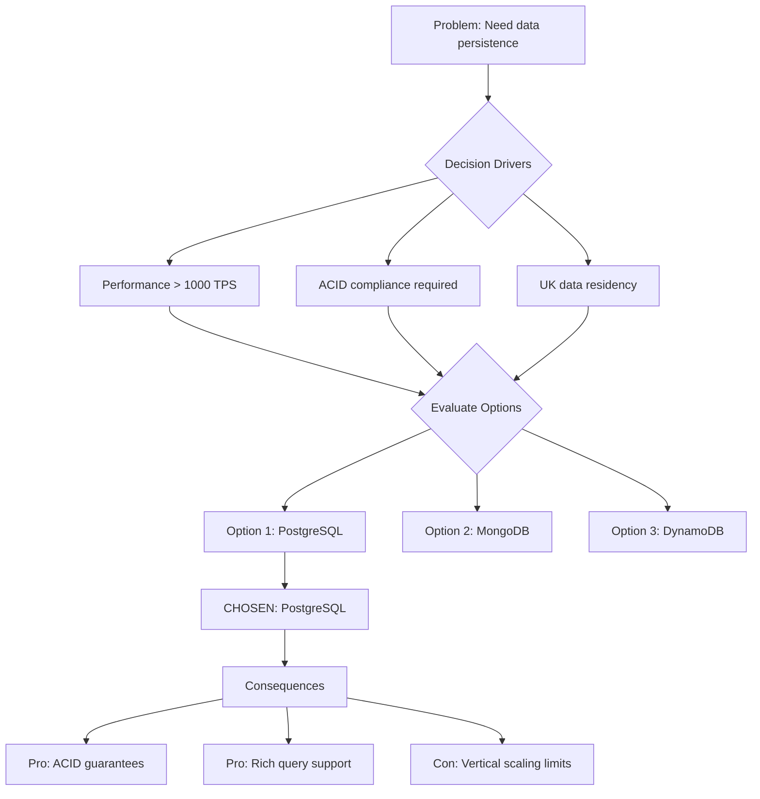

# Architecture Decision Record: [DECISION_TITLE]

> **Template Status**: Beta | **Version**: [VERSION] | **Command**: `/arckit.adr`

## Document Control

| Field | Value |
|-------|-------|
| **Document ID** | ARC-[PROJECT_ID]-ADR-[NUM]-v[VERSION] |
| **Document Type** | Architecture Decision Record |
| **Project** | [PROJECT_NAME] (Project [PROJECT_ID]) |
| **Classification** | [PUBLIC / OFFICIAL / OFFICIAL-SENSITIVE / SECRET] |
| **Status** | [DRAFT / IN_REVIEW / APPROVED / PUBLISHED / SUPERSEDED / ARCHIVED] |
| **Version** | [VERSION] |
| **Created Date** | [YYYY-MM-DD] |
| **Last Modified** | [YYYY-MM-DD] |
| **Review Cycle** | [Monthly / Quarterly / Annual / On-Demand] |
| **Next Review Date** | [YYYY-MM-DD] |
| **Owner** | [OWNER_NAME_AND_ROLE] |
| **Reviewed By** | [REVIEWER_NAME] on [DATE] or [PENDING] |
| **Approved By** | [APPROVER_NAME] on [DATE] or [PENDING] |
| **Distribution** | [DISTRIBUTION_LIST] |
| **ADR Number** | ADR-[NUM] |
| **Date** | [YYYY-MM-DD] |
| **Author** | [AUTHOR_NAME] |
| **Supersedes** | [ADR-XXX] (if applicable) |
| **Superseded by** | [ADR-YYY] (if applicable) |
| **Escalation Level** | [Team / Cross-team / Department / Cross-government] |
| **Governance Forum** | [Architecture Review Board / TDA / Programme Board / Steering Committee] |

## Revision History

| Version | Date | Author | Changes | Approved By | Approval Date |
|---------|------|--------|---------|-------------|---------------|
| [VERSION] | [DATE] | ArcKit AI | Initial creation from `/arckit.[COMMAND]` command | [PENDING] | [PENDING] |

## 1. Decision Title

**[Short noun phrase describing the decision]**

Example: "Use PostgreSQL for Data Persistence" or "Adopt API Gateway Pattern"

---

## 2. Stakeholders

### 2.1 Deciders (RACI: Accountable)
Final decision makers with authority to approve this ADR.

- [Name, Role] - [Justification for involvement]
- [Name, Role]

### 2.2 Consulted (RACI: Consulted)
Subject matter experts providing input through two-way communication.

- [Name, Role, Expertise area]
- [Name, Role, Expertise area]

### 2.3 Informed (RACI: Informed)
Stakeholders kept up-to-date with one-way communication.

- [Name, Role]
- [Team/Group name]

### 2.4 UK Government Escalation Context

**Decision Level**: [Team / Cross-team / Department / Cross-government]

**Escalation Rationale**:
- [ ] **Team**: Local implementation choice (frameworks, libraries, testing)
- [ ] **Cross-team**: Integration patterns, shared services, API standards
- [ ] **Department**: Technology standards, cloud providers, security frameworks
- [ ] **Cross-government**: National infrastructure, cross-department interoperability

**Governance Forum**: [Name of forum that approved/will approve this decision]

**Approval Date**: [YYYY-MM-DD] (if accepted)

---

## 3. Context and Problem Statement

### 3.1 Problem Description

[Describe the architectural problem or decision driver in 2-3 sentences or as an illustrative story. Use plain language that non-technical stakeholders can understand.]

**Problem statement as a question**: [What architectural decision needs to be made?]

### 3.2 Why This Decision Is Needed

[Explain the business/technical context requiring this decision]

- **Business context**: [Link to business requirements BR-XXX]
- **Technical context**: [Link to technical requirements FR-XXX, NFR-XXX]
- **Regulatory context**: [GDPR, GDS Service Standard, Cyber Essentials, etc.]

### 3.3 Supporting Links

- **User story/Epic**: [Link to backlog item, Jira ticket, GitHub issue]
- **Requirements**: BR-XXX, FR-XXX, NFR-XXX
- **Research findings**: [Link to ARC-{PROJECT_ID}-RSCH-v*.md section]
- **Related ADRs**: ADR-XXX, ADR-YYY

---

## 4. Decision Drivers (Forces)

These forces influence the decision. They are often in tension with each other.

### 4.1 Technical Drivers

- **[Driver name]**: [Description]
  - Requirements: NFR-P-XXX (Performance), NFR-SEC-XXX (Security)
  - Architecture principles: [Reference specific principles]
  - Quality attributes: [Performance, Security, Scalability, Maintainability]

- **[Driver name]**: [Description]

### 4.2 Business Drivers

- **[Driver name]**: [Description]
  - Requirements: BR-XXX
  - Stakeholder goals: [Link to ARC-{PROJECT_ID}-STKE-v*.md]
  - Benefits: [Cost savings, time to market, risk reduction]

### 4.3 Regulatory & Compliance Drivers

- **GDS Service Standard**: [Which points apply? Point 4: Open standards, Point 9: Hosting, etc.]
- **Technology Code of Practice**: [Which points? Point 5: Cloud first, Point 8: Reuse, Point 13: AI]
- **NCSC Cyber Security**: [Cyber Essentials Plus, CAF principles]
- **Data Protection**: [UK GDPR Article 25: Data protection by design, Article 35: DPIA]
- **Accessibility**: [WCAG 2.2 AA, Public Sector Bodies Accessibility Regulations]

### 4.4 Alignment to Architecture Principles

Reference architecture principles from `projects/000-global/ARC-000-PRIN-v*.md`:

| Principle | Alignment | Impact |
|-----------|-----------|--------|
| [Principle Name] | ✅ Supports / ⚠️ Partial / ❌ Conflicts | [How this decision aligns or conflicts] |
| [Principle Name] | [Status] | [Impact] |

---

## 5. Considered Options

**Minimum 2-3 options must be analyzed. Always include "Do Nothing" as baseline.**

### Option 1: [OPTION_NAME]

**Description**: [Brief description of this option]

**Implementation approach**: [How would this be implemented?]

**Wardley Evolution Stage**: [Genesis (Novel) / Custom-Built / Product (Off-the-shelf) / Commodity (Utility)]

#### Good (Pros)
- ✅ **[Benefit]**: [Explanation, links to requirements met]
- ✅ **[Benefit]**: [Explanation, links to principles supported]
- ✅ **[Benefit]**: [Quantified where possible - performance metrics, cost savings]

#### Bad (Cons)
- ❌ **[Drawback]**: [Explanation, links to requirements not met]
- ❌ **[Risk]**: [What could go wrong? Mitigation strategies]
- ❌ **[Trade-off]**: [Accepted negative consequences]

#### Cost Analysis
- **CAPEX**: [One-time costs: licenses, hardware, migration]
- **OPEX**: [Ongoing costs: support, training, maintenance per year]
- **TCO (3-year)**: [Total cost of ownership]

#### GDS Service Standard Impact
| Point | Impact | Notes |
|-------|--------|-------|
| 4. Open standards | [Positive/Negative/Neutral] | [Explanation] |
| 5. Security | [Impact] | [NCSC guidance compliance] |
| 9. Technology | [Impact] | [Cloud hosting, scalability] |

---

### Option 2: [OPTION_NAME]

[Repeat structure from Option 1]

---

### Option 3: Do Nothing (Baseline)

**Description**: Continue with current approach or defer the decision.

#### Good
- ✅ **No immediate cost**: No investment required
- ✅ **No risk**: No implementation risk

#### Bad
- ❌ **Technical debt accumulates**: [What problems persist?]
- ❌ **Opportunity cost**: [What benefits are missed?]
- ❌ **Compliance risk**: [Any regulatory issues?]

---

## 6. Decision Outcome

### 6.1 Chosen Option

**"Option [X]: [OPTION_NAME]"**

### 6.2 Y-Statement (Structured Justification)

> **In the context of** [use case / system context],
> **facing** [concern / force],
> **we decided for** [chosen option],
> **to achieve** [system quality / benefit],
> **accepting** [downside / trade-off].

**Example**:
> In the context of building a citizen-facing chatbot service,
> facing the need for secure, compliant, and scalable conversational AI,
> we decided for Azure OpenAI Service with Government instance,
> to achieve UK data residency and NCSC-assured cloud hosting,
> accepting higher costs compared to consumer OpenAI API.

### 6.3 Justification (Why This Option?)

[Explain why this option was chosen over the alternatives. Reference decision drivers and stakeholder input.]

**Key reasons**:
1. **[Reason]**: [Explanation with evidence]
2. **[Reason]**: [Quantified benefits where possible]
3. **[Reason]**: [Risk mitigation]

**Stakeholder consensus**: [How was agreement reached? Any dissenting views?]

**Risk appetite**: [How does this align with organization's risk tolerance?]

---

## 7. Consequences

### 7.1 Positive Consequences

- ✅ **[Benefit]**: [What improvements result from this decision?]
- ✅ **[Capability]**: [New capabilities enabled]
- ✅ **[Compliance]**: [Regulatory/standard compliance achieved]

**Measurable outcomes**:
- [Metric]: [Baseline] → [Target] (e.g., API response time: 500ms → 100ms)
- [Metric]: [Improvement]

### 7.2 Negative Consequences (Accepted Trade-offs)

- ❌ **[Trade-off]**: [What do we give up or accept?]
- ❌ **[Limitation]**: [Constraints introduced]
- ❌ **[Technical debt]**: [Future work needed]

**Mitigation strategies**:
- **[Trade-off]**: [How will we address this in future?]
- **[Limitation]**: [Workarounds or future ADRs]

### 7.3 Neutral Consequences (Changes Needed)

- 🔄 **Team training**: [Skills development required]
- 🔄 **Infrastructure changes**: [New environments, tools, pipelines]
- 🔄 **Process updates**: [New workflows, documentation, runbooks]
- 🔄 **Vendor relationships**: [New contracts, support agreements]

### 7.4 Risks and Mitigations

| Risk | Likelihood | Impact | Mitigation | Owner |
|------|------------|--------|------------|-------|
| [Risk description] | [H/M/L] | [H/M/L] | [Mitigation strategy] | [Name] |
| [Risk description] | [H/M/L] | [H/M/L] | [Mitigation strategy] | [Name] |

**Link to risk register**: [projects/XXX/ARC-XXX-RISK-v*.md - Risk ID: RISK-XXX]

---

## 8. Validation & Compliance

### 8.1 How Will Implementation Be Verified?

**Design review**:
- [ ] High-Level Design (HLD) review includes this decision
- [ ] Detailed Design (DLD) shows implementation details
- [ ] Architecture diagrams reflect this decision

**Code review**:
- [ ] Pull request checklist includes ADR compliance
- [ ] Architecture patterns match decision
- [ ] Configuration matches decision parameters

**Testing strategy**:
- [ ] Unit tests verify implementation
- [ ] Integration tests validate decision outcome
- [ ] Performance tests confirm non-functional requirements met
- [ ] Security tests validate compliance requirements

### 8.2 Monitoring & Observability

**Success metrics** (how to measure if decision achieved goals):
- **[Metric]**: [Target value, measurement method]
- **[Metric]**: [Baseline vs target, monitoring tool]

**Alerts and dashboards**:
- [What metrics will be monitored?]
- [What thresholds trigger alerts?]

### 8.3 Compliance Verification

**GDS Service Assessment**:
- [ ] Point [X]: [How this decision addresses Service Standard point]
- [ ] Evidence prepared for assessment

**Technology Code of Practice**:
- [ ] Point [X]: [How this decision addresses TCoP point]

**Security assurance**:
- [ ] NCSC Cloud Security Principles: [Which principles apply?]
- [ ] Cyber Essentials controls: [Impact on 5 controls]
- [ ] Security testing completed: [Pen test, vulnerability scan]

**Data protection**:
- [ ] DPIA updated if processing personal data
- [ ] Data flow diagrams updated
- [ ] Privacy notice updated if needed

---

## 9. Links to Supporting Documents

### 9.1 Requirements Traceability

**Business Requirements**:
- BR-XXX: [Requirement title] - [How decision addresses it]
- BR-XXX: [Requirement title]

**Functional Requirements**:
- FR-XXX: [Requirement title]
- FR-XXX: [Requirement title]

**Non-Functional Requirements**:
- NFR-P-XXX: [Performance requirement]
- NFR-SEC-XXX: [Security requirement]
- NFR-S-XXX: [Scalability requirement]

### 9.2 Architecture Artifacts

**Architecture principles**: `projects/000-global/ARC-000-PRIN-v*.md`
- [List which principles influenced this decision]

**Stakeholder drivers**: `projects/XXX/ARC-XXX-STKE-v*.md`
- [Link to stakeholder goals this decision supports]

**Risk register**: `projects/XXX/ARC-XXX-RISK-v*.md`
- RISK-XXX: [Risk this decision mitigates]

**Research findings**: `projects/XXX/ARC-XXX-RSCH-v*.md`
- [Section/page that analyzed these options]

**Wardley Maps**: `projects/XXX/wardley-maps/ARC-XXX-WARD-*.md`
- [Map showing evolution stage of chosen components]

**Architecture diagrams**: `projects/XXX/diagrams/ARC-XXX-DIAG-*.md`
- [List C4/deployment/sequence diagrams showing this decision]

**Strategic roadmap**: `projects/XXX/ARC-*-ROADMAP-*.md`
- [Theme/initiative this decision supports]

### 9.3 Design Documents

**High-Level Design**: `projects/XXX/vendors/[vendor]/hld-v*.md`
- [Section showing implementation of this decision]

**Detailed Design**: `projects/XXX/vendors/[vendor]/dld-v*.md`
- [Detailed implementation specifications]

**Data model**: `projects/XXX/ARC-XXX-DATA-v*.md`
- [If decision affects data structure]

### 9.4 External References

**Standards and RFCs**:
- [RFC number/link]
- [ISO/IEC standard]
- [W3C specification]

**Vendor documentation**:
- [Product documentation links]
- [API references]
- [Best practice guides]

**UK Government guidance**:
- [GDS Service Manual link]
- [NCSC guidance link]
- [GOV.UK Architecture patterns]

**Research and evidence**:
- [Academic papers]
- [Industry benchmarks]
- [Proof of concept results]

---

## 10. Implementation Plan

### 10.1 Dependencies

**Prerequisite decisions**:
- ADR-XXX: [Must be implemented first]

**Infrastructure dependencies**:
- [Cloud services, environments, accounts needed]

**Team dependencies**:
- [Skills, training, team capacity]

### 10.2 Implementation Timeline

| Phase | Activities | Duration | Owner |
|-------|-----------|----------|-------|
| **Phase 1: Preparation** | [Setup, procurement, training] | [X weeks] | [Name] |
| **Phase 2: Implementation** | [Development, configuration] | [X weeks] | [Name] |
| **Phase 3: Validation** | [Testing, security review] | [X weeks] | [Name] |
| **Phase 4: Deployment** | [Rollout, cutover] | [X weeks] | [Name] |

### 10.3 Rollback Plan

**Rollback trigger**: [What conditions require rollback?]

**Rollback procedure**:
1. [Step-by-step rollback process]
2. [Data migration back if needed]
3. [Communication plan]

**Rollback owner**: [Name, Role]

---

## 11. Review and Updates

### 11.1 Review Schedule

**Initial review**: [Date - typically 3-6 months after implementation]

**Periodic review**: [Frequency - annually, or triggered by events]

**Review criteria**:
- Are success metrics being met?
- Have assumptions changed?
- Is this decision still optimal?
- Should this ADR be deprecated/superseded?

### 11.2 Trigger Events for Review

- [ ] Major technology version changes (e.g., framework upgrades)
- [ ] Significant cost changes (>20% variance)
- [ ] Security incidents related to this decision
- [ ] Regulatory changes affecting compliance
- [ ] Failure to meet success metrics
- [ ] New options become available (Wardley evolution)

---

## 12. Related Decisions

### 12.1 Decisions This ADR Depends On

- **ADR-XXX**: [Title] - [How it influences this decision]

### 12.2 Decisions That Depend On This ADR

- **ADR-YYY**: [Title] - [How this decision influences it]

### 12.3 Conflicting Decisions

- **ADR-ZZZ**: [Title] - [How conflict is resolved]

---

## 13. Appendices

### Appendix A: Options Analysis Details

[Detailed technical analysis, proof-of-concept results, benchmarks]

### Appendix B: Stakeholder Consultation Log

| Date | Stakeholder | Feedback | Action Taken |
|------|-------------|----------|--------------|
| [Date] | [Name] | [Summary] | [Response] |

### Appendix C: Alternative Formats

**Mermaid Decision Flow Diagram** (optional):

---

## Document Approval

| Role | Name | Signature | Date |
|------|------|-----------|------|
| **Technical Architect** | [Name] | | YYYY-MM-DD |
| **Senior Responsible Owner** | [Name] | | YYYY-MM-DD |
| **Security Architect** | [Name] | | YYYY-MM-DD |
| **Governance Board** | [Board name] | | YYYY-MM-DD |

---

*This ADR follows the MADR v4.0 format enhanced with UK Government requirements and ArcKit governance standards.*

*For more information:*
- *MADR: https://adr.github.io/madr/*
- *UK Gov ADR Framework: https://www.gov.uk/government/publications/architectural-decision-record-framework*
- *ArcKit Documentation: [Link to project README]*

## External References

| Document | Type | Source | Key Extractions | Path |
|----------|------|--------|-----------------|------|
| *None provided* | — | — | — | — |

---

**Generated by**: ArcKit `/arckit.adr` command
**Generated on**: [DATE]
**ArcKit Version**: [VERSION]
**Project**: [PROJECT_NAME]
**Model**: [AI_MODEL]