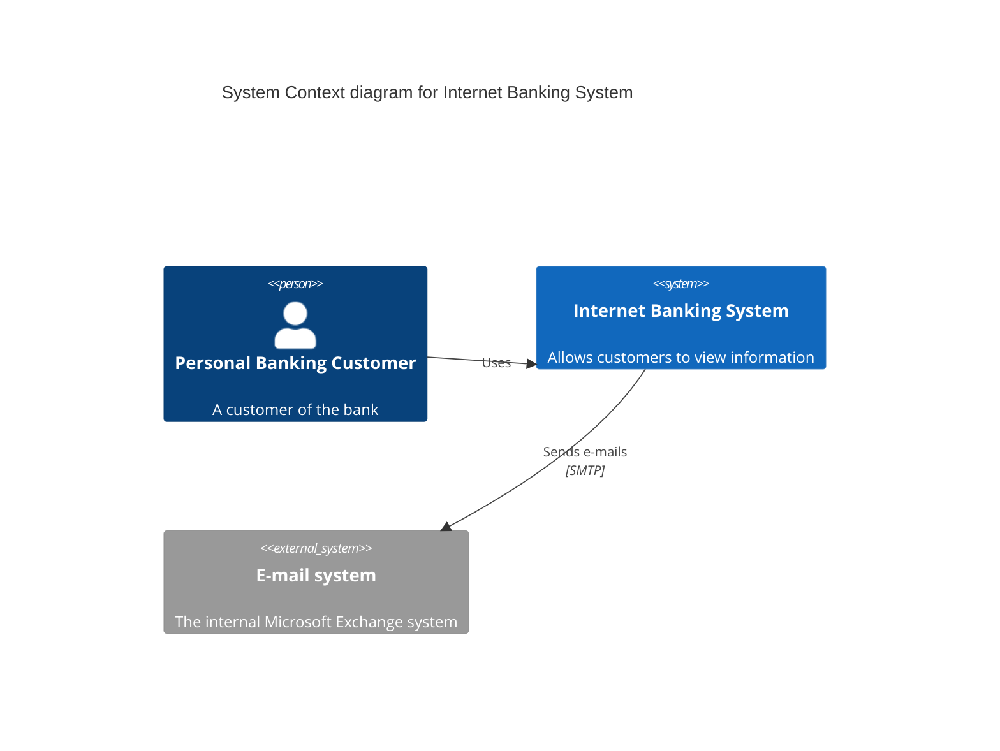
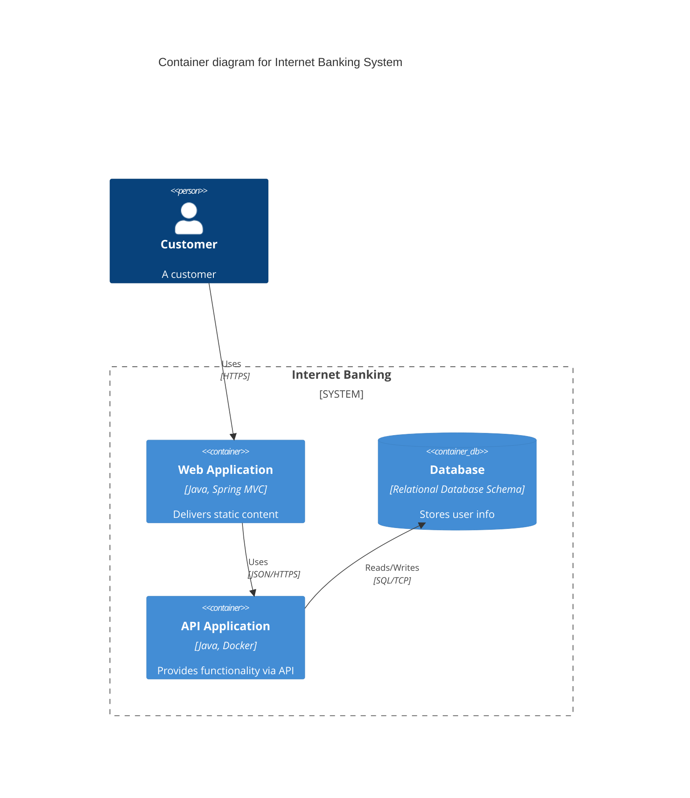
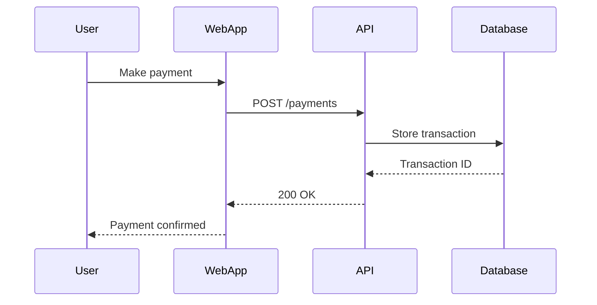
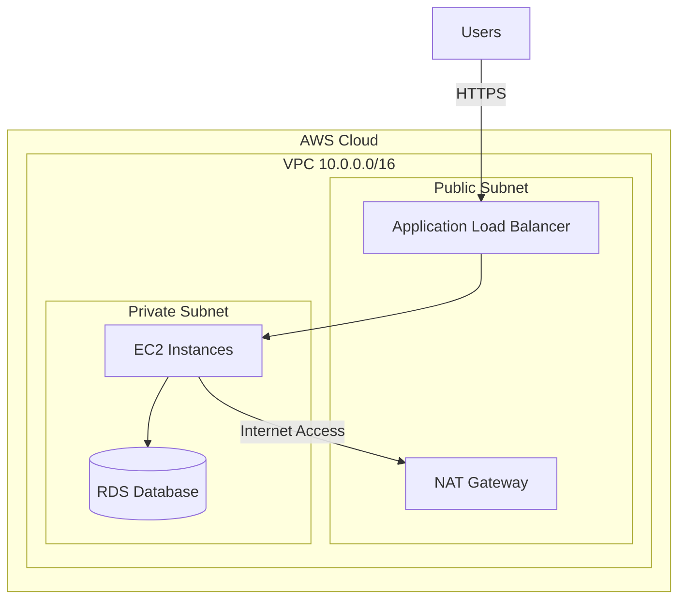
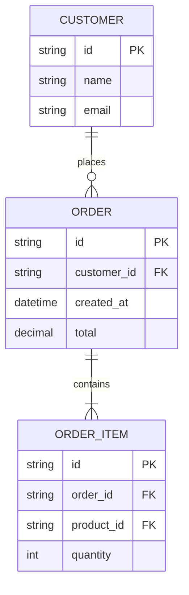

# Architecture Diagram: {diagram_name}

> **Template Status**: Live | **Version**: [VERSION] | **Command**: `/arckit.diagram`

## Document Control

| Field | Value |
|-------|-------|
| **Document ID** | ARC-[PROJECT_ID]-DIAG-v[VERSION] |
| **Document Type** | Architecture Diagram |
| **Project** | [PROJECT_NAME] (Project [PROJECT_ID]) |
| **Classification** | [PUBLIC / OFFICIAL / OFFICIAL-SENSITIVE / SECRET] |
| **Status** | [DRAFT / IN_REVIEW / APPROVED / PUBLISHED / SUPERSEDED / ARCHIVED] |
| **Version** | [VERSION] |
| **Created Date** | [YYYY-MM-DD] |
| **Last Modified** | [YYYY-MM-DD] |
| **Review Cycle** | [Monthly / Quarterly / Annual / On-Demand] |
| **Next Review Date** | [YYYY-MM-DD] |
| **Owner** | [OWNER_NAME_AND_ROLE] |
| **Reviewed By** | [REVIEWER_NAME] ([YYYY-MM-DD]) or PENDING |
| **Approved By** | [APPROVER_NAME] ([YYYY-MM-DD]) or PENDING |
| **Distribution** | [DISTRIBUTION_LIST] |

## Revision History

| Version | Date | Author | Changes | Approved By | Approval Date |
|---------|------|--------|---------|-------------|---------------|
| [VERSION] | [DATE] | ArcKit AI | Initial creation from `/arckit.diagram` command | PENDING | PENDING |

---

## Diagram

```mermaid
{mermaid_code}
```

**View this diagram**:
- **GitHub**: Renders automatically in markdown preview
- **VS Code**: Install Mermaid Preview extension
- **Online**: https://mermaid.live (paste code above)
- **Export**: Use mermaid.live to export as PNG/SVG/PDF

---

## Mermaid Syntax Reference

**IMPORTANT - Line Break Syntax Rules**:

### C4 Diagrams (Context, Container, Component)

C4 diagrams support `<br/>` tags in **BOTH node labels AND edge labels**:

✅ **Node Labels** - WORKS:
```
Person(user, "User<br/>(Customer Role)")
System(api, "Payment API<br/>(REST)")
```

✅ **Edge Labels** - WORKS:
```
Rel(user, api, "Submits payment<br/>HTTPS, JWT auth")
Rel(api, db, "Stores transaction<br/>Encrypted at rest")
```

### Flowcharts, Sequence Diagrams, Deployment Diagrams

These diagram types support `<br/>` tags in **node labels ONLY** - NOT in edge labels:

✅ **Node Labels** - WORKS:
```
flowchart LR
    User["User<br/>(Customer Role)"]
    API["Payment API<br/>(REST)"]
```

❌ **Edge Labels with `<br/>`** - FAILS (causes parse error):
```
flowchart LR
    User -->|Submits payment<br/>HTTPS| API  %% PARSE ERROR!
```

✅ **Edge Labels with commas** - WORKS:
```
flowchart LR
    User -->|Submits payment via HTTPS, JWT auth| API
```

**Best Practice**: For flowcharts, use comma-separated text in edge labels instead of attempting multi-line formatting.

---

## Diagram Type Reference

**C4 Context Diagram** (Level 1): System in context with users and external systems
**C4 Container Diagram** (Level 2): Technical containers and technology choices
**C4 Component Diagram** (Level 3): Internal components within a container
**Deployment Diagram**: Infrastructure topology and cloud resources
**Sequence Diagram**: API interactions and request/response flows
**Data Flow Diagram**: How data moves through the system

---

## Component Inventory

| Component | Type | Technology | Responsibility | Evolution Stage | Build/Buy |
|-----------|------|------------|----------------|-----------------|-----------|
| {Component 1} | {type} | {technology} | {responsibility} | {stage} | {decision} |
| {Component 2} | {type} | {technology} | {responsibility} | {stage} | {decision} |
| {Component 3} | {type} | {technology} | {responsibility} | {stage} | {decision} |

**Evolution Stage Legend**:
- **Genesis (0.0-0.25)**: Novel, unproven, rapidly changing
- **Custom (0.25-0.50)**: Bespoke, emerging practices
- **Product (0.50-0.75)**: Commercial products with feature differentiation
- **Commodity (0.75-1.0)**: Utility services, standardized

**Build/Buy Decision**:
- **BUILD**: Genesis/Custom components with competitive advantage
- **BUY**: Product components with mature market
- **USE**: Commodity cloud/utility services
- **REUSE**: GOV.UK services (if UK Government project)

---

## Architecture Decisions

### Key Design Decisions

**Decision 1**: {decision_title}
- **Context**: {context}
- **Decision**: {decision}
- **Rationale**: {rationale}
- **Consequences**: {consequences}

**Decision 2**: {decision_title}
- **Context**: {context}
- **Decision**: {decision}
- **Rationale**: {rationale}
- **Consequences**: {consequences}

### Technology Choices

| Technology | Purpose | Rationale | Evolution Stage |
|------------|---------|-----------|-----------------|
| {Technology 1} | {purpose} | {rationale} | {stage} |
| {Technology 2} | {purpose} | {rationale} | {stage} |

---

## Requirements Traceability

**Requirements Coverage**:

| Requirement ID | Description | Component(s) | Coverage Status |
|----------------|-------------|--------------|-----------------|
| BR-001 | {description} | {components} | ✅ / ⚠️ / ❌ |
| FR-001 | {description} | {components} | ✅ / ⚠️ / ❌ |
| NFR-P-001 | {description} | {components} | ✅ / ⚠️ / ❌ |
| NFR-S-001 | {description} | {components} | ✅ / ⚠️ / ❌ |
| INT-001 | {description} | {components} | ✅ / ⚠️ / ❌ |
| DR-001 | {description} | {components} | ✅ / ⚠️ / ❌ |

**Coverage Summary**:
- Total Requirements: {total}
- Covered: {covered} ({percentage}%)
- Partially Covered: {partial}
- Not Covered: {not_covered}

---

## Integration Points

### External Systems

| External System | Interface | Protocol | Responsibility | SLA |
|----------------|-----------|----------|----------------|-----|
| {System 1} | {interface} | {protocol} | {responsibility} | {sla} |
| {System 2} | {interface} | {protocol} | {responsibility} | {sla} |

### APIs and Endpoints

| API | Endpoint | Method | Purpose | Authentication |
|-----|----------|--------|---------|----------------|
| {API 1} | {endpoint} | {method} | {purpose} | {auth} |
| {API 2} | {endpoint} | {method} | {purpose} | {auth} |

---

## Data Flow

### Data Sources

| Data Source | Type | Data Format | Update Frequency | Owner |
|-------------|------|-------------|------------------|-------|
| {Source 1} | {type} | {format} | {frequency} | {owner} |
| {Source 2} | {type} | {format} | {frequency} | {owner} |

### Data Sinks

| Data Sink | Type | Data Format | Retention | Backup |
|-----------|------|-------------|-----------|--------|
| {Sink 1} | {type} | {format} | {retention} | {backup} |
| {Sink 2} | {type} | {format} | {retention} | {backup} |

### PII Handling (UK GDPR / GDPR Compliance)

| Component | PII Type | Processing | Legal Basis | Retention | Deletion |
|-----------|----------|------------|-------------|-----------|----------|
| {Component 1} | {pii_type} | {processing} | {legal_basis} | {retention} | {deletion} |
| {Component 2} | {pii_type} | {processing} | {legal_basis} | {retention} | {deletion} |

**DPIA Required**: {Yes / No}
**DPO Consulted**: {Yes / No / N/A}

---

## Security Architecture

### Security Zones

| Zone | Components | Security Level | Controls |
|------|------------|----------------|----------|
| {Zone 1} | {components} | {level} | {controls} |
| {Zone 2} | {components} | {level} | {controls} |

### Security Controls

| Control | Type | Component(s) | Implementation |
|---------|------|--------------|----------------|
| {Control 1} | {type} | {components} | {implementation} |
| {Control 2} | {type} | {components} | {implementation} |

### Authentication & Authorization

| Component | Authentication | Authorization | Session Management |
|-----------|----------------|---------------|-------------------|
| {Component 1} | {auth_method} | {authz_method} | {session} |
| {Component 2} | {auth_method} | {authz_method} | {session} |

---

## Deployment Architecture

### Cloud Provider

**Provider**: {AWS / Azure / GCP / On-Premise}
**Region**: {region}
**Availability Zones**: {az_count}

### Infrastructure Components

| Component | Type | Spec | HA | Backup |
|-----------|------|------|-----|--------|
| {Component 1} | {type} | {spec} | {ha} | {backup} |
| {Component 2} | {type} | {spec} | {ha} | {backup} |

### Network Architecture

| Network Component | CIDR | Purpose | Security Group |
|------------------|------|---------|----------------|
| VPC | {cidr} | {purpose} | {sg} |
| Public Subnet 1 | {cidr} | {purpose} | {sg} |
| Private Subnet 1 | {cidr} | {purpose} | {sg} |

---

## Non-Functional Requirements

### Performance

| Requirement | Target | Component(s) | How Achieved |
|-------------|--------|--------------|--------------|
| Response Time | {target} | {components} | {how} |
| Throughput (TPS) | {target} | {components} | {how} |
| Concurrent Users | {target} | {components} | {how} |

### Scalability

| Scalability Type | Approach | Component(s) | Max Scale |
|-----------------|----------|--------------|-----------|
| Horizontal | {approach} | {components} | {max_scale} |
| Vertical | {approach} | {components} | {max_scale} |

### Availability & Resilience

| Requirement | Target | Component(s) | How Achieved |
|-------------|--------|--------------|--------------|
| Availability | {target} | {components} | {how} |
| RTO (Recovery Time) | {target} | {components} | {how} |
| RPO (Recovery Point) | {target} | {components} | {how} |

### Security & Compliance

| Requirement | Standard | Component(s) | Controls |
|-------------|----------|--------------|----------|
| {Security Req 1} | {standard} | {components} | {controls} |
| {Compliance Req 1} | {standard} | {components} | {controls} |

---

## UK Government Compliance (if applicable)

### Technology Code of Practice

| TCoP Point | Compliance | Component(s) | Evidence |
|------------|------------|--------------|----------|
| 1. User Needs | ✅ / ⚠️ / ❌ | {components} | {evidence} |
| 2. Accessibility | ✅ / ⚠️ / ❌ | {components} | {evidence} |
| 3. Open Source | ✅ / ⚠️ / ❌ | {components} | {evidence} |
| 5. Cloud First | ✅ / ⚠️ / ❌ | {components} | {evidence} |
| 6. Security | ✅ / ⚠️ / ❌ | {components} | {evidence} |
| 7. Privacy | ✅ / ⚠️ / ❌ | {components} | {evidence} |
| 8. Share & Reuse | ✅ / ⚠️ / ❌ | {components} | {evidence} |

### GOV.UK Services

| GOV.UK Service | Used | Component | Rationale |
|----------------|------|-----------|-----------|
| GOV.UK Pay | {Yes/No} | {component} | {rationale} |
| GOV.UK Notify | {Yes/No} | {component} | {rationale} |
| GOV.UK Design System | {Yes/No} | {component} | {rationale} |
| GOV.UK Verify | {Yes/No} | {component} | {rationale} |
| GOV.UK PaaS | {Yes/No} | {component} | {rationale} |

### AI Playbook Compliance (for AI systems)

**AI Risk Level**: {HIGH-RISK / MEDIUM-RISK / LOW-RISK / N/A}

If AI system:
- **Human Oversight**: {Human-in-the-loop / Human-on-the-loop / Human-in-command}
- **ATRS Required**: {Yes / No}
- **Bias Testing**: {Yes / No}
- **Explainability**: {Yes / No}

---

## Wardley Map Integration

**Related Wardley Map**: {file_path or N/A}

### Component Positioning

| Component | Visibility | Evolution | Stage | Strategic Action |
|-----------|-----------|-----------|-------|------------------|
| {Component 1} | {0.0-1.0} | {0.0-1.0} | {Genesis/Custom/Product/Commodity} | {BUILD/BUY/USE/REUSE} |
| {Component 2} | {0.0-1.0} | {0.0-1.0} | {Genesis/Custom/Product/Commodity} | {BUILD/BUY/USE/REUSE} |

### Strategic Alignment

- [ ] All BUILD decisions align with Genesis/Custom stage
- [ ] All BUY decisions align with Product stage
- [ ] All USE decisions align with Commodity stage
- [ ] No commodity components being built
- [ ] No Genesis components being bought

---

## Linked Artifacts

**Requirements**: `{path_to_requirements}`
**Architecture Principles**: `{path_to_principles}`
**Wardley Map**: `{path_to_wardley_map}`
**HLD**: `{path_to_hld}`
**DLD**: `{path_to_dld}`
**TCoP Assessment**: `{path_to_tcop}`
**AI Playbook Assessment**: `{path_to_ai_playbook}`
**ATRS Record**: `{path_to_atrs}`

---

## Change Log

| Version | Date | Author | Changes | Rationale |
|---------|------|--------|---------|-----------|
| v1.0 | {date} | {author} | Initial diagram | {rationale} |
| v1.1 | {date} | {author} | {changes} | {rationale} |

**Next Review Date**: {review_date}

---

## Mermaid Syntax Reference

### C4 Context Diagram



### C4 Container Diagram



### Sequence Diagram



### Flowchart (Deployment)



### Entity Relationship Diagram



---

## Additional Resources

- **Mermaid Documentation**: https://mermaid.js.org/
- **Mermaid Live Editor**: https://mermaid.live
- **C4 Model**: https://c4model.com/
- **ArcKit Repository**: https://github.com/tractorjuice/arc-kit

## External References

| Document | Type | Source | Key Extractions | Path |
|----------|------|--------|-----------------|------|
| *None provided* | — | — | — | — |

---

**Generated by**: ArcKit `/arckit.diagram` command
**Generated on**: [DATE]
**ArcKit Version**: [VERSION]
**Project**: [PROJECT_NAME]
**Model**: [AI_MODEL]

