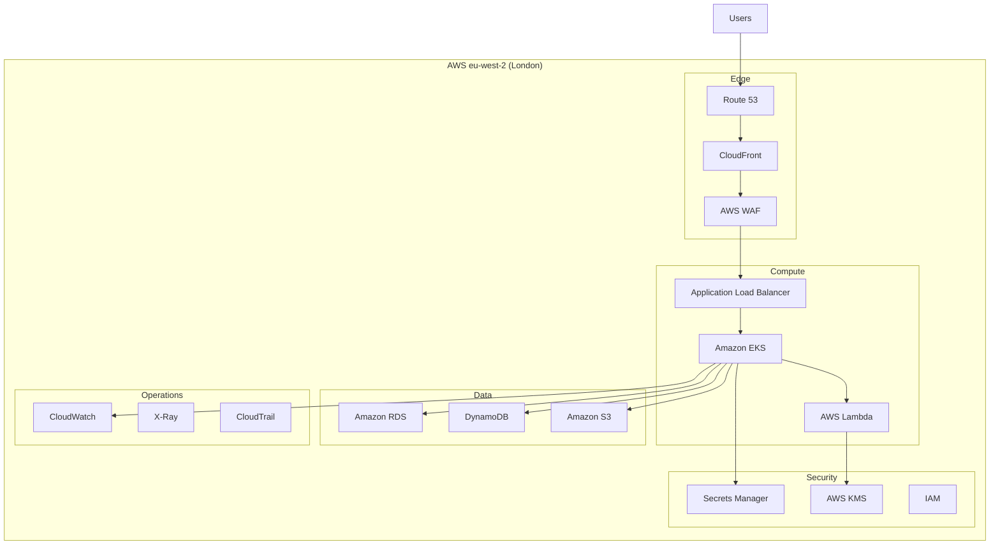

# AWS Technology Research: [PROJECT_NAME]

> **Template Status**: Experimental | **Version**: [VERSION] | **Command**: `/arckit.aws-research`

## Document Control

| Field | Value |
|-------|-------|
| **Document ID** | ARC-[PROJECT_ID]-AWRS-v[VERSION] |
| **Document Type** | AWS Technology Research |
| **Project** | [PROJECT_NAME] (Project [PROJECT_ID]) |
| **Classification** | [PUBLIC / OFFICIAL / OFFICIAL-SENSITIVE / SECRET] |
| **Status** | [DRAFT / IN_REVIEW / APPROVED / PUBLISHED / SUPERSEDED / ARCHIVED] |
| **Version** | [VERSION] |
| **Created Date** | [YYYY-MM-DD] |
| **Last Modified** | [YYYY-MM-DD] |
| **Review Cycle** | [Monthly / Quarterly / Annual / On-Demand] |
| **Next Review Date** | [YYYY-MM-DD] |
| **Owner** | [OWNER_NAME_AND_ROLE] |
| **Reviewed By** | [REVIEWER_NAME] ([YYYY-MM-DD]) or PENDING |
| **Approved By** | [APPROVER_NAME] ([YYYY-MM-DD]) or PENDING |
| **Distribution** | [DISTRIBUTION_LIST] |

## Revision History

| Version | Date | Author | Changes | Approved By | Approval Date |
|---------|------|--------|---------|-------------|---------------|
| [VERSION] | [DATE] | ArcKit AI | Initial creation from `/arckit.aws-research` agent | PENDING | PENDING |

---

## Executive Summary

### Research Scope

This document presents AWS-specific technology research findings for the project requirements. It provides AWS service recommendations, architecture patterns, and implementation guidance based on official AWS documentation.

**Requirements Analyzed**: [X] functional, [Y] non-functional, [Z] integration, [W] data requirements

**AWS Services Evaluated**: [X] AWS services across [Y] categories

**Research Sources**: [AWS Documentation, AWS Architecture Center, AWS Well-Architected Framework, AWS Knowledge MCP]

### Key Recommendations

| Requirement Category | Recommended AWS Service | Tier | Monthly Estimate |
|---------------------|-------------------------|------|------------------|
| [Category 1] | [AWS Service] | [On-Demand/Reserved] | £[X] |
| [Category 2] | [AWS Service] | [On-Demand/Reserved] | £[Y] |
| [Category 3] | [AWS Service] | [On-Demand/Reserved] | £[Z] |

### Architecture Pattern

**Recommended Pattern**: [Pattern Name from AWS Architecture Center]

**Reference Architecture**: [Link to AWS reference architecture]

### UK Government Suitability

| Criteria | Status | Notes |
|----------|--------|-------|
| **UK Region Availability** | ✅ eu-west-2 (London) | Primary UK region |
| **G-Cloud Listing** | ✅ G-Cloud 14 | Framework: [RM1557.14] |
| **Data Classification** | ✅ OFFICIAL / OFFICIAL-SENSITIVE | AWS GovCloud for higher |
| **NCSC Cloud Security Principles** | ✅ 14/14 principles met | [Link to attestation] |

---

## AWS Services Analysis

### Category 1: [CATEGORY_NAME]

**Requirements Addressed**: [FR-001, FR-015, NFR-SEC-003]

**Why This Category**: [Explain based on requirements]

---

#### Recommended: [AWS_SERVICE_NAME]

**Service Overview**:
- **Full Name**: [e.g., Amazon Elastic Kubernetes Service (EKS)]
- **Category**: [Compute / Storage / Database / AI / Security / etc.]
- **Documentation**: [AWS Documentation link]

**Key Features**:
- [Feature 1]: [Description]
- [Feature 2]: [Description]
- [Feature 3]: [Description]

**Pricing Model**:

| Pricing Option | Cost | Commitment | Savings |
|----------------|------|------------|---------|
| On-Demand | £[X]/hr | None | Baseline |
| Reserved (1yr) | £[Y]/hr | 1 year | ~30% |
| Reserved (3yr) | £[Z]/hr | 3 years | ~50% |
| Savings Plans | £[W]/hr | Flexible | ~30% |

**Estimated Cost for This Project**:

| Resource | Configuration | Monthly Cost | Notes |
|----------|---------------|--------------|-------|
| [Service] | [Size/Type] | £[X] | [Based on requirements] |
| [Service] | [Size/Type] | £[Y] | [Based on requirements] |
| **Total** | | **£[Z]** | |

**AWS Well-Architected Assessment**:

| Pillar | Rating | Notes |
|--------|--------|-------|
| **Operational Excellence** | ⭐⭐⭐⭐⭐ | [CloudWatch, Systems Manager, automation] |
| **Security** | ⭐⭐⭐⭐⭐ | [IAM, encryption, VPC, Security Hub] |
| **Reliability** | ⭐⭐⭐⭐⭐ | [Multi-AZ, auto-scaling, backup] |
| **Performance Efficiency** | ⭐⭐⭐⭐⭐ | [Right-sizing, caching, CDN] |
| **Cost Optimization** | ⭐⭐⭐⭐☆ | [Reserved instances, Savings Plans] |
| **Sustainability** | ⭐⭐⭐⭐☆ | [Efficient resources, carbon footprint] |

**AWS Security Hub Alignment**:

| Control | Status | Implementation |
|---------|--------|----------------|
| AWS Foundational Security Best Practices | ✅ | Security Hub enabled |
| CIS AWS Foundations Benchmark | ✅ | CIS controls implemented |
| PCI DSS | ✅ | If payment processing |
| NIST 800-53 | ✅ | Federal compliance |

**Integration Capabilities**:
- **APIs**: REST, AWS SDK, CloudFormation, CDK, Terraform
- **SDKs**: Python (boto3), JavaScript, Java, .NET, Go, Ruby
- **Event-Driven**: EventBridge, SNS, SQS integration
- **Other AWS Services**: [List integrations]

**UK Region Availability**:
- ✅ eu-west-2 (London) - Primary
- ✅ eu-west-1 (Ireland) - DR option
- [Any limitations in UK region]

**Compliance Certifications**:
- ✅ ISO 27001, 27017, 27018
- ✅ SOC 1, 2, 3
- ✅ UK Cyber Essentials Plus
- ✅ UK G-Cloud
- ✅ GDPR compliant

---

#### Alternative: [ALTERNATIVE_AWS_SERVICE]

[Repeat structure for alternative AWS service option]

---

#### Comparison Matrix

| Criteria | [Service A] | [Service B] | Winner |
|----------|-------------|-------------|--------|
| Cost (monthly) | £[X] | £[Y] | [Service] |
| Performance | [Rating] | [Rating] | [Service] |
| Ease of Use | [Rating] | [Rating] | [Service] |
| UK Availability | ✅ | ✅ | Tie |
| Feature Match | [X]% | [Y]% | [Service] |

**Recommendation**: [Service Name] - [Rationale]

---

### Category 2: [ANOTHER_CATEGORY]

[Repeat structure for each category]

---

## Architecture Pattern

### Recommended AWS Reference Architecture

**Pattern Name**: [e.g., Serverless Web Application, Microservices on EKS]

**AWS Architecture Center Reference**: [Link]

**Pattern Description**:

[2-3 paragraph description of the pattern and why it fits requirements]

### Architecture Diagram



### Component Mapping

| Component | AWS Service | Purpose | Configuration |
|-----------|-------------|---------|---------------|
| CDN | CloudFront | Global content delivery | Edge locations |
| DNS | Route 53 | DNS management | Hosted zone |
| Load Balancer | ALB | Traffic distribution | Multi-AZ |
| Container Platform | EKS | Kubernetes hosting | Managed node groups |
| Serverless | Lambda | Event processing | 512MB, 30s timeout |
| Primary Database | RDS PostgreSQL | Relational data | Multi-AZ, r6g.large |
| NoSQL | DynamoDB | Key-value data | On-demand capacity |
| Object Storage | S3 | Documents, media | Standard tier |
| Secrets | Secrets Manager | Credentials, keys | Automatic rotation |
| Encryption | KMS | Key management | Customer managed keys |
| Monitoring | CloudWatch | Logs, metrics, alerts | Standard |

---

## Security & Compliance

### AWS Security Hub Controls

| Control Category | Controls Implemented | AWS Services |
|------------------|---------------------|--------------|
| **Identity and Access Management** | IAM.1-IAM.21 | IAM, Organizations, SSO |
| **Detection** | CloudTrail.1-5, GuardDuty.1 | CloudTrail, GuardDuty, Security Hub |
| **Infrastructure Protection** | EC2.1-25, VPC.1-4 | VPC, Security Groups, NACLs |
| **Data Protection** | S3.1-14, RDS.1-25, KMS.1-4 | KMS, S3 encryption, RDS encryption |
| **Incident Response** | EventBridge, SNS | EventBridge rules, SNS notifications |
| **Logging and Monitoring** | CloudWatch.1-4 | CloudWatch, CloudTrail, Config |

### AWS Config Rules

| Rule Category | Example Rules | Status |
|---------------|---------------|--------|
| Compute | ec2-instance-managed-by-ssm, ec2-security-group-attached-to-eni | ✅ |
| Storage | s3-bucket-server-side-encryption-enabled, s3-bucket-public-read-prohibited | ✅ |
| Database | rds-instance-public-access-check, rds-storage-encrypted | ✅ |
| Network | vpc-flow-logs-enabled, vpc-sg-open-only-to-authorized-ports | ✅ |
| IAM | iam-password-policy, iam-user-mfa-enabled | ✅ |

### UK Government Security Alignment

| Framework | Alignment | Notes |
|-----------|-----------|-------|
| **NCSC Cloud Security Principles** | ✅ 14/14 | Full attestation available |
| **Cyber Essentials Plus** | ✅ Certified | AWS controls map to CE+ |
| **UK GDPR** | ✅ Compliant | UK data residency, DPA signed |
| **OFFICIAL** | ✅ Suitable | Standard AWS services |
| **OFFICIAL-SENSITIVE** | ✅ Suitable | Additional controls required |
| **SECRET** | ⚠️ AWS GovCloud | US-only, not available in UK |

### AWS GuardDuty & Security Hub

**Recommendations**:
- Enable GuardDuty in all accounts and regions
- Enable Security Hub with AWS Foundational Security Best Practices
- Configure automated remediation via EventBridge and Lambda
- Enable AWS Config for continuous compliance monitoring
- Use AWS Organizations for centralized security management

---

## Implementation Guidance

### Infrastructure as Code

**Recommended Approach**: AWS CDK (TypeScript/Python) or Terraform

#### AWS CDK Example (TypeScript)

```typescript
// lib/infrastructure-stack.ts
import * as cdk from 'aws-cdk-lib';
import * as ec2 from 'aws-cdk-lib/aws-ec2';
import * as eks from 'aws-cdk-lib/aws-eks';
import * as rds from 'aws-cdk-lib/aws-rds';

export class InfrastructureStack extends cdk.Stack {
  constructor(scope: cdk.App, id: string, props?: cdk.StackProps) {
    super(scope, id, props);

    // VPC
    const vpc = new ec2.Vpc(this, 'MainVpc', {
      maxAzs: 3,
      natGateways: 2,
    });

    // EKS Cluster
    const cluster = new eks.Cluster(this, 'EksCluster', {
      vpc,
      version: eks.KubernetesVersion.V1_28,
      defaultCapacity: 3,
    });

    // RDS Database
    const database = new rds.DatabaseInstance(this, 'Database', {
      engine: rds.DatabaseInstanceEngine.postgres({
        version: rds.PostgresEngineVersion.VER_15,
      }),
      vpc,
      multiAz: true,
      storageEncrypted: true,
    });
  }
}
```

#### CloudFormation Example

```yaml
# template.yaml
AWSTemplateFormatVersion: '2010-09-09'
Description: Core infrastructure

Parameters:
  Environment:
    Type: String
    Default: prod
    AllowedValues: [dev, staging, prod]

Resources:
  VPC:
    Type: AWS::EC2::VPC
    Properties:
      CidrBlock: 10.0.0.0/16
      EnableDnsHostnames: true
      EnableDnsSupport: true
      Tags:
        - Key: Name
          Value: !Sub ${AWS::StackName}-vpc

  EKSCluster:
    Type: AWS::EKS::Cluster
    Properties:
      Name: !Sub ${AWS::StackName}-cluster
      Version: '1.28'
      RoleArn: !GetAtt EKSRole.Arn
      ResourcesVpcConfig:
        SubnetIds:
          - !Ref PrivateSubnet1
          - !Ref PrivateSubnet2
```

#### Terraform Example

```hcl
# main.tf
provider "aws" {
  region = "eu-west-2"
}

module "vpc" {
  source  = "terraform-aws-modules/vpc/aws"
  version = "5.0.0"

  name = "${var.project_name}-vpc"
  cidr = "10.0.0.0/16"

  azs             = ["eu-west-2a", "eu-west-2b", "eu-west-2c"]
  private_subnets = ["10.0.1.0/24", "10.0.2.0/24", "10.0.3.0/24"]
  public_subnets  = ["10.0.101.0/24", "10.0.102.0/24", "10.0.103.0/24"]

  enable_nat_gateway = true
  single_nat_gateway = false
}

module "eks" {
  source  = "terraform-aws-modules/eks/aws"
  version = "19.0.0"

  cluster_name    = "${var.project_name}-cluster"
  cluster_version = "1.28"

  vpc_id     = module.vpc.vpc_id
  subnet_ids = module.vpc.private_subnets
}
```

### AWS CodePipeline

```yaml
# buildspec.yml
version: 0.2

phases:
  install:
    runtime-versions:
      nodejs: 18
    commands:
      - npm install -g aws-cdk

  pre_build:
    commands:
      - npm ci
      - npm run test

  build:
    commands:
      - cdk synth
      - cdk deploy --require-approval never

artifacts:
  files:
    - cdk.out/**/*
```

### Code Samples

**Official AWS Samples**:

| Sample | Description | GitHub Link |
|--------|-------------|-------------|
| [Sample 1] | [Description] | [Link] |
| [Sample 2] | [Description] | [Link] |
| [Sample 3] | [Description] | [Link] |

---

## Cost Estimate

### Monthly Cost Summary

| Category | AWS Service | Configuration | Monthly Cost |
|----------|-------------|---------------|--------------|
| Compute | [Service] | [Size] | £[X] |
| Database | [Service] | [Type] | £[Y] |
| Storage | [Service] | [Tier] | £[Z] |
| Networking | [Service] | [Config] | £[W] |
| Security | [Service] | [Tier] | £[V] |
| Monitoring | [Service] | [Tier] | £[U] |
| **Total** | | | **£[TOTAL]** |

### 3-Year TCO

| Year | Monthly | Annual | Cumulative | Notes |
|------|---------|--------|------------|-------|
| Year 1 | £[X] | £[Y] | £[Y] | Setup + operation |
| Year 2 | £[X] | £[Y] | £[Z] | + Reserved Instance savings |
| Year 3 | £[X] | £[Y] | £[W] | + Reserved Instance savings |
| **Total** | | | **£[TOTAL]** | |

### Cost Optimization Recommendations

1. **Reserved Instances**: Save up to 72% on EC2/RDS with 3-year reservations
2. **Savings Plans**: Flexible commitment for compute savings (up to 66%)
3. **Spot Instances**: Use for dev/test and fault-tolerant workloads (up to 90% savings)
4. **Right-Sizing**: Use AWS Compute Optimizer recommendations
5. **S3 Intelligent-Tiering**: Automatic cost optimization for storage
6. **Graviton Processors**: Up to 40% better price/performance

**Estimated Savings with Optimizations**: £[X]/month (Y% reduction)

---

## UK Government Considerations

### G-Cloud Procurement

**AWS on G-Cloud 14**:
- **Framework**: RM1557.14
- **Supplier**: Amazon Web Services EMEA SARL
- **Service ID**: [Service ID from Digital Marketplace]

**Procurement Steps**:
1. Search Digital Marketplace for "Amazon Web Services"
2. Review service description and pricing
3. Direct award (if requirements clear) or further competition
4. Use call-off contract under G-Cloud terms

### AWS GovCloud (if SECRET classification required)

For SECRET data classification:
- **AWS GovCloud**: US-only isolated region
- **Note**: Not available in UK - consider alternative approaches
- **Alternative**: Implement strong controls on standard AWS for OFFICIAL-SENSITIVE
- **Contact**: AWS Public Sector team for guidance

### Data Residency

| Data Type | Storage Location | Replication | Notes |
|-----------|------------------|-------------|-------|
| Primary Data | eu-west-2 (London) | Cross-AZ | GDPR compliant |
| Backups | eu-west-2 | Cross-AZ or S3 Cross-Region to eu-west-1 | Within EU |
| Logs | eu-west-2 | N/A | CloudWatch Logs |

### Regional Availability Check

**Services confirmed available in eu-west-2 (London)**:

| Service | Availability | Notes |
|---------|--------------|-------|
| [Service 1] | ✅ Available | Full feature parity |
| [Service 2] | ✅ Available | Full feature parity |
| [Service 3] | ⚠️ Limited | [Specific limitations] |

*Use `get_regional_availability` MCP tool for real-time verification*

---

## References

### AWS Documentation

| Topic | Link |
|-------|------|
| [Service 1] Documentation | [AWS Documentation URL] |
| [Service 2] Documentation | [AWS Documentation URL] |
| AWS Architecture Center | https://aws.amazon.com/architecture/ |
| AWS Well-Architected Framework | https://aws.amazon.com/architecture/well-architected/ |
| AWS Security Best Practices | https://aws.amazon.com/security/ |

### AWS Architecture Center References

| Reference Architecture | Link |
|------------------------|------|
| [Pattern 1] | [AWS Architecture Center URL] |
| [Pattern 2] | [AWS Architecture Center URL] |

### Code Samples

| Sample | Repository |
|--------|------------|
| [Sample 1] | [GitHub URL] |
| [Sample 2] | [GitHub URL] |

---

## Next Steps

### Immediate Actions

1. **Review Findings**: Share with architecture team and stakeholders
2. **Validate Costs**: Use AWS Pricing Calculator for detailed estimates
3. **Security Review**: Engage security team for Security Hub baseline review
4. **POC Planning**: Identify POC scope and success criteria

### Integration with Other ArcKit Commands

- Run `/arckit.diagram` to create detailed AWS architecture diagrams
- Run `/arckit.secure` to validate against UK Secure by Design
- Run `/arckit.devops` to plan AWS CodePipeline/GitHub Actions
- Run `/arckit.finops` to create AWS cost management strategy

## External References

| Document | Type | Source | Key Extractions | Path |
|----------|------|--------|-----------------|------|
| *None provided* | — | — | — | — |

---

**Generated by**: ArcKit `/arckit.aws-research` agent
**Generated on**: [DATE]
**ArcKit Version**: [VERSION]
**Project**: [PROJECT_NAME]
**Model**: [AI_MODEL]
**MCP Sources**: AWS Knowledge MCP Server (https://knowledge-mcp.global.api.aws)
