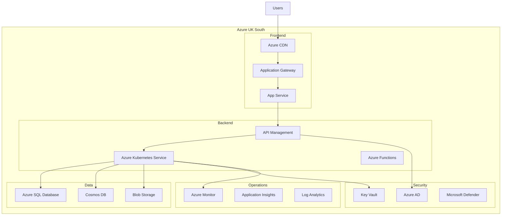

# Azure Technology Research: [PROJECT_NAME]

> **Template Status**: Experimental | **Version**: [VERSION] | **Command**: `/arckit.azure-research`

## Document Control

| Field | Value |
|-------|-------|
| **Document ID** | ARC-[PROJECT_ID]-AZRS-v[VERSION] |
| **Document Type** | Azure Technology Research |
| **Project** | [PROJECT_NAME] (Project [PROJECT_ID]) |
| **Classification** | [PUBLIC / OFFICIAL / OFFICIAL-SENSITIVE / SECRET] |
| **Status** | [DRAFT / IN_REVIEW / APPROVED / PUBLISHED / SUPERSEDED / ARCHIVED] |
| **Version** | [VERSION] |
| **Created Date** | [YYYY-MM-DD] |
| **Last Modified** | [YYYY-MM-DD] |
| **Review Cycle** | [Monthly / Quarterly / Annual / On-Demand] |
| **Next Review Date** | [YYYY-MM-DD] |
| **Owner** | [OWNER_NAME_AND_ROLE] |
| **Reviewed By** | [REVIEWER_NAME] ([YYYY-MM-DD]) or PENDING |
| **Approved By** | [APPROVER_NAME] ([YYYY-MM-DD]) or PENDING |
| **Distribution** | [DISTRIBUTION_LIST] |

## Revision History

| Version | Date | Author | Changes | Approved By | Approval Date |
|---------|------|--------|---------|-------------|---------------|
| [VERSION] | [DATE] | ArcKit AI | Initial creation from `/arckit.azure-research` agent | PENDING | PENDING |

---

## Executive Summary

### Research Scope

This document presents Azure-specific technology research findings for the project requirements. It provides Azure service recommendations, architecture patterns, and implementation guidance based on official Microsoft documentation.

**Requirements Analyzed**: [X] functional, [Y] non-functional, [Z] integration, [W] data requirements

**Azure Services Evaluated**: [X] Azure services across [Y] categories

**Research Sources**: [Microsoft Learn, Azure Architecture Center, Azure Well-Architected Framework, Microsoft Learn MCP]

### Key Recommendations

| Requirement Category | Recommended Azure Service | Tier | Monthly Estimate |
|---------------------|---------------------------|------|------------------|
| [Category 1] | [Azure Service] | [Standard/Premium] | £[X] |
| [Category 2] | [Azure Service] | [Standard/Premium] | £[Y] |
| [Category 3] | [Azure Service] | [Standard/Premium] | £[Z] |

### Architecture Pattern

**Recommended Pattern**: [Pattern Name from Azure Architecture Center]

**Reference Architecture**: [Link to Azure reference architecture]

### UK Government Suitability

| Criteria | Status | Notes |
|----------|--------|-------|
| **UK Region Availability** | ✅ UK South, UK West | Primary: UK South |
| **G-Cloud Listing** | ✅ G-Cloud 14 | Framework: [RM1557.14] |
| **Data Classification** | ✅ OFFICIAL / OFFICIAL-SENSITIVE | Azure Government for SECRET |
| **NCSC Cloud Security Principles** | ✅ 14/14 principles met | [Link to attestation] |

---

## Azure Services Analysis

### Category 1: [CATEGORY_NAME]

**Requirements Addressed**: [FR-001, FR-015, NFR-SEC-003]

**Why This Category**: [Explain based on requirements]

---

#### Recommended: [AZURE_SERVICE_NAME]

**Service Overview**:
- **Full Name**: [e.g., Azure Kubernetes Service (AKS)]
- **Category**: [Compute / Storage / Database / AI / Security / etc.]
- **Documentation**: [Microsoft Learn link]

**Key Features**:
- [Feature 1]: [Description]
- [Feature 2]: [Description]
- [Feature 3]: [Description]

**Pricing Tiers**:

| Tier | Monthly Cost | Features | Use Case |
|------|--------------|----------|----------|
| Basic | £[X] | [Features] | Dev/Test |
| Standard | £[Y] | [Features] | Production |
| Premium | £[Z] | [Features] | Enterprise |

**Estimated Cost for This Project**:

| Resource | Configuration | Monthly Cost | Notes |
|----------|---------------|--------------|-------|
| [Service] | [Size/Tier] | £[X] | [Based on requirements] |
| [Service] | [Size/Tier] | £[Y] | [Based on requirements] |
| **Total** | | **£[Z]** | |

**Azure Well-Architected Assessment**:

| Pillar | Rating | Notes |
|--------|--------|-------|
| **Reliability** | ⭐⭐⭐⭐⭐ | [SLA, availability zones, DR] |
| **Security** | ⭐⭐⭐⭐⭐ | [Encryption, identity, network] |
| **Cost Optimization** | ⭐⭐⭐⭐☆ | [Reserved instances, scaling] |
| **Operational Excellence** | ⭐⭐⭐⭐⭐ | [Monitoring, automation] |
| **Performance Efficiency** | ⭐⭐⭐⭐⭐ | [Scaling, caching, CDN] |

**Azure Security Benchmark Alignment**:

| Control | Status | Implementation |
|---------|--------|----------------|
| NS-1: Network Security | ✅ | Private endpoints, NSGs |
| IM-1: Identity Management | ✅ | Azure AD, managed identities |
| DP-1: Data Protection | ✅ | Encryption at rest/transit |
| LT-1: Logging and Threat Detection | ✅ | Azure Monitor, Defender |

**Integration Capabilities**:
- **APIs**: REST, ARM, Bicep, Terraform
- **SDKs**: .NET, Python, Java, JavaScript, Go
- **Event-Driven**: Event Grid, Service Bus integration
- **Other Azure Services**: [List integrations]

**UK Region Availability**:
- ✅ UK South (Primary)
- ✅ UK West (DR)
- [Any limitations in UK regions]

**Compliance Certifications**:
- ✅ ISO 27001, 27017, 27018
- ✅ SOC 1, 2, 3
- ✅ UK Cyber Essentials Plus
- ✅ UK G-Cloud
- ✅ GDPR compliant

---

#### Alternative: [ALTERNATIVE_AZURE_SERVICE]

[Repeat structure for alternative Azure service option]

---

#### Comparison Matrix

| Criteria | [Service A] | [Service B] | Winner |
|----------|-------------|-------------|--------|
| Cost (monthly) | £[X] | £[Y] | [Service] |
| Performance | [Rating] | [Rating] | [Service] |
| Ease of Use | [Rating] | [Rating] | [Service] |
| UK Availability | ✅ | ✅ | Tie |
| Feature Match | [X]% | [Y]% | [Service] |

**Recommendation**: [Service Name] - [Rationale]

---

### Category 2: [ANOTHER_CATEGORY]

[Repeat structure for each category]

---

## Architecture Pattern

### Recommended Azure Reference Architecture

**Pattern Name**: [e.g., Web application with API backend, Microservices on AKS]

**Azure Architecture Center Reference**: [Link]

**Pattern Description**:

[2-3 paragraph description of the pattern and why it fits requirements]

### Architecture Diagram



### Component Mapping

| Component | Azure Service | Purpose | Tier |
|-----------|---------------|---------|------|
| Web Frontend | App Service | Host web application | P1v3 |
| API Gateway | API Management | API security, rate limiting | Standard |
| Container Platform | AKS | Microservices hosting | Standard |
| Primary Database | Azure SQL | Relational data | Business Critical |
| Document Store | Cosmos DB | NoSQL data | Provisioned |
| File Storage | Blob Storage | Documents, media | Hot |
| Secrets | Key Vault | Keys, secrets, certificates | Standard |
| Identity | Azure AD | Authentication, authorization | P1 |
| Monitoring | Azure Monitor | Logs, metrics, alerts | Standard |

---

## Security & Compliance

### Azure Security Benchmark Mapping

| ASB Control Domain | Controls Implemented | Azure Services |
|-------------------|---------------------|----------------|
| **Network Security (NS)** | NS-1, NS-2, NS-3 | VNet, NSG, Private Link, WAF |
| **Identity Management (IM)** | IM-1, IM-2, IM-3 | Azure AD, Managed Identity, PIM |
| **Privileged Access (PA)** | PA-1, PA-2, PA-3 | Azure AD PIM, JIT access |
| **Data Protection (DP)** | DP-1, DP-2, DP-3 | Encryption, Key Vault, TDE |
| **Asset Management (AM)** | AM-1, AM-2, AM-3 | Resource Graph, Tags, Policies |
| **Logging & Threat Detection (LT)** | LT-1, LT-2, LT-3 | Monitor, Sentinel, Defender |
| **Incident Response (IR)** | IR-1, IR-2, IR-3 | Defender, Sentinel playbooks |
| **Posture & Vulnerability (PV)** | PV-1, PV-2, PV-3 | Defender, Update Management |
| **Endpoint Security (ES)** | ES-1, ES-2 | Defender for Endpoint |
| **Backup & Recovery (BR)** | BR-1, BR-2, BR-3 | Azure Backup, ASR |
| **DevOps Security (DS)** | DS-1, DS-2, DS-3 | DevOps, GitHub Advanced Security |
| **Governance & Strategy (GS)** | GS-1, GS-2, GS-3 | Policy, Blueprints, Management Groups |

### UK Government Security Alignment

| Framework | Alignment | Notes |
|-----------|-----------|-------|
| **NCSC Cloud Security Principles** | ✅ 14/14 | Full attestation available |
| **Cyber Essentials Plus** | ✅ Certified | Azure controls map to CE+ |
| **UK GDPR** | ✅ Compliant | UK data residency, DPA signed |
| **OFFICIAL** | ✅ Suitable | Standard Azure services |
| **OFFICIAL-SENSITIVE** | ✅ Suitable | Additional controls required |
| **SECRET** | ⚠️ Azure Government | Separate tenant required |

### Microsoft Defender for Cloud

**Recommendations**:
- Enable Defender for Cloud on all subscriptions
- Enable Defender plans for: Servers, App Service, SQL, Storage, Key Vault, Kubernetes
- Configure Security Policy aligned to Azure Security Benchmark
- Enable Continuous Export to Log Analytics

---

## Implementation Guidance

### Infrastructure as Code

**Recommended Approach**: Bicep (Azure-native) or Terraform

#### Bicep Example

```bicep
// main.bicep - Core infrastructure
targetScope = 'subscription'

param location string = 'uksouth'
param environment string = 'prod'
param projectName string

// Resource Group
resource rg 'Microsoft.Resources/resourceGroups@2023-07-01' = {
  name: 'rg-${projectName}-${environment}'
  location: location
}

// Deploy modules
module networking 'modules/networking.bicep' = {
  name: 'networking'
  scope: rg
  params: {
    location: location
    environment: environment
  }
}

module compute 'modules/compute.bicep' = {
  name: 'compute'
  scope: rg
  params: {
    location: location
    environment: environment
    subnetId: networking.outputs.subnetId
  }
}
```

#### Terraform Example

```hcl
# main.tf - Core infrastructure
provider "azurerm" {
  features {}
}

resource "azurerm_resource_group" "main" {
  name     = "rg-${var.project_name}-${var.environment}"
  location = "UK South"
}

module "networking" {
  source      = "./modules/networking"
  rg_name     = azurerm_resource_group.main.name
  location    = azurerm_resource_group.main.location
  environment = var.environment
}

module "compute" {
  source      = "./modules/compute"
  rg_name     = azurerm_resource_group.main.name
  location    = azurerm_resource_group.main.location
  subnet_id   = module.networking.subnet_id
  environment = var.environment
}
```

### Azure DevOps Pipeline

```yaml
# azure-pipelines.yml
trigger:
  branches:
    include:
      - main

pool:
  vmImage: 'ubuntu-latest'

stages:
  - stage: Validate
    jobs:
      - job: ValidateBicep
        steps:
          - task: AzureCLI@2
            inputs:
              azureSubscription: 'Azure-ServiceConnection'
              scriptType: 'bash'
              scriptLocation: 'inlineScript'
              inlineScript: |
                az bicep build --file main.bicep
                az deployment sub validate \
                  --location uksouth \
                  --template-file main.bicep

  - stage: Deploy
    dependsOn: Validate
    jobs:
      - deployment: DeployInfrastructure
        environment: 'production'
        strategy:
          runOnce:
            deploy:
              steps:
                - task: AzureCLI@2
                  inputs:
                    azureSubscription: 'Azure-ServiceConnection'
                    scriptType: 'bash'
                    scriptLocation: 'inlineScript'
                    inlineScript: |
                      az deployment sub create \
                        --location uksouth \
                        --template-file main.bicep \
                        --parameters environment=prod
```

### Code Samples

**Official Microsoft Samples**:

| Sample | Description | GitHub Link |
|--------|-------------|-------------|
| [Sample 1] | [Description] | [Link] |
| [Sample 2] | [Description] | [Link] |
| [Sample 3] | [Description] | [Link] |

---

## Cost Estimate

### Monthly Cost Summary

| Category | Azure Service | Configuration | Monthly Cost |
|----------|---------------|---------------|--------------|
| Compute | [Service] | [Size] | £[X] |
| Database | [Service] | [Tier] | £[Y] |
| Storage | [Service] | [Tier] | £[Z] |
| Networking | [Service] | [Config] | £[W] |
| Security | [Service] | [Tier] | £[V] |
| Monitoring | [Service] | [Tier] | £[U] |
| **Total** | | | **£[TOTAL]** |

### 3-Year TCO

| Year | Monthly | Annual | Cumulative | Notes |
|------|---------|--------|------------|-------|
| Year 1 | £[X] | £[Y] | £[Y] | Setup + operation |
| Year 2 | £[X] | £[Y] | £[Z] | + 3% reserved savings |
| Year 3 | £[X] | £[Y] | £[W] | + 3% reserved savings |
| **Total** | | | **£[TOTAL]** | |

### Cost Optimization Recommendations

1. **Reserved Instances**: Save up to 72% on compute with 3-year reservations
2. **Azure Hybrid Benefit**: Use existing Windows Server/SQL licenses
3. **Spot VMs**: Use for dev/test and fault-tolerant workloads (up to 90% savings)
4. **Auto-scaling**: Scale down during off-peak hours
5. **Right-sizing**: Use Azure Advisor recommendations

**Estimated Savings with Optimizations**: £[X]/month (Y% reduction)

---

## UK Government Considerations

### G-Cloud Procurement

**Azure on G-Cloud 14**:
- **Framework**: RM1557.14
- **Supplier**: Microsoft Limited
- **Service ID**: [Service ID from Digital Marketplace]

**Procurement Steps**:
1. Search Digital Marketplace for "Microsoft Azure"
2. Review service description and pricing
3. Direct award (if requirements clear) or further competition
4. Use call-off contract under G-Cloud terms

### Azure Government (if SECRET classification required)

For SECRET data classification:
- **Azure Government UK**: Separate sovereign cloud
- **Accreditation**: IL3+ certified
- **Access**: Requires MOD/government sponsorship
- **Contact**: [Azure Government UK team]

### Data Residency

| Data Type | Storage Location | Replication | Notes |
|-----------|------------------|-------------|-------|
| Primary Data | UK South | UK West (GRS) | GDPR compliant |
| Backups | UK South/West | Within UK | No cross-border |
| Logs | UK South | N/A | Log Analytics workspace |

---

## References

### Microsoft Learn Documentation

| Topic | Link |
|-------|------|
| [Service 1] Documentation | [Microsoft Learn URL] |
| [Service 2] Documentation | [Microsoft Learn URL] |
| Azure Architecture Center | https://learn.microsoft.com/azure/architecture/ |
| Azure Well-Architected Framework | https://learn.microsoft.com/azure/well-architected/ |
| Azure Security Benchmark | https://learn.microsoft.com/security/benchmark/azure/ |

### Azure Architecture Center References

| Reference Architecture | Link |
|------------------------|------|
| [Pattern 1] | [Azure Architecture Center URL] |
| [Pattern 2] | [Azure Architecture Center URL] |

### Code Samples

| Sample | Repository |
|--------|------------|
| [Sample 1] | [GitHub URL] |
| [Sample 2] | [GitHub URL] |

---

## Next Steps

### Immediate Actions

1. **Review Findings**: Share with architecture team and stakeholders
2. **Validate Costs**: Use Azure Pricing Calculator for detailed estimates
3. **Security Review**: Engage security team for Azure Security Benchmark review
4. **POC Planning**: Identify POC scope and success criteria

### Integration with Other ArcKit Commands

- Run `/arckit.diagram` to create detailed Azure architecture diagrams
- Run `/arckit.secure` to validate against UK Secure by Design
- Run `/arckit.devops` to plan Azure DevOps/GitHub Actions pipelines
- Run `/arckit.finops` to create Azure cost management strategy

## External References

| Document | Type | Source | Key Extractions | Path |
|----------|------|--------|-----------------|------|
| *None provided* | — | — | — | — |

---

**Generated by**: ArcKit `/arckit.azure-research` agent
**Generated on**: [DATE]
**ArcKit Version**: [VERSION]
**Project**: [PROJECT_NAME]
**Model**: [AI_MODEL]
**MCP Sources**: Microsoft Learn MCP Server (https://learn.microsoft.com/api/mcp)
