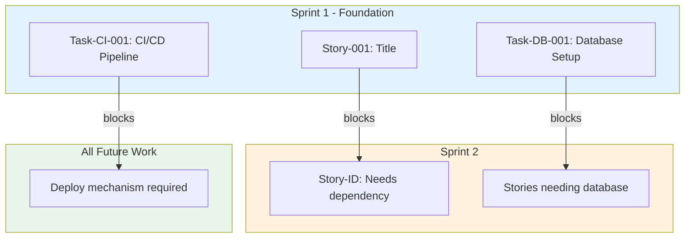
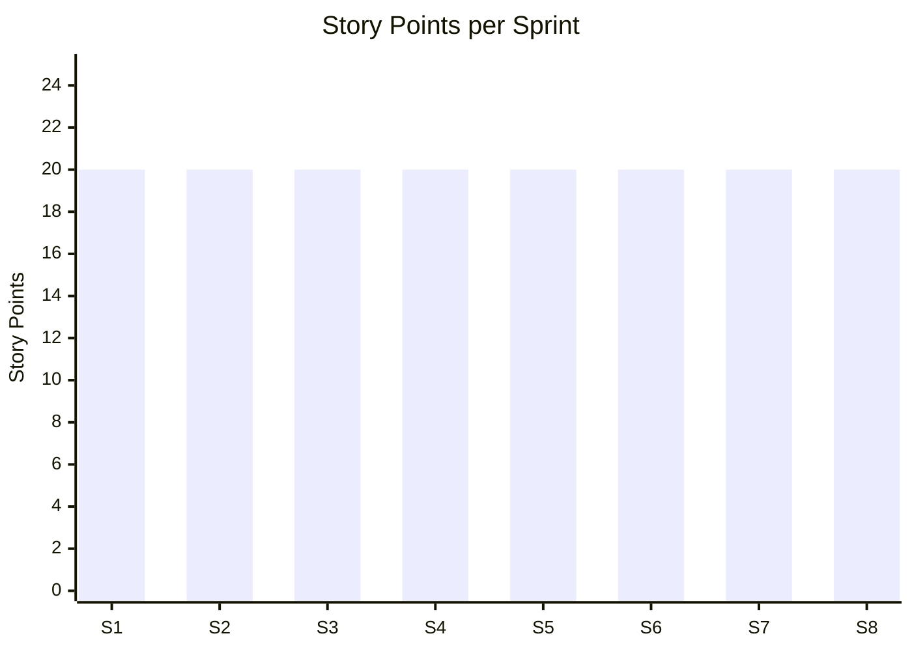

# Product Backlog: [Project Name]

> **Template Status**: Beta | **Version**: [VERSION] | **Command**: `/arckit.backlog`

## Document Control

| Field | Value |
|-------|-------|
| **Document ID** | ARC-[PROJECT_ID]-BLOG-v[VERSION] |
| **Document Type** | Product Backlog |
| **Project** | [PROJECT_NAME] (Project [PROJECT_ID]) |
| **Classification** | [PUBLIC / OFFICIAL / OFFICIAL-SENSITIVE / SECRET] |
| **Status** | [DRAFT / IN_REVIEW / APPROVED / PUBLISHED / SUPERSEDED / ARCHIVED] |
| **Version** | [VERSION] |
| **Created Date** | [YYYY-MM-DD] |
| **Last Modified** | [YYYY-MM-DD] |
| **Review Cycle** | [Monthly / Quarterly / Annual / On-Demand] |
| **Next Review Date** | [YYYY-MM-DD] |
| **Owner** | [OWNER_NAME_AND_ROLE] |
| **Reviewed By** | [REVIEWER_NAME] ([YYYY-MM-DD]) or PENDING |
| **Approved By** | [APPROVER_NAME] ([YYYY-MM-DD]) or PENDING |
| **Distribution** | [DISTRIBUTION_LIST] |

## Revision History

| Version | Date | Author | Changes | Approved By | Approval Date |
|---------|------|--------|---------|-------------|---------------|
| [VERSION] | [DATE] | ArcKit AI | Initial creation from `/arckit.backlog` command | PENDING | PENDING |

---

## Executive Summary

**Total Stories**: [N]
**Total Epics**: [N]
**Total Story Points**: [N]
**Estimated Duration**: [N] sprints ([N] weeks)

### Priority Breakdown
- Must Have: [N] stories ([N] points) - [X]%
- Should Have: [N] stories ([N] points) - [X]%
- Could Have: [N] stories ([N] points) - [X]%

### Epic Breakdown
1. [Epic Name] ([N] points, [N] stories)
2. [Epic Name] ([N] points, [N] stories)
[... all epics listed ...]

---

## How to Use This Backlog

### For Product Owners:
1. Review epic priorities - adjust based on business needs
2. Refine story acceptance criteria before sprint planning
3. Validate user stories with actual users
4. Adjust sprint sequence based on stakeholder priorities

### For Development Teams:
1. Review stories in upcoming sprint (Sprint Planning)
2. Break down stories into tasks if needed
3. Estimate effort using team velocity
4. Identify technical blockers early
5. Update story status as work progresses

### For Scrum Masters:
1. Track velocity after each sprint
2. Adjust future sprint loading based on actual velocity
3. Monitor dependency chains
4. Escalate blockers early
5. Facilitate backlog refinement sessions

### Backlog Refinement Schedule:
- **Weekly**: Review and refine next 2 sprints
- **Bi-weekly**: Groom backlog beyond 2 sprints
- **Monthly**: Reassess epic priorities
- **Per sprint**: Update based on completed work and learnings

---

## Epics

### Epic 1: [Epic Name] ([BR-ID])

**Business Requirement**: [BR-ID]
**Priority**: [Must Have | Should Have | Could Have]
**Business Value**: [High | Medium | Low] - [description]
**Risk**: [Critical | High | Medium | Low] - [from risk register]
**Dependencies**: [Other epic IDs]
**Total Story Points**: [N]
**Estimated Duration**: [N] sprints

**Description**:
[Epic description from BR]

**Success Criteria**:
- [Criterion 1]
- [Criterion 2]
- [Criterion 3]

**Stories in this Epic**:
1. Story-[ID]: [Title] ([N] points) - Sprint [N]
2. Story-[ID]: [Title] ([N] points) - Sprint [N]
[... all stories in epic ...]

---

## Prioritized Backlog

### Story-001: [Story Title]

**As a** [persona]
**I want** [capability]
**So that** [goal]

**Acceptance Criteria**:
- It's done when [measurable outcome 1]
- It's done when [measurable outcome 2]
- It's done when [measurable outcome 3]
- It's done when [measurable outcome 4]

**Technical Tasks**:
- Task-001-A: [task description] ([N] points)
- Task-001-B: [task description] ([N] points)
- Task-001-C: [task description] ([N] points)

**Requirements Traceability**: [FR-xxx, NFR-xxx, etc.]
**Component**: [from HLD]
**Story Points**: [N]
**Priority**: [Must Have | Should Have | Could Have]
**Sprint**: [N]
**Dependencies**: [Story IDs that must be done first]

---

[... repeat for all stories ...]

---

## Sprint Plan

### Sprint 1: Foundation (Weeks 1-2)

**Velocity**: 20 story points
**Theme**: Technical foundation and core infrastructure

#### Must Have Stories (12 points):
- Story-001: [Title] ([N] points) [Epic: [Name]]
- Story-002: [Title] ([N] points) [Epic: [Name]]

#### Technical Tasks (4 points):
- Task-DB-001: [Title] ([N] points) [Epic: Infrastructure]
- Task-CI-001: [Title] ([N] points) [Epic: DevOps]

#### Testing Tasks (3 points):
- Task-TEST-001: [Title] ([N] points) [Epic: Testing]

#### Buffer (1 point):
- [Could Have story for buffer]

**Total Allocated**: 20 points

### Sprint Goals:
- [Goal 1]
- [Goal 2]
- [Goal 3]

### Dependencies Satisfied:
✅ [Dependency description or "None" for Sprint 1]

### Dependencies Created for Sprint 2:
→ [Dependency 1]
→ [Dependency 2]

### Risks:
⚠️ [Risk 1]
⚠️ [Risk 2]

### Definition of Done:
- [ ] Code reviewed and approved
- [ ] Unit tests written (80% coverage minimum)
- [ ] Integration tests written for critical paths
- [ ] Security scan passed (no critical/high issues)
- [ ] Deployed to dev environment
- [ ] Demo-able to stakeholders
- [ ] Documentation updated

---

### Sprint 2: [Theme] (Weeks 3-4)

[... repeat sprint structure ...]

---

[... all sprints ...]

---

## Appendices

### A. Requirements Traceability Matrix

| Requirement | Type | User Stories | Sprint | Status | Notes |
|-------------|------|-------------|--------|--------|-------|
| BR-001 | Business | Story-001, Story-002, ... | 1-2 | Planned | [Epic name] |
| FR-001 | Functional | Story-001 | 1 | Planned | [Description] |
| NFR-005 | Non-Functional | Task-NFR-005 | 2 | Planned | [Description] |
[... all requirements ...]

**Coverage Summary**:
- Total Requirements: [N]
- Mapped to Stories: [N] (100%)
- Scheduled in Sprints 1-[N]: [N] ([X]%)
- Remaining for Future Sprints: [N] ([X]%)

---

### B. Dependency Graph

---

### C. Epic Overview

| Epic ID | Epic Name | Priority | Stories | Points | Sprints | Status | Dependencies |
|---------|-----------|----------|---------|--------|---------|--------|--------------|
| EPIC-001 | [Name] | Must Have | [N] | [N] | 1-2 | Planned | None |
| EPIC-002 | [Name] | Must Have | [N] | [N] | 2-4 | Planned | EPIC-001 |
[... all epics ...]

**Total**: [N] epics, [N] stories, [N] story points

---

### D. Story Points Distribution

**Summary**:
- Total: [N] points allocated / [N] points total
- Remaining: [N] points ([N] more sprints needed)

---

### E. Risk-Based Prioritization

**High Risk Items (Addressed Early)**:
- Sprint [N]: [Risk description and story]
- Sprint [N]: [Risk description and story]

**Medium Risk Items**:
- Sprint [N]: [Risk description and story]

**Low Risk Items**:
- Sprint [N]: [Risk description and story]

---

### F. Definition of Done (from Architecture Principles)

Every story must meet these criteria before marking "Done":

#### Code Quality
- [ ] Code reviewed by 2+ team members
- [ ] No merge conflicts
- [ ] Follows coding standards (linting passed)
- [ ] No code smells or technical debt introduced

#### Testing
- [ ] Unit tests written (minimum 80% coverage)
- [ ] Integration tests written for API endpoints
- [ ] Manual testing completed
- [ ] Acceptance criteria verified and signed off

#### Security
- [ ] Security scan passed (no critical/high vulnerabilities)
- [ ] OWASP Top 10 checks completed
- [ ] Secrets not hardcoded (use environment variables)
- [ ] Authentication and authorization tested

#### Performance
- [ ] Performance tested (meets NFR thresholds)
- [ ] No N+1 query issues
- [ ] Caching implemented where appropriate
- [ ] Response times within acceptable limits

#### Compliance
- [ ] GDPR requirements met (if handling user data)
- [ ] Accessibility tested (WCAG 2.1 AA)
- [ ] Audit logging in place (if required)

#### Documentation
- [ ] API documentation updated (OpenAPI/Swagger)
- [ ] Code comments for complex logic
- [ ] README updated if needed
- [ ] Runbook updated (if operational changes)

#### Deployment
- [ ] Deployed to dev environment
- [ ] Deployed to staging environment
- [ ] Database migrations tested (if applicable)
- [ ] Configuration updated in all environments

#### Stakeholder
- [ ] Demoed to Product Owner at sprint review
- [ ] Acceptance criteria validated by PO
- [ ] User feedback incorporated (if available)

---

## Future Sprints (Beyond Sprint 8)

**Remaining Backlog**: [N] story points
**Estimated Duration**: [N] sprints (at [velocity] points/sprint)

**High Priority Items for Sprint 9+**:
1. Story-[ID]: [Title] ([N] points) - [Epic name]
2. Story-[ID]: [Title] ([N] points) - [Epic name]
[... remaining high-priority items ...]

**Could Have Items (Deferred)**:
- Story-[ID]: [Title] ([N] points) - [Reason for deferral]
- Story-[ID]: [Title] ([N] points) - [Reason for deferral]

---

## Backlog Maintenance

### Velocity Tracking
After each sprint, update:
- Actual velocity vs planned
- Velocity trend (improving, stable, declining)
- Adjust future sprint capacity accordingly

### Backlog Grooming Sessions
- **Weekly**: Refine next 2 sprints (add details, update estimates)
- **Bi-weekly**: Groom backlog beyond 2 sprints (reprioritize)
- **Monthly**: Review epic priorities (business changes)

### When to Re-Generate Backlog
- Requirements significantly changed
- New epics added
- Business priorities shifted
- Architecture redesigned

---

## Integration with Other ArcKit Commands

**This backlog was generated from**:
- `/arckit.requirements` - Source of all stories
- `/arckit.hld` - Component mapping
- `/arckit.stakeholders` - User personas
- `/arckit.risk-register` - Risk priorities
- `/arckit.business-case` - Value priorities

**Use this backlog with**:
- `/arckit.traceability` - Track requirements through implementation
- `/arckit.test-strategy` - Generate test cases from acceptance criteria
- `/arckit.analyze` - Validate backlog completeness

---

**Important Notes**:

⚠️ **Story Points Are Estimates**: AI-generated estimates should be validated by your team based on actual velocity and capacity. Use team poker for consensus estimation.

⚠️ **Velocity Will Vary**: Initial velocity (20 points) is assumed. Track actual velocity after Sprint 1 and adjust future sprints accordingly.

⚠️ **Dependencies May Change**: Technical dependencies are identified automatically but may need adjustment based on your team's approach and constraints.

⚠️ **Regular Refinement Required**: This backlog is a starting point. Teams should refine weekly and adapt based on learnings.

## External References

| Document | Type | Source | Key Extractions | Path |
|----------|------|--------|-----------------|------|
| *None provided* | — | — | — | — |

---

**Generated by**: ArcKit `/arckit.backlog` command
**Generated on**: [DATE]
**ArcKit Version**: [VERSION]
**Project**: [PROJECT_NAME]
**Model**: [AI_MODEL]

---

**End of Backlog**
