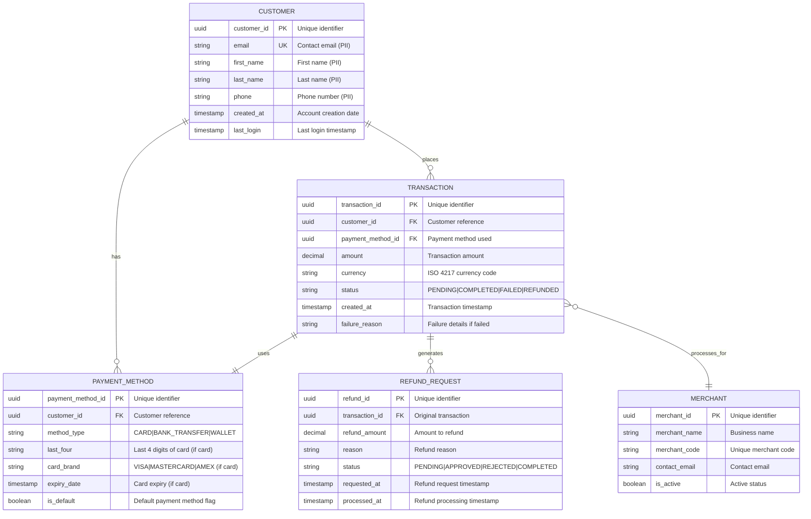

# Data Model: [PROJECT_NAME]

> **Template Status**: Live | **Version**: [VERSION] | **Command**: `/arckit.data-model`

## Document Control

| Field | Value |
|-------|-------|
| **Document ID** | ARC-[PROJECT_ID]-DATA-v[VERSION] |
| **Document Type** | Data Model |
| **Project** | [PROJECT_NAME] (Project [PROJECT_ID]) |
| **Classification** | [PUBLIC / OFFICIAL / OFFICIAL-SENSITIVE / SECRET] |
| **Status** | [DRAFT / IN_REVIEW / APPROVED / PUBLISHED / SUPERSEDED / ARCHIVED] |
| **Version** | [VERSION] |
| **Created Date** | [YYYY-MM-DD] |
| **Last Modified** | [YYYY-MM-DD] |
| **Review Cycle** | [Monthly / Quarterly / Annual / On-Demand] |
| **Next Review Date** | [YYYY-MM-DD] |
| **Owner** | [OWNER_NAME_AND_ROLE] |
| **Reviewed By** | [REVIEWER_NAME] ([YYYY-MM-DD]) or PENDING |
| **Approved By** | [APPROVER_NAME] ([YYYY-MM-DD]) or PENDING |
| **Distribution** | [DISTRIBUTION_LIST] |

## Revision History

| Version | Date | Author | Changes | Approved By | Approval Date |
|---------|------|--------|---------|-------------|---------------|
| [VERSION] | [DATE] | ArcKit AI | Initial creation from `/arckit.data-model` command | PENDING | PENDING |

---

## Executive Summary

### Overview
[2-3 paragraphs explaining the purpose of this data model, what business domain it covers, and how it supports the project requirements]

### Model Statistics
- **Total Entities**: [X] entities defined (E-001 through E-XXX)
- **Total Attributes**: [Y] attributes across all entities
- **Total Relationships**: [Z] relationships mapped
- **Data Classification**:
  - 🟢 Public: [X] entities
  - 🟡 Internal: [X] entities
  - 🟠 Confidential: [X] entities ([X] contain PII)
  - 🔴 Restricted: [X] entities (payment card data, health records, etc.)

### Compliance Summary
- **GDPR/DPA 2018 Status**: [COMPLIANT | NEEDS_DPIA | GAPS_IDENTIFIED]
- **PII Entities**: [X] entities contain personally identifiable information
- **Data Protection Impact Assessment (DPIA)**: [REQUIRED | NOT_REQUIRED | COMPLETED]
- **Data Retention**: [Longest retention period] (driven by [regulation/requirement])
- **Cross-Border Transfers**: [YES | NO] (UK to [countries])

### Key Data Governance Stakeholders
- **Data Owner (Business)**: [Name/Role] - Accountable for data quality and usage
- **Data Steward**: [Name/Role] - Responsible for data governance policies
- **Data Custodian (Technical)**: [Name/Role] - Manages data storage and security
- **Data Protection Officer**: [Name/Role] - Ensures privacy compliance

---

## Visual Entity-Relationship Diagram (ERD)

**Diagram Notes**:
- **Cardinality**: `||` = exactly one, `o{` = zero or more, `|{` = one or more
- **Primary Keys (PK)**: Uniquely identify each record
- **Foreign Keys (FK)**: Reference other entities
- **Unique Keys (UK)**: Must be unique but not primary identifier

---

## Entity Catalog

### Entity E-001: [ENTITY_NAME]

**Description**: [What this entity represents in the business domain]

**Source Requirements**:
- [DR-001]: [Requirement description]
- [DR-002]: [Requirement description]

**Business Context**: [Why this entity exists, what business processes use it]

**Data Ownership**:
- **Business Owner**: [Stakeholder from RACI matrix] - Accountable for data accuracy and usage
- **Technical Owner**: [Team/Role] - Maintains database and schema
- **Data Steward**: [Name/Role] - Enforces data governance policies

**Data Classification**: [PUBLIC | INTERNAL | CONFIDENTIAL | RESTRICTED]

**Volume Estimates**:
- **Initial Volume**: [X] records at go-live
- **Growth Rate**: [+Y] records per month
- **Peak Volume**: [Z] records at Year 3
- **Average Record Size**: [N] KB

**Data Retention**:
- **Active Period**: [X] years in primary database
- **Archive Period**: [Y] years in cold storage
- **Total Retention**: [Z] years (driven by [GDPR | tax law | regulatory requirement])
- **Deletion Policy**: [Hard delete | Soft delete | Anonymization] after retention period

#### Attributes

| Attribute | Type | Required | PII | Description | Validation Rules | Default | Source Req |
|-----------|------|----------|-----|-------------|------------------|---------|------------|
| [attr_id] | UUID | Yes | No | Unique identifier | UUID v4 format | Auto-generated | DR-001 |
| [email] | VARCHAR(255) | Yes | Yes | Email address | RFC 5322 email format, unique | None | DR-002 |
| [first_name] | VARCHAR(50) | Yes | Yes | First name | Non-empty, 1-50 chars | None | DR-003 |
| [last_name] | VARCHAR(50) | Yes | Yes | Last name | Non-empty, 1-50 chars | None | DR-003 |
| [phone] | VARCHAR(20) | No | Yes | Phone number | E.164 format, optional | NULL | DR-004 |
| [created_at] | TIMESTAMP | Yes | No | Record creation time | ISO 8601, auto-set | NOW() | DR-005 |
| [updated_at] | TIMESTAMP | Yes | No | Last update time | ISO 8601, auto-update | NOW() | DR-005 |
| [is_active] | BOOLEAN | Yes | No | Active status flag | true/false | true | DR-006 |

**Attribute Notes**:
- **PII Attributes**: [List attributes that are personally identifiable information]
- **Encrypted Attributes**: [List attributes that must be encrypted at rest]
- **Derived Attributes**: [List attributes calculated from other fields]
- **Audit Attributes**: created_at, updated_at, created_by, updated_by for change tracking

#### Relationships

**Outgoing Relationships** (this entity references others):
- [relationship_name]: E-001 → E-002 ([cardinality: one-to-many | many-to-one | many-to-many])
  - Foreign Key: [fk_column_name] references E-002.[pk_column_name]
  - Description: [What this relationship represents]
  - Cascade Delete: [YES | NO] - If parent deleted, delete children?
  - Orphan Check: [REQUIRED | OPTIONAL] - Can child exist without parent?

**Incoming Relationships** (other entities reference this):
- [relationship_name]: E-003 → E-001
  - Description: [What this relationship represents]
  - Usage: [How other entities use this entity]

#### Indexes

**Primary Key**:
- `pk_[entity_name]` on `[primary_key_column]` (clustered index)

**Foreign Keys**:
- `fk_[entity]_[referenced_entity]` on `[foreign_key_column]`
  - References: E-XXX.[primary_key_column]
  - On Delete: [CASCADE | RESTRICT | SET NULL]
  - On Update: [CASCADE | RESTRICT]

**Unique Constraints**:
- `uk_[entity]_[column]` on `[column_name]` (e.g., email must be unique)

**Performance Indexes**:
- `idx_[entity]_[column]` on `[column_name]` (for frequent queries)
- `idx_[entity]_[col1]_[col2]` on `([column1], [column2])` (composite index)

**Full-Text Indexes** (if applicable):
- `ftx_[entity]_[column]` on `[text_column]` (for search functionality)

#### Privacy & Compliance

**GDPR/DPA 2018 Considerations**:
- **Contains PII**: [YES | NO]
- **PII Attributes**: [List of PII columns: email, first_name, last_name, phone, etc.]
- **Legal Basis for Processing**: [Consent | Contract | Legal Obligation | Vital Interests | Public Task | Legitimate Interests]
- **Data Subject Rights**:
  - **Right to Access**: Provide [entity] records via API endpoint [/api/subject-access-request]
  - **Right to Rectification**: Allow updates via [admin portal | API endpoint]
  - **Right to Erasure**: [Hard delete | Anonymize] records on request
  - **Right to Portability**: Export in [JSON | CSV | XML] format
  - **Right to Object**: [Support opt-out | Not applicable]
  - **Right to Restrict Processing**: [Support restriction flag | Not applicable]
- **Data Breach Impact**: [HIGH | MEDIUM | LOW] - If this entity is breached, impact on data subjects
- **Cross-Border Transfers**: [None | EU | US | Other] - Where data may be transferred
- **Data Protection Impact Assessment (DPIA)**: [REQUIRED | NOT_REQUIRED]

**Sector-Specific Compliance**:
- **PCI-DSS**: [Applicable if payment card data] - Special handling requirements
- **HIPAA**: [Applicable if healthcare data] - US healthcare regulations
- **FCA Regulations**: [Applicable if financial services] - UK financial conduct rules
- **Government Security Classification**: [OFFICIAL | SECRET | TOP SECRET]

**Audit Logging**:
- **Access Logging**: [Required | Not Required] - Log who accesses this data
- **Change Logging**: [Required | Not Required] - Log all modifications (before/after values)
- **Retention of Logs**: [X] years for compliance

---

### Entity E-002: [ENTITY_NAME]

[Repeat the full structure above for each entity: E-002, E-003, E-004, etc.]

**Description**: [What this entity represents]

**Source Requirements**: [DR-XXX references]

**Business Context**: [Business purpose]

**Data Ownership**: [Business Owner, Technical Owner, Data Steward]

**Data Classification**: [PUBLIC | INTERNAL | CONFIDENTIAL | RESTRICTED]

**Volume Estimates**: [Initial, Growth, Peak, Size]

**Data Retention**: [Active, Archive, Total, Deletion policy]

#### Attributes
[Full attributes table with Type, Required, PII, Validation, etc.]

#### Relationships
[Outgoing and Incoming relationships]

#### Indexes
[Primary Key, Foreign Keys, Unique Constraints, Performance Indexes]

#### Privacy & Compliance
[GDPR considerations, PII handling, Data subject rights, Compliance requirements]

---

[Repeat for E-003, E-004, E-005, etc. - continue for all entities]

---

## Data Governance Matrix

| Entity | Business Owner | Data Steward | Technical Custodian | Sensitivity | Compliance | Quality SLA | Access Control |
|--------|----------------|--------------|---------------------|-------------|------------|-------------|----------------|
| E-001: [Entity] | [CFO] | [Data Governance Lead] | [Database Team] | CONFIDENTIAL | GDPR, PCI-DSS | 99% accuracy | Role: Admin, Finance |
| E-002: [Entity] | [CTO] | [Data Governance Lead] | [Database Team] | INTERNAL | None | 95% completeness | Role: All authenticated |
| E-003: [Entity] | [CMO] | [Marketing Data Lead] | [Database Team] | CONFIDENTIAL | GDPR, Marketing regs | 98% accuracy | Role: Marketing, Sales |

**Governance Notes**:
- **Business Owner**: Accountable for data quality, accuracy, and appropriate usage
- **Data Steward**: Responsible for enforcing governance policies and resolving data quality issues
- **Technical Custodian**: Manages database infrastructure, backups, security controls
- **Sensitivity**: Classification drives access controls and encryption requirements
- **Compliance**: Regulatory frameworks that apply to this entity
- **Quality SLA**: Measurable quality targets (accuracy, completeness, timeliness)
- **Access Control**: Roles/groups permitted to view or modify data

---

## CRUD Matrix

**Purpose**: Shows which components/systems can Create, Read, Update, Delete each entity

| Entity | [Payment API] | [Admin Portal] | [Reporting Service] | [CRM Integration] | [Batch Jobs] | [Mobile App] |
|--------|---------------|----------------|---------------------|-------------------|--------------|--------------|
| E-001: Customer | CR-- | CRUD | -R-- | -R-- | --U- | -R-- |
| E-002: Transaction | CR-- | -R-- | -R-- | -R-- | ---- | -R-- |
| E-003: PaymentMethod | CRUD | CRUD | -R-- | ---- | ---- | -R-- |
| E-004: RefundRequest | CR-- | CRUD | -R-- | ---- | --U- | CR-- |
| E-005: Merchant | ---- | CRUD | -R-- | CR-- | ---- | ---- |

**Legend**:
- **C** = Create (can insert new records)
- **R** = Read (can query existing records)
- **U** = Update (can modify existing records)
- **D** = Delete (can remove records)
- **-** = No access

**Access Control Implications**:
- Components with **C** access require input validation and business rule enforcement
- Components with **U** access require audit logging (before/after values)
- Components with **D** access require authorization checks and soft delete patterns
- Components with **R** only should use read-only database connections

**Security Considerations**:
- **Least Privilege**: Each component has minimum necessary permissions
- **Separation of Duties**: Critical operations (e.g., delete) restricted to admin roles
- **Audit Trail**: All CUD operations logged with timestamp, user, before/after values

---

## Data Integration Mapping

### Upstream Systems (Data Sources)

#### Integration INT-001: [Source System Name]

**Source System**: [Legacy CRM | SAP | Salesforce | External API]

**Integration Type**: [Real-time API | Batch ETL | Event-driven | File transfer]

**Data Flow Direction**: [Source System] → [This System]

**Entities Affected**:
- **E-001 (Customer)**: Receives customer master data from CRM
  - Source Fields: CRM.customer_id → customer_external_id
  - Update Frequency: Real-time (event-driven on customer create/update)
  - Data Quality SLA: 99.9% accuracy, <5 minute latency

**Data Mapping**:
| Source Field | Source Type | Target Entity | Target Attribute | Transformation |
|--------------|-------------|---------------|------------------|----------------|
| CRM.cust_id | INT | E-001 | customer_external_id | Direct mapping |
| CRM.email_addr | VARCHAR | E-001 | email | Lowercase, trim whitespace |
| CRM.full_name | VARCHAR | E-001 | first_name, last_name | Split on space |

**Data Quality Rules**:
- **Validation**: Reject records with missing email or invalid format
- **Deduplication**: Check for existing customer by email before creating
- **Error Handling**: Failed records logged to error table for manual review

**Reconciliation**:
- **Frequency**: Daily at 02:00 UTC
- **Method**: Compare record counts and checksums between source and target
- **Tolerance**: <0.1% variance acceptable

---

#### Integration INT-002: [Another Source System]

[Repeat structure for each upstream integration]

---

### Downstream Systems (Data Consumers)

#### Integration INT-101: [Target System Name]

**Target System**: [Data Warehouse | Reporting Platform | External Partner API]

**Integration Type**: [Real-time API | Batch export | Event streaming | File transfer]

**Data Flow Direction**: [This System] → [Target System]

**Entities Shared**:
- **E-002 (Transaction)**: Provides transaction data for financial reporting
  - Update Frequency: Near real-time (15 minute batch)
  - Sync Method: REST API push
  - Data Latency SLA: <30 minutes

**Data Mapping**:
| Source Entity | Source Attribute | Target Field | Target Type | Transformation |
|---------------|------------------|--------------|-------------|----------------|
| E-002 | transaction_id | DW.txn_id | UUID | Direct mapping |
| E-002 | amount | DW.txn_amount | DECIMAL(10,2) | Currency conversion if needed |
| E-002 | created_at | DW.txn_timestamp | TIMESTAMP | Convert to UTC |

**Data Quality Assurance**:
- **Pre-send Validation**: Ensure all required fields populated
- **Retry Logic**: 3 retries with exponential backoff on failure
- **Monitoring**: Alert if sync latency exceeds SLA

---

#### Integration INT-102: [Another Target System]

[Repeat structure for each downstream integration]

---

### Master Data Management (MDM)

**Source of Truth** (which system is authoritative for each entity):

| Entity | System of Record | Rationale | Conflict Resolution |
|--------|------------------|-----------|---------------------|
| E-001: Customer | [This System] | Customer data mastered here, synced to CRM | This system wins on conflict |
| E-002: Transaction | [This System] | Transactions created here, immutable | No conflicts (append-only) |
| E-005: Merchant | [External Partner API] | Partner manages merchant data | Partner system wins on conflict |

**Data Lineage**:
- **E-001 (Customer)**: Created in [Registration Service] → Enriched in [This System] → Synced to [CRM, Data Warehouse]
- **E-002 (Transaction)**: Created in [This System] → Archived to [Data Lake] → Aggregated in [Reporting System]

---

## Privacy & Compliance

### GDPR / UK Data Protection Act 2018 Compliance

#### PII Inventory

**Entities Containing PII**:
- **E-001 (Customer)**: email, first_name, last_name, phone, billing_address
- **E-003 (PaymentMethod)**: last_four (indirect identifier), cardholder_name
- **E-004 (RefundRequest)**: refund_reason (may contain personal details)

**Total PII Attributes**: [X] attributes across [Y] entities

**Special Category Data** (sensitive PII under GDPR Article 9):
- [None | Health data | Biometric data | etc.] in entity [E-XXX]
- Requires explicit consent or legal basis beyond standard GDPR

#### Legal Basis for Processing

| Entity | Purpose | Legal Basis | Notes |
|--------|---------|-------------|-------|
| E-001: Customer | Customer account management | Contract (GDPR Art 6(1)(b)) | Processing necessary to perform contract |
| E-002: Transaction | Payment processing | Contract (GDPR Art 6(1)(b)) | Financial transaction execution |
| E-003: PaymentMethod | Payment processing | Contract (GDPR Art 6(1)(b)) | Store for future transactions with consent |
| E-004: RefundRequest | Refund processing | Contract (GDPR Art 6(1)(b)) | Customer service obligation |

**Consent Management** (if applicable):
- **Opt-in Required**: Marketing communications (E-001.marketing_consent)
- **Consent Storage**: E-XXX.consent_timestamp, consent_method, consent_version
- **Withdrawal**: User can withdraw consent via [account settings | API endpoint]

#### Data Subject Rights Implementation

**Right to Access (Subject Access Request)**:
- **Endpoint**: [/api/v1/subject-access-request]
- **Authentication**: Multi-factor authentication required
- **Response Format**: JSON containing all personal data
- **Response Time**: Within 30 days (GDPR requirement)
- **Entities Included**: E-001, E-002, E-003, E-004 (all entities with PII)

**Right to Rectification**:
- **Endpoint**: [/api/v1/customer/profile] (PUT)
- **UI**: Customer can update own data via account settings
- **Admin Override**: Admin portal for data steward corrections
- **Propagation**: Updates synced to downstream systems within [X] hours

**Right to Erasure (Right to be Forgotten)**:
- **Method**: [Hard delete | Pseudonymization | Anonymization]
- **Process**:
  1. Customer submits erasure request via [account settings | support ticket]
  2. Data Protection Officer reviews request (legal obligations check)
  3. If approved, [delete | anonymize] PII within 30 days
  4. Notify downstream systems to delete/anonymize
- **Exceptions**: Cannot delete if legal obligation to retain (e.g., financial records for tax law)
- **Retention Override**: Transaction financial data retained for 7 years per tax law (PII anonymized)

**Right to Data Portability**:
- **Endpoint**: [/api/v1/data-export]
- **Format**: JSON or CSV (machine-readable)
- **Scope**: All customer-provided data (E-001, E-003)
- **Exclusions**: Derived data, system-generated data

**Right to Object**:
- **Marketing Opt-out**: E-001.marketing_consent = false
- **Profiling Opt-out**: [Applicable | Not applicable]

**Right to Restrict Processing**:
- **Flag**: E-001.processing_restricted = true
- **Effect**: Data retained but not used for business operations (frozen)

#### Data Retention Schedule

| Entity | Active Retention | Archive Retention | Total Retention | Legal Basis | Deletion Method |
|--------|------------------|-------------------|-----------------|-------------|-----------------|
| E-001: Customer | Active account + 2 years | 5 years | 7 years | Tax law, GDPR | Anonymize PII, retain transactions |
| E-002: Transaction | 3 years | 4 years | 7 years | Tax law (HMRC) | Hard delete after 7 years |
| E-003: PaymentMethod | Active account | N/A | Until deleted by user | GDPR | Hard delete on user request |
| E-004: RefundRequest | 3 years | 4 years | 7 years | Financial records | Hard delete after 7 years |

**Retention Policy Enforcement**:
- **Automated Deletion**: Batch job runs monthly to delete/anonymize data past retention period
- **Audit Trail**: Deletion events logged (entity ID, deletion date, reason)

#### Cross-Border Data Transfers

**Data Locations**:
- **Primary Database**: [UK | EU | US] - [Cloud provider, region]
- **Backup Storage**: [UK | EU | US] - [Cloud provider, region]
- **Downstream Systems**: [List countries where data is transferred]

**UK-EU Data Transfers**:
- **Adequacy Decision**: UK-EU adequacy decision in effect (no additional safeguards required as of 2025)
- **Standard Contractual Clauses (SCCs)**: [Required | Not required]

**UK-US Data Transfers**:
- **UK Extension to EU-US Data Privacy Framework**: [Applicable | Not applicable]
- **Standard Contractual Clauses (SCCs)**: Required for US transfers
- **Supplementary Measures**: [Encryption in transit, encryption at rest, access controls]

#### Data Protection Impact Assessment (DPIA)

**DPIA Required**: [YES | NO]

**Triggers for DPIA** (GDPR Article 35):
- ✅ Large-scale processing of special category data (health, biometric, etc.)
- ✅ Systematic monitoring of publicly accessible areas (CCTV, tracking)
- ✅ Automated decision-making with legal or significant effects (credit scoring, profiling)
- ⬜ Other high-risk processing

**DPIA Status**: [NOT_STARTED | IN_PROGRESS | COMPLETED]

**DPIA Summary** (if completed):
- **Privacy Risks Identified**: [List key privacy risks]
- **Mitigation Measures**: [List controls to reduce risks]
- **Residual Risk**: [HIGH | MEDIUM | LOW]
- **ICO Consultation Required**: [YES | NO] - If high residual risk, consult ICO before processing

#### ICO Registration & Notifications

**ICO Registration**: [REGISTERED | REQUIRED | EXEMPT]
- **Registration Number**: [ICO-XXXXXXXX]
- **Renewal Date**: [Annual renewal date]

**Data Breach Notification**:
- **Breach Detection**: Automated monitoring, security alerts
- **ICO Notification Deadline**: Within 72 hours if high risk to rights and freedoms
- **Data Subject Notification**: Without undue delay if high risk
- **Breach Log**: All breaches logged (even if not reportable) in incident management system

---

### Sector-Specific Compliance

#### PCI-DSS (Payment Card Industry Data Security Standard)

**Applicability**: [APPLICABLE | NOT_APPLICABLE]

**Cardholder Data Entities**:
- **E-003 (PaymentMethod)**: Stores last_four, card_brand, expiry_date
  - **PAN (Primary Account Number)**: NOT STORED (tokenized by payment processor)
  - **CVV/CVC**: NOT STORED (prohibited by PCI-DSS)
  - **Expiry Date**: STORED (masked in logs)
  - **Cardholder Name**: STORED (encrypted at rest)

**PCI-DSS Controls**:
- **Requirement 3**: Protect stored cardholder data
  - Encryption: AES-256 encryption at rest
  - Tokenization: Full PAN replaced with token from [payment processor]
  - Key Management: Encryption keys stored in [HSM | Key Management Service]
- **Requirement 4**: Encrypt transmission of cardholder data
  - TLS 1.3 for all API communications
  - No cardholder data in URLs or logs
- **Requirement 8**: Identify and authenticate access
  - Multi-factor authentication for admin access to payment data
- **Requirement 10**: Track and monitor all access to cardholder data
  - Audit logging of all payment_method read/update operations

**PCI-DSS Compliance Level**: [Level 1 | Level 2 | Level 3 | Level 4]
- Based on transaction volume: [X] transactions per year

---

#### HIPAA (Health Insurance Portability and Accountability Act)

**Applicability**: [APPLICABLE | NOT_APPLICABLE]

[If applicable, detail PHI entities, HIPAA controls, BAA requirements]

---

#### FCA Regulations (Financial Conduct Authority - UK)

**Applicability**: [APPLICABLE | NOT_APPLICABLE]

[If applicable, detail financial data controls, record-keeping requirements]

---

#### Government Security Classifications (UK Public Sector)

**Applicability**: [APPLICABLE | NOT_APPLICABLE]

**Classification by Entity**:
- E-001: [OFFICIAL | OFFICIAL-SENSITIVE | SECRET | TOP SECRET]
- E-002: [OFFICIAL | OFFICIAL-SENSITIVE | SECRET | TOP SECRET]

**Security Controls**:
- [Detail controls based on classification: encryption, access controls, physical security]

---

## Data Quality Framework

### Quality Dimensions

#### Accuracy
**Definition**: Data correctly represents the real-world entity or event

**Quality Targets**:
| Entity | Attribute | Accuracy Target | Measurement Method | Owner |
|--------|-----------|-----------------|-------------------|-------|
| E-001: Customer | email | 99.5% valid emails | Bounce rate monitoring | Marketing Lead |
| E-001: Customer | phone | 95% valid phone numbers | Validation against telecoms DB | Customer Service |
| E-002: Transaction | amount | 100% accurate to penny | Reconciliation with bank statements | Finance Lead |

**Validation Rules**:
- **Email**: RFC 5322 format, MX record exists, not disposable domain
- **Phone**: E.164 format, valid country code, not invalid pattern (e.g., 00000000)
- **Amount**: Non-negative, max 2 decimal places, currency matches region

#### Completeness
**Definition**: All required data elements are populated

**Quality Targets**:
| Entity | Required Fields Completeness | Target | Current | Owner |
|--------|------------------------------|--------|---------|-------|
| E-001: Customer | first_name, last_name, email | 100% | [TBD] | Customer Service Lead |
| E-001: Customer | phone (optional) | 80% | [TBD] | Customer Service Lead |
| E-002: Transaction | All required fields | 100% | [TBD] | Finance Lead |

**Missing Data Handling**:
- **Required Fields**: Reject record creation if missing (hard validation)
- **Optional Fields**: Allow NULL, but track completeness % for reporting

#### Consistency
**Definition**: Data is consistent across systems and does not contradict itself

**Quality Targets**:
- **Cross-System**: Customer email in CRM matches email in Payment System (99.9% match rate)
- **Referential Integrity**: All foreign keys reference valid parent records (100%)
- **Business Rules**: Transaction amount matches sum of line items (100%)

**Reconciliation Process**:
- **Frequency**: Daily reconciliation between [This System] and [CRM, Data Warehouse]
- **Method**: Compare key fields (email, transaction totals) between systems
- **Discrepancy Resolution**: Automated sync if <0.1% variance, manual review if >0.1%

#### Timeliness
**Definition**: Data is up-to-date and available when needed

**Quality Targets**:
| Entity | Update Frequency | Staleness Tolerance | Current Latency | Owner |
|--------|------------------|---------------------|-----------------|-------|
| E-001: Customer | Real-time | <5 minutes | [TBD] | Integration Lead |
| E-002: Transaction | Real-time | <1 minute | [TBD] | Integration Lead |
| E-005: Merchant | Daily batch | <24 hours | [TBD] | Partner Integration Lead |

**Staleness Monitoring**:
- **Alert**: If data age exceeds staleness tolerance, alert data steward
- **Dashboard**: Real-time dashboard showing data freshness per entity

#### Uniqueness
**Definition**: No duplicate records exist (entity represents real-world object exactly once)

**Deduplication Rules**:
| Entity | Unique Key | Deduplication Logic | Duplicate Resolution |
|--------|------------|---------------------|----------------------|
| E-001: Customer | email | Case-insensitive email match | Merge records, keep oldest customer_id |
| E-002: Transaction | transaction_id | UUID uniqueness (guaranteed) | Cannot duplicate (primary key) |

**Duplicate Detection**:
- **Pre-insert Check**: Before creating E-001, check if email already exists
- **Periodic Scan**: Monthly scan for fuzzy duplicates (similar names + addresses)

#### Validity
**Definition**: Data conforms to defined formats, ranges, and business rules

**Validation Rules**:
| Attribute | Format/Range | Invalid Example | Handling |
|-----------|--------------|-----------------|----------|
| email | RFC 5322 | "not-an-email" | Reject on insert, flag in existing data |
| phone | E.164 | "123" | Reject on insert, allow NULL |
| amount | Positive decimal | -10.50 | Reject on insert (refunds use separate entity) |
| currency | ISO 4217 | "DOLLARS" | Reject on insert, must be "USD", "GBP", etc. |
| status | Enum | "UNKNOWN" | Reject on insert, must be valid status value |

---

### Data Quality Metrics

**Overall Data Quality Score** (weighted average):
- Accuracy: 40% weight → Target: 99%
- Completeness: 30% weight → Target: 95%
- Consistency: 15% weight → Target: 99.9%
- Timeliness: 10% weight → Target: 95%
- Uniqueness: 5% weight → Target: 99.9%

**Target Overall Score**: 97% or higher

**Monitoring**:
- **Dashboard**: Real-time data quality dashboard showing metrics per entity
- **Alerting**: Alert data steward if quality score drops below 95%
- **Reporting**: Monthly data quality report to data governance committee

---

### Data Quality Issue Resolution

**Issue Detection**:
- **Automated Validation**: Run data quality rules on insert/update
- **Periodic Audits**: Weekly batch scan for quality issues in existing data
- **User Reports**: Allow users to flag data quality issues

**Issue Classification**:
- **Critical**: Blocks business operations (e.g., invalid payment amount)
- **High**: Significant impact (e.g., missing customer email prevents communication)
- **Medium**: Moderate impact (e.g., missing optional phone number)
- **Low**: Minor impact (e.g., inconsistent address formatting)

**Resolution Process**:
1. **Detection**: Quality issue identified by automated rule or user report
2. **Logging**: Issue logged to data quality issue tracker (with entity, attribute, severity)
3. **Assignment**: Auto-assigned to data steward based on entity ownership
4. **Root Cause Analysis**: Identify why issue occurred (bad source data, integration bug, user error)
5. **Remediation**: Fix the data (manual correction or automated script)
6. **Prevention**: Update validation rules or source system to prevent recurrence
7. **Closure**: Verify fix, close issue, document lesson learned

**SLA for Resolution**:
- **Critical**: 4 hours
- **High**: 24 hours
- **Medium**: 3 business days
- **Low**: 10 business days

---

## Requirements Traceability

**Purpose**: Ensure every DR-xxx (Data Requirement) is modeled in this data model

| Requirement ID | Requirement Description | Entity | Attributes | Status | Notes |
|----------------|------------------------|--------|------------|--------|-------|
| DR-001 | Store customer identity and contact info | E-001: Customer | customer_id, email, first_name, last_name, phone | ✅ Implemented | |
| DR-002 | Track all payment transactions | E-002: Transaction | transaction_id, customer_id, amount, currency, status, created_at | ✅ Implemented | |
| DR-003 | Store payment methods securely | E-003: PaymentMethod | payment_method_id, method_type, last_four, card_brand | ✅ Implemented | PCI-DSS compliant tokenization |
| DR-004 | Support refund workflows | E-004: RefundRequest | refund_id, transaction_id, refund_amount, reason, status | ✅ Implemented | |
| DR-005 | Maintain merchant registry | E-005: Merchant | merchant_id, merchant_name, merchant_code, contact_email | ✅ Implemented | |
| DR-006 | GDPR: Right to erasure | E-001: Customer | [All PII fields] | ✅ Implemented | Anonymization process defined |
| DR-007 | PCI-DSS: Secure card storage | E-003: PaymentMethod | [Tokenized PAN] | ✅ Implemented | PAN not stored, token only |
| DR-008 | 7-year retention for financial records | E-002: Transaction | [All fields] | ✅ Implemented | Archive policy defined |

**Coverage Summary**:
- **Total DR Requirements**: [X]
- **Requirements Modeled**: [Y] (✅)
- **Requirements Partially Modeled**: [Z] (🟡)
- **Requirements Not Modeled**: [N] (❌)
- **Coverage %**: [Y/X * 100]%

**Gaps Identified**:
- [DR-XXX]: [Description of requirement not yet modeled] → **Action**: [Create entity E-XXX | Add attributes to E-YYY | Clarify requirement with stakeholder]

---

## Implementation Guidance

### Database Technology Recommendation

**Recommended Database**: [PostgreSQL | MySQL | MongoDB | DynamoDB | Neo4j | Multi-model]

**Rationale**:
- **Relational (PostgreSQL, MySQL)**: Recommended for transactional data with strong ACID guarantees
  - Use Case: E-001 (Customer), E-002 (Transaction), E-003 (PaymentMethod)
  - Benefits: Referential integrity, ACID transactions, mature tooling, SQL standards
- **Document (MongoDB, DynamoDB)**: Consider for flexible schemas, high write throughput
  - Use Case: E-XXX (Event logs, audit trails)
  - Benefits: Schema flexibility, horizontal scaling, high availability
- **Graph (Neo4j)**: Consider for highly connected data (social networks, fraud detection)
  - Use Case: E-XXX (Relationship graphs, recommendation engines)
  - Benefits: Traverse relationships efficiently, pattern matching
- **Time-Series (InfluxDB, TimescaleDB)**: Consider for metrics, events, IoT data
  - Use Case: E-XXX (System metrics, transaction metrics)
  - Benefits: Time-based queries, automatic downsampling, compression

**Chosen Technology**: [PostgreSQL 15+]
- **Justification**: [Strong ACID guarantees for financial transactions, excellent JSON support for flexible attributes, mature ecosystem, GDPR compliance tooling]
- **Cloud Provider**: [AWS RDS | Azure Database for PostgreSQL | Google Cloud SQL]
- **High Availability**: [Multi-AZ deployment | Read replicas | Failover strategy]

---

### Schema Migration Strategy

**Migration Tool**: [Flyway | Liquibase | Alembic | Django Migrations | Custom scripts]

**Versioning**:
- **Schema Version**: [V1.0.0] (semantic versioning)
- **Migration Scripts**: Stored in `db/migrations/` directory
- **Naming Convention**: `V[version]__[description].sql` (e.g., `V1.0.0__create_customer_table.sql`)

**Migration Process**:
1. **Development**: Create migration script in local environment
2. **Testing**: Run migration on test database, verify data integrity
3. **Peer Review**: Code review of migration script (check for data loss, performance impact)
4. **Staging**: Deploy migration to staging environment, run smoke tests
5. **Production**: Deploy migration during maintenance window (or zero-downtime if possible)
6. **Rollback Plan**: Document rollback procedure for each migration (undo script)

**Zero-Downtime Migrations** (where possible):
- **Additive Changes**: Add new columns/tables without dropping old ones (backward compatible)
- **Blue-Green Deployment**: Maintain two schemas, switch over when migration complete
- **Avoid**: Rename columns, drop columns, change data types (requires downtime or complex migration)

---

### Backup and Recovery

**Backup Strategy**:
- **Full Backup**: Daily at 02:00 UTC
- **Incremental Backup**: Every 6 hours
- **Transaction Log Backup**: Continuous (WAL archiving for PostgreSQL)
- **Backup Retention**: 30 days online, 7 years archival (for compliance)

**Recovery Point Objective (RPO)**: <1 hour (max data loss tolerable)

**Recovery Time Objective (RTO)**: <4 hours (max downtime tolerable)

**Disaster Recovery**:
- **Multi-Region Replication**: [ENABLED | DISABLED]
- **Failover**: Automated failover to secondary region if primary fails
- **DR Testing**: Quarterly DR drills to validate recovery procedures

**Backup Security**:
- **Encryption at Rest**: AES-256 encryption for all backups
- **Encryption in Transit**: TLS for backup transfers
- **Access Control**: Only DBA team can restore backups

---

### Data Archival

**Archival Policy**:
- **Active Data**: Data accessed frequently (last 3 years) → Hot storage (SSD)
- **Archived Data**: Data accessed rarely (3-7 years old) → Cold storage (S3 Glacier, Azure Archive)
- **Deleted Data**: Data past retention period → Permanently deleted or anonymized

**Archival Process**:
1. **Identification**: Monthly batch job identifies records older than active retention period
2. **Export**: Export records to cold storage in compressed format (Parquet, Avro)
3. **Deletion**: Delete from hot storage after successful export and verification
4. **Indexing**: Maintain metadata index in hot storage for retrieval (entity ID, archive location)

**Retrieval Process**:
- **Retrieval SLA**: Restore archived data within 24 hours (for compliance requests, litigation hold)
- **Cost**: Archival reduces storage costs by ~90% compared to hot storage

---

### Testing Data Strategy

**Test Data Requirements**:
- **Volume**: [10% | 50% | 100%] of production data volume for performance testing
- **Diversity**: Cover all entity types, edge cases, valid/invalid data

**Data Anonymization** (for non-production environments):
- **PII Masking**:
  - `email`: Replace with `test_<random>@example.com`
  - `first_name`, `last_name`: Replace with random names from faker library
  - `phone`: Replace with valid but fake phone numbers
  - `address`: Replace with valid but fake addresses
- **Referential Integrity**: Maintain relationships (foreign keys) while masking
- **Consistency**: Mask deterministically (same real email always maps to same fake email)

**Test Data Generation**:
- **Synthetic Data**: Use tools like [Faker | Mockaroo | custom scripts] to generate fake data
- **Production Copy**: Copy production data to staging, then anonymize PII
- **Prohibited**: Never use real PII in development or test environments

**Test Data Refresh**:
- **Frequency**: Monthly refresh of test data from production (anonymized)
- **Automation**: Automated pipeline to copy, anonymize, and load test data

---

## Appendix

### Glossary

- **PII (Personally Identifiable Information)**: Data that can identify an individual (email, name, phone, etc.)
- **GDPR (General Data Protection Regulation)**: EU regulation on data privacy (UK version: DPA 2018)
- **DPA 2018 (Data Protection Act 2018)**: UK implementation of GDPR
- **DPIA (Data Protection Impact Assessment)**: Assessment of privacy risks for high-risk processing
- **PCI-DSS (Payment Card Industry Data Security Standard)**: Security standard for handling payment card data
- **Cardinality**: Number of instances in a relationship (one-to-one, one-to-many, many-to-many)
- **Foreign Key**: Attribute that references the primary key of another entity
- **Referential Integrity**: Ensures foreign keys reference valid parent records
- **ACID (Atomicity, Consistency, Isolation, Durability)**: Database transaction properties
- **RPO (Recovery Point Objective)**: Maximum acceptable data loss in time
- **RTO (Recovery Time Objective)**: Maximum acceptable downtime

### References

- [HM Treasury Green Book](https://www.gov.uk/government/publications/the-green-book-appraisal-and-evaluation-in-central-governent) - Business case guidance (may reference data costs)
- [ICO Data Protection](https://ico.org.uk/for-organisations/guide-to-data-protection/) - UK GDPR compliance guidance
- [PCI Security Standards](https://www.pcisecuritystandards.org/) - Payment card data security
- [NCSC Cloud Security Principles](https://www.ncsc.gov.uk/collection/cloud/the-cloud-security-principles) - UK government cloud security
- [GDS Data Standards](https://www.gov.uk/government/collections/data-standards-for-government) - UK government data standards

---

**Document End**

*This data model is a living document and should be updated as requirements evolve, new entities are added, or compliance regulations change.*

## External References

| Document | Type | Source | Key Extractions | Path |
|----------|------|--------|-----------------|------|
| *None provided* | — | — | — | — |

---

**Generated by**: ArcKit `/arckit.data-model` command
**Generated on**: [DATE]
**ArcKit Version**: [VERSION]
**Project**: [PROJECT_NAME]
**Model**: [AI_MODEL]

