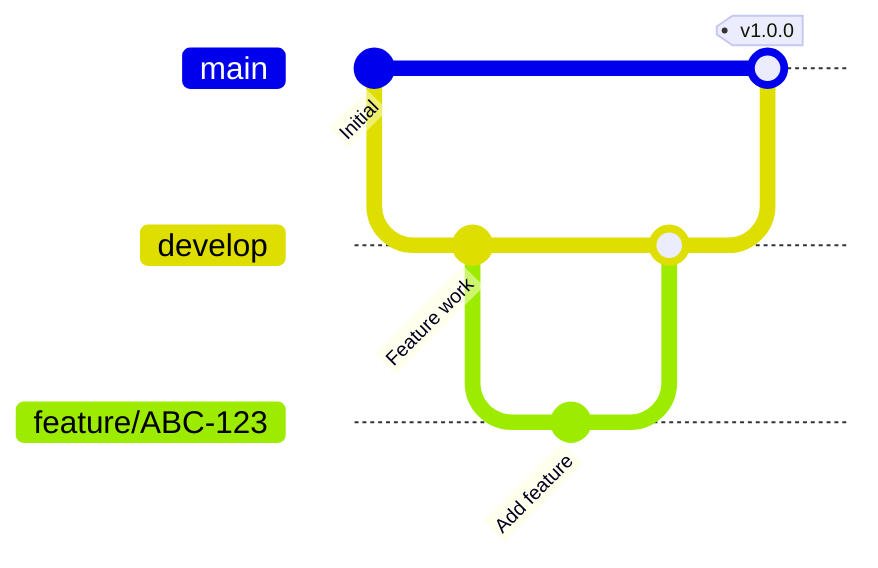
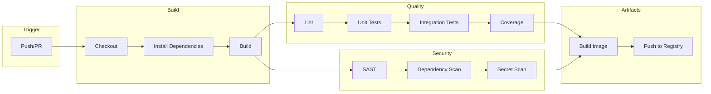
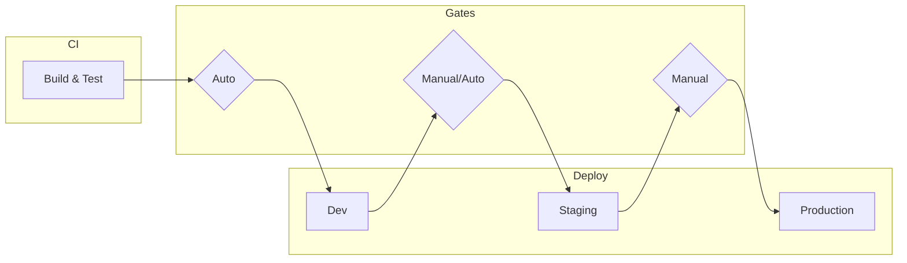
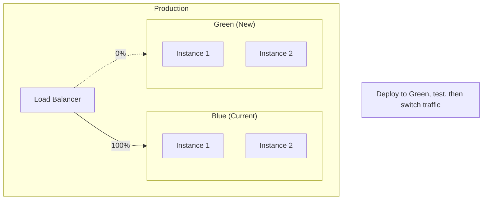
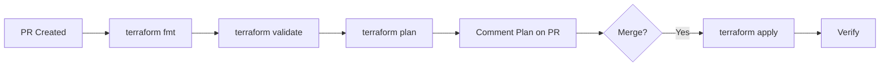
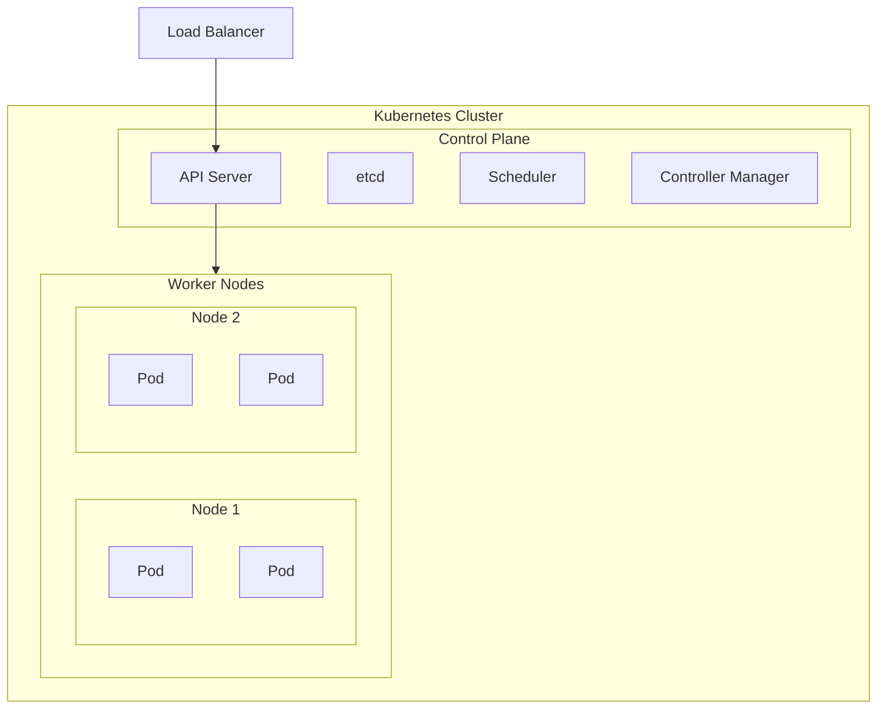
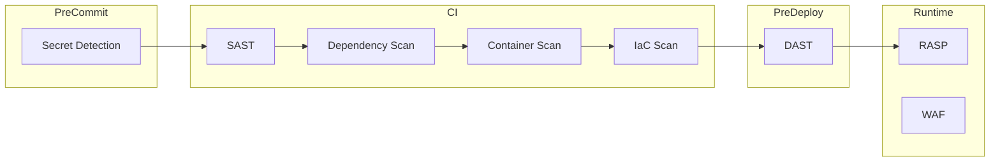
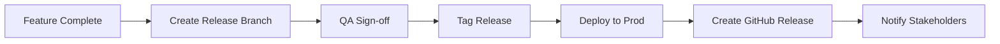

# DevOps Strategy

> **Template Status**: Experimental | **Version**: [VERSION] | **Command**: `/arckit.devops`

## Document Control

| Field | Value |
|-------|-------|
| **Document ID** | ARC-[PROJECT_ID]-DEVOPS-v[VERSION] |
| **Document Type** | DevOps Strategy |
| **Project** | [PROJECT_NAME] (Project [PROJECT_ID]) |
| **Classification** | [PUBLIC / OFFICIAL / OFFICIAL-SENSITIVE / SECRET] |
| **Status** | [DRAFT / IN_REVIEW / APPROVED / PUBLISHED / SUPERSEDED / ARCHIVED] |
| **Version** | [VERSION] |
| **Created Date** | [YYYY-MM-DD] |
| **Last Modified** | [YYYY-MM-DD] |
| **Review Cycle** | [Monthly / Quarterly / Annual / On-Demand] |
| **Next Review Date** | [YYYY-MM-DD] |
| **Owner** | [OWNER_NAME_AND_ROLE] |
| **Reviewed By** | [REVIEWER_NAME] ([YYYY-MM-DD]) or PENDING |
| **Approved By** | [APPROVER_NAME] ([YYYY-MM-DD]) or PENDING |
| **Distribution** | [DISTRIBUTION_LIST] |

## Revision History

| Version | Date | Author | Changes | Approved By | Approval Date |
|---------|------|--------|---------|-------------|---------------|
| [VERSION] | [DATE] | ArcKit AI | Initial creation from `/arckit.devops` command | PENDING | PENDING |

---

## 1. DevOps Overview

### Strategic Objectives

| Objective | Target | Rationale |
|-----------|--------|-----------|
| Deployment Frequency | [Daily / Weekly / On-demand] | [Why this target] |
| Lead Time for Changes | [<X hours/days] | [Why this target] |
| Change Failure Rate | [<X%] | [Why this target] |
| MTTR | [<X hours] | [Why this target] |

### DevOps Maturity

| Level | Current | Target | Timeline |
|-------|---------|--------|----------|
| Level 1 (Manual) | [Yes/No] | - | - |
| Level 2 (CI Automation) | [Yes/No] | [Yes/No] | [Date] |
| Level 3 (CI/CD) | [Yes/No] | [Yes/No] | [Date] |
| Level 4 (Continuous Deployment) | [Yes/No] | [Yes/No] | [Date] |
| Level 5 (Platform/GitOps) | [Yes/No] | [Yes/No] | [Date] |

### Team Structure

| Team | Responsibility | Size |
|------|----------------|------|
| Platform Team | CI/CD, IaC, observability | [X] |
| Development Team(s) | Application development | [X] |
| Security Team | Security scanning, compliance | [X] |

### Technology Stack

| Layer | Technology |
|-------|------------|
| Languages | [Python, TypeScript, Go, etc.] |
| Frameworks | [React, FastAPI, etc.] |
| Cloud Provider | [AWS / Azure / GCP] |
| Container Runtime | [Docker / containerd] |
| Orchestration | [Kubernetes / ECS / etc.] |
| CI/CD Platform | [GitHub Actions / GitLab CI / Azure DevOps] |
| IaC Tool | [Terraform / Pulumi / CloudFormation] |

---

## 2. Source Control Strategy

### Repository Structure

| Pattern | Description | When to Use |
|---------|-------------|-------------|
| **[Selected]** Monorepo | Single repo, multiple projects | Tight coupling, shared libraries |
| Multi-repo | Separate repos per service | Independent teams, loose coupling |

### Repository Layout

```
[repository-name]/
├── .github/
│   └── workflows/           # CI/CD pipelines
├── apps/
│   ├── [app-1]/            # Application 1
│   └── [app-2]/            # Application 2
├── packages/
│   └── [shared-lib]/       # Shared libraries
├── infra/
│   ├── terraform/          # Infrastructure code
│   └── kubernetes/         # K8s manifests
├── docs/                   # Documentation
└── scripts/                # Utility scripts
```

### Branching Strategy

| Strategy | **[Selected]** |
|----------|----------------|
| GitFlow | `main`, `develop`, `feature/*`, `release/*`, `hotfix/*` |
| Trunk-Based | `main` + short-lived feature branches |
| GitHub Flow | `main` + feature branches + PRs |



### Branch Protection Rules

| Branch | Rules |
|--------|-------|
| `main` | Require PR, require reviews ([X]), require status checks, no direct push |
| `develop` | Require PR, require status checks |
| `feature/*` | No restrictions |

### Commit Conventions

| Type | Description | Example |
|------|-------------|---------|
| `feat` | New feature | `feat(auth): add OAuth2 login` |
| `fix` | Bug fix | `fix(api): handle null response` |
| `docs` | Documentation | `docs: update README` |
| `chore` | Maintenance | `chore: update dependencies` |
| `refactor` | Code refactoring | `refactor: extract helper function` |

---

## 3. CI Pipeline Design

### Pipeline Architecture



### CI Stages

| Stage | Jobs | Duration Target | Failure Action |
|-------|------|-----------------|----------------|
| Build | Checkout, Install, Compile | <2 min | Block |
| Lint | ESLint, Prettier, Pylint | <1 min | Block |
| Unit Test | pytest, Jest | <5 min | Block |
| Integration Test | API tests | <10 min | Block |
| Security Scan | SAST, Dependencies | <5 min | Block (High/Critical) |
| Build Image | Docker build, push | <5 min | Block |
| **Total** | - | **<30 min** | - |

### Quality Gates

| Gate | Threshold | Enforcement |
|------|-----------|-------------|
| Test Coverage | >[X]% | Required |
| Lint Errors | 0 | Required |
| Unit Test Pass | 100% | Required |
| SAST Critical | 0 | Required |
| SAST High | 0 | Required |
| Dependency Vulnerabilities | 0 Critical/High | Required |

### Artifact Management

| Artifact | Registry | Retention |
|----------|----------|-----------|
| Container Images | [ECR / ACR / GCR / DockerHub] | [90 days / permanent for releases] |
| npm packages | [npm / Artifactory] | [Permanent] |
| Python packages | [PyPI / Artifactory] | [Permanent] |
| Build logs | [CI Platform] | [30 days] |

---

## 4. CD Pipeline Design

### Deployment Pipeline



### Environment Promotion

| Environment | Trigger | Approval | Duration |
|-------------|---------|----------|----------|
| Dev | Push to `develop` | Automatic | <5 min |
| Staging | PR merged to `main` | [Auto / Manual] | <10 min |
| Production | Release tag | Manual approval | <15 min |

### Deployment Strategies

| Strategy | Description | Use Case | Rollback Time |
|----------|-------------|----------|---------------|
| **[Selected]** Rolling | Gradual replacement | Low risk, stateless | Minutes |
| Blue-Green | Parallel environments | Zero downtime required | Seconds |
| Canary | Progressive traffic shift | High risk changes | Seconds |

### Blue-Green Deployment



### Canary Deployment

| Phase | Traffic to Canary | Duration | Success Criteria |
|-------|-------------------|----------|------------------|
| 1 | 5% | 15 min | Error rate <1%, latency <SLO |
| 2 | 25% | 30 min | Error rate <1%, latency <SLO |
| 3 | 50% | 1 hour | Error rate <1%, latency <SLO |
| 4 | 100% | - | Full rollout |

### Rollback Procedure

```bash
# 1. Identify issue
# Check monitoring dashboard for anomalies

# 2. Initiate rollback
[kubectl rollout undo deployment/[service] -n [namespace]]
# OR
[aws deploy stop-deployment --deployment-id [id] --auto-rollback-enabled]

# 3. Verify rollback
[kubectl rollout status deployment/[service] -n [namespace]]

# 4. Notify team
# Post in #[channel] with incident details

# 5. Create incident ticket
# Document for post-mortem
```

### Feature Flags

| Platform | Purpose |
|----------|---------|
| [LaunchDarkly / Unleash / Flagsmith / Custom] | Runtime feature control |

| Flag Type | Use Case |
|-----------|----------|
| Release flag | Enable/disable new features |
| Ops flag | Circuit breakers, kill switches |
| Experiment flag | A/B testing |
| Permission flag | Entitlement control |

---

## 5. Infrastructure as Code

### IaC Tool Selection

| Tool | **[Selected]** |
|------|----------------|
| Terraform | Multi-cloud, extensive provider support |
| Pulumi | Programming language support (TypeScript, Python) |
| CloudFormation | AWS-native |
| ARM/Bicep | Azure-native |

### Project Structure

```
infra/
├── modules/
│   ├── networking/
│   │   ├── main.tf
│   │   ├── variables.tf
│   │   └── outputs.tf
│   ├── compute/
│   ├── database/
│   └── security/
├── environments/
│   ├── dev/
│   │   └── main.tf
│   ├── staging/
│   │   └── main.tf
│   └── prod/
│       └── main.tf
├── backend.tf
└── versions.tf
```

### State Management

| Attribute | Value |
|-----------|-------|
| **Backend** | [S3 + DynamoDB / Azure Blob / GCS / Terraform Cloud] |
| **State Locking** | Enabled |
| **State Encryption** | Enabled |
| **State per Environment** | Yes |

### IaC Pipeline



### Drift Detection

| Check | Frequency | Action |
|-------|-----------|--------|
| `terraform plan` | Daily | Alert if drift detected |
| Manual audit | Monthly | Review and remediate |

---

## 6. Container Strategy

### Base Images

| Application Type | Base Image | Size |
|-----------------|------------|------|
| Python | `python:3.11-slim` | ~150MB |
| Node.js | `node:20-alpine` | ~180MB |
| Go | `gcr.io/distroless/static` | ~2MB |
| Java | `eclipse-temurin:17-jre-alpine` | ~200MB |

### Dockerfile Best Practices

```dockerfile
# Example Dockerfile
FROM python:3.11-slim AS builder
WORKDIR /app
COPY requirements.txt .
RUN pip install --no-cache-dir -r requirements.txt

FROM python:3.11-slim
WORKDIR /app

# Non-root user
RUN useradd -r -u 1000 appuser
USER appuser

COPY --from=builder /usr/local/lib/python3.11/site-packages /usr/local/lib/python3.11/site-packages
COPY . .

EXPOSE 8000
CMD ["python", "-m", "uvicorn", "main:app", "--host", "0.0.0.0"]
```

### Image Registry

| Registry | URL | Use |
|----------|-----|-----|
| [ECR / ACR / GCR] | [URL] | Production images |
| [DockerHub] | docker.io | Public base images |

### Image Security

| Check | Tool | When |
|-------|------|------|
| Vulnerability scan | [Trivy / Snyk / Clair] | CI pipeline |
| Image signing | [Cosign / Notary] | Post-build |
| Runtime security | [Falco / Sysdig] | Production |

### Image Tagging Strategy

| Tag | Example | Use |
|-----|---------|-----|
| Commit SHA | `abc123def` | Development |
| Semantic Version | `v1.2.3` | Releases |
| Latest | `latest` | **Never use in production** |
| Environment | `staging`, `prod` | Environment tracking |

---

## 7. Kubernetes / Orchestration

### Cluster Architecture



### Cluster Configuration

| Attribute | Value |
|-----------|-------|
| **Provider** | [EKS / AKS / GKE / Self-managed] |
| **Version** | [1.XX] |
| **Node Count** | [Min: X, Max: Y] |
| **Node Size** | [Instance type] |
| **Autoscaling** | [Cluster Autoscaler / Karpenter] |

### Namespace Strategy

| Namespace | Purpose | Teams |
|-----------|---------|-------|
| `[project]-dev` | Development environment | All developers |
| `[project]-staging` | Staging environment | QA, Dev leads |
| `[project]-prod` | Production environment | Operations |
| `monitoring` | Observability stack | Platform |
| `ingress` | Ingress controllers | Platform |

### Resource Management

| Resource Type | Request | Limit | Notes |
|---------------|---------|-------|-------|
| CPU (typical app) | 100m | 500m | Burstable |
| Memory (typical app) | 256Mi | 512Mi | Prevent OOM |
| CPU (high compute) | 1000m | 2000m | Resource-intensive |

### GitOps Tooling

| Tool | **[Selected]** |
|------|----------------|
| ArgoCD | Declarative GitOps, UI, multi-cluster |
| Flux | Lightweight, GitOps Toolkit |
| Manual | kubectl apply in CD pipeline |

### ArgoCD Application Structure

```yaml
# apps/[service]/application.yaml
apiVersion: argoproj.io/v1alpha1
kind: Application
metadata:
  name: [service]
  namespace: argocd
spec:
  project: default
  source:
    repoURL: [git-repo-url]
    targetRevision: HEAD
    path: infra/kubernetes/[service]
  destination:
    server: https://kubernetes.default.svc
    namespace: [project]-prod
  syncPolicy:
    automated:
      prune: true
      selfHeal: true
```

---

## 8. Environment Management

### Environments

| Environment | Purpose | Data | Access |
|-------------|---------|------|--------|
| Local | Developer workstation | Mock/Seed | All developers |
| Dev | Integration testing | Synthetic | All developers |
| Staging | Pre-production validation | Anonymized prod | Dev leads, QA |
| Production | Live system | Real | Operations, On-call |

### Environment Parity

| Aspect | Parity Level | Notes |
|--------|--------------|-------|
| Infrastructure | High | Same IaC, different sizing |
| Configuration | High | Environment variables differ |
| Data | Medium | Staging uses anonymized data |
| Integrations | Medium | Test accounts for external services |

### Ephemeral Environments

| Feature | Value |
|---------|-------|
| **Trigger** | PR opened |
| **Lifetime** | Until PR closed |
| **URL Pattern** | `pr-[number].[domain]` |
| **Resources** | Scaled down (cost optimization) |

---

## 9. Secret Management

### Secret Storage

| Tool | **[Selected]** |
|------|----------------|
| HashiCorp Vault | Full-featured, multi-cloud |
| AWS Secrets Manager | AWS-native |
| Azure Key Vault | Azure-native |
| GCP Secret Manager | GCP-native |

### Secret Types

| Type | Storage | Rotation |
|------|---------|----------|
| Database credentials | [Vault/Secrets Manager] | 90 days |
| API keys | [Vault/Secrets Manager] | 90 days |
| TLS certificates | [Cert Manager / ACM] | Auto |
| SSH keys | [Vault] | 90 days |

### Secret Injection

| Method | Use Case |
|--------|----------|
| Environment variables | Simple applications |
| Mounted files | Certificate files |
| CSI Driver | Kubernetes native |
| Sidecar | Vault Agent |

### Secret Security

- [ ] Secrets never in source control
- [ ] Secrets never in logs
- [ ] Secrets encrypted at rest
- [ ] Secrets encrypted in transit
- [ ] Least privilege access
- [ ] Audit logging enabled

---

## 10. Developer Experience

### Local Development Setup

```bash
# Prerequisites
- Docker Desktop / Podman
- [Language runtime]
- [Tool dependencies]

# Clone and setup
git clone [repository-url]
cd [repository]
make setup  # or ./scripts/setup.sh

# Run locally
make dev    # or docker-compose up

# Run tests
make test
```

### Development Containers

```json
// .devcontainer/devcontainer.json
{
  "name": "[Project] Dev Container",
  "image": "mcr.microsoft.com/devcontainers/[language]:latest",
  "features": {
    "ghcr.io/devcontainers/features/docker-in-docker:2": {},
    "ghcr.io/devcontainers/features/kubectl-helm-minikube:1": {}
  },
  "postCreateCommand": "make setup",
  "customizations": {
    "vscode": {
      "extensions": [
        "[relevant-extensions]"
      ]
    }
  }
}
```

### Inner Loop Optimization

| Activity | Target Time | Tools |
|----------|-------------|-------|
| Code change to local run | <5 seconds | Hot reload |
| Code change to test | <30 seconds | Watch mode |
| Code change to local K8s | <1 minute | Skaffold/Tilt |

### Self-Service Capabilities

| Capability | How | Access |
|------------|-----|--------|
| Create environment | [CLI / Portal] | All developers |
| View logs | [Logging platform] | All developers |
| View metrics | [Grafana] | All developers |
| Deploy to dev | [CI/CD] | All developers |
| Deploy to staging | [CI/CD] | Dev leads |

---

## 11. Observability Integration

### Logging

| Attribute | Value |
|-----------|-------|
| **Format** | JSON structured |
| **Collector** | [Fluent Bit / Fluentd / Vector] |
| **Storage** | [CloudWatch / ELK / Loki] |
| **Retention** | [30 days] |

### Log Schema

```json
{
  "timestamp": "2024-01-15T10:30:00Z",
  "level": "INFO",
  "service": "[service-name]",
  "trace_id": "abc123",
  "message": "Request processed",
  "context": {
    "user_id": "123",
    "request_id": "xyz789"
  }
}
```

### Metrics

| Attribute | Value |
|-----------|-------|
| **Format** | Prometheus |
| **Collector** | [Prometheus / OTEL Collector] |
| **Storage** | [Prometheus / Thanos / Mimir] |
| **Visualization** | [Grafana] |

### Tracing

| Attribute | Value |
|-----------|-------|
| **Protocol** | [OpenTelemetry / Jaeger / X-Ray] |
| **Sampling** | [100% dev, 10% prod] |
| **Storage** | [Jaeger / Tempo / X-Ray] |

### Dashboard as Code

```yaml
# grafana/dashboards/[service].json
# Stored in git, provisioned via ConfigMap or Grafana API
```

---

## 12. DevSecOps

### Security Scanning Pipeline



### Security Tools

| Category | Tool | When |
|----------|------|------|
| Secret Detection | [Gitleaks / TruffleHog] | Pre-commit |
| SAST | [Semgrep / SonarQube / CodeQL] | CI |
| Dependency Scan | [Snyk / Dependabot / Trivy] | CI |
| Container Scan | [Trivy / Snyk / Clair] | CI |
| IaC Scan | [Checkov / tfsec / Terrascan] | CI |
| DAST | [OWASP ZAP / Burp Suite] | Pre-deploy |

### Vulnerability Management

| Severity | SLA | Action |
|----------|-----|--------|
| Critical | 24 hours | Block deploy, immediate fix |
| High | 7 days | Priority fix |
| Medium | 30 days | Scheduled fix |
| Low | 90 days | Backlog |

### Compliance as Code

| Framework | Tool | Checks |
|-----------|------|--------|
| [CIS Benchmarks] | [InSpec / Prowler] | [X] checks |
| [PCI-DSS] | [Custom policies] | [X] checks |
| [UK Gov] | [Custom policies] | TCoP, Cyber Essentials |

---

## 13. Release Management

### Versioning

| Type | Format | Example |
|------|--------|---------|
| Semantic Version | MAJOR.MINOR.PATCH | 1.2.3 |
| Pre-release | MAJOR.MINOR.PATCH-[tag].[n] | 1.2.3-beta.1 |
| Build metadata | MAJOR.MINOR.PATCH+[build] | 1.2.3+abc123 |

### Release Process



### Changelog Generation

| Tool | Integration |
|------|-------------|
| [Conventional Changelog] | Auto-generate from commits |
| [Release Drafter] | PR-based changelog |

### Hotfix Process

1. Create branch from `main`: `hotfix/[issue-id]`
2. Fix and test
3. PR to `main` (expedited review)
4. Tag patch version
5. Deploy immediately
6. Cherry-pick to `develop` (if using GitFlow)

---

## 14. Platform Engineering

### Internal Developer Platform (IDP)

| Component | Tool | Purpose |
|-----------|------|---------|
| Service Catalog | [Backstage / Port] | Service discovery |
| Self-Service Portal | [Backstage / Custom] | Environment creation |
| Documentation | [Backstage TechDocs / Confluence] | Centralized docs |
| Templates | [Cookiecutter / Backstage] | Golden paths |

### Golden Paths

| Path | Description | Includes |
|------|-------------|----------|
| Python API | Standard Python service | FastAPI, Docker, CI/CD, IaC |
| Node.js API | Standard Node service | Express/Fastify, Docker, CI/CD, IaC |
| Frontend | Standard web app | React/Next.js, Docker, CI/CD |

### Platform APIs

| API | Purpose | Access |
|-----|---------|--------|
| Environment API | Create/destroy environments | Self-service |
| Deployment API | Trigger deployments | CI/CD |
| Secrets API | Manage secrets | Authorized apps |

---

## 15. UK Government Compliance

### Technology Code of Practice

| Point | Requirement | Implementation |
|-------|-------------|----------------|
| 3. Be open and use open source | [OSS tools used] | [List] |
| 4. Make use of open standards | [Standards] | OCI, OpenTelemetry, etc. |
| 5. Use cloud first | [Cloud provider] | [AWS/Azure/GCP] |
| 6. Make things secure | [DevSecOps] | Shift-left security |
| 12. Meet Digital Spend Controls | [Procurement] | [Details] |

### Cloud First Implementation

| Attribute | Value |
|-----------|-------|
| Primary Cloud | [AWS / Azure / GCP] |
| Multi-cloud Strategy | [Yes / No] |
| Egress Strategy | [Details] |

### Open Standards Used

| Area | Standard |
|------|----------|
| Containers | OCI (Open Container Initiative) |
| Kubernetes | CNCF Kubernetes |
| Observability | OpenTelemetry |
| API | OpenAPI 3.x |
| Authentication | OAuth 2.0 / OIDC |

---

## 16. Metrics & Improvement

### DORA Metrics

| Metric | Current | Target | Industry Elite |
|--------|---------|--------|----------------|
| Deployment Frequency | [X/week] | [X/day] | On-demand |
| Lead Time for Changes | [X days] | [X hours] | <1 hour |
| Change Failure Rate | [X%] | [<15%] | <15% |
| MTTR | [X hours] | [<1 hour] | <1 hour |

### Engineering Metrics

| Metric | Current | Target |
|--------|---------|--------|
| Build time | [X min] | [<10 min] |
| Test coverage | [X%] | [>80%] |
| Tech debt ratio | [X%] | [<10%] |
| Toil percentage | [X%] | [<30%] |

### Continuous Improvement

| Activity | Frequency | Owner |
|----------|-----------|-------|
| Retrospectives | Sprint end | Scrum Master |
| Metrics review | Weekly | Platform Lead |
| Tooling evaluation | Quarterly | Platform Team |
| Post-incident reviews | After incidents | On-call |

---

## 17. Requirements Traceability

| Requirement ID | Requirement | DevOps Element | Status |
|----------------|-------------|----------------|--------|
| [NFR-P-001] | [Build time <X min] | CI Pipeline | ✅ |
| [NFR-SEC-001] | [Security scanning] | DevSecOps | ✅ |
| [NFR-A-001] | [99.9% availability] | Deployment strategy | ✅ |

---

## Approval

| Role | Name | Signature | Date |
|------|------|-----------|------|
| Platform Lead | | | |
| Security Lead | | | |
| Engineering Manager | | | |

## External References

| Document | Type | Source | Key Extractions | Path |
|----------|------|--------|-----------------|------|
| *None provided* | — | — | — | — |

---

**Generated by**: ArcKit `/arckit.devops` command
**Generated on**: [DATE]
**ArcKit Version**: [VERSION]
**Project**: [PROJECT_NAME]
**Model**: [AI_MODEL]
