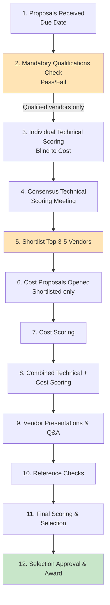

# Vendor Evaluation Criteria: [PROJECT_NAME]

> **Template Status**: Live | **Version**: [VERSION] | **Command**: `/arckit.evaluate`

## Document Control

| Field | Value |
|-------|-------|
| **Document ID** | ARC-[PROJECT_ID]-EVAL-v[VERSION] |
| **Document Type** | [DOCUMENT_TYPE_NAME] |
| **Project** | [PROJECT_NAME] (Project [PROJECT_ID]) |
| **Classification** | [PUBLIC / OFFICIAL / OFFICIAL-SENSITIVE / SECRET] |
| **Status** | [DRAFT / IN_REVIEW / APPROVED / PUBLISHED / SUPERSEDED / ARCHIVED] |
| **Version** | [VERSION] |
| **Created Date** | [YYYY-MM-DD] |
| **Last Modified** | [YYYY-MM-DD] |
| **Review Cycle** | [Monthly / Quarterly / Annual / On-Demand] |
| **Next Review Date** | [YYYY-MM-DD] |
| **Owner** | [OWNER_NAME_AND_ROLE] |
| **Reviewed By** | [REVIEWER_NAME] on [DATE] or [PENDING] |
| **Approved By** | [APPROVER_NAME] on [DATE] or [PENDING] |
| **Distribution** | [DISTRIBUTION_LIST] |

## Revision History

| Version | Date | Author | Changes | Approved By | Approval Date |
|---------|------|--------|---------|-------------|---------------|
| [VERSION] | [DATE] | ArcKit AI | Initial creation from `/arckit.[COMMAND]` command | [PENDING] | [PENDING] |

## Document Purpose

[Brief description of what this document is for and how it will be used]

---

## 1. Evaluation Overview

### 1.1 Purpose

This document defines the criteria, scoring methodology, and process for evaluating vendor proposals for [PROJECT_NAME]. The goal is to select the vendor that provides the best value considering technical capability, experience, cost, and cultural fit.

### 1.2 Evaluation Principles

- **Objective**: Criteria are measurable and consistently applied
- **Transparent**: Vendors understand how they will be evaluated
- **Fair**: All vendors evaluated against same criteria
- **Documented**: Scores and rationale captured for auditability
- **Value-Based**: Best value, not necessarily lowest cost

### 1.3 Evaluation Team

| Name | Role | Department | Evaluation Focus |
|------|------|------------|------------------|
| [Name] | Evaluation Lead | Procurement | Process orchestration, final scoring |
| [Name] | Technical Evaluator | Enterprise Architecture | Technical solution, architecture |
| [Name] | Technical Evaluator | Security | Security and compliance |
| [Name] | Technical Evaluator | Domain Architecture | Domain fit, integration |
| [Name] | Business Evaluator | Product/Business | Requirements understanding, business value |
| [Name] | Business Evaluator | Finance | Cost evaluation, budget alignment |
| [Name] | Observer (non-voting) | Legal | Contract terms review |

### 1.4 Conflict of Interest

All evaluators must disclose any conflicts of interest with vendors:
- [ ] Personal relationships with vendor employees
- [ ] Financial interests in vendor companies
- [ ] Prior employment with vendor (within 2 years)
- [ ] Concurrent consulting arrangements

Evaluators with conflicts must recuse themselves from evaluation of that vendor.

---

## 2. Evaluation Process

### 2.1 Process Flow

### 2.2 Timeline

| Phase | Duration | Deadline | Responsible |
|-------|----------|----------|-------------|
| Proposals Due | - | [DATE] | Vendors |
| Mandatory Qualifications Check | 2 days | [DATE] | Procurement |
| Individual Technical Scoring | 1 week | [DATE] | All evaluators |
| Consensus Meeting | 1 day | [DATE] | Evaluation committee |
| Shortlist | 1 day | [DATE] | Evaluation lead |
| Cost Evaluation | 2 days | [DATE] | Finance |
| Vendor Presentations | 1 week | [DATE RANGE] | Shortlisted vendors |
| Reference Checks | 1 week | [DATE RANGE] | Evaluation team |
| Final Scoring | 2 days | [DATE] | Evaluation committee |
| Selection Decision | 1 day | [DATE] | Executive sponsor |
| Vendor Notification | 1 day | [DATE] | Procurement |

---

## 3. Mandatory Qualifications (Pass/Fail)

Before scoring, vendors must meet ALL mandatory qualifications. Failure on any item results in disqualification.

### 3.1 Mandatory Qualification Checklist

| ID | Qualification | Pass/Fail | Notes |
|----|---------------|-----------|-------|
| **MQ-1** | Minimum [5] years of experience | [ ] Pass [ ] Fail | |
| **MQ-2** | At least [3] relevant reference projects | [ ] Pass [ ] Fail | |
| **MQ-3** | Required certifications present on team | [ ] Pass [ ] Fail | |
| **MQ-4** | Company security compliance (SOC 2/ISO 27001) | [ ] Pass [ ] Fail | |
| **MQ-5** | Financial stability evidence provided | [ ] Pass [ ] Fail | |
| **MQ-6** | Proposal submitted on time | [ ] Pass [ ] Fail | |
| **MQ-7** | Proposal follows required format | [ ] Pass [ ] Fail | |
| **MQ-8** | All required sections completed | [ ] Pass [ ] Fail | |
| **MQ-9** | Cost proposal separate from technical | [ ] Pass [ ] Fail | |
| **MQ-10** | Key personnel resumes included | [ ] Pass [ ] Fail | |

**Disqualification Procedure**:
1. Evaluator identifies mandatory qualification failure
2. Evaluation lead confirms failure
3. Vendor notified of disqualification with specific reason
4. Vendor has [48 hours] to provide clarification if failure was due to misunderstanding
5. Final determination by evaluation lead

---

## 4. Technical Evaluation Criteria (100 Points)

Technical proposals are scored **blind to cost** to ensure unbiased evaluation.

### 4.1 Criteria Summary

| Category | Weight | Max Points | Evaluator(s) |
|----------|--------|------------|--------------|
| **Technical Approach and Solution Design** | 35% | 35 | Technical evaluators |
| **Project Approach and Methodology** | 20% | 20 | All evaluators |
| **Team Qualifications and Experience** | 25% | 25 | Technical + business evaluators |
| **Relevant Experience and References** | 15% | 15 | Business evaluators |
| **Understanding of Requirements** | 5% | 5 | All evaluators |
| **TOTAL** | **100%** | **100** | |

---

### 4.2 Category 1: Technical Approach and Solution Design (35 points)

**Purpose**: Evaluate the proposed technical solution's quality, feasibility, and alignment with requirements and architecture principles.

#### Subcriteria

| Subcriterion | Points | Evaluation Questions |
|--------------|--------|---------------------|
| **1.1 Architecture Quality** | 10 | • Is the architecture well-designed, scalable, and maintainable? • Does it follow modern best practices (microservices, cloud-native, etc.)? • Are components loosely coupled with clear boundaries? • Is the architecture aligned with our enterprise principles? |
| **1.2 Technology Stack** | 8 | • Are technology choices appropriate for requirements? • Do choices align with our approved stack or have good justification? • Is the stack modern, supportable, with active community? • Are there lock-in risks or vendor dependencies? |
| **1.3 Scalability & Performance** | 7 | • Does solution meet performance requirements? • Is horizontal scaling strategy credible? • Are bottlenecks identified and addressed? • Is performance testing approach sound? |
| **1.4 Security & Compliance** | 6 | • Are security controls comprehensive and appropriate? • Does solution meet compliance requirements (GDPR, HIPAA, etc.)? • Is threat model thoughtful and complete? • Are security best practices followed (encryption, least privilege, etc.)? |
| **1.5 Integration Approach** | 4 | • Is integration strategy with existing systems sound? • Are integration patterns appropriate (API, event-driven, etc.)? • Are integration risks identified and mitigated? |

#### Scoring Rubric (Per Subcriterion)

| Score | Description |
|-------|-------------|
| **Excellent (90-100%)** | Exceeds expectations; innovative; demonstrates deep expertise; minimal risks |
| **Good (75-89%)** | Meets all expectations; sound approach; some minor concerns or areas for clarification |
| **Adequate (60-74%)** | Meets most expectations; workable approach; some concerns or gaps requiring discussion |
| **Weak (40-59%)** | Meets minimum expectations; significant concerns; substantial gaps or risks |
| **Unacceptable (0-39%)** | Does not meet expectations; major flaws; unworkable approach |

#### Scoring Template (per vendor)

**Vendor Name**: _______________

| Subcriterion | Max Points | Score | Justification |
|--------------|------------|-------|---------------|
| 1.1 Architecture Quality | 10 | ___ | |
| 1.2 Technology Stack | 8 | ___ | |
| 1.3 Scalability & Performance | 7 | ___ | |
| 1.4 Security & Compliance | 6 | ___ | |
| 1.5 Integration Approach | 4 | ___ | |
| **Category 1 Total** | **35** | **___** | |

---

### 4.3 Category 2: Project Approach and Methodology (20 points)

**Purpose**: Evaluate the vendor's approach to delivering the project, managing risks, and ensuring quality.

#### Subcriteria

| Subcriterion | Points | Evaluation Questions |
|--------------|--------|---------------------|
| **2.1 Development Methodology** | 5 | • Is the proposed methodology (Agile, SAFe, etc.) appropriate? • Is sprint/iteration planning realistic? • Are roles and ceremonies well-defined? • How will vendor adapt to our processes? |
| **2.2 Project Timeline & Phasing** | 5 | • Is timeline realistic given scope? • Are phases logically sequenced? • Are milestones meaningful and measurable? • Is there buffer for risks/unknowns? |
| **2.3 Risk Management** | 4 | • Are key risks identified proactively? • Are mitigation strategies credible? • Is risk monitoring process defined? • Does vendor show awareness of project risks? |
| **2.4 Quality Assurance** | 3 | • Is testing strategy comprehensive (unit, integration, UAT, performance)? • Are QA resources adequate? • Is test automation planned? • Are quality gates defined? |
| **2.5 Communication & Governance** | 3 | • Is communication plan clear (frequency, audiences, formats)? • Are governance structures appropriate (steering, working teams)? • Is escalation process defined? • How will status be reported? |

#### Scoring Template

**Vendor Name**: _______________

| Subcriterion | Max Points | Score | Justification |
|--------------|------------|-------|---------------|
| 2.1 Development Methodology | 5 | ___ | |
| 2.2 Project Timeline & Phasing | 5 | ___ | |
| 2.3 Risk Management | 4 | ___ | |
| 2.4 Quality Assurance | 3 | ___ | |
| 2.5 Communication & Governance | 3 | ___ | |
| **Category 2 Total** | **20** | **___** | |

---

### 4.4 Category 3: Team Qualifications and Experience (25 points)

**Purpose**: Evaluate the vendor's team expertise, experience, and ability to deliver.

#### Subcriteria

| Subcriterion | Points | Evaluation Questions |
|--------------|--------|---------------------|
| **3.1 Key Personnel Qualifications** | 10 | • Do key personnel (architect, tech lead) have strong relevant experience? • Do resumes demonstrate depth in required technologies? • Are certifications appropriate and current? • Is team composition appropriate (seniority mix)? |
| **3.2 Team Size & Allocation** | 5 | • Is team size adequate for scope? • Are key personnel dedicated (not spread thin)? • Is ramp-up/ramp-down plan reasonable? • Are backup resources identified? |
| **3.3 Domain Expertise** | 5 | • Does team have experience in our industry? • Do they understand our domain challenges? • Have they solved similar problems before? • Is domain knowledge demonstrated in proposal? |
| **3.4 Technology Expertise** | 5 | • Does team have deep expertise in proposed technologies? • Are multiple team members proficient (not single point of failure)? • Do they have experience with modern DevOps/cloud practices? • Are there capability gaps requiring training? |

#### Scoring Template

**Vendor Name**: _______________

| Subcriterion | Max Points | Score | Justification |
|--------------|------------|-------|---------------|
| 3.1 Key Personnel Qualifications | 10 | ___ | |
| 3.2 Team Size & Allocation | 5 | ___ | |
| 3.3 Domain Expertise | 5 | ___ | |
| 3.4 Technology Expertise | 5 | ___ | |
| **Category 3 Total** | **25** | **___** | |

---

### 4.5 Category 4: Relevant Experience and References (15 points)

**Purpose**: Evaluate vendor's track record delivering similar projects successfully.

#### Subcriteria

| Subcriterion | Points | Evaluation Questions |
|--------------|--------|---------------------|
| **4.1 Reference Project Relevance** | 8 | • Are reference projects similar in scope and complexity? • Do they demonstrate required capabilities? • Were projects successful (on time, on budget, quality)? • Are reference clients willing to be contacted? |
| **4.2 Industry Experience** | 4 | • Does vendor have significant experience in our industry? • Do they understand industry-specific regulations/constraints? • Can they provide industry-relevant insights? |
| **4.3 Innovation & Thought Leadership** | 3 | • Is vendor recognized as technology leader? • Do they contribute to open source or industry standards? • Do they demonstrate innovative approaches? • Are they forward-thinking vs. commoditized? |

#### Reference Project Evaluation

For each reference project, score on these dimensions:

| Reference | Similarity to Our Project | Success Indicators | Reference Check Result | Notes |
|-----------|---------------------------|--------------------|-----------------------|-------|
| Reference 1 | High/Med/Low | On time, budget, quality | Positive/Neutral/Negative | |
| Reference 2 | High/Med/Low | On time, budget, quality | Positive/Neutral/Negative | |
| Reference 3 | High/Med/Low | On time, budget, quality | Positive/Neutral/Negative | |

#### Scoring Template

**Vendor Name**: _______________

| Subcriterion | Max Points | Score | Justification |
|--------------|------------|-------|---------------|
| 4.1 Reference Project Relevance | 8 | ___ | |
| 4.2 Industry Experience | 4 | ___ | |
| 4.3 Innovation & Thought Leadership | 3 | ___ | |
| **Category 4 Total** | **15** | **___** | |

---

### 4.6 Category 5: Understanding of Requirements (5 points)

**Purpose**: Evaluate how well vendor understands the problem and requirements.

#### Subcriteria

| Subcriterion | Points | Evaluation Questions |
|--------------|--------|---------------------|
| **5.1 Problem Understanding** | 2 | • Does vendor demonstrate understanding of our business problem? • Do they articulate WHY we need this solution? • Do they show empathy for user needs? |
| **5.2 Requirements Comprehension** | 2 | • Are all key requirements addressed in proposal? • Are requirements interpreted correctly? • Are gaps or ambiguities identified? |
| **5.3 Thoughtful Questions** | 1 | • Did vendor ask insightful questions during Q&A? • Do questions demonstrate critical thinking? • Do they probe areas of risk or uncertainty? |

#### Scoring Template

**Vendor Name**: _______________

| Subcriterion | Max Points | Score | Justification |
|--------------|------------|-------|---------------|
| 5.1 Problem Understanding | 2 | ___ | |
| 5.2 Requirements Comprehension | 2 | ___ | |
| 5.3 Thoughtful Questions | 1 | ___ | |
| **Category 5 Total** | **5** | **___** | |

---

### 4.7 Technical Scoring Summary

**Vendor Name**: _______________

| Category | Max Points | Score | Percentage |
|----------|------------|-------|------------|
| 1. Technical Approach & Solution Design | 35 | ___ | ___% |
| 2. Project Approach & Methodology | 20 | ___ | ___% |
| 3. Team Qualifications & Experience | 25 | ___ | ___% |
| 4. Relevant Experience & References | 15 | ___ | ___% |
| 5. Understanding of Requirements | 5 | ___ | ___% |
| **TOTAL TECHNICAL SCORE** | **100** | **___** | **___%** |

---

## 5. Cost Evaluation

Cost proposals are opened **only for shortlisted vendors** after technical evaluation is complete.

### 5.1 Cost Scoring Methodology

**Method**: [SELECT ONE]

#### Option A: Lowest Price Best Value (Recommended)
- Lowest cost proposal receives 100 points
- Other proposals scaled proportionally
- Formula: `Cost Score = (Lowest Price / Vendor Price) × 100`

#### Option B: Fixed Weight
- Cost is [30]% of total score
- Technical is [70]% of total score
- Final Score = (Technical Score × 0.70) + (Cost Score × 0.30)

#### Option C: Cost Reasonableness
- Each vendor scored on cost reasonableness (not purely lowest)
- Scoring based on value for money, not absolute price
- Consider: total cost, cost breakdown, value provided

### 5.2 Cost Evaluation Criteria (if using Option C)

| Criterion | Points | Evaluation Questions |
|-----------|--------|---------------------|
| **Total Cost Competitiveness** | 40 | How does total cost compare to budget and other vendors? |
| **Cost Breakdown Transparency** | 20 | Is cost breakdown detailed and transparent? Are costs justified? |
| **Value for Money** | 30 | Considering technical quality, is this good value? |
| **Payment Terms** | 10 | Are payment terms favorable and aligned with milestones? |
| **TOTAL** | **100** | |

### 5.3 Cost Analysis Template

| Vendor | Total Cost | Cost per Point (Technical) | Rank by Cost | Rank by Value | Notes |
|--------|------------|---------------------------|--------------|---------------|-------|
| Vendor A | $[X] | $[X/pt] | 1 | | |
| Vendor B | $[X] | $[X/pt] | 2 | | |
| Vendor C | $[X] | $[X/pt] | 3 | | |

**Cost Breakdown Comparison**:

| Cost Category | Vendor A | Vendor B | Vendor C | Notes |
|---------------|----------|----------|----------|-------|
| Labor | $[X] | $[X] | $[X] | |
| Infrastructure | $[X] | $[X] | $[X] | |
| Licenses/Tools | $[X] | $[X] | $[X] | |
| Travel | $[X] | $[X] | $[X] | |
| Contingency | $[X] | $[X] | $[X] | |
| **Total** | **$[X]** | **$[X]** | **$[X]** | |

---

## 6. Combined Scoring

### 6.1 Final Scoring Formula

**Final Score = (Technical Score × [0.70]) + (Cost Score × [0.30])**

Adjust weights based on organizational priorities:
- High technical complexity: 80% technical, 20% cost
- Cost-sensitive: 60% technical, 40% cost
- Balanced: 70% technical, 30% cost

### 6.2 Combined Scoring Summary

| Vendor | Technical Score (100) | Technical Weighted ([70]%) | Cost Score (100) | Cost Weighted ([30]%) | **Final Score** | Rank |
|--------|-----------------------|----------------------------|------------------|-----------------------|-----------------|------|
| Vendor A | ___ | ___ | ___ | ___ | **___** | |
| Vendor B | ___ | ___ | ___ | ___ | **___** | |
| Vendor C | ___ | ___ | ___ | ___ | **___** | |

---

## 7. Vendor Presentations

Shortlisted vendors present their proposals to the evaluation committee.

### 7.1 Presentation Format

**Duration**: [2 hours]
- Vendor presentation: [60 minutes]
- Q&A: [60 minutes]

**Attendees**:
- Evaluation committee (all members)
- Key stakeholders (business sponsors, technical leads)
- Note-taker (non-voting)

**Presentation Content**:
1. Company overview (5 min)
2. Team introductions (5 min)
3. Solution overview (15 min)
4. Technical deep-dive (20 min)
5. Project approach (10 min)
6. Demo (if applicable) (5 min)
7. Q&A (60 min)

### 7.2 Presentation Evaluation

Presentations are NOT separately scored but may adjust existing scores based on:
- Clarifications that resolve concerns (improve scores)
- Red flags or concerning answers (lower scores)
- Team chemistry and communication effectiveness

**Post-Presentation Actions**:
1. Evaluation committee discusses each vendor
2. Scores adjusted if significant new information emerged
3. Updated scores documented with rationale

---

## 8. Reference Checks

### 8.1 Reference Check Process

For each shortlisted vendor, contact **all provided references** (minimum 3).

**Reference Check Template**:

**Reference Information**:
- Client Organization: _______________
- Contact Name: _______________
- Contact Role: _______________
- Project: _______________
- Timeframe: _______________

**Questions**:

1. **Project Scope**: Can you describe the project [Vendor] delivered for you?
   - Notes: _______________

2. **On-Time Delivery**: Was the project delivered on schedule? If not, what caused delays?
   - [ ] On time  [ ] Minor delays (<10%)  [ ] Significant delays (>10%)
   - Notes: _______________

3. **On-Budget Delivery**: Was the project delivered within budget? Were there change orders?
   - [ ] On budget  [ ] Minor overruns (<10%)  [ ] Significant overruns (>10%)
   - Notes: _______________

4. **Quality**: Was the quality of deliverables high? Did it meet your expectations?
   - [ ] Exceeded expectations  [ ] Met expectations  [ ] Below expectations
   - Notes: _______________

5. **Team Effectiveness**: How effective was the vendor's team? Communication? Responsiveness?
   - [ ] Excellent  [ ] Good  [ ] Adequate  [ ] Poor
   - Notes: _______________

6. **Issue Resolution**: How did the vendor handle problems or conflicts?
   - [ ] Very well  [ ] Adequately  [ ] Poorly
   - Notes: _______________

7. **Technical Expertise**: Did the team demonstrate strong technical skills?
   - [ ] Excellent  [ ] Good  [ ] Adequate  [ ] Lacking
   - Notes: _______________

8. **Post-Go-Live Support**: How was support during warranty/maintenance phase?
   - [ ] Excellent  [ ] Good  [ ] Adequate  [ ] Poor  [ ] N/A
   - Notes: _______________

9. **Would You Hire Again?**: Would you engage this vendor for another project?
   - [ ] Definitely  [ ] Probably  [ ] Maybe  [ ] No
   - Notes: _______________

10. **Anything Else**: Is there anything else we should know about working with this vendor?
    - Notes: _______________

**Reference Check Summary**:
- [ ] Highly Positive (enthusiastic, would rehire, exceeded expectations)
- [ ] Positive (satisfied, met expectations, would consider again)
- [ ] Mixed (some concerns, met most expectations, might rehire with reservations)
- [ ] Negative (not satisfied, below expectations, would not rehire)

### 8.2 Reference Check Impact on Scoring

Reference checks do NOT add points but may **disqualify** or **lower scores**:
- **Disqualification**: Multiple negative references or single highly negative reference
- **Score Adjustment**: Concerning patterns (e.g., always over budget) may lower relevant subcriteria scores by 10-20%

---

## 9. Final Selection Decision

### 9.1 Decision Factors

The highest scoring vendor is typically selected, but decision may also consider:

**Quantitative (Objective)**:
- Final combined score
- Cost relative to budget
- Technical score threshold (minimum 70/100 technical required)

**Qualitative (Subjective)**:
- Cultural fit and communication style
- Confidence in delivery based on presentations and references
- Strategic partnership potential
- Risk tolerance (prefer known vendor vs. innovative newcomer)

### 9.2 Decision Matrix

| Vendor | Final Score | Technical Score | Cost | Reference Check | Cultural Fit | Risk Level | Recommendation |
|--------|-------------|-----------------|------|-----------------|--------------|------------|----------------|
| Vendor A | ___ | ___ | $X | Positive | Good | Low | [ ] Select |
| Vendor B | ___ | ___ | $Y | Very Positive | Excellent | Low | [ ] Select |
| Vendor C | ___ | ___ | $Z | Mixed | Good | Medium | [ ] Select |

### 9.3 Selection Approval

**Decision Authority**: [CTO/CIO | Procurement Committee | Steering Committee]

**Approval Requirements**:
- Evaluation summary presented to decision authority
- Rationale for selection documented
- Risks and mitigation strategies outlined
- Budget approval confirmed

**Approval Form**:

**Recommended Vendor**: _______________

**Selection Rationale**:
[Summary of why this vendor was selected]

**Key Strengths**:
- [Strength 1]
- [Strength 2]
- [Strength 3]

**Risks and Mitigations**:
- [Risk 1]: [Mitigation strategy]
- [Risk 2]: [Mitigation strategy]

**Approvals**:

| Role | Name | Signature | Date |
|------|------|-----------|------|
| Evaluation Lead | [NAME] | _________ | [DATE] |
| Enterprise Architect | [NAME] | _________ | [DATE] |
| Executive Sponsor | [NAME] | _________ | [DATE] |
| CTO/CIO | [NAME] | _________ | [DATE] |

---

## 10. Vendor Notification

### 10.1 Award Notification

**Selected Vendor**:
- Notify within [1 business day] of decision
- Schedule contract negotiation kickoff
- Provide high-level feedback on their strengths

### 10.2 Non-Selected Vendors

**Notification Timeline**: Within [2 business days] of decision

**Notification Content**:
- Thank vendor for their proposal
- Inform them they were not selected
- Offer optional debrief call (no obligation)

**Debrief Guidelines** (if vendor requests):
- Schedule within 2 weeks of request
- Provide constructive feedback on their proposal
- Do NOT disclose other vendors' scores or details
- Do NOT disclose cost of other proposals
- Focus on areas for improvement

---

## 11. Appeals Process

Vendors may appeal selection decision if they believe process was unfair.

### 11.1 Grounds for Appeal

Appeals accepted only for:
- [ ] Evaluation process not followed as documented
- [ ] Scoring errors or mathematical mistakes
- [ ] Evaluator conflict of interest not disclosed
- [ ] Vendor information misrepresented by evaluation team

Appeals NOT accepted for:
- [ ] Disagreement with evaluation criteria
- [ ] Disagreement with scores or subjective judgments
- [ ] "We should have won because we're cheaper"

### 11.2 Appeal Process

1. Vendor submits written appeal within [5 business days] of notification
2. Appeal reviewed by impartial party (e.g., Legal, Internal Audit)
3. Review completed within [10 business days]
4. Decision communicated to vendor
5. Procurement Lead's decision is final

---

## 12. Documentation and Records

### 12.1 Required Documentation

All evaluation materials must be retained for [3 years]:
- [ ] RFP/SOW document
- [ ] All vendor proposals (technical and cost)
- [ ] Individual scoring sheets
- [ ] Consensus scoring sheets
- [ ] Presentation notes
- [ ] Reference check notes
- [ ] Selection decision memo
- [ ] Approval signatures

### 12.2 Confidentiality

Evaluation materials are confidential:
- Evaluators sign non-disclosure agreement
- Proposals not shared outside evaluation committee
- Scores and vendor comparisons remain confidential
- Vendor debriefs do not disclose competitor information

---

## Appendices

### Appendix A: Individual Evaluator Scorecard

[Complete scoring template for each evaluator to fill out independently]

### Appendix B: Consensus Scoring Worksheet

[Template for facilitated consensus scoring meeting]

### Appendix C: Evaluation Committee Charter

[Defines roles, responsibilities, decision-making process]

### Appendix D: Conflict of Interest Form

[Form for evaluators to disclose any conflicts]

---

**Document Control**

| Version | Date | Author | Changes |
|---------|------|--------|---------|
| 1.0 | [DATE] | [AUTHOR] | Initial version |

## External References

| Document | Type | Source | Key Extractions | Path |
|----------|------|--------|-----------------|------|
| *None provided* | — | — | — | — |

---

**Generated by**: ArcKit `/arckit.evaluate` command
**Generated on**: [DATE]
**ArcKit Version**: [VERSION]
**Project**: [PROJECT_NAME]
**Model**: [AI_MODEL]