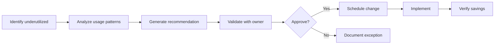
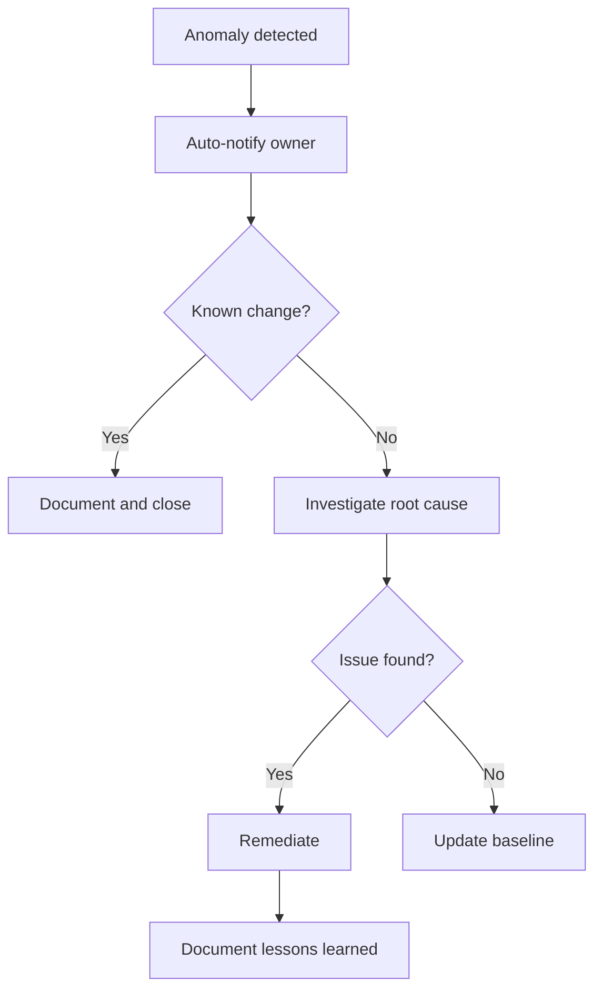

# FinOps Strategy

> **Template Status**: Experimental | **Version**: [VERSION] | **Command**: `/arckit.finops`

## Document Control

| Field | Value |
|-------|-------|
| **Document ID** | ARC-[PROJECT_ID]-FINOPS-v[VERSION] |
| **Document Type** | FinOps Strategy |
| **Project** | [PROJECT_NAME] (Project [PROJECT_ID]) |
| **Classification** | [PUBLIC / OFFICIAL / OFFICIAL-SENSITIVE / SECRET] |
| **Status** | [DRAFT / IN_REVIEW / APPROVED / PUBLISHED / SUPERSEDED / ARCHIVED] |
| **Version** | [VERSION] |
| **Created Date** | [YYYY-MM-DD] |
| **Last Modified** | [YYYY-MM-DD] |
| **Review Cycle** | [Monthly / Quarterly / Annual / On-Demand] |
| **Next Review Date** | [YYYY-MM-DD] |
| **Owner** | [OWNER_NAME_AND_ROLE] |
| **Reviewed By** | [REVIEWER_NAME] ([YYYY-MM-DD]) or PENDING |
| **Approved By** | [APPROVER_NAME] ([YYYY-MM-DD]) or PENDING |
| **Distribution** | [DISTRIBUTION_LIST] |

## Revision History

| Version | Date | Author | Changes | Approved By | Approval Date |
|---------|------|--------|---------|-------------|---------------|
| [VERSION] | [DATE] | ArcKit AI | Initial creation from `/arckit.finops` command | PENDING | PENDING |

---

## 1. FinOps Overview

### Strategic Objectives

| Objective | Target | Rationale |
|-----------|--------|-----------|
| Cost Visibility | [100% tagged resources] | [Enable accurate cost attribution] |
| Cost Optimization | [X% cost reduction] | [Maximize cloud value] |
| Budget Accuracy | [±X% variance] | [Predictable cloud spend] |
| Unit Economics | [£X per transaction/user] | [Scale costs with value] |

### FinOps Maturity

| Level | Current | Target | Timeline |
|-------|---------|--------|----------|
| Crawl (Basic visibility, reactive) | [Yes/No] | - | - |
| Walk (Proactive optimization, budgets) | [Yes/No] | [Yes/No] | [Date] |
| Run (Automated, real-time, predictive) | [Yes/No] | [Yes/No] | [Date] |

### FinOps Team Structure

| Role | Responsibility | Name/Team |
|------|----------------|-----------|
| FinOps Lead | Strategy, governance, reporting | [Name] |
| Cloud Team | Technical optimization, implementation | [Team] |
| Finance | Budgeting, forecasting, accounting | [Team] |
| Engineering Leads | Team-level cost ownership | [Names] |

### RACI Matrix

| Activity | FinOps Lead | Cloud Team | Finance | Engineering |
|----------|-------------|------------|---------|-------------|
| Tag enforcement | A | R | I | C |
| Cost reporting | R | C | A | I |
| Optimization | A | R | I | R |
| Budgeting | C | C | A | R |
| Commitment purchases | A | R | A | C |

---

## 2. Cloud Estate Overview

### Cloud Providers

| Provider | Account/Subscription | Purpose | Monthly Spend |
|----------|---------------------|---------|---------------|
| [AWS / Azure / GCP] | [Account ID/Name] | [Production / Dev / Shared] | [£X,XXX] |

### Cost Centers

| Cost Center | Description | Monthly Budget | Current Spend |
|-------------|-------------|----------------|---------------|
| [CC-001] | [Production workloads] | [£X,XXX] | [£X,XXX] |
| [CC-002] | [Development/Test] | [£X,XXX] | [£X,XXX] |
| [CC-003] | [Shared services] | [£X,XXX] | [£X,XXX] |

### Spend Baseline

| Category | Monthly Spend | % of Total |
|----------|---------------|------------|
| Compute | [£X,XXX] | [X%] |
| Storage | [£X,XXX] | [X%] |
| Networking | [£X,XXX] | [X%] |
| Database | [£X,XXX] | [X%] |
| Other services | [£X,XXX] | [X%] |
| **Total** | **[£X,XXX]** | **100%** |

### Spend Trends

| Period | Spend | Growth |
|--------|-------|--------|
| [Month -3] | [£X,XXX] | - |
| [Month -2] | [£X,XXX] | [+X%] |
| [Month -1] | [£X,XXX] | [+X%] |
| Current | [£X,XXX] | [+X%] |
| Forecast +3 months | [£X,XXX] | [+X%] |

---

## 3. Tagging Strategy

### Mandatory Tags

| Tag Key | Description | Values | Enforcement |
|---------|-------------|--------|-------------|
| `cost-center` | Financial cost center | CC-XXX | Block deployment |
| `environment` | Deployment environment | prod, staging, dev, test | Block deployment |
| `owner` | Resource owner email | email@domain | Block deployment |
| `project` | Project identifier | Project code | Block deployment |
| `application` | Application name | App name | Warning |

### Optional Tags

| Tag Key | Description | Use Case |
|---------|-------------|----------|
| `team` | Owning team | Team-level reporting |
| `data-classification` | Data sensitivity | Security compliance |
| `backup-policy` | Backup requirements | DR compliance |
| `expiry-date` | Resource expiration | Temporary resources |
| `terraform-managed` | IaC managed | Drift detection |

### Tag Enforcement

| Level | Action | Scope |
|-------|--------|-------|
| Prevent | Block resource creation | Production accounts |
| Warn | Allow with warning | Development accounts |
| Report | Flag in reports | All accounts |

### Untagged Resource Policy

| Resource Age | Action |
|--------------|--------|
| 0-7 days | Warning notification to owner |
| 8-14 days | Escalation to manager |
| 15-30 days | Resource flagged for review |
| 30+ days | Resource scheduled for termination |

---

## 4. Cost Visibility & Reporting

### Reporting Cadence

| Report | Frequency | Audience | Delivery |
|--------|-----------|----------|----------|
| Executive summary | Monthly | Leadership | Email |
| Detailed cost report | Weekly | FinOps, Finance | Dashboard |
| Team cost report | Weekly | Engineering leads | Dashboard |
| Anomaly alerts | Real-time | FinOps, Owners | Slack/Email |
| Optimization report | Monthly | Engineering | Email |

### Dashboard Requirements

| Dashboard | Purpose | Tool |
|-----------|---------|------|
| Executive overview | High-level spend trends | [Grafana / Power BI / QuickSight] |
| Cost by team | Team accountability | [Cloud native / Custom] |
| Optimization opportunities | Actionable insights | [Cloud native / Third-party] |
| Commitment utilization | RI/SP tracking | [Cloud native] |

### Cost Allocation

| Method | Description | Use Case |
|--------|-------------|----------|
| Direct | Costs directly attributed | Single-tenant resources |
| Proportional | Split by usage metric | Shared infrastructure |
| Fixed | Equal split | Platform services |
| Tag-based | Based on resource tags | Application costs |

---

## 5. Budgeting & Forecasting

### Budget Types

| Budget Type | Description | Applies To |
|-------------|-------------|------------|
| Fixed | Absolute amount | Annual planning |
| Variable | Scales with metric | Business-linked costs |
| Per-unit | Cost per transaction/user | Unit economics |

### Annual Budget

| Quarter | Budget | Forecast | Variance |
|---------|--------|----------|----------|
| Q1 | [£XX,XXX] | [£XX,XXX] | [±X%] |
| Q2 | [£XX,XXX] | [£XX,XXX] | [±X%] |
| Q3 | [£XX,XXX] | [£XX,XXX] | [±X%] |
| Q4 | [£XX,XXX] | [£XX,XXX] | [±X%] |
| **Total** | **[£XXX,XXX]** | **[£XXX,XXX]** | **[±X%]** |

### Budget Alert Thresholds

| Threshold | Action | Notification |
|-----------|--------|--------------|
| 50% | Informational | Dashboard |
| 75% | Warning | Email to owner |
| 90% | Alert | Email to owner + manager |
| 100% | Critical | Escalation to leadership |

### Forecasting Methodology

| Method | Description | Accuracy Target |
|--------|-------------|-----------------|
| Trend-based | Historical extrapolation | ±15% |
| Driver-based | Business metrics correlated | ±10% |
| Hybrid | Combination approach | ±10% |

---

## 6. Showback/Chargeback Model

### Allocation Model

| Model | **[Selected]** |
|-------|----------------|
| Showback | Teams see costs, no internal billing |
| Chargeback | Teams billed via internal transfer |
| Hybrid | Showback with major project chargeback |

### Allocation Methodology

| Cost Type | Allocation Method | Basis |
|-----------|-------------------|-------|
| Direct costs | 100% to owner | Tag-based |
| Shared compute | Proportional | CPU/memory usage |
| Shared storage | Proportional | GB consumed |
| Shared networking | Proportional | Data transfer |
| Platform costs | Fixed split | Equal or headcount |
| Support costs | Proportional | Total spend ratio |

### Unit Economics

| Metric | Calculation | Target |
|--------|-------------|--------|
| Cost per user | Total cost / Active users | [£X.XX] |
| Cost per transaction | Total cost / Transactions | [£X.XX] |
| Cost per API call | Compute cost / API calls | [£X.XX] |
| Infrastructure ratio | Cloud cost / Revenue | [X%] |

### Internal Billing (if Chargeback)

| Process Step | Owner | Timeline |
|--------------|-------|----------|
| Cost calculation | FinOps | 1st of month |
| Review and validation | Engineering | 1st-5th |
| Dispute resolution | FinOps + Finance | 5th-10th |
| Journal entry | Finance | 15th |

---

## 7. Cost Optimization Strategies

### Rightsizing

| Category | Analysis Frequency | Tool | Threshold |
|----------|-------------------|------|-----------|
| Compute | Weekly | [Cloud Advisor / Custom] | <40% CPU avg |
| Database | Monthly | [Cloud Advisor / Custom] | <30% utilization |
| Storage | Monthly | [Cloud Advisor / Custom] | <50% usage |

### Rightsizing Workflow

### Reserved Instances / Savings Plans

| Commitment Type | Coverage Target | Term | Payment |
|-----------------|-----------------|------|---------|
| Compute Savings Plan | [X%] | 1 year / 3 year | All upfront / Partial / None |
| EC2 Reserved Instances | [X%] | 1 year / 3 year | All upfront / Partial / None |
| RDS Reserved Instances | [X%] | 1 year | All upfront |

### Spot/Preemptible Usage

| Workload Type | Spot Eligible | Target Coverage |
|---------------|---------------|-----------------|
| Batch processing | Yes | [X%] |
| CI/CD runners | Yes | [X%] |
| Dev/Test environments | Yes | [X%] |
| Production stateless | Conditional | [X%] |
| Production stateful | No | 0% |

### Storage Optimization

| Strategy | Description | Target Savings |
|----------|-------------|----------------|
| Lifecycle policies | Auto-tier to cheaper storage | [X%] |
| Delete unattached volumes | Remove orphaned EBS/disks | [X%] |
| Snapshot management | Delete old snapshots | [X%] |
| S3 Intelligent Tiering | Auto-optimize S3 | [X%] |

### Idle Resource Detection

| Resource Type | Idle Definition | Auto-Action |
|---------------|-----------------|-------------|
| EC2/VM instances | No network traffic 7 days | Alert |
| Load balancers | No requests 7 days | Alert |
| Elastic IPs | Unattached 7 days | Release |
| RDS instances | No connections 14 days | Alert |
| Dev environments | After hours/weekends | Stop |

---

## 8. Commitment Management

### Current Commitments

| Type | Provider | Monthly Commitment | Expiry | Utilization |
|------|----------|-------------------|--------|-------------|
| [RI/SP] | [AWS/Azure/GCP] | [£X,XXX] | [Date] | [X%] |

### Commitment Coverage

| Service | On-Demand Spend | Committed | Coverage |
|---------|-----------------|-----------|----------|
| Compute | [£X,XXX] | [£X,XXX] | [X%] |
| Database | [£X,XXX] | [£X,XXX] | [X%] |
| **Total** | **[£X,XXX]** | **[£X,XXX]** | **[X%]** |

### Purchase Recommendations

| Recommendation | Savings | Term | Break-even |
|----------------|---------|------|------------|
| [Compute SP £X,XXX] | [£X,XXX/year] | [1yr/3yr] | [X months] |
| [RDS RI instance-type] | [£X,XXX/year] | [1yr] | [X months] |

### Commitment Review Cadence

| Activity | Frequency | Owner |
|----------|-----------|-------|
| Utilization review | Weekly | FinOps |
| Coverage analysis | Monthly | FinOps |
| Purchase planning | Quarterly | FinOps + Finance |
| Renewal planning | 90 days before expiry | FinOps |

---

## 9. Anomaly Detection & Alerts

### Anomaly Detection Configuration

| Provider | Tool | Sensitivity |
|----------|------|-------------|
| AWS | Cost Anomaly Detection | [Low / Medium / High] |
| Azure | Cost Management Alerts | [Custom threshold] |
| GCP | Budgets & Alerts | [Custom threshold] |

### Alert Thresholds

| Alert Type | Threshold | Notification |
|------------|-----------|--------------|
| Daily spike | +50% vs 7-day avg | Slack + Email |
| Weekly trend | +25% vs prior week | Email |
| Service anomaly | +100% any service | Slack + Email |
| New service | Any new service usage | Email |

### Investigation Workflow

### Escalation Matrix

| Time Since Alert | Action |
|------------------|--------|
| 0-4 hours | Resource owner investigates |
| 4-8 hours | Team lead notified |
| 8-24 hours | FinOps lead engaged |
| 24+ hours | Management escalation |

---

## 10. Governance & Policies

### Cloud Governance Framework

| Policy Area | Description | Enforcement |
|-------------|-------------|-------------|
| Resource creation | Approved instance types only | Preventive |
| Region restrictions | Approved regions only | Preventive |
| Tagging compliance | Mandatory tags required | Preventive |
| Budget limits | Maximum spend per account | Alert |
| Commitment approval | Large purchases need approval | Manual |

### Approval Workflows

| Spend Level | Approval Required |
|-------------|-------------------|
| <£1,000/month | Team lead |
| £1,000-£10,000/month | Engineering manager |
| £10,000-£50,000/month | FinOps lead + Finance |
| >£50,000/month | Leadership approval |

### Policy Enforcement Tools

| Tool | Purpose | Provider |
|------|---------|----------|
| [Service Control Policies] | Preventive controls | AWS |
| [Azure Policy] | Compliance enforcement | Azure |
| [Organization Policies] | Constraint enforcement | GCP |

### Exception Process

| Step | Owner | SLA |
|------|-------|-----|
| Exception request | Requestor | - |
| Initial review | FinOps | 2 days |
| Approval decision | Approver | 3 days |
| Implementation | Cloud team | 2 days |
| Documentation | FinOps | 1 day |

---

## 11. FinOps Tooling

### Native Cloud Tools

| Provider | Cost Management Tool | Features Used |
|----------|---------------------|---------------|
| AWS | Cost Explorer, Budgets, CUR | Reporting, alerts, detailed data |
| Azure | Cost Management + Billing | Reporting, budgets, advisor |
| GCP | Cloud Billing, Recommender | Reporting, recommendations |

### Third-Party Tools (if applicable)

| Tool | Purpose | Integration |
|------|---------|-------------|
| [CloudHealth / Cloudability / Spot.io] | Multi-cloud management | API |
| [Kubecost] | Kubernetes cost allocation | In-cluster |
| [Infracost] | IaC cost estimation | CI/CD |

### Automation

| Automation | Description | Schedule |
|------------|-------------|----------|
| Cost report generation | Automated weekly reports | Every Monday |
| Idle resource detection | Scan for unused resources | Daily |
| Dev environment shutdown | Stop non-prod after hours | Evenings/weekends |
| Rightsizing recommendations | Generate recommendations | Weekly |

### Custom Dashboards

| Dashboard | Data Source | Refresh |
|-----------|-------------|---------|
| Executive summary | [CUR / Billing API] | Daily |
| Team cost breakdown | [CUR / Billing API] | Daily |
| Optimization tracker | [Advisor / Custom] | Weekly |

---

## 12. Sustainability & Carbon

### Carbon Footprint Visibility

| Provider | Carbon Tool | Scope |
|----------|-------------|-------|
| AWS | Customer Carbon Footprint Tool | Scope 1, 2, 3 |
| Azure | Emissions Impact Dashboard | Scope 1, 2, 3 |
| GCP | Carbon Footprint | Scope 1, 2, 3 |

### Sustainable Cloud Practices

| Practice | Description | Status |
|----------|-------------|--------|
| Green regions | Prefer low-carbon regions | [Implemented / Planned] |
| Efficient instance types | Graviton/ARM processors | [Implemented / Planned] |
| Auto-shutdown | Stop idle resources | [Implemented / Planned] |
| Serverless | Event-driven compute | [Implemented / Planned] |
| Storage lifecycle | Reduce storage footprint | [Implemented / Planned] |

### Sustainability Targets

| Metric | Current | Target |
|--------|---------|--------|
| Carbon per transaction | [X g CO2e] | [X g CO2e] |
| Green region usage | [X%] | [X%] |
| Renewable energy coverage | [X%] | [100%] |

---

## 13. UK Government Compliance

### Cabinet Office Spend Controls

| Control | Threshold | Requirement |
|---------|-----------|-------------|
| Digital spend | >£100k | Cabinet Office approval |
| Technology spend | >£100k | Cabinet Office approval |
| External hosting | Any | Justify vs G-Cloud |

### Treasury Green Book Alignment

| Aspect | Implementation |
|--------|----------------|
| Business case | Cloud costs in options analysis |
| Value for money | Unit economics tracked |
| Risk assessment | Cost overrun scenarios modeled |
| Benefits realization | Cost savings tracked vs baseline |

### G-Cloud / Digital Marketplace Tracking

| Metric | Current | Target |
|--------|---------|--------|
| G-Cloud spend | [£X,XXX] | [Track separately] |
| Marketplace spend | [£X,XXX] | [Track separately] |
| SME percentage | [X%] | [>33%] |

### Reporting Requirements

| Report | Frequency | Recipient |
|--------|-----------|-----------|
| Annual technology spend | Annual | Cabinet Office |
| Transparency data | Annual | Public |
| G-Cloud spend | Quarterly | Crown Commercial Service |

---

## 14. FinOps Operating Model

### FinOps Cadence

| Meeting | Frequency | Attendees | Purpose |
|---------|-----------|-----------|---------|
| Daily standup | Daily | FinOps team | Anomaly review |
| Weekly cost review | Weekly | FinOps + Engineering leads | Trend analysis |
| Monthly business review | Monthly | Leadership + Finance | Strategic review |
| Quarterly planning | Quarterly | All stakeholders | Budget planning |

### Stakeholder Engagement

| Stakeholder | Engagement | Frequency |
|-------------|------------|-----------|
| Engineering teams | Cost reports, optimization coaching | Weekly |
| Finance | Budget alignment, forecasting | Monthly |
| Leadership | Strategic updates, approvals | Monthly |
| Procurement | Commitment planning, vendor management | Quarterly |

### Escalation Paths

| Issue | First Contact | Escalation |
|-------|---------------|------------|
| Budget breach | FinOps lead | Finance director |
| Anomaly investigation | Resource owner | FinOps lead |
| Policy exception | FinOps lead | Engineering director |
| Commitment purchase | FinOps lead | CFO |

### Continuous Improvement

| Activity | Frequency | Output |
|----------|-----------|--------|
| Process retrospective | Monthly | Process improvements |
| Tool evaluation | Quarterly | Tool recommendations |
| Training | Quarterly | Upskilled teams |
| Benchmarking | Annual | Industry comparison |

---

## 15. Metrics & KPIs

### Cost Efficiency Metrics

| Metric | Current | Target | Trend |
|--------|---------|--------|-------|
| Committed coverage | [X%] | [>70%] | [↑/↓/→] |
| Commitment utilization | [X%] | [>80%] | [↑/↓/→] |
| Rightsizing adoption | [X%] | [>80%] | [↑/↓/→] |
| Waste percentage | [X%] | [<5%] | [↑/↓/→] |

### Unit Economics

| Metric | Current | Target | Trend |
|--------|---------|--------|-------|
| Cost per user | [£X.XX] | [£X.XX] | [↑/↓/→] |
| Cost per transaction | [£X.XX] | [£X.XX] | [↑/↓/→] |
| Infrastructure ratio | [X%] | [<X%] | [↑/↓/→] |

### Optimization Targets

| Initiative | Target Savings | Status |
|------------|----------------|--------|
| Rightsizing | [£X,XXX/year] | [X%] complete |
| Commitment purchases | [£X,XXX/year] | [X%] complete |
| Idle resource cleanup | [£X,XXX/year] | [X%] complete |
| Storage optimization | [£X,XXX/year] | [X%] complete |
| **Total** | **[£XX,XXX/year]** | - |

### Governance Compliance

| Metric | Current | Target |
|--------|---------|--------|
| Tag compliance | [X%] | [>95%] |
| Policy compliance | [X%] | [100%] |
| Budget accuracy | [±X%] | [±10%] |

---

## 16. Requirements Traceability

| Requirement ID | Requirement | FinOps Element | Status |
|----------------|-------------|----------------|--------|
| [BR-XXX] | [Budget constraint £X] | Budget management | ✅ |
| [NFR-COST-001] | [Unit cost target] | Unit economics tracking | ✅ |
| [NFR-S-001] | [Auto-scaling] | Commitment strategy | ✅ |

---

## Approval

| Role | Name | Signature | Date |
|------|------|-----------|------|
| FinOps Lead | | | |
| Finance Director | | | |
| Engineering Director | | | |

## External References

| Document | Type | Source | Key Extractions | Path |
|----------|------|--------|-----------------|------|
| *None provided* | — | — | — | — |

---

**Generated by**: ArcKit `/arckit.finops` command
**Generated on**: [DATE]
**ArcKit Version**: [VERSION]
**Project**: [PROJECT_NAME]
**Model**: [AI_MODEL]
