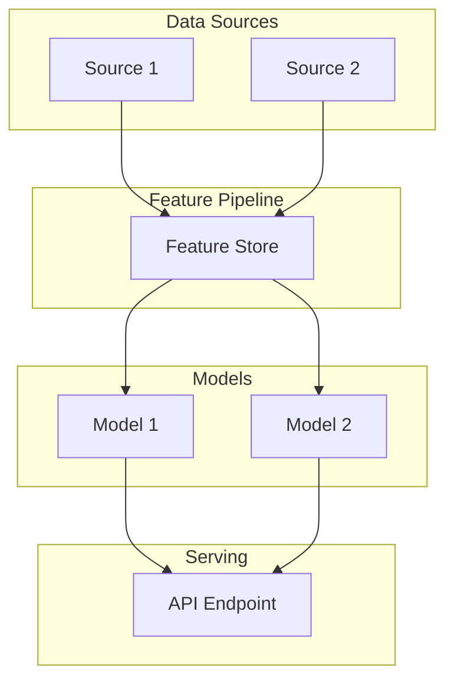
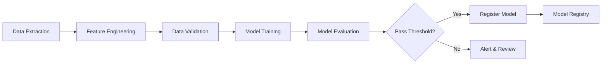
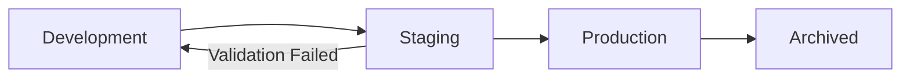
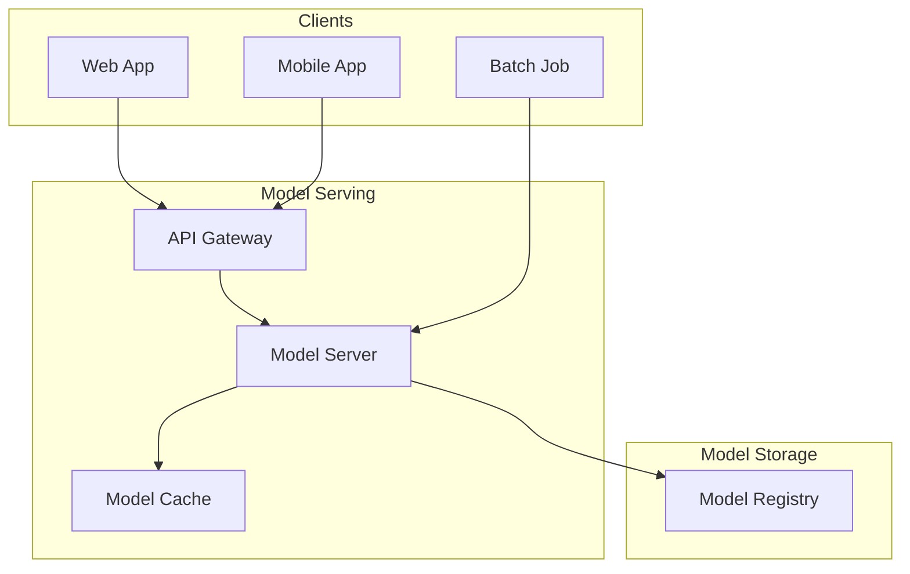
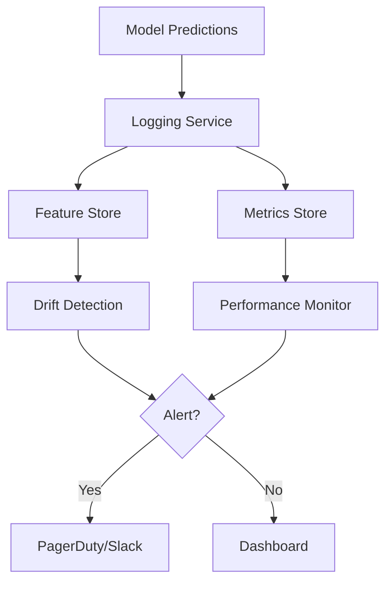
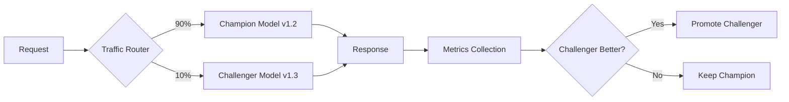
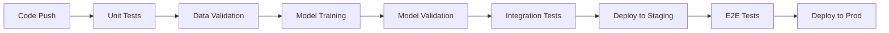
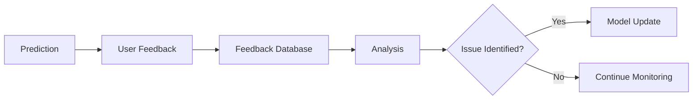

# MLOps Strategy

> **Template Status**: Experimental | **Version**: [VERSION] | **Command**: `/arckit.mlops`

## Document Control

| Field | Value |
|-------|-------|
| **Document ID** | ARC-[PROJECT_ID]-MLOPS-v[VERSION] |
| **Document Type** | MLOps Strategy |
| **Project** | [PROJECT_NAME] (Project [PROJECT_ID]) |
| **Classification** | [PUBLIC / OFFICIAL / OFFICIAL-SENSITIVE / SECRET] |
| **Status** | [DRAFT / IN_REVIEW / APPROVED / PUBLISHED / SUPERSEDED / ARCHIVED] |
| **Version** | [VERSION] |
| **Created Date** | [YYYY-MM-DD] |
| **Last Modified** | [YYYY-MM-DD] |
| **Review Cycle** | [Monthly / Quarterly / Annual / On-Demand] |
| **Next Review Date** | [YYYY-MM-DD] |
| **Owner** | [OWNER_NAME_AND_ROLE] |
| **Reviewed By** | [REVIEWER_NAME] ([YYYY-MM-DD]) or PENDING |
| **Approved By** | [APPROVER_NAME] ([YYYY-MM-DD]) or PENDING |
| **Distribution** | [DISTRIBUTION_LIST] |

## Revision History

| Version | Date | Author | Changes | Approved By | Approval Date |
|---------|------|--------|---------|-------------|---------------|
| [VERSION] | [DATE] | ArcKit AI | Initial creation from `/arckit.mlops` command | PENDING | PENDING |

---

## 1. ML System Overview

### Business Context

| Attribute | Value |
|-----------|-------|
| **System Name** | [ML System Name] |
| **Business Purpose** | [What business problem does ML solve?] |
| **Primary Use Cases** | [List of ML use cases] |
| **User Impact** | [How does ML affect end users?] |

### MLOps Maturity

| Level | Current | Target | Timeline |
|-------|---------|--------|----------|
| Level 0 (Manual) | [Yes/No] | - | - |
| Level 1 (Automated Training) | [Yes/No] | [Yes/No] | [Date] |
| Level 2 (CI/CD for ML) | [Yes/No] | [Yes/No] | [Date] |
| Level 3 (Auto-Retraining) | [Yes/No] | [Yes/No] | [Date] |
| Level 4 (Full Automation) | [Yes/No] | [Yes/No] | [Date] |

### Key Stakeholders

| Role | Name | Responsibility |
|------|------|----------------|
| ML Lead | [Name] | Model development strategy |
| Data Scientist | [Name] | Model training and experimentation |
| ML Engineer | [Name] | MLOps infrastructure |
| Product Owner | [Name] | Use case prioritization |
| Data Engineer | [Name] | Data pipelines and features |

---

## 2. Model Inventory

### Model Catalog

| Model ID | Model Name | Type | Framework | Purpose | Risk Level | Owner |
|----------|------------|------|-----------|---------|------------|-------|
| ML-001 | [Name] | [Classification/Regression/NLP/GenAI] | [PyTorch/TensorFlow/sklearn] | [Purpose] | [Low/Medium/High] | [Name] |
| ML-002 | [Name] | [Type] | [Framework] | [Purpose] | [Risk] | [Name] |

### Model Risk Classification

| Risk Level | Criteria | Governance |
|------------|----------|------------|
| Low | No significant impact on individuals | Standard review |
| Medium | Some impact, not life-affecting | Enhanced review |
| High | Significant impact on individuals | Ethics board review |
| Very High | Life-affecting, legal, employment | Ministerial / Executive approval |

### Model Dependencies



---

## 3. Data Pipeline

### Training Data Sources

| Source | Type | Update Frequency | Volume | PII | Owner |
|--------|------|------------------|--------|-----|-------|
| [Source] | [Database/API/File] | [Real-time/Daily/Weekly] | [Size] | [Yes/No] | [Name] |

### Feature Engineering

| Feature Group | Features | Transformation | Refresh |
|---------------|----------|----------------|---------|
| [Group Name] | [List of features] | [Standardization/Encoding/etc.] | [Frequency] |

### Feature Store

| Attribute | Value |
|-----------|-------|
| **Platform** | [Feast / SageMaker Feature Store / Vertex AI Feature Store / Custom] |
| **Online Store** | [Yes/No] - for real-time serving |
| **Offline Store** | [Yes/No] - for training |
| **Versioning** | [Enabled/Disabled] |

### Data Quality Checks

| Check | Threshold | Action |
|-------|-----------|--------|
| Missing values | [<X%] | Block pipeline |
| Schema validation | Match expected | Block pipeline |
| Statistical drift | [PSI < 0.2] | Alert |
| Freshness | [<X hours old] | Alert |

### Data Versioning

| Attribute | Value |
|-----------|-------|
| **Strategy** | [DVC / Delta Lake / Git LFS / Custom] |
| **Storage** | [S3/GCS/Azure Blob] |
| **Retention** | [X months] |

---

## 4. Training Pipeline

### Infrastructure

| Component | Technology | Specification |
|-----------|------------|---------------|
| Compute | [SageMaker / Vertex AI / AKS / On-prem] | [Instance types] |
| GPU | [Yes/No] | [GPU type, count] |
| Storage | [S3/GCS/Azure] | [Size] |
| Orchestration | [Airflow / Step Functions / Kubeflow] | - |

### Training Pipeline Architecture



### Experiment Tracking

| Attribute | Value |
|-----------|-------|
| **Platform** | [MLflow / Weights & Biases / SageMaker Experiments / Vertex AI] |
| **Tracked Artifacts** | Parameters, Metrics, Models, Code |
| **Comparison** | [Dashboard URL] |

### Hyperparameter Optimization

| Attribute | Value |
|-----------|-------|
| **Method** | [Grid Search / Random Search / Bayesian / Hyperband] |
| **Platform** | [Optuna / Ray Tune / SageMaker HPO / Manual] |
| **Budget** | [Max trials / Max time] |

### Training Triggers

| Trigger | Condition | Action |
|---------|-----------|--------|
| Scheduled | [Daily/Weekly/Monthly] | Full retraining |
| Data-driven | New data > [X] records | Incremental training |
| Performance | Accuracy < [X%] | Full retraining |
| Manual | On-demand | As requested |

---

## 5. Model Registry

### Registry Configuration

| Attribute | Value |
|-----------|-------|
| **Platform** | [MLflow Registry / SageMaker Registry / Vertex AI / Custom] |
| **Versioning** | Semantic versioning (MAJOR.MINOR.PATCH) |
| **Storage** | [S3/GCS/Azure Blob] |

### Model Metadata

Each registered model must include:
- Model version and unique identifier
- Training data version
- Training code commit
- Hyperparameters
- Performance metrics
- Model card (documentation)
- Approval status

### Model Promotion Stages



| Stage | Criteria | Approval |
|-------|----------|----------|
| Development | Experiments complete | Data Scientist |
| Staging | Validation tests pass | ML Engineer |
| Production | Performance meets SLA | ML Lead + Product |
| Archived | Replaced or retired | ML Lead |

### Model Approval Workflow

| Step | Actor | Checks |
|------|-------|--------|
| 1. Submit | Data Scientist | Model card complete |
| 2. Technical Review | ML Engineer | Tests pass, performance OK |
| 3. Ethics Review | Ethics Board | Bias checks, fairness (if High risk) |
| 4. Approve | ML Lead | Final sign-off |

---

## 6. Serving Infrastructure

### Deployment Patterns

| Pattern | Use Case | Latency | Models |
|---------|----------|---------|--------|
| Real-time | User-facing predictions | <100ms | [List] |
| Batch | Overnight processing | Hours | [List] |
| Streaming | Event-driven | <1s | [List] |

### Serving Architecture



### Serving Platforms

| Model | Platform | Endpoint | Scaling |
|-------|----------|----------|---------|
| [Model 1] | [SageMaker Endpoint / KServe / Custom] | [URL] | [Auto/Manual] |

### Performance Requirements

| Metric | Target | Current |
|--------|--------|---------|
| Latency (p50) | [<X ms] | [TBD] |
| Latency (p99) | [<X ms] | [TBD] |
| Throughput | [X req/s] | [TBD] |
| Availability | [99.X%] | [TBD] |

### A/B Testing & Canary

| Attribute | Value |
|-----------|-------|
| **Strategy** | [A/B Testing / Canary / Shadow] |
| **Traffic Split** | [e.g., 90/10 for canary] |
| **Success Metrics** | [Accuracy, latency, business metric] |
| **Rollback Criteria** | [Metric threshold] |

---

## 7. Model Monitoring

### Monitoring Architecture



### Data Drift Monitoring

| Feature Group | Method | Threshold | Action |
|---------------|--------|-----------|--------|
| [Numeric features] | PSI / KS Test | [PSI > 0.2] | Alert |
| [Categorical features] | Chi-squared | [p < 0.05] | Alert |
| [Text/Embeddings] | Cosine distance | [> 0.3] | Alert |

### Model Performance Monitoring

| Metric | Baseline | Warning | Critical | Window |
|--------|----------|---------|----------|--------|
| Accuracy | [X%] | [<X-2%] | [<X-5%] | 7 days rolling |
| Precision | [X%] | [<X-2%] | [<X-5%] | 7 days rolling |
| Recall | [X%] | [<X-2%] | [<X-5%] | 7 days rolling |
| F1 Score | [X%] | [<X-2%] | [<X-5%] | 7 days rolling |

### Fairness Monitoring

| Protected Group | Metric | Threshold | Frequency |
|-----------------|--------|-----------|-----------|
| [e.g., Age groups] | Demographic parity | [<0.1 difference] | Daily |
| [e.g., Gender] | Equal opportunity | [<0.1 difference] | Daily |

### Prediction Monitoring

| Metric | Description | Alert |
|--------|-------------|-------|
| Prediction distribution | Output value distribution | Significant shift |
| Confidence scores | Model certainty distribution | Drop in confidence |
| Null/error rate | Failed predictions | [>X%] |

### Monitoring Dashboards

| Dashboard | Purpose | URL | Audience |
|-----------|---------|-----|----------|
| Model Health | Real-time performance | [URL] | ML Engineers |
| Drift Dashboard | Data/concept drift | [URL] | Data Scientists |
| Business Metrics | Business impact | [URL] | Product, Leadership |

---

## 8. Retraining Strategy

### Retraining Triggers

| Trigger | Condition | Action | Approval |
|---------|-----------|--------|----------|
| Scheduled | [Weekly/Monthly] | Full retrain | Automatic |
| Performance | Metric < threshold | Full retrain | ML Lead |
| Data drift | PSI > 0.2 | Evaluate + retrain | Data Scientist |
| Manual | On request | As specified | Requestor |

### Champion-Challenger Deployment



### Rollback Procedure

1. **Detect Issue**: Alert triggered or manual observation
2. **Assess Impact**: Determine scope and severity
3. **Rollback Decision**: ML Lead approves rollback
4. **Execute Rollback**: Switch traffic to previous version
5. **Verify**: Confirm metrics return to baseline
6. **Post-mortem**: Investigate root cause

---

## 9. LLM/GenAI Operations

*(Include this section if using Large Language Models or Generative AI)*

### LLM Configuration

| Attribute | Value |
|-----------|-------|
| **Model Provider** | [OpenAI / Anthropic / Azure OpenAI / Bedrock / Self-hosted] |
| **Model** | [GPT-4 / Claude / Llama / etc.] |
| **Deployment** | [API / Self-hosted] |
| **Fine-tuned** | [Yes/No] |

### Prompt Management

| Attribute | Value |
|-----------|-------|
| **Versioning** | [Git / Prompt management tool] |
| **Testing** | [Automated prompt evaluation] |
| **A/B Testing** | [Yes/No] |

### Guardrails & Safety

| Control | Implementation | Monitoring |
|---------|----------------|------------|
| Input validation | [PII filtering, prompt injection] | [Logged] |
| Output filtering | [Content moderation, safety filters] | [Logged] |
| Token limits | [Max tokens per request] | [Metered] |
| Rate limiting | [Requests per user/minute] | [Enforced] |

### RAG Pipeline Operations

*(If using Retrieval-Augmented Generation)*

| Component | Technology | Refresh |
|-----------|------------|---------|
| Vector Store | [Pinecone / Weaviate / pgvector] | [Real-time / Daily] |
| Embedding Model | [OpenAI / Cohere / Custom] | - |
| Retriever | [Similarity / Hybrid] | - |

### Cost Optimization

| Metric | Current | Target | Strategy |
|--------|---------|--------|----------|
| Token usage/day | [X] | [Y] | [Caching, prompt optimization] |
| Cost/request | [$X] | [$Y] | [Model selection, batching] |

---

## 10. CI/CD for ML

### Pipeline Architecture



### Source Control

| Artifact | Repository | Branch Strategy |
|----------|------------|-----------------|
| Model code | [Repo URL] | GitFlow |
| Training pipelines | [Repo URL] | GitFlow |
| Config/params | [Repo URL] | GitFlow |
| Data (DVC) | [Repo URL] | Versioned |

### Automated Testing

| Test Type | What | When | Tool |
|-----------|------|------|------|
| Unit tests | Functions, transforms | Every push | pytest |
| Data validation | Schema, quality | Pre-training | Great Expectations |
| Model validation | Performance thresholds | Post-training | Custom |
| Integration | API endpoints | Pre-deploy | pytest |
| E2E | Full pipeline | Pre-prod | Custom |

### Continuous Training

| Trigger | Pipeline | Duration | Output |
|---------|----------|----------|--------|
| Scheduled | Full training | [X hours] | New model version |
| Data update | Incremental | [X hours] | Updated model |

---

## 11. Model Governance

### Documentation Requirements

Each model must have:
- [ ] Model card (purpose, limitations, performance)
- [ ] Training data documentation
- [ ] Feature documentation
- [ ] Performance benchmarks
- [ ] Bias/fairness analysis
- [ ] Intended use and misuse cases

### Model Card Template

```markdown
## Model Card: [Model Name]

### Model Details
- Developer: [Team]
- Version: [X.Y.Z]
- Type: [Classification/Regression/etc.]
- Framework: [PyTorch/TensorFlow/etc.]

### Intended Use
- Primary: [Intended use case]
- Out-of-scope: [What NOT to use for]

### Training Data
- Dataset: [Description]
- Size: [N records]
- Date range: [From-To]

### Performance
| Metric | Value |
|--------|-------|
| Accuracy | X% |
| Precision | X% |
| Recall | X% |

### Limitations
- [Known limitations]

### Ethical Considerations
- [Bias analysis results]
- [Fairness metrics]
```

### Audit Trail

| Event | Logged | Retention |
|-------|--------|-----------|
| Model training | Yes | [X years] |
| Model deployment | Yes | [X years] |
| Predictions | [Yes/No] | [X months] |
| Model changes | Yes | [X years] |

### Model Retirement

| Stage | Action | Approval |
|-------|--------|----------|
| Deprecation notice | Announce, set sunset date | ML Lead |
| Migration | Move users to replacement | Product |
| Archival | Move to cold storage | ML Engineer |
| Deletion | Remove after retention | Compliance |

---

## 12. Responsible AI Operations

### Bias Detection

| Check | Method | Frequency | Owner |
|-------|--------|-----------|-------|
| Training data bias | Statistical analysis | Pre-training | Data Scientist |
| Model predictions bias | Fairness metrics | Weekly | ML Engineer |
| Outcome bias | Business metrics | Monthly | Product |

### Explainability

| Model | Method | Output |
|-------|--------|--------|
| [Model 1] | [SHAP / LIME / Attention] | [Feature importance / Explanations] |

### Human Oversight

| Scenario | Oversight Level | Implementation |
|----------|-----------------|----------------|
| [High confidence] | None | Automated |
| [Medium confidence] | Review queue | Human review |
| [Low confidence] | Mandatory review | Human decision |
| [Appeals] | Full review | Manual override |

### Feedback Loop



---

## 13. UK Government AI Compliance

### AI Playbook Principles

| Principle | Implementation | Status |
|-----------|----------------|--------|
| Understand users and their needs | [How implemented] | [Met/Partial/Not Met] |
| Use AI responsibly | [How implemented] | [Met/Partial/Not Met] |
| Design for transparency | [How implemented] | [Met/Partial/Not Met] |
| Build in accountability | [How implemented] | [Met/Partial/Not Met] |

### ATRS Requirements

| Field | Value |
|-------|-------|
| **ATRS Record ID** | [ID if published] |
| **Algorithmic Tool Name** | [Name] |
| **Purpose** | [Brief description] |
| **Tier** | [1: Decision support / 2: Automated decision] |
| **Transparency URL** | [Published location] |

### JSP 936 Alignment (MOD Only)

| JSP 936 Element | Implementation | Evidence |
|-----------------|----------------|----------|
| Ethical Principles | [How addressed] | [Document] |
| Risk Classification | [Level 1-5] | [Assessment] |
| Lifecycle Phase | [Current phase] | [Documentation] |
| Approval Pathway | [TLB/Defence/Ministerial] | [Approval record] |

### DPIA Integration

| DPIA Element | MLOps Link |
|--------------|------------|
| Processing purposes | Model use cases |
| Data sources | Training data |
| Automated decisions | Model predictions |
| Impact on individuals | Fairness monitoring |

---

## 14. Costs and Resources

### Infrastructure Costs

| Component | Monthly Cost | Scaling |
|-----------|--------------|---------|
| Training compute | [£X] | [Per job] |
| Serving infrastructure | [£X] | [Per request] |
| Storage | [£X] | [Per GB] |
| Monitoring tools | [£X] | [Fixed] |
| **Total** | **[£X]** | - |

### Team Structure

| Role | FTE | Skills |
|------|-----|--------|
| ML Engineer | [X] | Python, MLOps platforms, DevOps |
| Data Scientist | [X] | Statistics, ML frameworks |
| Data Engineer | [X] | Data pipelines, SQL, Spark |

---

## 15. Requirements Traceability

| Requirement ID | Requirement | MLOps Element | Status |
|----------------|-------------|---------------|--------|
| [FR-ML-001] | [ML use case] | Model: [Model ID] | ✅ |
| [NFR-P-001] | [Latency requirement] | Serving SLA | ✅ |
| [NFR-SEC-001] | [Security requirement] | Access control | ✅ |

---

## Approval

| Role | Name | Signature | Date |
|------|------|-----------|------|
| ML Lead | | | |
| Data Science Lead | | | |
| Product Owner | | | |
| Ethics Board (if High risk) | | | |

## External References

| Document | Type | Source | Key Extractions | Path |
|----------|------|--------|-----------------|------|
| *None provided* | — | — | — | — |

---

**Generated by**: ArcKit `/arckit.mlops` command
**Generated on**: [DATE]
**ArcKit Version**: [VERSION]
**Project**: [PROJECT_NAME]
**Model**: [AI_MODEL]
