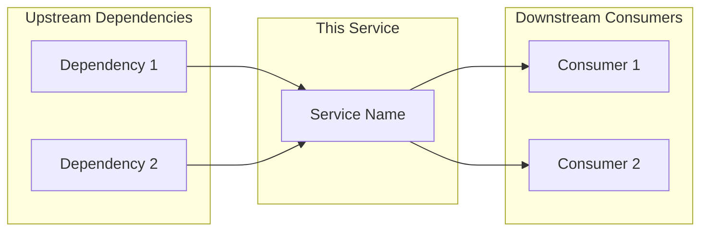
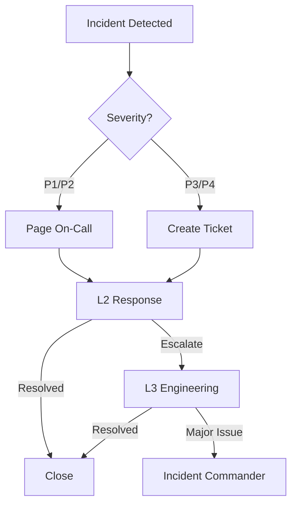
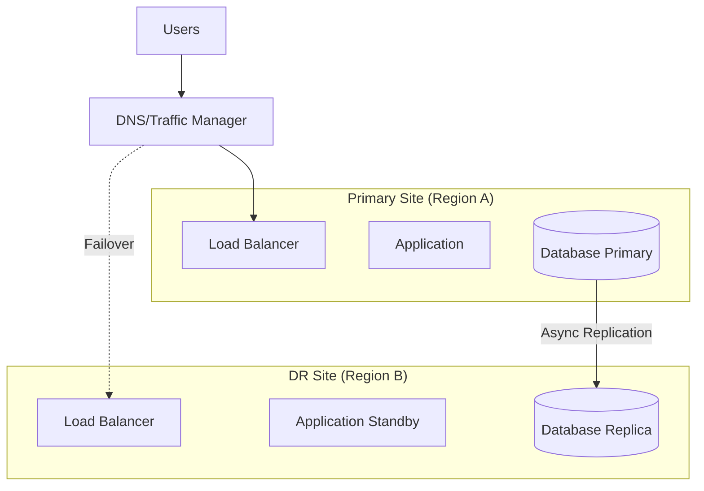

# Operational Readiness Pack

> **Template Status**: Experimental | **Version**: [VERSION] | **Command**: `/arckit.operationalize`

## Document Control

| Field | Value |
|-------|-------|
| **Document ID** | ARC-[PROJECT_ID]-OPS-v[VERSION] |
| **Document Type** | Operational Readiness Pack |
| **Project** | [PROJECT_NAME] (Project [PROJECT_ID]) |
| **Classification** | [PUBLIC / OFFICIAL / OFFICIAL-SENSITIVE / SECRET] |
| **Status** | [DRAFT / IN_REVIEW / APPROVED / PUBLISHED / SUPERSEDED / ARCHIVED] |
| **Version** | [VERSION] |
| **Created Date** | [YYYY-MM-DD] |
| **Last Modified** | [YYYY-MM-DD] |
| **Review Cycle** | [Monthly / Quarterly / Annual / On-Demand] |
| **Next Review Date** | [YYYY-MM-DD] |
| **Owner** | [OWNER_NAME_AND_ROLE] |
| **Reviewed By** | [REVIEWER_NAME] ([YYYY-MM-DD]) or PENDING |
| **Approved By** | [APPROVER_NAME] ([YYYY-MM-DD]) or PENDING |
| **Distribution** | [DISTRIBUTION_LIST] |

## Revision History

| Version | Date | Author | Changes | Approved By | Approval Date |
|---------|------|--------|---------|-------------|---------------|
| [VERSION] | [DATE] | ArcKit AI | Initial creation from `/arckit.operationalize` command | PENDING | PENDING |

---

## 1. Service Overview

### Service Description

| Attribute | Value |
|-----------|-------|
| **Service Name** | [Service Name] |
| **Description** | [Brief description of business capability] |
| **Service Tier** | [Critical / Important / Standard] |
| **Business Criticality** | [High / Medium / Low] |
| **Service Owner** | [Name, Role] |
| **Technical Lead** | [Name, Role] |
| **Operations Lead** | [Name, Role] |

### Service Tier Justification

[Explain why this service tier was selected based on NFRs and business impact]

### Dependencies



| Direction | Service | Impact if Unavailable | Fallback |
|-----------|---------|----------------------|----------|
| Upstream | [Service] | [Impact] | [Fallback/None] |
| Downstream | [Consumer] | [Impact] | [N/A] |

---

## 2. Service Level Objectives (SLOs)

### SLI Definitions

| SLI | Definition | Measurement | Source |
|-----|------------|-------------|--------|
| Availability | % of successful requests (HTTP 2xx/3xx) | (successful / total) × 100 | [APM/Logs] |
| Latency | Response time p95 | 95th percentile of request duration | [APM] |
| Error Rate | % of failed requests (HTTP 5xx) | (5xx / total) × 100 | [APM/Logs] |
| Throughput | Requests per second | Count of requests / time | [Metrics] |

### SLO Targets

| SLO | Target | Error Budget (30 days) | Measurement Window |
|-----|--------|----------------------|-------------------|
| Availability | [99.9%] | [43.8 minutes] | Rolling 30 days |
| Latency (p95) | [<500ms] | [0.1% of requests >500ms] | Rolling 30 days |
| Error Rate | [<0.1%] | [0.1% of requests] | Rolling 30 days |

### Error Budget Policy

| Error Budget Consumed | Action |
|----------------------|--------|
| <50% | Normal operations, continue feature work |
| 50-75% | Increased monitoring, prioritize reliability |
| 75-100% | Freeze non-critical changes, focus on stability |
| >100% | All hands on reliability, no new features |

### SLO Breach Response

1. **Detection**: Automated alert when SLO approaching breach
2. **Notification**: [Team] notified via [Channel]
3. **Response**: Incident created, investigation begins
4. **Review**: Weekly SLO review meeting with stakeholders

---

## 3. Support Model

### Support Tiers

| Tier | Team | Responsibilities | Hours |
|------|------|-----------------|-------|
| L1 | Service Desk | Initial triage, known issues, user queries | [24/7 / Business hours] |
| L2 | Application Support | Application troubleshooting, config changes | [24/7 / Business hours] |
| L3 | Engineering | Code fixes, architecture issues, DR | [On-call / Business hours] |

### Escalation Matrix



| Severity | L1 Response | L2 Response | L3 Response | Management |
|----------|-------------|-------------|-------------|------------|
| P1 | 5 min | 15 min | 30 min | 1 hour |
| P2 | 15 min | 1 hour | 2 hours | 4 hours |
| P3 | 1 hour | 4 hours | 8 hours | Next day |
| P4 | 4 hours | 1 day | 3 days | Weekly |

### On-Call Rotation

| Role | Primary | Secondary | Escalation |
|------|---------|-----------|------------|
| Application | [Name] | [Name] | [Name] |
| Infrastructure | [Name] | [Name] | [Name] |
| Database | [Name] | [Name] | [Name] |

**Rotation Schedule**: [Weekly / Bi-weekly]
**Handoff Time**: [Day, Time UTC]
**On-Call Tool**: [PagerDuty / Opsgenie / VictorOps]

### Out-of-Hours Procedures

1. All P1/P2 incidents page on-call immediately
2. P3/P4 incidents wait until next business day unless escalated
3. On-call has authority to page additional engineers if needed
4. Management escalation for incidents >2 hours unresolved

---

## 4. Monitoring & Observability

### Health Check Endpoints

| Component | Endpoint | Method | Expected Response | Timeout |
|-----------|----------|--------|------------------|---------|
| [API] | /health | GET | HTTP 200, `{"status":"ok"}` | 5s |
| [API] | /health/ready | GET | HTTP 200 | 5s |
| [API] | /health/live | GET | HTTP 200 | 2s |
| [Database] | Connection check | - | Connected | 10s |

### Key Metrics

| Metric | Description | Warning | Critical |
|--------|-------------|---------|----------|
| `http_requests_total` | Request count | - | - |
| `http_request_duration_seconds` | Latency histogram | p95 > 500ms | p95 > 1s |
| `http_requests_errors_total` | 5xx error count | >1% for 5min | >5% for 5min |
| `cpu_usage_percent` | CPU utilization | >70% for 10min | >90% for 5min |
| `memory_usage_percent` | Memory utilization | >80% for 10min | >95% for 5min |
| `disk_usage_percent` | Disk utilization | >80% | >90% |

### Dashboards

| Dashboard | Purpose | URL | Audience |
|-----------|---------|-----|----------|
| Service Overview | Real-time health | [URL] | Operations |
| SLO Dashboard | SLI/SLO tracking | [URL] | Operations, Management |
| Business Metrics | User/transaction stats | [URL] | Product, Management |
| Infrastructure | Resource utilization | [URL] | Infrastructure team |

### Logging

| Log Type | Location | Retention | Search Tool |
|----------|----------|-----------|-------------|
| Application | [CloudWatch / ELK / Splunk] | [30 days] | [Tool] |
| Access | [Location] | [90 days] | [Tool] |
| Audit | [Location] | [1 year] | [Tool] |
| Security | [SIEM] | [1 year] | [Tool] |

### Distributed Tracing

| Component | Instrumentation | Trace ID Header |
|-----------|-----------------|-----------------|
| [API Gateway] | [OpenTelemetry] | X-Trace-ID |
| [Service] | [OpenTelemetry] | X-Trace-ID |
| [Database] | [Query tags] | - |

---

## 5. Alerting Strategy

### Alert Routing

| Alert Type | Channel | Recipients | Hours |
|------------|---------|------------|-------|
| P1 (Critical) | PagerDuty | On-call Primary + Secondary | 24/7 |
| P2 (High) | PagerDuty | On-call Primary | 24/7 |
| P3 (Medium) | Slack + Ticket | #[channel], Support Queue | Business hours |
| P4 (Low) | Ticket only | Support Queue | Business hours |

### Alert Definitions

| Alert Name | Condition | Severity | Runbook |
|------------|-----------|----------|---------|
| High Error Rate | error_rate > 5% for 5min | P1 | [Link] |
| Elevated Error Rate | error_rate > 1% for 10min | P2 | [Link] |
| High Latency | p95 > 1s for 5min | P2 | [Link] |
| Service Down | health_check fails 3x | P1 | [Link] |
| High CPU | cpu > 90% for 5min | P3 | [Link] |
| Disk Space Low | disk > 90% | P3 | [Link] |

### Alert Fatigue Prevention

- **Grouping**: Related alerts grouped into single notification
- **Deduplication**: Identical alerts suppressed for [15 min]
- **Maintenance Windows**: Alerts suppressed during planned changes
- **Auto-resolve**: Alerts auto-close when condition clears

---

## 6. Runbooks

### 6.1 Service Start/Stop

**Purpose**: Gracefully start or stop the service

**Prerequisites**:
- SSH access to servers or kubectl access to cluster
- Deployment credentials

**Start Procedure**:
```bash
# 1. Verify dependencies are available
curl -f https://[dependency]/health

# 2. Start the service
[kubectl scale deployment/[service] --replicas=3]
# OR
[systemctl start [service]]

# 3. Verify service is healthy
curl -f https://[service]/health

# 4. Verify in monitoring dashboard
# Check [Dashboard URL] for green status
```

**Stop Procedure**:
```bash
# 1. Remove from load balancer (graceful drain)
[kubectl annotate service [service] "drain=true"]
# Wait for connections to drain (check LB metrics)

# 2. Stop the service
[kubectl scale deployment/[service] --replicas=0]
# OR
[systemctl stop [service]]

# 3. Verify stopped
[kubectl get pods -l app=[service]]
```

**Verification**: Health check returns 200, no errors in logs

**Escalation**: If service won't start after 3 attempts, escalate to L3

---

### 6.2 Health Check Failures

**Purpose**: Respond to health check failures

**Detection**: Alert "[Service] Health Check Failed"

**Steps**:
```bash
# 1. Check service status
[kubectl get pods -l app=[service]]
# OR
[systemctl status [service]]

# 2. Check recent logs
[kubectl logs -l app=[service] --tail=100]
# OR
[journalctl -u [service] -n 100]

# 3. Check dependencies
curl -f https://[database-host]:[port]/health
curl -f https://[cache-host]:[port]/health

# 4. If pod/service is running but unhealthy, restart
[kubectl rollout restart deployment/[service]]

# 5. If dependency is down, check dependency runbook
```

**Verification**: Health check returns 200 consistently for 5 minutes

**Escalation**: If not resolved in 30 minutes, escalate to L3

---

### 6.3 High Error Rate

**Purpose**: Diagnose and mitigate elevated error rates

**Detection**: Alert "Error Rate > [X]%"

**Steps**:
```bash
# 1. Check error breakdown by type
# In [Logging Tool], search:
# service:[service] AND status:5*

# 2. Identify error pattern
# - Are errors from specific endpoint?
# - Are errors from specific user/tenant?
# - Did errors start after deployment?

# 3. Check recent changes
[git log --oneline -10]
# Check deployment history

# 4. If caused by recent deployment, rollback
[kubectl rollout undo deployment/[service]]

# 5. If caused by dependency, check dependency status
# See dependency contact list

# 6. If caused by load, scale up
[kubectl scale deployment/[service] --replicas=[N]]
```

**Verification**: Error rate returns below threshold for 10 minutes

**Escalation**: If cause unknown after 30 minutes, escalate to L3

---

### 6.4 Performance Degradation

**Purpose**: Respond to response time exceeding SLO

**Detection**: Alert "Latency p95 > [X]ms"

**Steps**:
```bash
# 1. Check current resource usage
[kubectl top pods -l app=[service]]

# 2. Check for resource constraints
# - CPU throttling?
# - Memory pressure?
# - Network saturation?

# 3. Check database performance
# - Slow queries in logs?
# - Connection pool exhausted?
# - Lock contention?

# 4. Check cache hit rate
# - Cache misses causing DB load?

# 5. If resource constrained, scale up
[kubectl scale deployment/[service] --replicas=[N]]
# OR increase resource limits

# 6. If database issue, check database runbook
```

**Verification**: p95 latency below SLO for 15 minutes

**Escalation**: If not resolved in 1 hour, escalate to L3

---

### 6.5 Dependency Failure

**Purpose**: Handle failures in upstream dependencies

**Detection**: Errors indicate dependency unavailable

**Steps**:
```bash
# 1. Confirm dependency is down
curl -f https://[dependency]/health

# 2. Check dependency status page
# [Dependency status page URL]

# 3. Contact dependency team
# [Contact details]

# 4. Enable circuit breaker / fallback if available
# [Feature flag / config change]

# 5. Communicate to stakeholders
# Post in [Slack channel] with status update

# 6. Monitor for recovery
# When dependency recovers, verify service recovers
```

**Verification**: Service recovers when dependency recovers

**Escalation**: If business-critical, escalate to management for comms

---

### 6.6 Security Incident Response

**Purpose**: Initial response to security events

**Detection**: Security alert from SIEM or manual report

**Steps**:
```bash
# 1. DO NOT modify evidence - preserve logs and state

# 2. Assess severity
# - Is data exposed?
# - Is system compromised?
# - Is attack ongoing?

# 3. Contain if needed (with Security team approval)
# - Block suspicious IP
# - Revoke compromised credentials
# - Isolate affected systems

# 4. Notify Security team immediately
# [Security team contact]

# 5. Preserve logs
# Export relevant logs to secure location

# 6. Document timeline
# Record all actions taken with timestamps
```

**Escalation**: ALWAYS escalate security incidents to Security team

---

## 7. Disaster Recovery (DR)

### DR Strategy

| Attribute | Value |
|-----------|-------|
| **DR Strategy** | [Active-Active / Active-Passive / Pilot Light / Backup-Restore] |
| **Primary Site** | [Region/Provider] |
| **DR Site** | [Region/Provider] |
| **RTO** | [X hours] |
| **RPO** | [X hours] |
| **Replication** | [Sync / Async / [X] minute lag] |

### DR Architecture



### Failover Procedure

**Trigger Criteria**: Primary site unavailable for >[X] minutes

**Steps**:
1. **Declare DR Event**: Incident Commander authorizes failover
2. **Verify DR Readiness**: Check DR site health and replication lag
3. **Stop Primary** (if possible): Prevent split-brain
4. **Promote DR Database**: `[promotion command]`
5. **Start DR Application**: Scale up DR instances
6. **Update DNS/Traffic**: Point traffic to DR site
7. **Verify Service**: Run smoke tests
8. **Notify Stakeholders**: Communication to users

**Estimated Failover Time**: [X] minutes

### Failback Procedure

1. **Restore Primary**: Rebuild primary site infrastructure
2. **Sync Data**: Replicate DR data back to primary
3. **Test Primary**: Verify primary site functionality
4. **Schedule Failback**: Plan maintenance window
5. **Execute Failback**: Reverse of failover procedure
6. **Verify**: Confirm primary is serving traffic

### DR Testing

| Test Type | Frequency | Last Tested | Next Scheduled |
|-----------|-----------|-------------|----------------|
| Tabletop Exercise | Quarterly | [Date] | [Date] |
| Failover Test (Non-prod) | Monthly | [Date] | [Date] |
| Full DR Test | Annually | [Date] | [Date] |

---

## 8. Business Continuity (BCP)

### Business Impact

| Function | Impact of Outage | Max Tolerable Downtime |
|----------|------------------|----------------------|
| [Function 1] | [Description] | [X hours] |
| [Function 2] | [Description] | [X hours] |

### Manual Workarounds

| Scenario | Workaround | Instructions |
|----------|------------|--------------|
| Service unavailable | [Manual process] | [Document link] |
| Partial functionality | [Degraded mode] | [Document link] |

### Communication Plan

| Audience | Channel | Trigger | Template |
|----------|---------|---------|----------|
| Internal teams | Slack #[channel] | P1/P2 incident | [Template link] |
| Leadership | Email | >1hr outage | [Template link] |
| Customers | Status page | Any outage | [Template link] |
| Press | PR team | Major incident | Via PR team only |

---

## 9. Backup & Restore

### Backup Schedule

| Data Type | Frequency | Retention | Location |
|-----------|-----------|-----------|----------|
| Database (full) | Daily 02:00 UTC | 30 days | [S3/Azure Blob] |
| Database (incremental) | Hourly | 7 days | [S3/Azure Blob] |
| Application config | On change | 90 days | [Git/Vault] |
| Logs | Continuous | 30 days | [Log storage] |

### Restore Procedure

```bash
# 1. Identify restore point
# List available backups:
[aws s3 ls s3://[bucket]/backups/]

# 2. Download backup
[aws s3 cp s3://[bucket]/backups/[backup-file] /tmp/restore/]

# 3. Stop application (prevent writes)
[kubectl scale deployment/[service] --replicas=0]

# 4. Restore database
[pg_restore -d [database] /tmp/restore/[backup-file]]

# 5. Verify data integrity
# Run verification queries

# 6. Start application
[kubectl scale deployment/[service] --replicas=3]

# 7. Verify service
curl -f https://[service]/health
```

### Backup Verification

- **Automated**: Daily restore test to non-prod environment
- **Manual**: Monthly verification of restore procedure
- **Last Verified**: [Date]

---

## 10. Capacity Planning

### Current Baseline

| Metric | Current | Peak | Capacity |
|--------|---------|------|----------|
| Requests/sec | [X] | [X] | [X] |
| Concurrent users | [X] | [X] | [X] |
| Database size | [X GB] | - | [X GB] |
| Storage used | [X GB] | - | [X GB] |

### Growth Projections

| Timeframe | Users | Transactions | Storage |
|-----------|-------|--------------|---------|
| 6 months | [+X%] | [+X%] | [+X GB] |
| 12 months | [+X%] | [+X%] | [+X GB] |
| 24 months | [+X%] | [+X%] | [+X GB] |

### Scaling Triggers

| Metric | Scale Up Trigger | Scale Down Trigger |
|--------|-----------------|-------------------|
| CPU | >70% for 5min | <30% for 15min |
| Memory | >80% for 5min | <40% for 15min |
| Request queue | >100 for 1min | <10 for 10min |

### Capacity Review

- **Frequency**: Monthly
- **Owner**: [Name]
- **Next Review**: [Date]

---

## 11. Security Operations

### Access Management

| Access Type | Request Process | Approver | Duration |
|-------------|-----------------|----------|----------|
| Read-only (prod) | Ticket | Team Lead | Permanent |
| Write (prod) | Ticket + justification | Service Owner | Time-limited |
| Admin | Ticket + approval chain | Security + Service Owner | Time-limited |

### Credential Rotation

| Credential | Rotation Frequency | Last Rotated | Process |
|------------|-------------------|--------------|---------|
| Database password | 90 days | [Date] | [Runbook link] |
| API keys | 90 days | [Date] | [Runbook link] |
| SSL certificates | Before expiry | [Date] | [Runbook link] |

### Security Patching

- **OS Patches**: [Weekly / Monthly] via [automation tool]
- **Application Dependencies**: [Weekly] via [Dependabot / Renovate]
- **Critical Patches**: Within [24/48/72] hours of CVE

### Security Contacts

| Role | Name | Contact |
|------|------|---------|
| Security Lead | [Name] | [Email/Slack] |
| Incident Response | [Name] | [Email/Slack] |
| CISO (escalation) | [Name] | [Email] |

---

## 12. Deployment & Release

### Deployment Windows

| Environment | Window | Approval |
|-------------|--------|----------|
| Dev | Anytime | None |
| Staging | Business hours | Team lead |
| Production | [Day] [Time UTC] | CAB / Auto |

### Deployment Procedure

1. **Pre-deployment**: Run smoke tests on staging
2. **Deployment**: [Blue-green / Canary / Rolling]
3. **Verification**: Automated tests + manual verification
4. **Rollback decision**: Within [X] minutes if issues

### Rollback Procedure

```bash
# 1. Identify previous good version
[kubectl rollout history deployment/[service]]

# 2. Execute rollback
[kubectl rollout undo deployment/[service]]

# 3. Verify rollback
[kubectl rollout status deployment/[service]]
curl -f https://[service]/health

# 4. Notify team
# Post in #[channel]
```

---

## 13. Knowledge Transfer & Training

### Training Requirements

| Audience | Training | Duration | Materials |
|----------|----------|----------|-----------|
| L1 Support | Service overview, common issues | 2 hours | [Link] |
| L2 Support | Architecture, troubleshooting | 1 day | [Link] |
| L3 Engineers | Deep dive, runbooks, DR | 2 days | [Link] |
| On-call | Incident response, escalation | 4 hours | [Link] |

### Knowledge Base Articles

| Article | Status | Owner |
|---------|--------|-------|
| Service Overview | [Draft / Published] | [Name] |
| Troubleshooting Guide | [Draft / Published] | [Name] |
| FAQ | [Draft / Published] | [Name] |
| Architecture Documentation | [Draft / Published] | [Name] |

### Subject Matter Experts

| Area | SME | Backup |
|------|-----|--------|
| Application | [Name] | [Name] |
| Database | [Name] | [Name] |
| Infrastructure | [Name] | [Name] |
| Security | [Name] | [Name] |

---

## 14. Handover Checklist

### Documentation
- [ ] All runbooks written and reviewed
- [ ] Architecture documentation complete
- [ ] API documentation published
- [ ] Knowledge base articles created

### Monitoring & Alerting
- [ ] Dashboards created and tested
- [ ] Alerts configured and tested
- [ ] On-call rotation staffed and documented
- [ ] Escalation paths confirmed

### Operations
- [ ] Support team trained
- [ ] Access provisioned for support team
- [ ] Runbooks tested by support team
- [ ] Communication channels established

### DR & Backup
- [ ] DR tested within last 6 months
- [ ] Backup restore tested
- [ ] RTO/RPO validated

### Security
- [ ] Security review completed
- [ ] Penetration test completed
- [ ] Access controls verified
- [ ] Credential rotation scheduled

### Sign-off
- [ ] Service Owner approval
- [ ] Technical Lead approval
- [ ] Operations Lead approval
- [ ] Security approval

---

## 15. Operational Metrics & Targets

| Metric | Target | Current | Status |
|--------|--------|---------|--------|
| Availability | [99.9%] | [TBD] | - |
| MTTR | [<1 hour] | [TBD] | - |
| MTBF | [>30 days] | [TBD] | - |
| Change Failure Rate | [<5%] | [TBD] | - |
| Deployment Frequency | [Daily / Weekly] | [TBD] | - |
| Toil % | [<50%] | [TBD] | - |

---

## 16. UK Government Considerations

### GDS Service Standard

| Point | Requirement | Status |
|-------|-------------|--------|
| 14 | Operate a reliable service | [Met / Partial / Not Met] |

### NCSC Guidance

- [ ] Logging and monitoring per NCSC guidelines
- [ ] Incident response aligned with NCSC framework
- [ ] Secure by Design principles in operations

### Cross-Government Dependencies

| Service | Usage | Fallback |
|---------|-------|----------|
| GOV.UK Notify | [Purpose] | [Fallback] |
| GOV.UK Pay | [Purpose] | [Fallback] |
| GOV.UK Verify/One Login | [Purpose] | [Fallback] |

---

## 17. Requirements Traceability

| Requirement ID | Requirement | Operational Element | Status |
|----------------|-------------|---------------------|--------|
| [NFR-A-001] | [Availability target] | SLO: Availability | ✅ |
| [NFR-P-001] | [Performance target] | SLO: Latency | ✅ |
| [NFR-SEC-001] | [Security requirement] | Security Operations | ✅ |
| [DR-001] | [RTO/RPO requirement] | DR Procedures | ✅ |

---

## Approval

| Role | Name | Signature | Date |
|------|------|-----------|------|
| Service Owner | | | |
| Technical Lead | | | |
| Operations Lead | | | |
| Security Lead | | | |

## External References

| Document | Type | Source | Key Extractions | Path |
|----------|------|--------|-----------------|------|
| *None provided* | — | — | — | — |

---

**Generated by**: ArcKit `/arckit.operationalize` command
**Generated on**: [DATE]
**ArcKit Version**: [VERSION]
**Project**: [PROJECT_NAME]
**Model**: [AI_MODEL]
