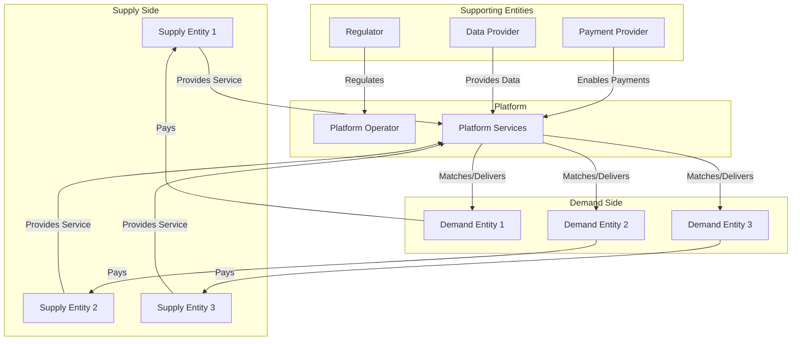

# Platform Strategy Design

> **Template Status**: Experimental | **Version**: [VERSION] | **Command**: `/arckit.platform-design`

## Document Control

| Field | Value |
|-------|-------|
| **Document ID** | `{document_id}` |
| **Document Type** | Platform Strategy Design |
| **Project** | [PROJECT_NAME] (Project [PROJECT_ID]) |
| **Classification** | [PUBLIC / OFFICIAL / OFFICIAL-SENSITIVE / SECRET] |
| **Status** | [DRAFT / IN_REVIEW / APPROVED / PUBLISHED / SUPERSEDED / ARCHIVED] |
| **Version** | [VERSION] |
| **Created Date** | [YYYY-MM-DD] |
| **Last Modified** | [YYYY-MM-DD] |
| **Review Cycle** | [Monthly / Quarterly / Annual / On-Demand] |
| **Next Review Date** | [YYYY-MM-DD] |
| **Owner** | [OWNER_NAME_AND_ROLE] |
| **Reviewed By** | [REVIEWER_NAME] on [DATE] or [PENDING] |
| **Approved By** | [APPROVER_NAME] on [DATE] or [PENDING] |
| **Distribution** | [DISTRIBUTION_LIST] |
| **Project Name** | `{project_name}` |
| **Author** | `{author}` |
| **Approval Date** | `{approval_date}` |

## Revision History

| Version | Date | Author | Changes | Approved By | Approval Date |
|---------|------|--------|---------|-------------|---------------|
| [VERSION] | [DATE] | ArcKit AI | Initial creation from `/arckit.[COMMAND]` command | [PENDING] | [PENDING] |

## Executive Summary

### Platform Vision

**Platform Name**: [Name of the platform]

**Platform Purpose**: [One-sentence value proposition]

**Target Ecosystem**: [Description of the ecosystem you aim to mobilize]

### Strategic Overview

**Two-Sided (or Multi-Sided) Market**:
- **Supply Side**: [Who provides value - e.g., service providers, sellers, creators]
- **Demand Side**: [Who consumes value - e.g., consumers, buyers, learners]
- **Platform Role**: [How platform enables/enhances transactions and learning]

### Key Metrics

| Metric | Target | Timeline |
|--------|--------|----------|
| **Entities Onboarded** (Supply Side) | [Number] | [Timeframe] |
| **Entities Onboarded** (Demand Side) | [Number] | [Timeframe] |
| **Transaction Volume** | [Number/month] | [Timeframe] |
| **Transaction Value** | [£/month] | [Timeframe] |
| **Network Effects** | [Metric - e.g., % increase in value per new user] | [Timeframe] |

### Critical Success Factors

1. **Liquidity**: [Strategy to solve chicken-and-egg problem]
2. **Transaction Cost Reduction**: [Key cost reductions that enable marketplace]
3. **Learning Services**: [How platform helps entities improve continuously]
4. **Network Effects**: [What drives increasing returns to scale]
5. **Defensibility**: [What prevents disintermediation or competition]

---

## 1. Ecosystem Canvas

### 1.1 Purpose

The Ecosystem Canvas maps all entities and their relationships within the platform ecosystem. It visualizes who participates, what they exchange, and how they interact.

**Reference**: Based on PDT Ecosystem Canvas v2.2

### 1.2 Ecosystem Map

### 1.3 Entity Catalog

| Entity ID | Entity Name | Entity Type | Role | Resources Provided | Resources Consumed |
|-----------|-------------|-------------|------|--------------------|--------------------|
| **E-001** | [Entity name] | [Supply/Demand/Supporting] | [Role description] | [What they provide] | [What they consume] |
| **E-002** | [Entity name] | [Supply/Demand/Supporting] | [Role description] | [What they provide] | [What they consume] |
| **E-003** | [Entity name] | [Supply/Demand/Supporting] | [Role description] | [What they provide] | [What they consume] |
| **E-004** | [Entity name] | [Supply/Demand/Supporting] | [Role description] | [What they provide] | [What they consume] |
| **E-005** | [Entity name] | [Supply/Demand/Supporting] | [Role description] | [What they provide] | [What they consume] |

**Add additional entities as needed** (typical platforms have 5-15 entity types)

### 1.4 Relationships and Flows

**Key Flows:**

1. **Value Flow (Supply → Platform → Demand)**
   - [Description of how value moves through ecosystem]
   - **Example**: Service providers list services → Platform matches → Consumers book services

2. **Payment Flow (Demand → Platform → Supply)**
   - [Description of payment mechanism]
   - **Example**: Consumers pay platform → Platform takes commission → Providers receive payment

3. **Data Flow**
   - [Description of data exchanges]
   - **Example**: Providers share availability → Platform aggregates → Consumers see real-time inventory

4. **Feedback Flow**
   - [Description of reputation/rating mechanisms]
   - **Example**: Consumers rate providers → Platform displays ratings → New consumers make informed choices

### 1.5 Ecosystem Boundaries

**In Scope**: [What is within the ecosystem you are orchestrating]

**Out of Scope**: [What adjacent ecosystems or entities are explicitly excluded]

**Interfaces**: [How your platform connects to adjacent ecosystems]

---

## 2. Entity-Role Portraits

### 2.1 Purpose

Entity portraits provide deep context on 3-5 key entities in the ecosystem. Each portrait analyzes:
- **Context**: Current situation and constraints
- **Performance Pressures**: What forces drive their behavior
- **Goals**: What outcomes they seek
- **Gains**: What value they hope to capture

**Reference**: Based on PDT Entity-Role Portrait (EEP) v2.2

### 2.2 Portrait 1: [Primary Supply-Side Entity]

**Entity ID**: E-001
**Entity Name**: [e.g., "Independent Service Provider"]
**Entity Type**: Supply Side

#### 2.2.1 Context

**Who are they?**
- [Description of typical profile - e.g., demographics, industry, size]

**Current Situation:**
- [How they operate today without the platform]
- [What tools/processes they currently use]
- [Pain points in current workflow]

**Constraints:**
- [Time constraints]
- [Budget constraints]
- [Regulatory constraints]
- [Technical capabilities]

#### 2.2.2 Performance Pressures

**External Pressures:**
- [Market competition pressures]
- [Economic pressures - e.g., declining revenues]
- [Regulatory pressures]
- [Customer expectation changes]

**Internal Pressures:**
- [Operational efficiency needs]
- [Cost reduction imperatives]
- [Growth targets]
- [Quality standards]

#### 2.2.3 Goals

**Short-term Goals (0-6 months):**
1. [Goal 1 - e.g., "Acquire 10 new customers per month"]
2. [Goal 2 - e.g., "Reduce time spent on administration by 50%"]
3. [Goal 3 - e.g., "Improve cash flow visibility"]

**Medium-term Goals (6-18 months):**
1. [Goal 1 - e.g., "Establish reputation in new market segment"]
2. [Goal 2 - e.g., "Build recurring revenue base"]
3. [Goal 3 - e.g., "Expand service offerings"]

**Long-term Goals (18+ months):**
1. [Goal 1 - e.g., "Become recognized leader in niche"]
2. [Goal 2 - e.g., "Scale business to £500K annual revenue"]
3. [Goal 3 - e.g., "Reduce dependency on large clients"]

#### 2.2.4 Gains Sought

**What value does the platform offer this entity?**

1. **Customer Acquisition**
   - [How platform helps them find customers]
   - **Value Metric**: [e.g., Cost per acquisition reduced from £500 to £50]

2. **Operational Efficiency**
   - [How platform reduces their operational burden]
   - **Value Metric**: [e.g., 10 hours/week saved on administration]

3. **Revenue Growth**
   - [How platform enables more revenue]
   - **Value Metric**: [e.g., 30% increase in billable hours through better utilization]

4. **Risk Reduction**
   - [How platform reduces their risks]
   - **Value Metric**: [e.g., Guaranteed payment, reduced bad debt]

5. **Learning and Improvement**
   - [How platform helps them get better]
   - **Value Metric**: [e.g., Performance analytics, best practice sharing]

#### 2.2.5 Linkage to Platform Features

| Entity Goal | Platform Feature | How Feature Delivers Value |
|-------------|------------------|----------------------------|
| [Goal from 2.2.3] | [Feature name] | [Description of how feature addresses goal] |
| [Goal from 2.2.3] | [Feature name] | [Description of how feature addresses goal] |
| [Goal from 2.2.3] | [Feature name] | [Description of how feature addresses goal] |

---

### 2.3 Portrait 2: [Primary Demand-Side Entity]

**Entity ID**: E-002
**Entity Name**: [e.g., "Enterprise Buyer"]
**Entity Type**: Demand Side

#### 2.3.1 Context

**Who are they?**
- [Description of typical profile]

**Current Situation:**
- [How they find/purchase services today without the platform]
- [What pain points they experience]

**Constraints:**
- [Budget limitations]
- [Procurement process constraints]
- [Technical integration constraints]
- [Compliance requirements]

#### 2.3.2 Performance Pressures

**External Pressures:**
- [Competitive pressures requiring faster delivery]
- [Cost reduction mandates]
- [Quality/compliance requirements]
- [Stakeholder expectations]

**Internal Pressures:**
- [Operational efficiency targets]
- [Risk mitigation requirements]
- [Innovation demands]
- [Team capacity constraints]

#### 2.3.3 Goals

**Short-term Goals (0-6 months):**
1. [Goal 1 - e.g., "Find qualified vendor within 2 weeks"]
2. [Goal 2 - e.g., "Reduce procurement cycle time by 40%"]
3. [Goal 3 - e.g., "Ensure vendor compliance with standards"]

**Medium-term Goals (6-18 months):**
1. [Goal 1 - e.g., "Build panel of pre-qualified suppliers"]
2. [Goal 2 - e.g., "Reduce total cost of ownership by 20%"]
3. [Goal 3 - e.g., "Improve vendor performance visibility"]

**Long-term Goals (18+ months):**
1. [Goal 1 - e.g., "Establish strategic supplier partnerships"]
2. [Goal 2 - e.g., "Create continuous improvement culture"]
3. [Goal 3 - e.g., "Benchmark performance against industry leaders"]

#### 2.3.4 Gains Sought

**What value does the platform offer this entity?**

1. **Supplier Discovery**
   - [How platform helps them find right suppliers]
   - **Value Metric**: [e.g., Time to find supplier reduced from 8 weeks to 2 weeks]

2. **Quality Assurance**
   - [How platform ensures supplier quality]
   - **Value Metric**: [e.g., 95% first-time quality through pre-vetting]

3. **Cost Savings**
   - [How platform reduces costs]
   - **Value Metric**: [e.g., 25% cost reduction through marketplace competition]

4. **Risk Mitigation**
   - [How platform reduces their risks]
   - **Value Metric**: [e.g., Supplier compliance guaranteed, insurance verified]

5. **Performance Visibility**
   - [How platform provides transparency]
   - **Value Metric**: [e.g., Real-time dashboards, SLA monitoring, benchmarking]

#### 2.3.5 Linkage to Platform Features

| Entity Goal | Platform Feature | How Feature Delivers Value |
|-------------|------------------|----------------------------|
| [Goal from 2.3.3] | [Feature name] | [Description of how feature addresses goal] |
| [Goal from 2.3.3] | [Feature name] | [Description of how feature addresses goal] |
| [Goal from 2.3.3] | [Feature name] | [Description of how feature addresses goal] |

---

### 2.4 Portrait 3: [Supporting Entity - e.g., Regulator]

**Entity ID**: E-003
**Entity Name**: [e.g., "Industry Regulator"]
**Entity Type**: Supporting Entity

#### 2.4.1 Context

**Who are they?**
- [Description of regulatory body or supporting entity]

**Current Situation:**
- [How they interact with the ecosystem today]
- [What challenges they face]

**Constraints:**
- [Legal/statutory constraints]
- [Resource constraints]
- [Political constraints]

#### 2.4.2 Performance Pressures

**Mandates:**
- [Statutory obligations]
- [Public interest requirements]
- [Compliance monitoring duties]

**Stakeholder Expectations:**
- [Government expectations]
- [Industry expectations]
- [Public expectations]

#### 2.4.3 Goals

**Regulatory Goals:**
1. [Goal 1 - e.g., "Ensure 100% provider compliance with safety standards"]
2. [Goal 2 - e.g., "Reduce consumer complaints by 30%"]
3. [Goal 3 - e.g., "Improve market transparency"]

#### 2.4.4 Gains Sought

**What value does the platform offer this entity?**

1. **Compliance Visibility**
   - [How platform provides regulatory oversight]
   - **Value Metric**: [e.g., Real-time compliance dashboard vs manual annual audits]

2. **Data for Evidence-Based Policy**
   - [How platform generates regulatory intelligence]
   - **Value Metric**: [e.g., Market data for policy decisions]

3. **Consumer Protection**
   - [How platform ensures consumer safety]
   - **Value Metric**: [e.g., Automated verification, complaint resolution SLAs]

---

**Note**: Add portraits for 2-3 additional critical entities (E-004, E-005, etc.) following the same structure.

---

## 3. Motivations Matrix

### 3.1 Purpose

The Motivations Matrix maps how different entities' motivations align or conflict. It helps identify:
- Where natural synergies exist (aligned motivations)
- Where platform must resolve conflicts
- Which entities are natural partners vs. competitors

**Reference**: Based on PDT Motivations Matrix (MM) v2.2

### 3.2 Cross-Entity Motivation Analysis

| | Supply Entity (E-001) | Demand Entity (E-002) | Regulator (E-003) | Payment Provider (E-004) |
|---|---|---|---|---|
| **Supply Entity (E-001)** | — | **ALIGNED**: Both want efficient matching and transaction | **CONFLICT**: Provider wants flexibility, regulator wants control | **ALIGNED**: Both benefit from transaction volume |
| **Demand Entity (E-002)** | **ALIGNED**: Both want efficient matching and transaction | — | **ALIGNED**: Both want quality assurance and compliance | **ALIGNED**: Both want secure, convenient payment |
| **Regulator (E-003)** | **CONFLICT**: Provider wants flexibility, regulator wants control | **ALIGNED**: Both want quality assurance and compliance | — | **ALIGNED**: Both want fraud prevention |
| **Payment Provider (E-004)** | **ALIGNED**: Both benefit from transaction volume | **ALIGNED**: Both want secure, convenient payment | **ALIGNED**: Both want fraud prevention | — |

### 3.3 Key Synergies

**Synergy 1: Supply-Demand Matching**
- **Entities**: E-001 (Supply) ↔ E-002 (Demand)
- **Shared Motivation**: Both want efficient, low-friction transactions
- **Platform Role**: Provide matching algorithm, reduce search costs, ensure quality
- **Value Creation**: £X million in transaction value enabled annually

**Synergy 2: Quality Assurance**
- **Entities**: E-002 (Demand) ↔ E-003 (Regulator)
- **Shared Motivation**: Both want compliant, high-quality providers
- **Platform Role**: Automated compliance verification, quality ratings, provider certification
- **Value Creation**: Risk reduction, consumer confidence, regulatory efficiency

**Synergy 3: Transaction Enablement**
- **Entities**: E-001 (Supply) ↔ E-004 (Payment Provider) ↔ E-002 (Demand)
- **Shared Motivation**: All benefit from transaction volume and payment security
- **Platform Role**: Integrated payment, escrow, dispute resolution
- **Value Creation**: Payment security, cash flow visibility, reduced fraud

### 3.4 Key Conflicts to Resolve

**Conflict 1: Flexibility vs. Control**
- **Entities**: E-001 (Supply) vs. E-003 (Regulator)
- **Conflict**: Providers want operational flexibility; regulator wants standardization
- **Platform Solution**: [How platform balances flexibility with compliance - e.g., "Compliance-as-a-service" that automates regulatory requirements while allowing provider customization]
- **Success Metric**: [e.g., 95% provider compliance + 80% provider satisfaction with flexibility]

**Conflict 2: Price Transparency vs. Price Optimization**
- **Entities**: E-001 (Supply) vs. E-002 (Demand)
- **Conflict**: Buyers want price transparency; sellers want pricing power
- **Platform Solution**: [e.g., Dynamic pricing with visibility into demand signals, allowing sellers to optimize while buyers compare]
- **Success Metric**: [e.g., 20% price reduction for buyers + 15% revenue increase for sellers through better matching]

**Conflict 3: Data Privacy vs. Personalization**
- **Entities**: E-002 (Demand) vs. Platform
- **Conflict**: Users want privacy; platform needs data for personalization
- **Platform Solution**: [e.g., Privacy-preserving analytics, user-controlled data sharing, GDPR compliance]
- **Success Metric**: [e.g., 90% user consent for data sharing + zero privacy incidents]

---

## 4. Transactions Board

### 4.1 Purpose

The Transactions Board identifies all transactions in the ecosystem and analyzes transaction costs. The platform's core role is **reducing transaction costs** to enable marketplace interactions.

**Reference**: Based on PDT Transactions Board (TB) v2.2

**Transaction Costs** (Coase, Williamson):
- **Search Costs**: Finding the right party
- **Information Costs**: Verifying quality, credentials, reputation
- **Negotiation Costs**: Agreeing on terms, pricing, contracts
- **Coordination Costs**: Logistics, scheduling, communication
- **Enforcement Costs**: Ensuring compliance, dispute resolution

### 4.2 Transaction Catalog

| Transaction ID | Transaction Name | From Entity | To Entity | Existing? | Current Channel | Transaction Costs (Without Platform) | Platform Channel | Transaction Costs (With Platform) | Cost Reduction |
|----------------|------------------|-------------|-----------|-----------|-----------------|--------------------------------------|------------------|-----------------------------------|----------------|
| **T-001** | [e.g., Service Request] | E-002 (Demand) | E-001 (Supply) | ❌ No | N/A - doesn't happen | £500 (search) + 2 weeks (time) | Platform marketplace | £50 (search) + 2 days | **90% cost reduction** |
| **T-002** | [e.g., Service Delivery] | E-001 (Supply) | E-002 (Demand) | ✅ Yes | Email, manual coordination | 5 hours coordination + 10% errors | Platform workflow | 30 min coordination + 2% errors | **90% time saved** |
| **T-003** | [e.g., Payment] | E-002 (Demand) | E-001 (Supply) | ✅ Yes | Bank transfer, invoicing | 7 days payment + 5% bad debt | Platform escrow | 1 day payment + 0.5% bad debt | **86% faster** |
| **T-004** | [e.g., Quality Verification] | E-003 (Regulator) | E-001 (Supply) | ✅ Yes | Annual manual audit | £2000/audit, 12-month cycles | Platform continuous monitoring | £200/year, real-time | **90% cost reduction** |
| **T-005** | [e.g., Performance Feedback] | E-002 (Demand) | E-001 (Supply) | ❌ No | N/A - doesn't happen | No feedback loop | Platform rating system | Real-time ratings | **New capability** |

**Add 10-20 transactions to comprehensively map the ecosystem**

### 4.3 Transaction Cost Analysis

**Total Ecosystem Transaction Costs (Without Platform):**
- Search Costs: [£X per transaction]
- Information Costs: [£Y per transaction]
- Negotiation Costs: [£Z per transaction]
- Coordination Costs: [£A per transaction]
- Enforcement Costs: [£B per transaction]
- **TOTAL**: [£X+Y+Z+A+B per transaction]

**Total Ecosystem Transaction Costs (With Platform):**
- Search Costs: [£reduced]
- Information Costs: [£reduced]
- Negotiation Costs: [£reduced]
- Coordination Costs: [£reduced]
- Enforcement Costs: [£reduced]
- **TOTAL**: [£reduced total per transaction]

**Platform Value Creation**:
- **Cost Reduction per Transaction**: [e.g., £450 saved per transaction]
- **Annual Transaction Volume**: [e.g., 10,000 transactions/year]
- **Annual Value Created**: [e.g., £4.5 million/year in transaction cost savings]

### 4.4 Transaction Enablement (New Transactions)

**Transactions That Don't Exist Today (But Will With Platform):**

1. **T-001: Service Request** (Supply-Demand matching)
   - **Why it doesn't exist**: Search costs too high (£500), 2-week delay
   - **How platform enables**: Automated matching, AI recommendations, instant quotes
   - **Value unlocked**: "Long tail" of small transactions become economically viable

2. **T-005: Performance Feedback** (Demand → Supply reputation)
   - **Why it doesn't exist**: No channel for feedback
   - **How platform enables**: Built-in rating system, structured feedback forms
   - **Value unlocked**: Quality signal for buyers, improvement signal for sellers

3. **[Additional transaction]**
   - **Why it doesn't exist**: [Barrier]
   - **How platform enables**: [Platform mechanism]
   - **Value unlocked**: [New capability]

### 4.5 Channel Improvements

| Transaction | Current Channel | Channel Problems | Platform Channel | Channel Improvements |
|-------------|----------------|------------------|------------------|----------------------|
| Service Discovery | Google search, word of mouth | Fragmented, no quality signal, high search cost | Platform marketplace with filters, ratings, AI matching | 90% faster discovery, quality-assured |
| Contract Negotiation | Email, phone calls, manual contracts | Slow (2 weeks), legal costs (£1000+), template inconsistency | Platform standard terms, automated T&Cs, e-signature | 95% faster, £900 cost saving |
| Payment Processing | Invoice → bank transfer | 7-30 day delay, manual reconciliation, bad debt risk | Platform escrow, automated invoicing, instant release | 1-day payment, zero bad debt |
| Quality Assurance | Manual audits | Annual, expensive (£2000), retrospective | Platform real-time monitoring, automated compliance checks | Continuous, £1800 saving, proactive |

---

## 5. Learning Engine Canvas

### 5.1 Purpose

The Learning Engine Canvas designs services that help ecosystem entities **continuously improve**. While transactions create immediate value exchange, learning services create long-term ecosystem health and defensibility.

**Reference**: Based on PDT Learning Engine Canvas (LC) v2.2

**Learning as Value Engine:**
- Transactions = immediate value exchange
- Learning = long-term value appreciation
- Platform that helps entities get better → stickiness, moat, network effects

### 5.2 Learning Services Catalog

**For Supply-Side Entities (E-001):**

#### Learning Service 1: Performance Analytics

**What**: Real-time dashboard showing provider performance vs. peer benchmarks

**Inputs**:
- Transaction data (volume, value, ratings)
- Peer group performance (anonymized)
- Industry benchmarks

**Outputs**:
- Performance scorecard (response time, quality ratings, revenue per hour)
- Trend analysis (improving/declining metrics)
- Peer comparison (top quartile, median, bottom quartile)

**How Entity Improves**:
- Identifies underperforming areas (e.g., slow response times)
- Sets improvement targets (reach top quartile)
- Tracks progress over time

**Platform Benefit**:
- Higher-quality supply side
- Competitive pressure drives excellence
- Data for coaching/training interventions

**Success Metric**: [e.g., Providers using analytics improve ratings by 0.5 stars within 3 months]

---

#### Learning Service 2: Best Practice Library

**What**: Curated library of case studies, templates, and how-to guides from top performers

**Inputs**:
- Top performer profiles (with permission)
- Success patterns identified by platform AI
- Industry expert contributions

**Outputs**:
- Case studies (e.g., "How provider X grew revenue 200% in 12 months")
- Templates (e.g., service description templates that convert 3x better)
- Video tutorials (e.g., "Optimizing your profile for search")

**How Entity Improves**:
- Learns from top performers
- Adopts proven templates
- Shortens learning curve

**Platform Benefit**:
- Faster onboarding of new providers
- Quality standards diffuse through ecosystem
- Content marketing (case studies)

**Success Metric**: [e.g., Providers who complete learning modules see 40% higher conversion rates]

---

#### Learning Service 3: Personalized Coaching

**What**: AI-driven recommendations + human coaching for underperformers

**Inputs**:
- Provider performance data
- Customer feedback themes
- Success patterns from top performers

**Outputs**:
- Weekly personalized tips (e.g., "Update your profile photo - it increases bookings 25%")
- Quarterly coaching calls for bottom quartile
- Certification programs for capability development

**How Entity Improves**:
- Receives specific, actionable feedback
- Gets human support for difficult changes
- Gains credentials through certification

**Platform Benefit**:
- Reduces provider churn (bottom quartile stays and improves)
- Elevates overall quality
- Creates professionalization pathway

**Success Metric**: [e.g., Bottom quartile providers who engage with coaching improve to median within 6 months]

---

**For Demand-Side Entities (E-002):**

#### Learning Service 4: Procurement Intelligence

**What**: Market intelligence reports on pricing trends, capacity, quality benchmarks

**Inputs**:
- Platform transaction data (prices, volumes, geographies)
- Quality ratings and compliance data
- Capacity/availability signals

**Outputs**:
- Quarterly market reports (e.g., "Average consulting rates decreased 10% this quarter")
- Real-time pricing benchmarks (e.g., "You are paying 15% above market median")
- Capacity forecasts (e.g., "High demand expected in Q4, book early")

**How Entity Improves**:
- Makes better procurement decisions
- Negotiates from data-driven position
- Plans capacity in advance

**Platform Benefit**:
- Buyers perceive platform as strategic advisor, not just marketplace
- Increased transaction volume (better planning)
- Reduced buyer churn

**Success Metric**: [e.g., Buyers using intelligence reports achieve 20% better pricing than non-users]

---

#### Learning Service 5: Vendor Management Toolkit

**What**: Tools and templates for managing vendor relationships and performance

**Inputs**:
- Platform SLA monitoring data
- Vendor scorecards
- Contract templates

**Outputs**:
- Vendor performance dashboards
- Automated SLA breach alerts
- Contract management workflows
- Vendor review templates

**How Entity Improves**:
- Professionalizes vendor management
- Reduces vendor management overhead (automated monitoring)
- Improves vendor performance (data-driven conversations)

**Platform Benefit**:
- Buyers get more value from platform relationships
- Platform becomes embedded in buyer operations
- Churn reduction

**Success Metric**: [e.g., Buyers using toolkit report 50% reduction in vendor management time]

---

### 5.3 Learning Services Business Model

**Freemium Model:**
- **Free Tier**: Basic analytics, public best practices
- **Premium Tier**: Advanced analytics, personalized coaching, market intelligence
- **Enterprise Tier**: Custom reports, dedicated account management, API access

**Pricing:**
- Premium: [£X/month per provider, £Y/month per buyer]
- Enterprise: [£Z/month + % of transaction value]

**Projected Adoption:**
- Year 1: 20% of entities upgrade to premium
- Year 2: 35% of entities on premium
- Year 3: 50% of entities on premium

**Revenue Potential:**
- [Calculate based on entity volumes and pricing]

---

## 6. Platform Experience Canvas

### 6.1 Purpose

The Platform Experience Canvas integrates **peer-to-peer transactions** (from Transactions Board) with **platform services** (from Learning Engine) into complete ecosystem journeys and business models.

**Reference**: Based on PDT Platform Experience Canvas (PEC) v2.2

### 6.2 Core Journey: [Journey Name - e.g., "First-Time Service Purchase"]

**Entity**: E-002 (Demand Side - First-Time Buyer)

**Journey Goal**: Complete first successful service purchase within 24 hours

#### 6.2.1 Journey Map

| Stage | Entity Action | Platform Service | Transaction (from TB) | Learning Service (from LC) | Touchpoint | Pain Points Addressed |
|-------|---------------|------------------|----------------------|----------------------------|------------|----------------------|
| **1. Discovery** | Buyer searches for service provider | Search algorithm, filters, AI matching | T-001 (Service Request) | — | Website, mobile app | Reduces search cost from £500 to £50 |
| **2. Evaluation** | Buyer reviews provider profiles, ratings, credentials | Provider verification, rating system, compliance badges | — | Learning Service 4 (Procurement Intelligence) shows market pricing | Provider profile pages | Reduces information cost, quality assurance |
| **3. Selection** | Buyer requests quote from 3 providers | Automated RFQ workflow, instant notifications | T-001 (Service Request) | — | RFQ form | Reduces negotiation time from 2 weeks to 2 days |
| **4. Negotiation** | Buyer compares quotes, negotiates terms | Standard T&Cs, comparison tool, chat | T-003 (Payment terms) | — | Quote comparison screen | Reduces legal costs, standardizes contracts |
| **5. Contracting** | Buyer accepts quote, signs contract | E-signature, escrow setup, SLA definitions | T-002 (Service Delivery agreement) | — | Contract wizard | 95% faster than manual contracting |
| **6. Delivery** | Provider delivers service, buyer monitors progress | Workflow tracker, milestone approvals, communication tools | T-002 (Service Delivery) | — | Project dashboard | Reduces coordination costs by 90% |
| **7. Payment** | Buyer approves completion, platform releases payment | Escrow release, automated invoicing, payment processing | T-003 (Payment) | — | Payment dashboard | Reduces payment time from 30 days to 1 day |
| **8. Feedback** | Buyer rates provider, shares experience | Rating system, review moderation, testimonial showcase | T-005 (Performance Feedback) | Learning Service 1 (Performance Analytics) updates provider scorecard | Review form | Creates quality signal for future buyers |
| **9. Retention** | Buyer considers repeat purchase | Personalized recommendations, saved providers, loyalty benefits | — | Learning Service 4 (Procurement Intelligence) suggests optimal rebuy timing | Email, dashboard | Increases repeat purchase rate by 60% |

#### 6.2.2 Journey Metrics

| Metric | Target | Current (Without Platform) | Improvement |
|--------|--------|---------------------------|-------------|
| Time to First Purchase | 24 hours | 2-4 weeks | **95% faster** |
| Cost to Find Provider | £50 | £500 | **90% cost reduction** |
| First Purchase Completion Rate | 80% | 30% | **167% improvement** |
| Repeat Purchase Rate (90 days) | 60% | 10% | **500% improvement** |
| Customer Satisfaction (NPS) | +50 | +10 | **+40 points** |

---

### 6.3 Core Journey: [Journey Name - e.g., "Provider Onboarding and First Sale"]

**Entity**: E-001 (Supply Side - New Provider)

**Journey Goal**: Complete onboarding and achieve first sale within 7 days

#### 6.3.1 Journey Map

| Stage | Entity Action | Platform Service | Transaction (from TB) | Learning Service (from LC) | Touchpoint | Pain Points Addressed |
|-------|---------------|------------------|----------------------|----------------------------|------------|----------------------|
| **1. Signup** | Provider creates account | Registration wizard, identity verification | — | — | Signup form | Simple 10-min signup vs 2-week vendor onboarding |
| **2. Profile Creation** | Provider describes services, pricing, credentials | Profile templates, credential verification, compliance checks | T-004 (Quality Verification) | Learning Service 2 (Best Practice Library) provides high-converting profile templates | Profile builder | Reduces time to create compelling profile by 80% |
| **3. Verification** | Provider submits credentials for verification | Automated verification APIs (Companies House, professional bodies, insurance) | T-004 (Quality Verification) | — | Document upload | Reduces verification time from 2 weeks to 24 hours |
| **4. Training** | Provider completes platform training | Video tutorials, knowledge base, certification quiz | — | Learning Service 2 (Best Practice Library) | Learning portal | Reduces onboarding errors by 70% |
| **5. Go Live** | Provider's profile goes live, starts appearing in search | SEO optimization, search ranking algorithm, featured listings | — | Learning Service 3 (Personalized Coaching) provides launch tips | Dashboard notification | Immediate visibility vs weeks of marketing effort |
| **6. First Lead** | Provider receives first customer inquiry | Lead notification, lead scoring, response time tracking | T-001 (Service Request) | Learning Service 1 (Performance Analytics) shows response time benchmarks | Email, SMS, app notification | Increases conversion rate by 40% through timely response |
| **7. First Sale** | Provider converts lead to sale | Quote builder, contract templates, customer communication tools | T-002 (Service Delivery), T-003 (Payment) | Learning Service 3 (Personalized Coaching) provides negotiation tips | Quote form, chat | 3x higher conversion rate than manual sales process |
| **8. First Delivery** | Provider completes first job | Delivery workflow, milestone tracker, quality checklists | T-002 (Service Delivery) | — | Project workspace | Reduces delivery errors, ensures quality |
| **9. First Payment** | Provider receives first payment | Automated invoicing, escrow release, bank transfer | T-003 (Payment) | — | Payment dashboard | Payment within 24 hours vs 30-60 day invoice terms |
| **10. Improvement** | Provider reviews performance, sets goals | Performance analytics, peer benchmarking, improvement plans | T-005 (Performance Feedback) | Learning Service 1 (Performance Analytics), Learning Service 3 (Personalized Coaching) | Analytics dashboard | Continuous improvement vs stagnation |

#### 6.3.2 Journey Metrics

| Metric | Target | Current (Without Platform) | Improvement |
|--------|--------|---------------------------|-------------|
| Time to Go Live | 48 hours | 2-4 weeks | **95% faster** |
| Time to First Sale | 7 days | 3-6 months | **95% faster** |
| Onboarding Completion Rate | 85% | 40% | **113% improvement** |
| First Month Revenue (average provider) | £2,000 | £200 | **900% improvement** |
| Provider Satisfaction (NPS) | +60 | +20 | **+40 points** |

---

### 6.4 Business Model Canvas

#### 6.4.1 Revenue Streams

**Transaction Fees:**
- **Commission on Transactions**: [X]% of transaction value
  - Supply side pays [Y]%, Demand side pays [Z]%
  - **Rationale**: [e.g., Split 5% supply / 5% demand to balance liquidity on both sides]
  - **Projected Volume**: [e.g., £10M GMV Year 1 → £1M commission revenue]

**Subscription Fees:**
- **Premium Memberships**: [£X/month per entity]
  - **Supply Side Premium**: [e.g., £99/month for advanced analytics, featured listings]
  - **Demand Side Premium**: [e.g., £199/month for procurement intelligence, unlimited RFQs]
  - **Projected Adoption**: [e.g., 30% adoption rate → £500K ARR]

**Learning Services:**
- **Certification Programs**: [£X per certification]
  - **Example**: [e.g., "Verified Professional" certification - £299]
  - **Projected Volume**: [e.g., 1,000 certifications Year 1 → £300K revenue]

**Data and Insights:**
- **Market Intelligence Reports**: [£X per report]
  - **Target**: Enterprise buyers, industry analysts, investors
  - **Projected Volume**: [e.g., 50 reports/year @ £5K each → £250K revenue]

**Total Projected Revenue Year 1**: [Sum of above]

#### 6.4.2 Cost Structure

**Technology Costs:**
- Platform development and maintenance: [£X/year]
- Cloud infrastructure (AWS/Azure): [£Y/year]
- Third-party APIs (payment, verification, etc.): [£Z/year]

**Operations Costs:**
- Customer support: [£A/year]
- Content moderation: [£B/year]
- Compliance and legal: [£C/year]

**Sales and Marketing:**
- Demand-side acquisition (CAC): [£D per buyer]
- Supply-side acquisition (CAC): [£E per provider]
- Marketing budget: [£F/year]

**Total Costs Year 1**: [Sum of above]

**Contribution Margin**: [Revenue - Variable Costs]
**Path to Profitability**: [Timeframe and GMV target]

#### 6.4.3 Unit Economics

**Per Transaction:**
- Average Transaction Value: [£X]
- Platform Commission (10%): [£Y]
- Payment Processing Fee (2.5%): [£Z]
- **Gross Profit per Transaction**: [£Y - Z]

**Per Entity (Annual):**
- Average Revenue per Supply Entity: [£X]
- Average Cost to Serve Supply Entity: [£Y]
- **Gross Profit per Supply Entity**: [£X - Y]

- Average Revenue per Demand Entity: [£A]
- Average Cost to Serve Demand Entity: [£B]
- **Gross Profit per Demand Entity**: [£A - B]

**Lifetime Value (LTV):**
- Supply-side LTV: [£X over 3 years]
- Demand-side LTV: [£Y over 3 years]

**Customer Acquisition Cost (CAC):**
- Supply-side CAC: [£A]
- Demand-side CAC: [£B]

**LTV:CAC Ratios:**
- Supply-side: [X:1] (Target: >3:1)
- Demand-side: [Y:1] (Target: >3:1)

---

## 7. Minimum Viable Platform Canvas

### 7.1 Purpose

The Minimum Viable Platform (MVP) Canvas designs your validation strategy. It answers: "What is the smallest platform we can build to test our riskiest assumptions?"

**Reference**: Based on PDT Minimum Viable Platform Canvas (MVP) v2.2

**Key Principle**: Platforms face a **chicken-and-egg problem**. You need supply to attract demand, and demand to attract supply. The MVP must solve liquidity bootstrapping.

### 7.2 Critical Assumptions

**Assumption 1: Supply-Side Value Hypothesis**
- **Assumption**: Service providers will join the platform because [reason - e.g., "they struggle to find customers and will pay 10% commission for qualified leads"]
- **Riskiness**: 🔴 **HIGH** - This is a critical assumption; if wrong, platform fails
- **Evidence Needed**: [e.g., 50 providers sign up and activate profiles within 30 days]
- **Test Method**: [e.g., Landing page + email campaign + 20 provider interviews]

**Assumption 2: Demand-Side Value Hypothesis**
- **Assumption**: Enterprise buyers will use the platform because [reason - e.g., "they waste £500 and 2 weeks finding providers, and will pay premium for verified suppliers"]
- **Riskiness**: 🔴 **HIGH** - This is a critical assumption; if wrong, platform fails
- **Evidence Needed**: [e.g., 10 buyers complete first purchase within 60 days]
- **Test Method**: [e.g., Concierge service - manually match buyers to providers, test willingness to pay]

**Assumption 3: Transaction Cost Reduction**
- **Assumption**: Platform can reduce transaction costs by [X]% through [mechanism - e.g., "automated matching, standardized contracts, escrow payments"]
- **Riskiness**: 🟠 **MEDIUM** - Important but testable
- **Evidence Needed**: [e.g., Transaction time reduced from 2 weeks to 2 days in 80% of cases]
- **Test Method**: [e.g., Pilot with 10 transactions, measure time and cost savings]

**Assumption 4: Network Effects**
- **Assumption**: Platform improves with scale because [reason - e.g., "more providers = better matching for buyers, more buyers = more revenue for providers"]
- **Riskiness**: 🟠 **MEDIUM** - Validates long-term moat
- **Evidence Needed**: [e.g., Buyer satisfaction increases from +20 NPS at 10 providers to +40 NPS at 50 providers]
- **Test Method**: [e.g., Track NPS, conversion rates, transaction velocity as supply grows]

**Assumption 5: Regulatory Compliance**
- **Assumption**: Platform can ensure provider compliance without manual audits through [mechanism - e.g., "API integration with professional bodies, automated credential verification"]
- **Riskiness**: 🟢 **LOW** - Known solution space
- **Evidence Needed**: [e.g., 95% automated verification success rate]
- **Test Method**: [e.g., Test verification APIs with 20 providers]

### 7.3 MVP Feature Set

**What's IN the MVP:**

✅ **Core Transactions** (from Transactions Board):
- T-001: Service Request (Supply-Demand matching)
- T-002: Service Delivery (basic workflow tracking)
- T-003: Payment (escrow + automated invoicing)

✅ **Essential Platform Services**:
- Provider profiles (basic templates, not AI-optimized)
- Buyer search and filtering
- Rating system (post-transaction only)
- Standard contracts (manual, not wizard-driven)
- Escrow payments
- Email/SMS notifications

✅ **One Learning Service** (to test learning hypothesis):
- Learning Service 1: Performance Analytics (basic version - just ratings and transaction count)

**What's OUT of the MVP** (defer to post-validation):

❌ **Advanced Features**:
- AI matching algorithm (use manual curation initially)
- Real-time chat (use email)
- Mobile apps (web-only)
- Advanced analytics (just basic dashboards)
- Certification programs
- Market intelligence reports
- API for integrations

❌ **Nice-to-Have Services**:
- Learning Services 2, 3, 4, 5 (defer until core value proven)
- Premium subscriptions (start with transaction fees only)
- Flywheel optimization
- International expansion

### 7.4 MVP Scope

**Geographic Scope**: [e.g., "London only" to concentrate liquidity]

**Entity Scope**:
- **Supply Side**: [e.g., "50 verified service providers in 3 categories"]
- **Demand Side**: [e.g., "10 enterprise buyers from our existing network"]

**Transaction Scope**: [e.g., "100 transactions in 90 days" to validate unit economics]

**Technology Scope**:
- Web app (responsive, mobile-friendly)
- PostgreSQL database
- Stripe for payments
- Manual processes where automation isn't critical (e.g., provider verification)

### 7.5 Liquidity Bootstrapping Strategy

**The Chicken-and-Egg Problem**: You need supply to attract demand, but demand to attract supply.

**Solution: Supply-First Strategy**

**Phase 1: Curate Initial Supply (Weeks 1-4)**
- **Target**: 50 high-quality providers in 3 categories
- **Acquisition Method**:
  - Direct outreach to providers in our network
  - "Invite-only beta" positioning
  - **Value Prop**: "Get first-mover advantage, zero commission for first 90 days"
- **Quality Bar**: Manual verification of credentials, portfolio, references
- **Success Metric**: 50 providers with complete, high-quality profiles

**Phase 2: Seed Demand (Weeks 5-8)**
- **Target**: 10 enterprise buyers from existing relationships
- **Acquisition Method**:
  - Personal introductions from founders
  - "White-glove concierge service" (we manually match them to providers)
  - **Value Prop**: "Verified providers, 50% faster procurement, risk-free trial"
- **Success Metric**: 10 buyers, each completing 2+ transactions

**Phase 3: Test Transaction Velocity (Weeks 9-12)**
- **Target**: 100 transactions in 30 days
- **Method**:
  - Optimize matching (learn what converts)
  - Add top-requested provider categories
  - Refine buyer experience based on feedback
- **Success Metric**:
  - Transaction completion rate >70%
  - Repeat purchase rate >40%
  - NPS >+30 from both sides

**Phase 4: Expand Liquidity (Weeks 13-24)**
- **Target**: 200 providers, 50 buyers, 500 transactions/month
- **Method**:
  - Provider referrals ("Bring 2 colleagues, get featured listing")
  - Buyer self-service onboarding
  - Reduce manual curation, increase automation
- **Success Metric**: Self-sustaining growth (10% MoM without paid acquisition)

### 7.6 Validation Metrics (Success Criteria)

**Go/No-Go Decision after 90 Days:**

| Metric | Success Threshold | Actual | ✅/❌ |
|--------|-------------------|--------|------|
| **Providers Onboarded** | 50+ | [Measure] | |
| **Providers Active** (≥1 transaction) | 30+ (60%) | [Measure] | |
| **Buyers Onboarded** | 10+ | [Measure] | |
| **Transactions Completed** | 100+ | [Measure] | |
| **Transaction Completion Rate** | 70%+ | [Measure] | |
| **Average Transaction Value** | £500+ | [Measure] | |
| **Gross Merchandise Value (GMV)** | £50K+ | [Measure] | |
| **Provider NPS** | +20 or higher | [Measure] | |
| **Buyer NPS** | +20 or higher | [Measure] | |
| **Repeat Purchase Rate** | 40%+ | [Measure] | |
| **Transaction Cost Reduction** | 50%+ | [Measure] | |
| **Unit Economics** | CAC < 33% LTV | [Measure] | |

**Decision**:
- **🟢 PROCEED**: If 10+ metrics hit targets → Build full platform, raise funding, scale
- **🟠 PIVOT**: If 7-9 metrics hit targets → Iterate MVP, test for another 90 days
- **🔴 STOP**: If <7 metrics hit targets → Core hypothesis invalid, shut down or fundamental pivot

### 7.7 MVP Timeline and Budget

**Timeline**: 6 months (3 months build + 3 months validation)

**Budget**:

| Category | Cost | Notes |
|----------|------|-------|
| **Product Development** | £80K | 2 developers × 3 months |
| **Design** | £20K | 1 designer × 3 months |
| **Infrastructure** | £5K | AWS, Stripe, tools for 6 months |
| **Provider Acquisition** | £10K | Events, outreach, referral incentives |
| **Buyer Acquisition** | £5K | Minimal (leveraging existing relationships) |
| **Operations** | £10K | Customer support, compliance, manual verification |
| **Contingency** | £20K | 15% buffer |
| **TOTAL MVP Budget** | **£150K** | Seed funding requirement |

**Team**:
- 1 Founder/CEO (strategy, fundraising, buyer relationships)
- 1 Founder/CTO (product, engineering, technical architecture)
- 2 Full-stack Developers (platform build)
- 1 Designer (UX/UI)
- 1 Operations Associate (provider onboarding, customer support)

---

## 8. Platform Design Canvas (Synthesis)

### 8.1 Purpose

The Platform Design Canvas synthesizes insights from all previous canvases into a single-page strategic overview. This is the "north star" document for the platform.

**Reference**: Based on PDT Platform Design Canvas (PDC) v2.2

### 8.2 Platform Overview

**Platform Name**: [Platform name]

**Platform Vision**: [One-sentence description of the ecosystem you enable]

**Platform Mission**: [How you create shared value for all entities]

### 8.3 The Six Building Blocks

#### Building Block 1: Ecosystem

**Who participates?**
- **Supply Side**: [Entity types - e.g., "Independent consultants, SME service providers"]
- **Demand Side**: [Entity types - e.g., "Enterprise buyers, government departments"]
- **Supporting Entities**: [e.g., "Regulators, payment providers, insurers"]

**Ecosystem Size (3-year target)**:
- [X] supply-side entities
- [Y] demand-side entities
- [£Z] Gross Merchandise Value (GMV) annually

**Reference**: Ecosystem Canvas (Section 1)

---

#### Building Block 2: Value Creation

**What value do we create?**

**For Supply Side**:
1. [Value 1 - e.g., "Customer acquisition at 90% lower cost"]
2. [Value 2 - e.g., "Payment certainty (1-day payment vs 30-60 days)"]
3. [Value 3 - e.g., "Continuous improvement through analytics and coaching"]

**For Demand Side**:
1. [Value 1 - e.g., "Verified supplier discovery (95% faster)"]
2. [Value 2 - e.g., "Risk mitigation (compliance guaranteed)"]
3. [Value 3 - e.g., "Procurement intelligence (20% cost savings)"]

**For Ecosystem**:
1. [Value 1 - e.g., "£4.5M annual transaction cost savings"]
2. [Value 2 - e.g., "Market transparency and quality standards"]
3. [Value 3 - e.g., "Industry professionalization"]

**Reference**: Entity Portraits (Section 2), Motivations Matrix (Section 3)

---

#### Building Block 3: Value Capture

**How do we monetize?**

**Revenue Model**:
1. **Transaction Fees**: [X]% commission = [£Y] revenue Year 1
2. **Subscriptions**: [Premium memberships] = [£Z] ARR Year 1
3. **Learning Services**: [Certifications, reports] = [£A] revenue Year 1
4. **Total Revenue Year 1**: [£Y + Z + A]

**Pricing Rationale**: [Why entities will pay - e.g., "10% commission is 5x cheaper than current customer acquisition cost"]

**Reference**: Platform Experience Canvas, Business Model (Section 6)

---

#### Building Block 4: Network Effects

**How does the platform get better with scale?**

**Same-Side Network Effects**:
- **Supply Side**: [e.g., "More providers → more specializations → better matching"]
- **Demand Side**: [e.g., "More buyers → more transactions → better provider revenue → attracts higher-quality providers"]

**Cross-Side Network Effects**:
- **Supply → Demand**: [e.g., "More providers → more choice, faster delivery, better prices → attracts more buyers"]
- **Demand → Supply**: [e.g., "More buyers → more revenue opportunities → attracts more providers"]

**Data Network Effects**:
- [e.g., "More transactions → better matching algorithm → higher conversion rates → more transactions"]

**Learning Network Effects**:
- [e.g., "More entities → more performance data → better benchmarks, coaching, insights → entities improve faster → ecosystem quality increases"]

**Defensibility**:
- [Why entities won't leave once ecosystem reaches critical mass]
- **Switching Costs**: [e.g., "Provider reputation, buyer relationships, transaction history"]
- **Multi-tenanting Risk**: [e.g., "Providers could multi-home on competing platforms - mitigate through exclusive benefits, superior matching"]

**Reference**: Motivations Matrix (Section 3), Platform Experience Canvas (Section 6)

---

#### Building Block 5: Transaction Engine

**What transactions do we enable/enhance?**

**Core Transactions** (from Transactions Board):
1. **T-001**: Service Request (Supply-Demand matching) - reduces search costs by 90%
2. **T-002**: Service Delivery - reduces coordination costs by 90%
3. **T-003**: Payment - reduces payment time by 86%, eliminates bad debt risk

**Transaction Cost Reductions**:
- **Total Cost Savings**: [£X per transaction]
- **Annual Value Created**: [£Y million for ecosystem]

**Transaction Velocity Target**:
- Year 1: [100 transactions/month]
- Year 2: [1,000 transactions/month]
- Year 3: [5,000 transactions/month]

**Reference**: Transactions Board (Section 4)

---

#### Building Block 6: Learning Engine

**How do we help entities improve continuously?**

**Learning Services** (from Learning Engine Canvas):

**For Supply Side**:
1. **Performance Analytics** - peer benchmarking, improvement tracking
2. **Best Practice Library** - case studies, templates, tutorials
3. **Personalized Coaching** - AI tips + human support

**For Demand Side**:
4. **Procurement Intelligence** - market data, pricing benchmarks
5. **Vendor Management Toolkit** - SLA monitoring, scorecards

**Learning Revenue**: [£X/year from premium subscriptions and certifications]

**Learning Impact**:
- [e.g., "Providers using analytics improve ratings by 0.5 stars in 3 months"]
- [e.g., "Buyers using intelligence achieve 20% better pricing"]

**Reference**: Learning Engine Canvas (Section 5)

---

### 8.4 Strategic Alignment

**Alignment to Stakeholder Goals** (from `ARC-{PROJECT_ID}-STKE-v*.md`):

| Stakeholder | Goal | How Platform Delivers |
|-------------|------|----------------------|
| [Stakeholder 1] | [Goal from stakeholder doc] | [Platform feature/value] |
| [Stakeholder 2] | [Goal from stakeholder doc] | [Platform feature/value] |
| [Stakeholder 3] | [Goal from stakeholder doc] | [Platform feature/value] |

**Alignment to Requirements** (from `ARC-{PROJECT_ID}-REQ-v*.md`):

| Requirement ID | Requirement | Platform Feature |
|----------------|-------------|------------------|
| BR-001 | [Business requirement] | [Feature that delivers it] |
| FR-005 | [Functional requirement] | [Feature that delivers it] |
| NFR-S-002 | [Scalability requirement] | [Architecture decision] |

**Alignment to Architecture Principles** (from `projects/000-global/ARC-000-PRIN-v*.md`):

| Principle | How Platform Embodies Principle |
|-----------|----------------------------------|
| [Principle 1] | [Implementation detail] |
| [Principle 2] | [Implementation detail] |

### 8.5 UK Government Context

**Government as a Platform (GaaP) Alignment**:

This platform embodies GaaP principles:
1. **Shared Services**: [How platform provides shared capability - e.g., "Verification-as-a-Service for all government departments"]
2. **Ecosystem Orchestration**: [How platform enables ecosystem - e.g., "SME suppliers access £10M government procurement opportunities"]
3. **Data Sharing**: [How platform enables data flows - e.g., "Supplier performance data shared across departments"]

**Technology Code of Practice (TCoP) Compliance**:

| TCoP Point | Compliance Approach |
|------------|---------------------|
| **Point 5: Use cloud first** | Platform runs on [AWS/Azure/GCP], serverless architecture |
| **Point 8: Share, reuse and collaborate** | Integrates GOV.UK Pay, Notify; open-sources platform design |
| **Point 11: Define your purchasing strategy** | Platform IS the purchasing strategy - Digital Marketplace model |

**GDS Service Standard Implications**:

| Service Standard Point | Platform Consideration |
|------------------------|------------------------|
| **Point 2: Solve a whole problem for users** | Platform solves entire procurement lifecycle, not just matching |
| **Point 5: Make sure everyone can use the service** | WCAG 2.1 AA compliance, mobile-first design |
| **Point 9: Create a secure service** | Cyber Essentials Plus, penetration testing, data encryption |
| **Point 13: Use common platforms and components** | GOV.UK Pay, Notify, Design System integration |

**Digital Marketplace Positioning**:

This platform operates within Digital Marketplace ecosystem:
- **G-Cloud**: [If applicable - e.g., "Platform listed as G-Cloud SaaS service"]
- **DOS**: [If applicable - e.g., "Platform providers are DOS suppliers"]
- **Differentiation**: [How this platform differs from/complements Digital Marketplace - e.g., "Digital Marketplace provides discovery; we provide transaction engine, learning services, and ecosystem orchestration"]

---

## 9. Traceability

### 9.1 Stakeholder-to-Platform Traceability

| Stakeholder | Driver | Goal | Platform Response |
|-------------|--------|------|-------------------|
| [From ARC-{PROJECT_ID}-STKE-v*.md] | [Driver] | [Goal] | [Entity Portrait + Value Proposition] |
| [From ARC-{PROJECT_ID}-STKE-v*.md] | [Driver] | [Goal] | [Transaction Cost Reduction + Learning Service] |

### 9.2 Requirements-to-Platform Traceability

| Requirement ID | Requirement | Platform Building Block | Implementation |
|----------------|-------------|-------------------------|----------------|
| BR-001 | [Business requirement] | [Ecosystem / Value Creation / etc.] | [Specific feature] |
| FR-010 | [Functional requirement] | [Transaction Engine] | [T-001: Service Request matching] |
| NFR-S-003 | [Scalability requirement] | [Network Effects] | [Auto-scaling infrastructure, async processing] |
| DR-007 | [Data requirement] | [Learning Engine] | [Analytics data pipeline, anonymization] |

### 9.3 Wardley Map Integration

**From `wardley-maps/ARC-*-WARD-*.md`:**

| Component (from Wardley Map) | Evolution Stage | Platform Strategy |
|------------------------------|----------------|-------------------|
| [Component 1 - e.g., "Service Discovery"] | Custom (0.35) | **Build** - Core differentiator, transaction cost reduction |
| [Component 2 - e.g., "Payment Processing"] | Product (0.65) | **Buy** - Use Stripe, not differentiated |
| [Component 3 - e.g., "Learning Analytics"] | Custom (0.40) | **Build** - Defensible moat, network effects |
| [Component 4 - e.g., "Cloud Hosting"] | Commodity (0.85) | **Use Utility** - AWS/Azure, no custom infrastructure |

**Platform Play**: [How platform leverages Wardley Map insights - e.g., "We build differentiated transaction and learning engines, use commodity components for infrastructure and payments"]

### 9.4 Risk Linkage

**From `ARC-{PROJECT_ID}-RISK-v*.md`:**

| Risk ID | Risk | Platform Mitigation |
|---------|------|---------------------|
| RISK-001 | [Risk description] | [How platform design addresses - e.g., "Liquidity bootstrapping strategy in MVP Canvas"] |
| RISK-005 | [Risk description] | [How platform design addresses - e.g., "Transaction escrow eliminates payment default risk"] |

---

## 10. Next Steps

### 10.1 Immediate Actions (Next 30 Days)

1. **Validate Critical Assumptions** (from MVP Canvas):
   - [ ] Interview 20 potential supply-side entities (validate value hypothesis)
   - [ ] Interview 10 potential demand-side entities (validate value hypothesis)
   - [ ] Test pricing sensitivity (commission rate, subscription tiers)

2. **Prototype MVP** (from MVP Canvas):
   - [ ] Design wireframes for core journeys
   - [ ] Build tech stack proof-of-concept
   - [ ] Test payment escrow with Stripe sandbox

3. **Fundraising**:
   - [ ] Pitch deck based on Platform Design Canvas
   - [ ] Financial model (GMV, revenue, unit economics from Platform Experience Canvas)
   - [ ] Raise £150K seed funding for MVP

### 10.2 MVP Build Phase (Months 2-4)

1. **Product Development**:
   - [ ] Build MVP feature set (Section 7.3)
   - [ ] Provider onboarding workflow
   - [ ] Buyer search and matching
   - [ ] Transaction workflow (T-001, T-002, T-003)
   - [ ] Basic analytics dashboard

2. **Provider Acquisition**:
   - [ ] Curate 50 high-quality providers (Section 7.5, Phase 1)
   - [ ] Manual verification and onboarding
   - [ ] Profile optimization

3. **Operations Setup**:
   - [ ] Customer support processes
   - [ ] Compliance verification workflows
   - [ ] Payment operations

### 10.3 MVP Validation Phase (Months 5-7)

1. **Buyer Onboarding**:
   - [ ] Onboard 10 enterprise buyers (Section 7.5, Phase 2)
   - [ ] White-glove concierge matching

2. **Transaction Velocity**:
   - [ ] Target: 100 transactions in 90 days (Section 7.5, Phase 3)
   - [ ] Measure all validation metrics (Section 7.6)

3. **Learning and Iteration**:
   - [ ] Weekly buyer/provider feedback sessions
   - [ ] A/B test conversion optimizations
   - [ ] Refine matching algorithm

### 10.4 Go/No-Go Decision (Month 7)

**Review Validation Metrics** (Section 7.6):
- If ✅ 10+ metrics hit targets → **PROCEED** to full platform build
- If 🟠 7-9 metrics hit targets → **PIVOT** and iterate for another 90 days
- If 🔴 <7 metrics hit targets → **STOP** or fundamental pivot

### 10.5 Scale Phase (Months 8-24)

**If validation successful:**

1. **Product**:
   - [ ] Build full feature set (Section 7.3 "What's OUT")
   - [ ] Launch mobile apps
   - [ ] Deploy all learning services
   - [ ] API for enterprise integrations

2. **Growth**:
   - [ ] Scale to 200 providers, 50 buyers (Section 7.5, Phase 4)
   - [ ] Launch paid acquisition campaigns
   - [ ] Geographic expansion
   - [ ] Target: Self-sustaining growth (10% MoM)

3. **Funding**:
   - [ ] Series A fundraising (£2-5M)
   - [ ] Use Platform Design Canvas as strategic foundation

---

## 11. Appendices

### Appendix A: PDT Methodology Reference

**Platform Design Toolkit v2.2.1**
- **Source**: Boundaryless.io
- **License**: Creative Commons CC-BY-SA
- **Documentation**: https://boundaryless.io/pdt-toolkit/

**PDT Phases**:
1. Opportunity Exploration (Arena Scan, Ecosystem Scan, VRIO, Wardley Maps)
2. **Strategy Design** (THIS DOCUMENT - 8 canvases)
3. Validation & Prototyping (Experiments, interviews, MVP)
4. Growth & Evolution (Flywheel, liquidity strategy, network properties)

**Core PDT Concepts**:
- **Two Value Engines**: Transactions (reduce friction) + Learning (continuous improvement)
- **Ecosystem Thinking**: Multi-sided markets, entities with distinct roles
- **Transaction Cost Economics**: Platform's role is to reduce Coasean transaction costs
- **Network Effects**: Platform value grows super-linearly with participants

### Appendix B: Canvas Completion Checklist

**Before finalizing this document, ensure:**

- [ ] **Ecosystem Canvas**: All entity types identified, relationships mapped
- [ ] **Entity Portraits**: 3-5 key entities with complete context, pressures, goals, gains
- [ ] **Motivations Matrix**: All entity pairings analyzed for synergies and conflicts
- [ ] **Transactions Board**: 10-20 transactions cataloged with cost analysis
- [ ] **Learning Engine Canvas**: 5 learning services designed with business model
- [ ] **Platform Experience Canvas**: 2 core journeys mapped end-to-end with metrics
- [ ] **MVP Canvas**: Critical assumptions, MVP scope, liquidity strategy, validation metrics
- [ ] **Platform Design Canvas**: All 6 building blocks synthesized
- [ ] **Traceability**: Links to stakeholders, requirements, Wardley maps, risks
- [ ] **UK Gov Context**: GaaP, TCoP, Service Standard, Digital Marketplace positioning

### Appendix C: Glossary

**Entity**: A stakeholder in the ecosystem with a distinct role (e.g., service provider, buyer, regulator)

**Transaction**: An interaction between entities that the platform enables or enhances

**Transaction Costs**: The costs of economic exchange beyond the price (search, information, negotiation, coordination, enforcement)

**Network Effects**: The phenomenon where a platform becomes more valuable as more participants join

**Liquidity**: The availability of both supply and demand sides, enabling transactions

**Chicken-and-Egg Problem**: The platform dilemma where you need supply to attract demand, but demand to attract supply

**GMV (Gross Merchandise Value)**: Total value of all transactions on the platform (before platform commission)

**LTV (Lifetime Value)**: Total revenue expected from an entity over their lifetime on the platform

**CAC (Customer Acquisition Cost)**: Cost to acquire one new entity (supply or demand side)

**Same-Side Network Effects**: Platform improves for one side as more participants join that same side

**Cross-Side Network Effects**: Platform improves for one side as more participants join the other side

**Multi-Homing**: When entities participate on multiple competing platforms simultaneously

**Disintermediation**: When entities bypass the platform to transact directly

---

**Document Status**: DRAFT - Awaiting stakeholder review and approval

**Next Review Date**: `{next_review_date}`

**Approval Required From**:
- [ ] Chief Technology Officer
- [ ] Chief Product Officer
- [ ] Head of Procurement (if applicable)
- [ ] Enterprise Architect
- [ ] Legal & Compliance (for marketplace/platform models)

**Platform Design Toolkit**: Open-source methodology from Boundaryless.io (CC-BY-SA)
**ArcKit Integration**: Connects PDT strategy design to UK Government governance, procurement, and delivery frameworks

## External References

| Document | Type | Source | Key Extractions | Path |
|----------|------|--------|-----------------|------|
| *None provided* | — | — | — | — |

---

**Generated by**: ArcKit `/arckit.platform-design` command
**Generated on**: [DATE]
**ArcKit Version**: [VERSION]
**Project**: [PROJECT_NAME]
**Model**: [AI_MODEL]