# Project Plan: [PROJECT_NAME]

> **Template Status**: Beta | **Version**: [VERSION] | **Command**: `/arckit.plan`

## Document Control

| Field | Value |
|-------|-------|
| **Document ID** | ARC-[PROJECT_ID]-PLAN-v[VERSION] |
| **Document Type** | Project Plan |
| **Project** | [PROJECT_NAME] (Project [PROJECT_ID]) |
| **Classification** | [PUBLIC / OFFICIAL / OFFICIAL-SENSITIVE / SECRET] |
| **Status** | [DRAFT / IN_REVIEW / APPROVED / PUBLISHED / SUPERSEDED / ARCHIVED] |
| **Version** | [VERSION] |
| **Created Date** | [YYYY-MM-DD] |
| **Last Modified** | [YYYY-MM-DD] |
| **Review Cycle** | [Monthly / Quarterly / Annual / On-Demand] |
| **Next Review Date** | [YYYY-MM-DD] |
| **Owner** | [OWNER_NAME_AND_ROLE] |
| **Reviewed By** | [REVIEWER_NAME] ([YYYY-MM-DD]) or PENDING |
| **Approved By** | [APPROVER_NAME] ([YYYY-MM-DD]) or PENDING |
| **Distribution** | [DISTRIBUTION_LIST] |

## Revision History

| Version | Date | Author | Changes | Approved By | Approval Date |
|---------|------|--------|---------|-------------|---------------|
| [VERSION] | [DATE] | ArcKit AI | Initial creation from `/arckit.plan` command | PENDING | PENDING |

---

## Executive Summary

**Project**: [PROJECT_NAME]
**Duration**: [X weeks/months]
**Budget**: £[amount]
**Team**: [X FTE average]
**Delivery Model**: GDS Agile Delivery (Discovery → Alpha → Beta → Live)

**Objective**: [One-sentence goal from business case]

**Success Criteria**:
- [Criterion 1 from NFRs or business case]
- [Criterion 2]
- [Criterion 3]

**Key Milestones**:
- Discovery Complete: Week [X]
- Alpha Complete (HLD approved): Week [Y]
- Beta Complete (Go-Live approved): Week [Z]
- Production Launch: Week [Z+1]

---

## Timeline Overview (Gantt Chart)

```mermaid
gantt
    title [PROJECT_NAME] - Project Timeline
    dateFormat YYYY-MM-DD

    section Discovery
    Stakeholder Analysis          :a1, [START_DATE], 2w
    User Research                 :a2, after a1, 2w
    Business Requirements         :a3, after a2, 2w
    Architecture Principles       :a4, after a3, 1w
    Initial Business Case         :a5, after a4, 1w
    Discovery Assessment          :milestone, m1, after a5, 0d

    section Alpha
    Detailed Requirements         :b1, after m1, 3w
    Architecture Design (HLD)     :b2, after b1, 4w
    Vendor Procurement (SOW)      :b3, after b1, 2w
    Vendor Evaluation             :b4, after b3, 3w
    Vendor Selection              :milestone, m2, after b4, 0d
    HLD Review Preparation        :b5, after b2, 1w
    HLD Review & Approval         :milestone, m3, after b5, 0d
    Security Threat Model         :b6, after b2, 2w
    Updated Business Case         :b7, after b4, 1w
    Alpha Assessment              :milestone, m4, after b7, 0d

    section Beta
    Detailed Design (DLD)         :c1, after m4, 4w
    DLD Review & Approval         :milestone, m5, after c1, 0d
    Sprint 1 - Core Services      :c2, after m5, 3w
    Sprint 2 - Integrations       :c3, after c2, 3w
    Sprint 3 - UI & Reporting     :c4, after c3, 3w
    Sprint 4 - Testing & Hardening:c5, after c4, 3w
    Security Testing (SAST/DAST)  :c6, after c5, 2w
    Performance Testing           :c7, after c6, 2w
    User Acceptance Testing (UAT) :c8, after c7, 2w
    Operational Readiness         :c9, after c8, 1w
    Beta Assessment (Go/No-Go)    :milestone, m6, after c9, 0d

    section Live
    Production Deployment         :d1, after m6, 1w
    Hypercare                     :d2, after d1, 4w
    Benefits Realization Tracking :d3, after d2, 8w
```

---

## Workflow & Gates Diagram

```mermaid
graph TB
    Start[Project Initiation] --> Discovery

    Discovery[Discovery Phase<br/>• Stakeholders<br/>• BRs<br/>• Principles<br/>• Business Case] --> DiscGate{Discovery<br/>Assessment}

    DiscGate -->|✅ Approved| Alpha
    DiscGate -->|❌ Rejected| Stop1[Stop/Pivot]

    Alpha[Alpha Phase<br/>• Detailed Requirements<br/>• HLD<br/>• Vendor Procurement<br/>• Threat Model] --> HLDGate{HLD Review}

    HLDGate -->|✅ Approved| AlphaGate{Alpha<br/>Assessment}
    HLDGate -->|❌ Rejected| RefineHLD[Refine HLD]
    RefineHLD --> HLDGate

    AlphaGate -->|✅ Approved| Beta
    AlphaGate -->|❌ Rejected| RefineAlpha[Refine Approach]
    RefineAlpha --> Alpha

    Beta[Beta Phase<br/>• DLD<br/>• Implementation<br/>• Testing<br/>• UAT] --> DLDGate{DLD Review}

    DLDGate -->|✅ Approved| Build[Implementation<br/>Sprints 1-4]
    DLDGate -->|❌ Rejected| RefineDLD[Refine DLD]
    RefineDLD --> DLDGate

    Build --> Testing[Security &<br/>Performance<br/>Testing]
    Testing --> UAT{UAT Pass?}
    UAT -->|✅ Pass| BetaGate{Beta Assessment<br/>Go/No-Go}
    UAT -->|❌ Fail| FixIssues[Fix Issues]
    FixIssues --> UAT

    BetaGate -->|✅ Go-Live| Live[Production<br/>Deployment]
    BetaGate -->|❌ No-Go| FixBlockers[Address<br/>Blockers]
    FixBlockers --> Beta

    Live --> Hypercare[Hypercare<br/>4 weeks]
    Hypercare --> BAU[Business As Usual<br/>Support]

    style DiscGate fill:#FFE4B5
    style HLDGate fill:#FFE4B5
    style AlphaGate fill:#FFE4B5
    style DLDGate fill:#FFE4B5
    style BetaGate fill:#FFE4B5
    style Stop1 fill:#FFB6C1
```



---

## Discovery Phase (Weeks 1-[X])

**Objective**: Validate problem and approach

### Activities & Timeline

| Week | Activity | ArcKit Command | Deliverable |
|------|----------|----------------|-------------|
| 1-2 | Stakeholder Analysis | `/arckit.stakeholders` | Stakeholder map, drivers, goals |
| 3-4 | User Research | Manual | User needs, pain points |
| 5-6 | Business Requirements | `/arckit.requirements` | BRs with acceptance criteria |
| 7 | Architecture Principles | `/arckit.principles` | 10-15 principles |
| 8 | Initial Business Case | `/arckit.sobc` | Cost/benefit analysis |
| 8 | Initial Risk Register | `/arckit.risk` | Top 10 risks |

### Gate: Discovery Assessment (Week [X])

**Approval Criteria**:
- [ ] Problem clearly defined and validated
- [ ] User needs documented
- [ ] Business Requirements defined (15-25 BRs)
- [ ] Architecture principles agreed
- [ ] Business case shows positive ROI
- [ ] No critical risks without mitigation
- [ ] Stakeholder buy-in confirmed

**Approvers**: SRO, Architecture Board

**Possible Outcomes**:
- ✅ **Go to Alpha** - Problem validated, approach feasible
- 🔄 **Pivot** - Adjust approach based on findings
- ❌ **Stop** - Problem not worth solving or approach not feasible

---

## Alpha Phase (Weeks [X+1]-[Y])

**Objective**: Design the solution and validate approach

### Activities & Timeline

| Week | Activity | ArcKit Command | Deliverable |
|------|----------|----------------|-------------|
| [X+1]-[X+3] | Detailed Requirements | `/arckit.requirements` | FR, NFR, INT, DR |
| [X+3]-[X+5] | Data Model | `/arckit.data-model` | Entity relationships |
| [X+4]-[X+8] | Architecture Design | `/arckit.diagram` | HLD with C4 diagrams |
| [X+3]-[X+5] | Generate SOW/RFP | `/arckit.sow` | Vendor procurement docs |
| [X+5]-[X+8] | Vendor Evaluation | `/arckit.evaluate` | Scoring matrix |
| [X+8] | Security Threat Model | Manual | STRIDE analysis |
| [X+9] | HLD Review | `/arckit.hld-review` | HLD approval |
| [X+10] | Updated Business Case | `/arckit.sobc` | Revised costs |

### Gate: HLD Review (Week [Y-2])

**Approval Criteria**:
- [ ] All MUST requirements addressed in design
- [ ] Architecture principles compliant
- [ ] Security architecture defined
- [ ] Integration approach documented
- [ ] Performance approach documented
- [ ] No unmitigated high risks

**Approvers**: Architecture Board, Security Lead

### Gate: Alpha Assessment (Week [Y])

**Approval Criteria**:
- [ ] HLD approved
- [ ] Vendor selected (if applicable)
- [ ] Business case updated with accurate costs
- [ ] Team and budget confirmed for Beta
- [ ] Technical feasibility demonstrated

**Approvers**: SRO, Architecture Board, Finance

**Possible Outcomes**:
- ✅ **Go to Beta** - Design validated, ready to build
- 🔄 **Iterate** - Refine design based on feedback
- ❌ **Stop** - Approach not feasible or business case negative

---

## Beta Phase (Weeks [Y+1]-[Z])

**Objective**: Build, test, and prepare for live

### Activities & Timeline

| Week | Activity | ArcKit Command | Deliverable |
|------|----------|----------------|-------------|
| [Y+1]-[Y+4] | Detailed Design (DLD) | Manual | DLD document |
| [Y+5] | DLD Review | `/arckit.dld-review` | DLD approval |
| [Y+6]-[Y+8] | Sprint 1 - Core Services | Manual | Working software |
| [Y+9]-[Y+11] | Sprint 2 - Integrations | Manual | Integrated system |
| [Y+12]-[Y+14] | Sprint 3 - UI & Reporting | Manual | User interface |
| [Y+15]-[Y+17] | Sprint 4 - Hardening | Manual | Production-ready code |
| [Y+18]-[Y+19] | Security Testing | Manual | SAST/DAST results |
| [Y+20]-[Y+21] | Performance Testing | Manual | Load test results |
| [Y+22]-[Y+23] | UAT | Manual | User sign-off |
| [Y+24] | Operational Readiness | `/arckit.operationalize` | Runbooks, DR plan |
| [Y+24] | Quality Analysis | `/arckit.analyze` | Final quality check |

### Gate: DLD Review (Week [Y+5])

**Approval Criteria**:
- [ ] DLD aligns with approved HLD
- [ ] All implementation details documented
- [ ] Security controls specified
- [ ] Test strategy defined
- [ ] Deployment approach documented

**Approvers**: Technical Lead, Architecture Board

### Gate: Beta Assessment / Go-Live (Week [Z])

**Approval Criteria**:
- [ ] All MUST requirements implemented and tested
- [ ] Security testing passed (no critical/high vulnerabilities)
- [ ] Performance testing passed (meets NFR-P targets)
- [ ] UAT signed off by business
- [ ] Operational readiness confirmed
- [ ] DR/BCP tested
- [ ] Support team trained

**Approvers**: SRO, Architecture Board, Security Lead, Operations Lead

**Possible Outcomes**:
- ✅ **Go-Live** - Ready for production deployment
- 🔄 **Fix Issues** - Address blockers before go-live
- ❌ **No-Go** - Major issues require significant rework

---

## Live Phase (Week [Z+1]+)

**Objective**: Deploy, stabilize, and realize benefits

### Activities & Timeline

| Week | Activity | ArcKit Command | Deliverable |
|------|----------|----------------|-------------|
| [Z+1] | Production Deployment | Manual | Live system |
| [Z+2]-[Z+5] | Hypercare | Manual | Issue resolution |
| [Z+6]+ | Benefits Tracking | `/arckit.sobc` | Benefits realization |
| Quarterly | Quality Reviews | `/arckit.analyze` | Ongoing compliance |
| Quarterly | Risk Updates | `/arckit.risk` | Updated risk register |

---

## ArcKit Commands Integration

### Discovery Phase
- Week 1-2: `/arckit.stakeholders` - Stakeholder analysis
- Week 5-6: `/arckit.requirements` - Business Requirements (BRs)
- Week 7: `/arckit.principles` - Architecture principles
- Week 8: `/arckit.sobc` - Initial business case
- Week 8: `/arckit.risk` - Initial risk register

### Alpha Phase
- Week 9-11: `/arckit.requirements` - Detailed requirements (FR, NFR, INT, DR)
- Week 10-12: `/arckit.data-model` - Data model
- Week 12-15: `/arckit.diagram` - Architecture diagrams (C4)
- Week 11-12: `/arckit.sow` - Generate SOW/RFP (if vendor needed)
- Week 13-15: `/arckit.evaluate` - Vendor evaluation (if applicable)
- Week 18: `/arckit.hld-review` - HLD approval gate
- Week 19: `/arckit.sobc` - Updated business case

### Beta Phase
- Week 25: `/arckit.dld-review` - DLD approval gate
- Week 29-31: `/arckit.analyze` - Quality analysis
- Week 32-33: `/arckit.traceability` - Verify design → code → tests
- If AI: `/arckit.ai-playbook`, `/arckit.atrs` - AI compliance

### Live Phase
- Quarterly: `/arckit.analyze` - Periodic quality reviews
- Quarterly: `/arckit.risk` - Update operational risks
- Annually: `/arckit.sobc` - Track benefits realization

---

## Resource Plan

### Team Sizing by Phase

| Phase | Duration | Team Size | Key Roles |
|-------|----------|-----------|-----------|
| Discovery | [X] weeks | [N] FTE | BA, Architect, UX Researcher |
| Alpha | [Y-X] weeks | [N] FTE | BA, Architect, Tech Lead, Security |
| Beta | [Z-Y] weeks | [N] FTE | Full dev team, QA, DevOps |
| Live | Ongoing | [N] FTE | Support, Operations |

### Budget Summary

| Phase | Duration | Team Cost | Infrastructure | Vendor/License | Total |
|-------|----------|-----------|----------------|----------------|-------|
| Discovery | [X] weeks | £[X] | £[X] | £[X] | £[X] |
| Alpha | [Y-X] weeks | £[X] | £[X] | £[X] | £[X] |
| Beta | [Z-Y] weeks | £[X] | £[X] | £[X] | £[X] |
| Live (Year 1) | 12 months | £[X] | £[X] | £[X] | £[X] |
| **Total** | | | | | **£[TOTAL]** |

---

## Risks & Assumptions

### Key Risks

| Risk | Impact | Likelihood | Mitigation |
|------|--------|------------|------------|
| [Risk 1] | High | Medium | [Mitigation] |
| [Risk 2] | Medium | High | [Mitigation] |
| [Risk 3] | High | Low | [Mitigation] |

### Key Assumptions

- [Assumption 1]
- [Assumption 2]
- [Assumption 3]

### Dependencies

- [Dependency 1]
- [Dependency 2]
- [Dependency 3]

---

## Appendix A: Glossary

| Term | Definition |
|------|------------|
| GDS | Government Digital Service |
| HLD | High-Level Design |
| DLD | Detailed-Level Design |
| UAT | User Acceptance Testing |
| SRO | Senior Responsible Owner |
| BA | Business Analyst |
| NFR | Non-Functional Requirement |

## External References

| Document | Type | Source | Key Extractions | Path |
|----------|------|--------|-----------------|------|
| *None provided* | — | — | — | — |

---

**Generated by**: ArcKit `/arckit.plan` command
**Generated on**: [DATE]
**ArcKit Version**: [VERSION]
**Project**: [PROJECT_NAME]
**Model**: [AI_MODEL]
