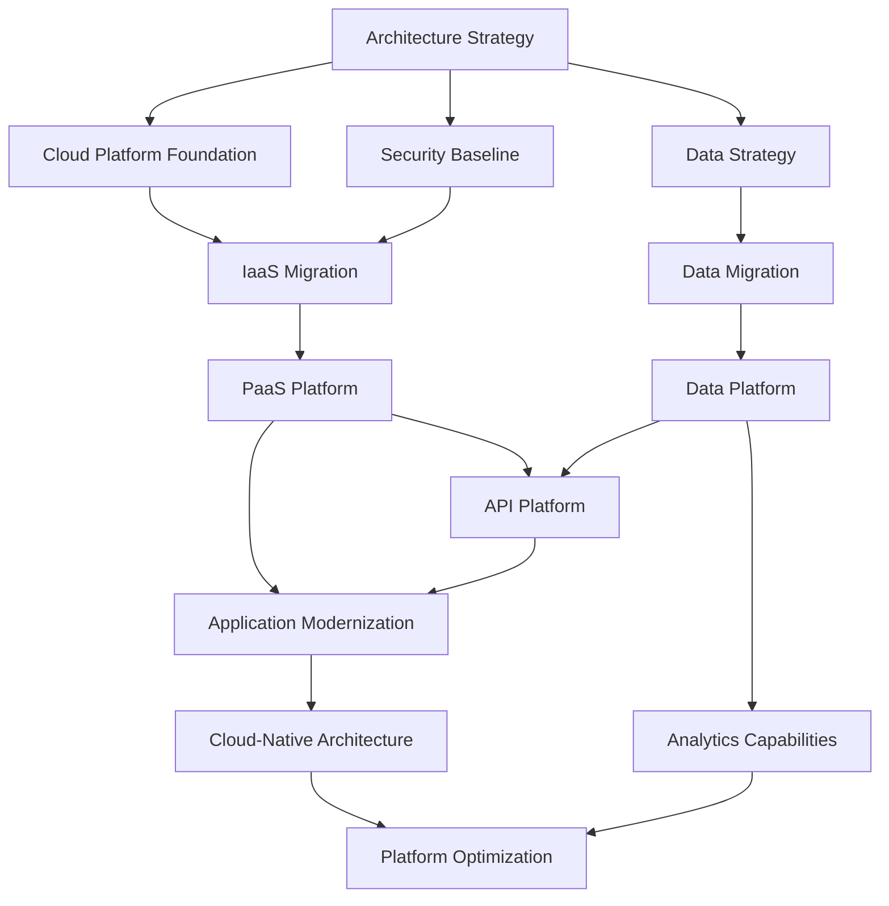

# Architecture Roadmap: [INITIATIVE_NAME]

> **Template Status**: Beta | **Version**: [VERSION] | **Command**: `/arckit.roadmap`

## Document Control

| Field | Value |
|-------|-------|
| **Document ID** | ARC-[PROJECT_ID]-ROADMAP-v1.0 |
| **Document Type** | Strategic Architecture Roadmap |
| **Project** | [PROJECT_NAME] (Project [PROJECT_ID]) |
| **Classification** | [PUBLIC / OFFICIAL / OFFICIAL-SENSITIVE / SECRET] |
| **Status** | [DRAFT / IN_REVIEW / APPROVED / PUBLISHED / SUPERSEDED / ARCHIVED] |
| **Version** | [VERSION] |
| **Created Date** | [YYYY-MM-DD] |
| **Last Modified** | [YYYY-MM-DD] |
| **Review Cycle** | [Monthly / Quarterly / Annual / On-Demand] |
| **Next Review Date** | [YYYY-MM-DD] |
| **Owner** | [OWNER_NAME_AND_ROLE] |
| **Reviewed By** | [REVIEWER_NAME] on [DATE] or [PENDING] |
| **Approved By** | [APPROVER_NAME] on [DATE] or [PENDING] |
| **Distribution** | [DISTRIBUTION_LIST] |
| **Financial Years Covered** | FY [START_YEAR] - FY [END_YEAR] |
| **Approver** | [Chief Architect / CTO] |

## Revision History

| Version | Date | Author | Changes | Approved By | Approval Date |
|---------|------|--------|---------|-------------|---------------|
| [VERSION] | [DATE] | ArcKit AI | Initial creation from `/arckit.[COMMAND]` command | [PENDING] | [PENDING] |

## Executive Summary

### Strategic Vision
[1-2 paragraphs: What is the strategic vision? What problem are we solving? What is the desired future state?]

### Investment Summary
- **Total Investment**: £[AMOUNT] over [N] years
- **Capital Expenditure**: £[CAPEX]
- **Operational Expenditure**: £[OPEX]
- **Expected ROI**: [ROI_PERCENTAGE]% by FY [YEAR]
- **Payback Period**: [N] years

### Expected Outcomes
1. **Business Outcome 1**: [Measurable outcome]
2. **Business Outcome 2**: [Measurable outcome]
3. **Business Outcome 3**: [Measurable outcome]

### Timeline at a Glance
- **Duration**: [START_DATE] to [END_DATE]
- **Major Phases**: [N] phases
- **Key Milestones**: [N] strategic milestones
- **Governance Gates**: [N] decision gates

---

## Strategic Context

### Vision & Strategic Drivers

#### Business Vision
[What business transformation is this roadmap enabling?]

#### Link to Stakeholder Drivers
[Reference to ARC-{PROJECT_ID}-STKE-v*.md document]

| Stakeholder Group | Key Driver | Strategic Goal | Roadmap Alignment |
|-------------------|------------|----------------|-------------------|
| [Group] | [Driver] | [Goal] | [Which roadmap theme/initiative] |

#### Architecture Principles Alignment
[Reference to ARC-000-PRIN-v*.md]

| Principle | Roadmap Compliance | Timeline for Full Compliance |
|-----------|-------------------|------------------------------|
| [Principle Name] | [Current compliance level] | FY [YEAR] Q[N] |

### Current State Assessment

#### Technology Landscape
[Current technology estate, systems, platforms]

**Key Systems**:
- **System 1**: [Description, technology stack, age, technical debt]
- **System 2**: [Description, technology stack, age, technical debt]

#### Capability Maturity Baseline

| Capability Domain | Current Maturity Level | Assessment |
|-------------------|------------------------|------------|
| [Domain 1] | Level 1 (Initial/Ad-hoc) | [Brief assessment] |
| [Domain 2] | Level 2 (Repeatable) | [Brief assessment] |
| [Domain 3] | Level 1 (Initial/Ad-hoc) | [Brief assessment] |

**Maturity Model**:
- **Level 1**: Initial/Ad-hoc
- **Level 2**: Repeatable
- **Level 3**: Defined
- **Level 4**: Managed
- **Level 5**: Optimized

#### Technical Debt Quantification
- **Total Technical Debt**: £[AMOUNT] or [N] person-months
- **High Priority Debt**: [List top 3-5 items]
- **Impact on Delivery**: [How debt slows current delivery]

#### Risk Exposure
[Link to ARC-{PROJECT_ID}-RISK-v*.md]

**Strategic Risks**:
1. **Risk 1**: [Description, impact on roadmap]
2. **Risk 2**: [Description, impact on roadmap]
3. **Risk 3**: [Description, impact on roadmap]

### Future State Vision

#### Target Architecture
[What will the technology landscape look like at the end of the roadmap?]

**Target State Characteristics**:
- Cloud-native architecture
- API-first integration
- Microservices where appropriate
- Automated CI/CD pipelines
- Security by design
- Data-driven decision making

#### Capability Maturity Targets

| Capability Domain | Target Maturity Level | Gap to Close |
|-------------------|----------------------|--------------|
| [Domain 1] | Level 4 (Managed) | +3 levels |
| [Domain 2] | Level 4 (Managed) | +2 levels |
| [Domain 3] | Level 5 (Optimized) | +4 levels |

#### Technology Evolution
[Reference to Wardley Maps if available]

**Evolution Strategy**:
- **Genesis → Custom**: [New capabilities to build]
- **Custom → Product**: [Build vs buy decisions]
- **Product → Commodity**: [Services to commoditize via cloud]

---

## Roadmap Timeline

### Visual Timeline

```mermaid
gantt
    title Architecture Roadmap Timeline FY [START] - FY [END]
    dateFormat YYYY-MM-DD

    section Foundation
    Assessment & Strategy           :done, foundation1, [START_DATE], 90d
    Architecture Baseline          :done, foundation2, after foundation1, 60d
    Security Framework             :active, foundation3, after foundation2, 120d

    section Migration Phase
    Legacy System Analysis         :migration1, after foundation3, 90d
    Data Migration Wave 1          :migration2, after migration1, 180d
    Application Modernization Wave 1 :migration3, after migration2, 240d

    section Transformation Phase
    Cloud-Native Platform          :transform1, after migration3, 180d
    API Platform Launch            :transform2, after transform1, 120d
    DevOps Maturity               :transform3, after transform2, 150d

    section Optimization Phase
    Performance Optimization       :optimize1, after transform3, 120d
    Scale & Resilience            :optimize2, after optimize1, 90d
    Continuous Improvement        :optimize3, after optimize2, 180d

    section Governance Gates
    Alpha Assessment              :milestone, gate1, after foundation3, 0d
    Beta Assessment               :milestone, gate2, after migration3, 0d
    Live Assessment               :milestone, gate3, after transform3, 0d
```

### Roadmap Phases

#### Phase 1: Foundation (FY [YEAR] Q[N] - Q[N])
**Objectives**:
- Establish architecture baseline
- Define target architecture
- Secure funding and resources
- Build foundational capabilities

**Key Deliverables**:
- Architecture principles approved
- Current state assessment complete
- Target architecture defined
- Business case approved (SOBC/FBC)
- Security framework established

**Investment**: £[AMOUNT]

---

#### Phase 2: Migration (FY [YEAR] Q[N] - FY [YEAR] Q[N])
**Objectives**:
- Migrate core systems to target architecture
- Reduce technical debt
- Establish new ways of working
- Decommission legacy systems

**Key Deliverables**:
- [N]% of applications migrated to cloud
- Legacy system 1 decommissioned
- Data migration complete
- API platform established

**Investment**: £[AMOUNT]

---

#### Phase 3: Transformation (FY [YEAR] Q[N] - FY [YEAR] Q[N])
**Objectives**:
- Achieve cloud-native architecture
- Implement DevOps practices at scale
- Enable self-service capabilities
- Improve time to market

**Key Deliverables**:
- Cloud-native platform operational
- CI/CD pipelines for all services
- Container orchestration platform live
- Developer self-service portal

**Investment**: £[AMOUNT]

---

#### Phase 4: Optimization (FY [YEAR] Q[N] - FY [YEAR] Q[N])
**Objectives**:
- Optimize costs and performance
- Achieve target capability maturity
- Establish continuous improvement culture
- Realize full business benefits

**Key Deliverables**:
- Target maturity levels achieved
- Cost optimization realized
- Performance SLAs met
- Business outcomes delivered

**Investment**: £[AMOUNT]

---

## Roadmap Themes & Initiatives

### Theme 1: [THEME_NAME] (e.g., Cloud Migration)

#### Strategic Objective
[What business value does this theme deliver?]

#### Timeline by Financial Year

**FY [YEAR] Q1-Q2**:
- Initiative 1.1: [Description]
- Initiative 1.2: [Description]
- **Milestones**: [Key milestones]
- **Investment**: £[AMOUNT]

**FY [YEAR] Q3-Q4**:
- Initiative 1.3: [Description]
- Initiative 1.4: [Description]
- **Milestones**: [Key milestones]
- **Investment**: £[AMOUNT]

**FY [YEAR+1]**:
- Initiative 1.5: [Description]
- Initiative 1.6: [Description]
- **Milestones**: [Key milestones]
- **Investment**: £[AMOUNT]

#### Success Criteria
- [ ] [Measurable success criterion 1]
- [ ] [Measurable success criterion 2]
- [ ] [Measurable success criterion 3]

---

### Theme 2: [THEME_NAME] (e.g., Data Modernization)

#### Strategic Objective
[What business value does this theme deliver?]

#### Timeline by Financial Year

**FY [YEAR]**:
- Initiative 2.1: [Description]
- Initiative 2.2: [Description]
- **Milestones**: [Key milestones]
- **Investment**: £[AMOUNT]

**FY [YEAR+1]**:
- Initiative 2.3: [Description]
- Initiative 2.4: [Description]
- **Milestones**: [Key milestones]
- **Investment**: £[AMOUNT]

**FY [YEAR+2]**:
- Initiative 2.5: [Description]
- Initiative 2.6: [Description]
- **Milestones**: [Key milestones]
- **Investment**: £[AMOUNT]

#### Success Criteria
- [ ] [Measurable success criterion 1]
- [ ] [Measurable success criterion 2]
- [ ] [Measurable success criterion 3]

---

### Theme 3: [THEME_NAME] (e.g., Security & Compliance)

#### Strategic Objective
[What business value does this theme deliver?]

#### Timeline by Financial Year

**FY [YEAR]**:
- Initiative 3.1: Achieve Cyber Essentials certification
- Initiative 3.2: Implement NCSC CAF baseline controls
- **Milestones**: Cyber Essentials certified
- **Investment**: £[AMOUNT]

**FY [YEAR+1]**:
- Initiative 3.3: ISO 27001 certification
- Initiative 3.4: Security automation and monitoring
- **Milestones**: ISO 27001 certified
- **Investment**: £[AMOUNT]

**FY [YEAR+2]**:
- Initiative 3.5: Continuous compliance automation
- Initiative 3.6: Zero Trust architecture
- **Milestones**: Continuous compliance operational
- **Investment**: £[AMOUNT]

#### Success Criteria
- [ ] All critical systems meet security baseline
- [ ] Security incident reduction by 80%
- [ ] Compliance audit findings reduced to zero

---

## Capability Delivery Matrix

| Capability Domain | Current Maturity | FY [YEAR] | FY [YEAR+1] | FY [YEAR+2] | FY [YEAR+3] | Target Maturity |
|-------------------|------------------|-----------|-------------|-------------|-------------|-----------------|
| Cloud Platform | L1 (Initial) | L2 | L3 | L4 | L4 | L4 (Managed) |
| API Management | None | L1 | L2 | L3 | L4 | L4 (Managed) |
| Data Analytics | L1 (Initial) | L2 | L3 | L4 | L5 | L5 (Optimized) |
| DevOps & CI/CD | L1 (Initial) | L2 | L3 | L4 | L4 | L4 (Managed) |
| Security & Compliance | L2 (Repeatable) | L3 | L3 | L4 | L5 | L5 (Optimized) |
| Monitoring & Observability | L1 (Initial) | L2 | L3 | L4 | L4 | L4 (Managed) |

**Capability Evolution**:
- **L1 → L2**: Documented processes, repeatable execution
- **L2 → L3**: Standardized across organization, proactive management
- **L3 → L4**: Quantitatively managed, metrics-driven
- **L4 → L5**: Continuous optimization, innovation

---

## Dependencies & Sequencing

### Initiative Dependencies



### Critical Path
1. **Architecture Strategy** → 2. **Security Baseline** → 3. **Cloud Platform** → 4. **Application Modernization** → 5. **Optimization**

### External Dependencies
| Dependency | Provider | Required By | Risk Level |
|------------|----------|-------------|------------|
| [Dependency 1] | [External party] | FY [YEAR] Q[N] | High/Medium/Low |
| [Dependency 2] | [External party] | FY [YEAR] Q[N] | High/Medium/Low |

---

## Investment & Resource Planning

### Investment Summary by Financial Year

| Financial Year | Capital (£) | Operational (£) | Total (£) | % of Total Budget |
|----------------|-------------|-----------------|-----------|-------------------|
| FY [YEAR] | £[CAPEX] | £[OPEX] | £[TOTAL] | [%] |
| FY [YEAR+1] | £[CAPEX] | £[OPEX] | £[TOTAL] | [%] |
| FY [YEAR+2] | £[CAPEX] | £[OPEX] | £[TOTAL] | [%] |
| FY [YEAR+3] | £[CAPEX] | £[OPEX] | £[TOTAL] | [%] |
| **Total** | **£[CAPEX]** | **£[OPEX]** | **£[TOTAL]** | **100%** |

### Resource Requirements

| Financial Year | FTE Required | Key Roles | Recruitment Timeline | Training Budget |
|----------------|--------------|-----------|---------------------|-----------------|
| FY [YEAR] | [N] | Cloud architects, Security specialists | Q1-Q2 | £[AMOUNT] |
| FY [YEAR+1] | [N] | Developers, Data engineers, DevOps | Q3-Q4 | £[AMOUNT] |
| FY [YEAR+2] | [N] | SRE, Platform engineers, Data scientists | Q1-Q2 | £[AMOUNT] |
| FY [YEAR+3] | [N] | Optimization specialists, Automation engineers | Q3 | £[AMOUNT] |

### Investment by Theme

| Theme | FY [YEAR] | FY [YEAR+1] | FY [YEAR+2] | FY [YEAR+3] | Total |
|-------|-----------|-------------|-------------|-------------|-------|
| Theme 1 | £[AMOUNT] | £[AMOUNT] | £[AMOUNT] | £[AMOUNT] | £[TOTAL] |
| Theme 2 | £[AMOUNT] | £[AMOUNT] | £[AMOUNT] | £[AMOUNT] | £[TOTAL] |
| Theme 3 | £[AMOUNT] | £[AMOUNT] | £[AMOUNT] | £[AMOUNT] | £[TOTAL] |

### Cost Savings & Benefits Realization

| Benefit Type | FY [YEAR] | FY [YEAR+1] | FY [YEAR+2] | FY [YEAR+3] | Cumulative |
|--------------|-----------|-------------|-------------|-------------|------------|
| Operational Savings | £[AMOUNT] | £[AMOUNT] | £[AMOUNT] | £[AMOUNT] | £[TOTAL] |
| Efficiency Gains | [%] | [%] | [%] | [%] | [%] |
| Revenue Enablement | £[AMOUNT] | £[AMOUNT] | £[AMOUNT] | £[AMOUNT] | £[TOTAL] |

---

## Risks, Assumptions & Constraints

### Key Risks

| Risk ID | Risk Description | Impact | Probability | Mitigation Strategy | Timeline | Owner |
|---------|------------------|--------|-------------|---------------------|----------|-------|
| R-001 | [Risk description] | High/Med/Low | High/Med/Low | [Mitigation] | FY [YEAR] Q[N] | [Owner] |
| R-002 | Vendor lock-in to cloud provider | High | Medium | Multi-cloud strategy, abstraction layers | FY [YEAR] Q2 | [Cloud Architect] |
| R-003 | Skills shortage in cloud-native development | High | High | Training program, partner with suppliers | FY [YEAR] Q1 | [HR/Recruitment] |

[Link to full risk register: ARC-{PROJECT_ID}-RISK-v*.md]

### Critical Assumptions

| Assumption ID | Assumption | Validation Approach | Contingency Plan |
|---------------|------------|---------------------|------------------|
| A-001 | Spending Review approval for full funding | Finance review by [DATE] | Phased approach if funding reduced |
| A-002 | Recruitment of specialist skills feasible | Market assessment Q[N] | Increase supplier usage |
| A-003 | Legacy system support continues until migration complete | Vendor contracts extend to [DATE] | Accelerate migration if needed |
| A-004 | Executive sponsorship maintained throughout program | Quarterly board reviews | Escalation process defined |

### Constraints

| Constraint Type | Description | Impact on Roadmap |
|-----------------|-------------|-------------------|
| **Budget** | Total budget capped at £[AMOUNT] | Prioritization required |
| **Timeline** | Must achieve [milestone] by [DATE] | Parallel workstreams needed |
| **Regulatory** | Must maintain GDPR compliance throughout migration | Data migration approach constrained |
| **Technical** | Legacy system integration required until FY [YEAR] | Cannot fully decommission until then |

---

## Governance & Decision Gates

### Governance Structure

#### Architecture Review Board (ARB)
- **Frequency**: Monthly
- **Purpose**: Review progress, resolve blockers, approve architecture decisions
- **Participants**: Chief Architect, Enterprise Architects, Technical Leads
- **Deliverables**: Architecture Decision Records (ADRs), progress reports

#### Programme Board
- **Frequency**: Monthly
- **Purpose**: Programme-level oversight, budget management, risk management
- **Participants**: SRO, Programme Manager, Finance, ARB representative
- **Deliverables**: Progress reports, budget variance reports, risk updates

#### Steering Committee
- **Frequency**: Quarterly
- **Purpose**: Strategic direction, investment decisions, escalation resolution
- **Participants**: Executive sponsors, SRO, Chief Architect, Finance Director
- **Deliverables**: Strategic decisions, funding approvals, roadmap adjustments

### Review Cycles

| Review Type | Frequency | Purpose | Outcomes |
|-------------|-----------|---------|----------|
| **Weekly Progress** | Weekly | Team-level progress tracking | Sprint updates, blocker resolution |
| **ARB Review** | Monthly | Architecture governance | ADRs approved, technical decisions |
| **Programme Review** | Monthly | Budget and schedule tracking | Budget reconciliation, schedule updates |
| **Quarterly Business Review** | Quarterly | Strategic alignment check | Roadmap refresh, strategic adjustments |
| **Annual Strategic Review** | Annually | Multi-year strategy alignment | Spending Review inputs, 5-year refresh |

### Service Standard Assessment Gates (UK Government)

#### Alpha Assessment - FY [YEAR] Q[N]
**Focus**: Validate approach, prove concept feasibility
- [ ] User research completed
- [ ] Technology spike validated
- [ ] Architecture approach approved
- [ ] Security approach defined
- [ ] 14 Service Standard points addressed

#### Beta Assessment - FY [YEAR] Q[N]
**Focus**: Prove service works at scale, ready for public use
- [ ] Service in private/public beta
- [ ] User feedback incorporated
- [ ] Non-functional requirements met
- [ ] Security testing complete
- [ ] 14 Service Standard points demonstrated

#### Live Assessment - FY [YEAR] Q[N]
**Focus**: Service fully operational and continuously improving
- [ ] Service live and stable
- [ ] SLAs being met
- [ ] Continuous improvement process established
- [ ] Full compliance demonstrated
- [ ] 14 Service Standard points evidenced

### Decision Gates

| Gate | Date | Decision Required | Go/No-Go Criteria |
|------|------|-------------------|-------------------|
| Gate 1: Proceed to Migration | FY [YEAR] Q[N] | Approve migration phase | Foundation complete, budget confirmed |
| Gate 2: Proceed to Transformation | FY [YEAR] Q[N] | Approve transformation phase | [N]% migration complete, benefits realized |
| Gate 3: Proceed to Optimization | FY [YEAR] Q[N] | Approve optimization phase | Target architecture operational |

---

## Success Metrics & KPIs

### Strategic KPIs

| KPI | Baseline | FY [YEAR] Target | FY [YEAR+1] Target | FY [YEAR+2] Target | FY [YEAR+3] Target | Measurement Frequency |
|-----|----------|------------------|--------------------|--------------------|--------------------|-----------------------|
| Cloud adoption % | 15% | 40% | 65% | 85% | 95% | Quarterly |
| Technical debt reduction | 0% | 20% | 45% | 70% | 85% | Quarterly |
| Security incidents (per year) | 12 | 8 | 5 | 3 | <2 | Monthly |
| Mean Time to Recovery (MTTR) | 4 hours | 2 hours | 1 hour | 30 min | 15 min | Monthly |
| Deployment frequency | Weekly | Daily | Multiple/day | On-demand | On-demand | Monthly |
| Time to market (new features) | 6 months | 3 months | 6 weeks | 2 weeks | 1 week | Quarterly |

### Capability Maturity Metrics

| Capability | Baseline | FY [YEAR] | FY [YEAR+1] | FY [YEAR+2] | FY [YEAR+3] | Target |
|------------|----------|-----------|-------------|-------------|-------------|--------|
| DevOps Maturity | L1 | L2 | L3 | L4 | L4 | L4 |
| Cloud Maturity | L1 | L2 | L3 | L4 | L4 | L4 |
| Data Maturity | L1 | L1 | L2 | L3 | L4 | L4 |
| Security Maturity | L2 | L3 | L3 | L4 | L5 | L5 |

### Technical Metrics

| Metric | Current | FY [YEAR] | FY [YEAR+1] | FY [YEAR+2] | FY [YEAR+3] | Industry Best Practice |
|--------|---------|-----------|-------------|-------------|-------------|------------------------|
| API availability SLA | 95% | 98% | 99% | 99.5% | 99.9% | 99.95% |
| Page load time (p95) | 5s | 3s | 2s | 1s | <1s | <1s |
| Infrastructure as Code % | 20% | 50% | 80% | 95% | 100% | 100% |
| Automated testing coverage | 30% | 50% | 70% | 85% | 90% | 80%+ |

### Business Outcome Metrics

| Business Outcome | Baseline | FY [YEAR] | FY [YEAR+1] | FY [YEAR+2] | FY [YEAR+3] |
|------------------|----------|-----------|-------------|-------------|-------------|
| User satisfaction score | 3.2/5 | 3.5/5 | 4.0/5 | 4.3/5 | 4.5/5 |
| Operational cost reduction | 0% | 10% | 25% | 40% | 50% |
| Revenue enablement | £0 | £[AMOUNT] | £[AMOUNT] | £[AMOUNT] | £[AMOUNT] |
| Staff productivity gain | 0% | 15% | 30% | 50% | 75% |

---

## Traceability

### Links to Architecture Artifacts

#### Stakeholder Drivers → Roadmap Themes
[Reference: ARC-{PROJECT_ID}-STKE-v*.md]

| Stakeholder Driver | Strategic Goal | Roadmap Theme | Timeline |
|--------------------|----------------|---------------|----------|
| [Driver ID] | [Goal] | Theme [N] | FY [YEAR] |

#### Architecture Principles → Compliance Timeline
[Reference: ARC-000-PRIN-v*.md]

| Principle | Current Compliance | Roadmap Activities | Target Compliance Date |
|-----------|-------------------|-------------------|------------------------|
| [Principle Name] | [%] | [Activities] | FY [YEAR] Q[N] |

#### Requirements → Capability Delivery
[Reference: ARC-{PROJECT_ID}-REQ-v*.md]

| Requirement ID | Capability Delivered | Roadmap Phase | Delivery Date |
|----------------|---------------------|---------------|---------------|
| BR-001 | [Capability] | Phase [N] | FY [YEAR] Q[N] |

#### Wardley Maps → Technology Evolution
[Reference: wardley-maps/]

| Component | Current Evolution | Target Evolution | Roadmap Timeline |
|-----------|------------------|------------------|------------------|
| [Component] | Custom (0.35) | Product (0.65) | FY [YEAR] - FY [YEAR+1] |

#### Risk Register → Mitigation Timeline
[Reference: ARC-{PROJECT_ID}-RISK-v*.md]

| Risk ID | Mitigation Activity | Roadmap Phase | Mitigation Date |
|---------|-------------------|---------------|-----------------|
| R-001 | [Mitigation] | Phase [N] | FY [YEAR] Q[N] |

---

## Appendices

### Appendix A: Capability Maturity Model

#### Level 1: Initial / Ad-hoc
- **Characteristics**: Unpredictable, poorly controlled, reactive
- **Process**: Informal, undocumented
- **Success**: Depends on individual heroics
- **Repeatability**: Low

#### Level 2: Repeatable
- **Characteristics**: Repeatable processes, some discipline
- **Process**: Documented at project level
- **Success**: Can repeat previous successes
- **Repeatability**: Medium

#### Level 3: Defined
- **Characteristics**: Standardized, documented, integrated
- **Process**: Organization-wide standards
- **Success**: Consistent across projects
- **Repeatability**: High

#### Level 4: Managed
- **Characteristics**: Quantitatively managed, measured
- **Process**: Metrics-driven, statistically controlled
- **Success**: Predictable, meets targets
- **Repeatability**: Very High

#### Level 5: Optimized
- **Characteristics**: Continuous improvement, innovative
- **Process**: Focus on continuous optimization
- **Success**: Industry-leading
- **Repeatability**: Excellent

---

### Appendix B: Technology Radar

#### Adopt (Use now, proven technology)
- [Technology 1]
- [Technology 2]

#### Trial (Try in low-risk projects)
- [Technology 3]
- [Technology 4]

#### Assess (Explore, not ready for production)
- [Technology 5]
- [Technology 6]

#### Hold (Do not use for new projects)
- [Technology 7]
- [Technology 8]

---

### Appendix C: Vendor Roadmap Alignment

| Vendor | Product | Our Dependency | Vendor Roadmap Alignment | Risk Assessment |
|--------|---------|----------------|--------------------------|-----------------|
| [Vendor 1] | [Product] | [What we need] | [Alignment notes] | Low/Med/High |
| [Vendor 2] | [Product] | [What we need] | [Alignment notes] | Low/Med/High |

---

### Appendix D: Compliance & Standards Roadmap

| Standard/Compliance | Current Status | FY [YEAR] | FY [YEAR+1] | FY [YEAR+2] | FY [YEAR+3] |
|---------------------|----------------|-----------|-------------|-------------|-------------|
| Cyber Essentials | Not achieved | Certified | Maintained | Plus certified | Maintained |
| ISO 27001 | Gap identified | Planning | Certification | Maintained | Maintained |
| NCSC CAF | Baseline only | Full baseline | Enhanced | Advanced | Advanced |
| UK GDPR | Compliant | Compliant | Enhanced | Optimized | Optimized |
| PCI-DSS | Not applicable | N/A | Planning | Certified | Maintained |

## External References

| Document | Type | Source | Key Extractions | Path |
|----------|------|--------|-----------------|------|
| *None provided* | — | — | — | — |

---

**Generated by**: ArcKit `/arckit.roadmap` command
**Generated on**: [DATE]
**ArcKit Version**: [VERSION]
**Project**: [PROJECT_NAME]
**Model**: [AI_MODEL]