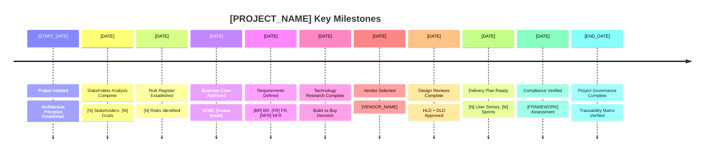
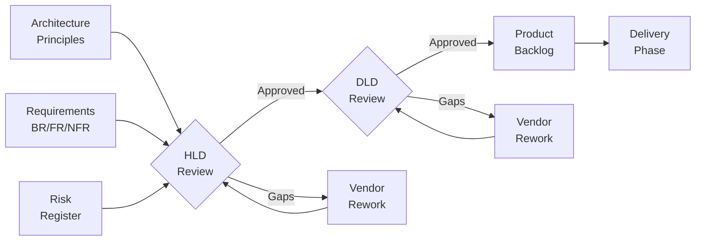
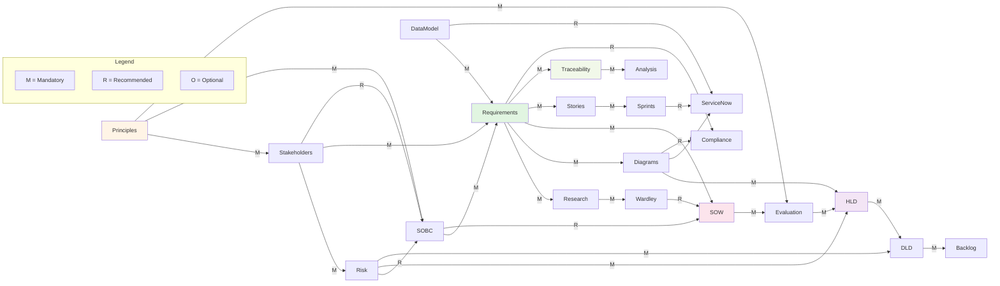

# [PROJECT_NAME] - Project Story

> **Template Status**: Live | **Version**: [VERSION] | **Command**: `/arckit.story`

## Document Control

| Field | Value |
|-------|-------|
| **Document ID** | ARC-[PROJECT_ID]-STORY-v[VERSION] |
| **Document Type** | Project Story |
| **Project** | [PROJECT_NAME] (Project [PROJECT_ID]) |
| **Classification** | [PUBLIC / OFFICIAL / OFFICIAL-SENSITIVE / SECRET] |
| **Status** | [DRAFT / IN_REVIEW / APPROVED / PUBLISHED / SUPERSEDED / ARCHIVED] |
| **Version** | [VERSION] |
| **Created Date** | [YYYY-MM-DD] |
| **Last Modified** | [YYYY-MM-DD] |
| **Review Cycle** | [Monthly / Quarterly / Annual / On-Demand] |
| **Next Review Date** | [YYYY-MM-DD] |
| **Owner** | [OWNER_NAME_AND_ROLE] |
| **Reviewed By** | [REVIEWER_NAME] on [DATE] or [PENDING] |
| **Approved By** | [APPROVER_NAME] on [DATE] or [PENDING] |
| **Distribution** | [DISTRIBUTION_LIST] |
| **Author** | Enterprise Architect |
| **Approver** | [Approver Name] |

## Revision History

| Version | Date | Author | Changes | Approved By | Approval Date |
|---------|------|--------|---------|-------------|---------------|
| [VERSION] | [DATE] | ArcKit AI | Initial creation from `/arckit.[COMMAND]` command | [PENDING] | [PENDING] |

## Executive Summary

**Project**: [PROJECT_NAME]

**Timeline Snapshot**:
- **Project Start**: [START_DATE]
- **Project End**: [END_DATE] (or "Ongoing")
- **Total Duration**: [TOTAL_DAYS] days ([TOTAL_WEEKS] weeks)
- **Artifacts Created**: [ARTIFACT_COUNT]
- **Commands Executed**: [COMMAND_COUNT]
- **Phases Completed**: [PHASE_COUNT]

**Key Outcomes**:
- [Outcome 1]
- [Outcome 2]
- [Outcome 3]

**Governance Achievements**:
- ✅ Architecture Principles Established
- ✅ Stakeholder Analysis Completed
- ✅ Risk Register Maintained
- ✅ Business Case Approved
- ✅ Requirements Defined ([BR_COUNT] BR, [FR_COUNT] FR, [NFR_COUNT] NFR)
- ✅ Design Reviewed
- ✅ Traceability Matrix Complete

**Strategic Context**:

[Brief overview of the project's strategic importance, business drivers, and how it evolved through the ArcKit governance framework]

---

## 📅 Complete Project Timeline

### Visual Timeline - Gantt Chart

```mermaid
gantt
    title [PROJECT_NAME] Project Timeline
    dateFormat YYYY-MM-DD

    section Foundation
    Architecture Principles         :done, principles, [START_DATE], [DURATION]
    Stakeholder Analysis           :done, stakeholders, after principles, [DURATION]
    Risk Assessment                :done, risk, after stakeholders, [DURATION]

    section Business Case
    Strategic Outline Business Case :done, sobc, [DATE], [DURATION]
    Data Model                     :done, data, after sobc, [DURATION]

    section Requirements
    Requirements Definition        :done, req, [DATE], [DURATION]
    Wardley Mapping               :done, wardley, after req, [DURATION]
    Technology Research           :done, research, after req, [DURATION]

    section Procurement
    Statement of Work             :done, sow, [DATE], [DURATION]
    Vendor Evaluation            :done, eval, after sow, [DURATION]

    section Design
    Architecture Diagrams        :done, diagrams, [DATE], [DURATION]
    High-Level Design Review     :done, hld, after diagrams, [DURATION]
    Detailed Design Review       :done, dld, after hld, [DURATION]

    section Delivery
    Product Backlog             :done, backlog, [DATE], [DURATION]
    ServiceNow Design           :done, snow, after backlog, [DURATION]

    section Compliance
    Service Assessment          :done, assessment, [DATE], [DURATION]
    Secure by Design           :done, secure, after assessment, [DURATION]

    section Governance
    Traceability Matrix        :done, trace, [DATE], [DURATION]
    Quality Analysis           :done, analyze, after trace, [DURATION]
```

### Linear Command Flow Timeline

```mermaid
flowchart TD
    Start([Project Initiated<br/>[START_DATE]]) --> Principles

    Principles["arckit.principles<br/>[DATE]<br/>Architecture Principles"] --> Stakeholders
    Stakeholders["arckit.stakeholders<br/>[DATE]<br/>Stakeholder Analysis"] --> Risk
    Risk["arckit.risk<br/>[DATE]<br/>Risk Register"] --> SOBC

    SOBC["arckit.sobc<br/>[DATE]<br/>Business Case"] --> Requirements
    Requirements["arckit.requirements<br/>[DATE]<br/>Requirements"] --> DataModel
    DataModel["arckit.data-model<br/>[DATE]<br/>Data Model"] --> Research

    Research["arckit.research<br/>[DATE]<br/>Technology Research"] --> Wardley
    Wardley["arckit.wardley<br/>[DATE]<br/>Wardley Maps"] --> Diagrams
    Diagrams["arckit.diagram<br/>[DATE]<br/>Architecture Diagrams"] --> SOW

    SOW["arckit.sow<br/>[DATE]<br/>Statement of Work"] --> Evaluate
    Evaluate["arckit.evaluate<br/>[DATE]<br/>Vendor Evaluation"] --> HLD

    HLD["arckit.hld-review<br/>[DATE]<br/>HLD Review"] --> DLD
    DLD["arckit.dld-review<br/>[DATE]<br/>DLD Review"] --> Backlog

    Backlog["arckit.backlog<br/>[DATE]<br/>Product Backlog"] --> ServiceNow
    ServiceNow["arckit.servicenow<br/>[DATE]<br/>ServiceNow Design"] --> Compliance

    Compliance{Compliance<br/>Requirements?}
    Compliance -->|UK Gov| TCoP["arckit.tcop<br/>[DATE]<br/>TCoP Review"]
    Compliance -->|All Projects| Secure["arckit.secure<br/>[DATE]<br/>Secure by Design"]
    Compliance -->|MOD| ModSecure["arckit.mod-secure<br/>[DATE]<br/>MOD Security"]
    Compliance -->|AI System| AIPlaybook["arckit.ai-playbook<br/>[DATE]<br/>AI Playbook"]

    TCoP --> Trace
    Secure --> Trace
    ModSecure --> Trace
    AIPlaybook --> Trace

    Trace["arckit.traceability<br/>[DATE]<br/>Traceability Matrix"] --> Analyze
    Analyze["arckit.analyze<br/>[DATE]<br/>Quality Analysis"] --> End

    End([Project Complete<br/>[END_DATE]])

    style Start fill:#e1f5e1
    style End fill:#e1f5e1
    style Principles fill:#fff4e6
    style Requirements fill:#e3f2fd
    style SOW fill:#f3e5f5
    style HLD fill:#fce4ec
    style Backlog fill:#e8f5e9
    style Compliance fill:#fff3e0
    style Trace fill:#f1f8e9
```

### Timeline Table - Detailed Event Log

| # | Date | Days from Start | Event Type | Command | Artifact | Description |
|---|------|-----------------|------------|---------|----------|-------------|
| 1 | [DATE] | 0 | Foundation | `/arckit.principles` | ARC-000-PRIN-v*.md | Established enterprise architecture principles |
| 2 | [DATE] | [DAYS] | Foundation | `/arckit.stakeholders` | ARC-{PROJECT_ID}-STKE-v*.md | Analyzed [N] stakeholders, [M] goals, [P] outcomes |
| 3 | [DATE] | [DAYS] | Risk | `/arckit.risk` | ARC-{PROJECT_ID}-RISK-v*.md | Identified [N] risks ([X] high, [Y] medium, [Z] low) |
| 4 | [DATE] | [DAYS] | Business Case | `/arckit.sobc` | ARC-{PROJECT_ID}-SOBC-v*.md | Strategic Outline Business Case (5-case model) |
| 5 | [DATE] | [DAYS] | Requirements | `/arckit.requirements` | ARC-{PROJECT_ID}-REQ-v*.md | [BR] business, [FR] functional, [NFR] non-functional reqs |
| 6 | [DATE] | [DAYS] | Data | `/arckit.data-model` | ARC-{PROJECT_ID}-DATA-v*.md | [N] entities, [M] relationships, GDPR compliance |
| 7 | [DATE] | [DAYS] | Research | `/arckit.research` | ARC-{PROJECT_ID}-RSCH-v*.md | Evaluated [N] options (build vs buy analysis) |
| 8 | [DATE] | [DAYS] | Strategy | `/arckit.wardley` | wardley-maps/ARC-*-WARD-*.md | Strategic positioning and evolution |
| 9 | [DATE] | [DAYS] | Architecture | `/arckit.diagram` | diagrams/ARC-*-DIAG-*.md | C4 context/container/component diagrams |
| 10 | [DATE] | [DAYS] | Procurement | `/arckit.sow` | ARC-*-SOW-*.md | Statement of Work for vendor RFP |
| 11 | [DATE] | [DAYS] | Evaluation | `/arckit.evaluate` | ARC-*-EVAL-*.md | Vendor evaluation framework |
| 12 | [DATE] | [DAYS] | Design Review | `/arckit.hld-review` | vendors/[VENDOR]/reviews/ARC-*-HLD-*.md | High-level design assessment |
| 13 | [DATE] | [DAYS] | Design Review | `/arckit.dld-review` | vendors/[VENDOR]/reviews/ARC-*-DLD-*.md | Detailed design assessment |
| 14 | [DATE] | [DAYS] | Delivery | `/arckit.backlog` | ARC-*-BKLG-*.md | [N] user stories across [M] sprints |
| 15 | [DATE] | [DAYS] | Operations | `/arckit.servicenow` | ARC-*-SNOW-*.md | CMDB, SLAs, incident management |
| 16 | [DATE] | [DAYS] | Compliance | `/arckit.tcop` | ARC-*-TCOP-*.md | Technology Code of Practice (13 points) |
| 17 | [DATE] | [DAYS] | Compliance | `/arckit.service-assessment` | ARC-*-SVCASS-*.md | GDS Service Standard (14 points) |
| 18 | [DATE] | [DAYS] | Security | `/arckit.secure` | ARC-*-SECD-*.md | NCSC CAF, Cyber Essentials, UK GDPR |
| 19 | [DATE] | [DAYS] | AI Compliance | `/arckit.ai-playbook` | ARC-*-AIPB-*.md | Responsible AI deployment |
| 20 | [DATE] | [DAYS] | Transparency | `/arckit.atrs` | ARC-*-ATRS-*.md | Algorithmic Transparency Recording |
| 21 | [DATE] | [DAYS] | Traceability | `/arckit.traceability` | ARC-*-TRAC-*.md | End-to-end requirement traceability |
| 22 | [DATE] | [DAYS] | Governance | `/arckit.analyze` | ARC-*-ANAL-*.md | Governance quality assessment |

### Phase Duration Analysis


### Timeline Metrics

| Metric | Value | Analysis |
|--------|-------|----------|
| **Project Duration** | [TOTAL_DAYS] days ([TOTAL_WEEKS] weeks) | [Analysis of timeline] |
| **Average Phase Duration** | [AVG_DAYS] days | [Comparison to typical projects] |
| **Longest Phase** | [PHASE_NAME] ([DAYS] days) | [Why this phase took longest] |
| **Shortest Phase** | [PHASE_NAME] ([DAYS] days) | [Why this phase was fastest] |
| **Commands per Week** | [VELOCITY] | [Velocity analysis] |
| **Artifacts per Week** | [VELOCITY] | [Output rate analysis] |
| **Time to First Artifact** | [DAYS] days | From project start to ARC-000-PRIN-v*.md |
| **Time to Requirements** | [DAYS] days | Critical milestone for project direction |
| **Time to Vendor Selection** | [DAYS] days | Critical milestone for procurement |
| **Time to Design Review** | [DAYS] days | Critical milestone for implementation readiness |
| **Compliance Time** | [DAYS] days ([PERCENTAGE]% of total) | Time spent on compliance artifacts |

### Milestones Achieved



---


## Design & Delivery Review

### Chapter 6: Design Review - Validating the Solution

**Timeline**: [DATE] to [DATE] ([DAYS] days)

**What Happened**:

Following vendor selection, the chosen vendor ([VENDOR_NAME]) provided High-Level and Detailed Designs which underwent rigorous ArcKit governance reviews.

**Key Activities**:

1. **High-Level Design Review** (`/arckit.hld-review` - [DATE])
   - Reviewed HLD document from [VENDOR_NAME]
   - Assessment against:
     - [N] architecture principles (compliance: [PERCENTAGE]%)
     - [M] requirements (coverage: [PERCENTAGE]%)
     - [P] NFRs (satisfaction: [PERCENTAGE]%)
     - [Q] risks (mitigation: [PERCENTAGE]%)
   - **Findings**:
     - ✅ Strengths: [List strengths]
     - ⚠️ Concerns: [List concerns]
     - ❌ Gaps: [List gaps]
   - **Verdict**: [APPROVED/APPROVED WITH CONDITIONS/REJECTED]
   - **Conditions**: [List any conditional approval requirements]
   - Created `projects/{project_id}/vendors/[vendor]/reviews/ARC-*-HLD-*.md`

2. **Detailed Design Review** (`/arckit.dld-review` - [DATE])
   - Reviewed DLD document from [VENDOR_NAME]
   - Assessment against:
     - API specifications (completeness, RESTful compliance)
     - Database schemas (normalization, indexing, GDPR)
     - Security controls (authentication, authorization, encryption)
     - Performance optimizations (caching, CDN, load balancing)
     - Operational considerations (monitoring, logging, alerting)
   - **Findings**:
     - ✅ Implementation-ready components: [List]
     - ⚠️ Needs clarification: [List]
     - ❌ Requires rework: [List]
   - **Verdict**: [APPROVED/APPROVED WITH CONDITIONS/REJECTED]
   - Created `projects/{project_id}/vendors/[vendor]/reviews/ARC-*-DLD-*.md`

**Design Review Traceability**:



**Timeline Context**:

Design reviews took [DAYS] days ([PERCENTAGE]% of project timeline). [Analysis: "Multiple review iterations were required to address security concerns" or "Streamlined review process due to vendor's strong initial submission."]

**Decision Points**:
- HLD Review: [APPROVED/CONDITIONAL/REJECTED] on [DATE]
- DLD Review: [APPROVED/CONDITIONAL/REJECTED] on [DATE]

**Traceability Chain**:

```
Architecture Principles → HLD Assessment Criteria → HLD Review Findings
Requirements → HLD Coverage Analysis → HLD Review Findings
Risk Register → DLD Risk Mitigation Verification → DLD Review Findings
Data Requirements → Database Schema Review → DLD Review Findings
```

**Artifacts Created**:
- `projects/{project_id}/vendors/[vendor]/reviews/ARC-*-HLD-*.md`
- `projects/{project_id}/vendors/[vendor]/reviews/ARC-*-DLD-*.md`

---

### Chapter 7: Delivery Planning - From Requirements to Sprints

**Timeline**: [DATE] to [DATE] ([DAYS] days)

**What Happened**:

With approved designs, the project moved into detailed delivery planning, translating requirements into user stories and establishing operational frameworks.

**Key Activities**:

1. **Product Backlog** (`/arckit.backlog` - [DATE])
   - Converted [TOTAL_REQS] requirements into [TOTAL_STORIES] GDS-style user stories
   - Story format: "As a [user type], I need to [action], so that [benefit]"
   - Prioritization using MoSCoW (Must/Should/Could/Won't)
   - Sprint planning:
     - Total sprints: [N] sprints ([SPRINT_LENGTH]-week sprints)
     - Sprint 1-[N]: [M] stories each
     - Estimated duration: [WEEKS] weeks ([MONTHS] months)
   - Velocity assumptions: [STORY_POINTS] points per sprint
   - Created `projects/{project_id}/ARC-*-BKLG-*.md`

2. **ServiceNow Design** (`/arckit.servicenow` - [DATE])
   - **CMDB Design**: [N] Configuration Items mapped to architecture components
   - **SLA Design**: [M] SLAs defined
     - Priority 1 (Critical): [RESPONSE_TIME] response, [RESOLUTION_TIME] resolution
     - Priority 2 (High): [RESPONSE_TIME] response, [RESOLUTION_TIME] resolution
     - Priority 3 (Medium): [RESPONSE_TIME] response, [RESOLUTION_TIME] resolution
     - Priority 4 (Low): [RESPONSE_TIME] response, [RESOLUTION_TIME] resolution
   - **Incident Management**: Workflows, escalation paths, assignment groups
   - **Change Management**: CAB process, change windows, approval workflows
   - **Service Catalog**: [P] catalog items for self-service
   - Created `projects/{project_id}/ARC-*-SNOW-*.md`

**Backlog Summary**:


**Timeline Context**:

Delivery planning took [DAYS] days ([PERCENTAGE]% of project). This phase established a [WEEKS]-week delivery roadmap with [N] sprints. [Analysis: "Efficient backlog creation was enabled by well-defined requirements" or "Extended planning was necessary for complex operational integration."]

**Traceability Chain**:

```
Requirements (BR/FR) → User Stories → Sprint Backlog
Architecture Components → CMDB Configuration Items
NFR-A-xxx (Availability) → SLA Targets
Requirements → ServiceNow Catalog Items
Stakeholders → ServiceNow Assignment Groups
```

**Artifacts Created**:
- `projects/{project_id}/ARC-*-BKLG-*.md`
- `projects/{project_id}/ARC-*-SNOW-*.md`

---
## Timeline Insights & Analysis

### Pacing Analysis

**Overall Pacing**: [ASSESSMENT: "Steady and measured" / "Accelerated" / "Extended with iterations"]

The project timeline shows [PATTERN: "consistent progress across all phases" / "front-loaded research and planning" / "iterative design refinement"]. Key observations:

- **Foundation Phase**: [DAYS] days - [ASSESSMENT: "Typical for establishing governance" / "Accelerated due to existing principles" / "Extended for stakeholder alignment"]
- **Requirements Phase**: [DAYS] days - [ASSESSMENT: "Comprehensive requirements gathering" / "Rapid definition" / "Iterative refinement"]
- **Procurement Phase**: [DAYS] days - [ASSESSMENT: "Efficient vendor selection" / "Thorough evaluation" / "Competitive tender process"]
- **Design Review Phase**: [DAYS] days - [ASSESSMENT: "Single-pass approval" / "Multiple iterations" / "Conditional approval with rework"]
- **Compliance Phase**: [DAYS] days - [ASSESSMENT: "Comprehensive validation" / "Streamlined checks" / "Deep security scrutiny"]

### Critical Path

The critical path through this project was:

```
[START] → Architecture Principles → Stakeholders → Risk → SOBC → Requirements → Research →
Wardley Maps → SOW → Vendor Selection → HLD Review → DLD Review → Backlog →
Traceability → [END]
```

**Longest Dependencies**:
1. [ACTIVITY_1] → [ACTIVITY_2]: [DAYS] days (rationale: [WHY])
2. [ACTIVITY_2] → [ACTIVITY_3]: [DAYS] days (rationale: [WHY])
3. [ACTIVITY_3] → [ACTIVITY_4]: [DAYS] days (rationale: [WHY])

**Parallel Workstreams**:

Some activities could have been parallelized:
- [ACTIVITY_A] and [ACTIVITY_B] (no dependencies)
- [ACTIVITY_C] and [ACTIVITY_D] (no dependencies)

### Timeline Deviations

**Expected vs Actual**:

| Phase | Expected Duration | Actual Duration | Variance | Reason |
|-------|------------------|-----------------|----------|---------|
| [PHASE_1] | [DAYS] days | [DAYS] days | [+/-DAYS] days | [REASON] |
| [PHASE_2] | [DAYS] days | [DAYS] days | [+/-DAYS] days | [REASON] |
| [PHASE_3] | [DAYS] days | [DAYS] days | [+/-DAYS] days | [REASON] |

**Key Factors Affecting Timeline**:
1. [FACTOR_1: e.g., "Extended stakeholder engagement due to organizational complexity"]
2. [FACTOR_2: e.g., "Accelerated requirements definition due to clear business drivers"]
3. [FACTOR_3: e.g., "Multiple design review iterations due to security concerns"]

### Velocity Metrics

**Command Execution Velocity**:
- Average: [COMMANDS_PER_WEEK] commands per week
- Peak: [MAX_COMMANDS] commands in week [N] ([DATE] to [DATE])
- Slowest: [MIN_COMMANDS] commands in week [M] ([DATE] to [DATE])

**Velocity Analysis**:

[Analysis: e.g., "The project maintained steady velocity throughout, with a peak during the requirements and research phase (weeks 3-5) when multiple artifacts were generated in parallel. The slowest week was during vendor evaluation, which required extended stakeholder consultation."]

### Lessons Learned (Timeline)

1. **What Went Well**:
   - [LESSON_1: e.g., "Early establishment of architecture principles accelerated all subsequent decision-making"]
   - [LESSON_2: e.g., "Wardley mapping enabled rapid build vs buy decisions"]

2. **What Could Be Improved**:
   - [LESSON_1: e.g., "Design reviews could have been parallelized with compliance assessments"]
   - [LESSON_2: e.g., "Earlier engagement with security team would have reduced design review iterations"]

---

## Complete Traceability Chain

This project achieved full end-to-end traceability following the ArcKit governance framework:

### Traceability Visualization

```mermaid
flowchart TD
    subgraph Foundation
        Principles[Architecture<br/>Principles<br/>[N] principles]
        Stakeholders[Stakeholder<br/>Analysis<br/>[M] stakeholders<br/>[P] goals]
        Risk[Risk<br/>Register<br/>[Q] risks]
    end

    subgraph Business Case
        SOBC[Strategic Outline<br/>Business Case<br/>5-case model]
        DataModel[Data Model<br/>[R] entities]
    end

    subgraph Requirements
        BR[Business<br/>Requirements<br/>[BR_COUNT] BR]
        FR[Functional<br/>Requirements<br/>[FR_COUNT] FR]
        NFR[Non-Functional<br/>Requirements<br/>[NFR_COUNT] NFR]
        INT[Integration<br/>Requirements<br/>[INT_COUNT] INT]
        DR[Data<br/>Requirements<br/>[DR_COUNT] DR]
    end

    subgraph Design
        Research[Technology<br/>Research<br/>Build vs Buy]
        Wardley[Wardley<br/>Maps<br/>Evolution]
        Diagrams[Architecture<br/>Diagrams<br/>C4 + Deployment]
    end

    subgraph Procurement
        SOW[Statement<br/>of Work]
        Evaluation[Vendor<br/>Evaluation]
        HLD[HLD<br/>Review]
        DLD[DLD<br/>Review]
    end

    subgraph Delivery
        Stories[User<br/>Stories<br/>[STORY_COUNT] stories]
        Sprints[Sprint<br/>Backlog<br/>[SPRINT_COUNT] sprints]
        ServiceNow[ServiceNow<br/>Design<br/>CMDB + SLA]
    end

    subgraph Compliance
        TCoP[Technology<br/>Code of Practice]
        ServiceAssessment[GDS Service<br/>Standard]
        Secure[Secure by<br/>Design]
        AIPlaybook[AI<br/>Playbook]
        ATRS[ATRS<br/>Record]
    end

    subgraph Governance
        Traceability[Traceability<br/>Matrix<br/>[PERCENTAGE]% coverage]
        Analysis[Quality<br/>Analysis<br/>Report]
    end

    Principles --> SOBC
    Stakeholders --> SOBC
    Stakeholders --> BR
    SOBC --> BR
    BR --> FR
    BR --> NFR
    DataModel --> DR

    FR --> Research
    NFR --> Research
    Research --> Wardley
    Wardley --> Diagrams
    FR --> Diagrams

    BR --> SOW
    FR --> SOW
    NFR --> SOW
    Principles --> Evaluation
    SOW --> Evaluation
    Evaluation --> HLD
    HLD --> DLD

    FR --> Stories
    Stories --> Sprints
    Diagrams --> ServiceNow
    NFR --> ServiceNow

    SOW --> TCoP
    Diagrams --> Secure
    NFR --> Secure
    Research --> AIPlaybook
    AIPlaybook --> ATRS

    BR --> Traceability
    FR --> Traceability
    NFR --> Traceability
    DR --> Traceability
    Stories --> Traceability
    Sprints --> Traceability

    Traceability --> Analysis
    Risk --> Analysis

    style Principles fill:#fff4e6
    style SOBC fill:#e3f2fd
    style BR fill:#e1f5e1
    style Research fill:#f3e5f5
    style SOW fill:#fce4ec
    style Stories fill:#e8f5e9
    style TCoP fill:#fff3e0
    style Traceability fill:#f1f8e9
```

### Traceability Matrix Summary

| From | To | Count | Coverage |
|------|-----|-------|----------|
| Stakeholder Goals | Business Requirements | [N] | [PERCENTAGE]% |
| Business Requirements | Functional Requirements | [N] | [PERCENTAGE]% |
| Business Requirements | Non-Functional Requirements | [N] | [PERCENTAGE]% |
| Requirements (All) | User Stories | [N] | [PERCENTAGE]% |
| User Stories | Sprint Backlog | [N] | [PERCENTAGE]% |
| Requirements | Architecture Components | [N] | [PERCENTAGE]% |
| Architecture Components | CMDB CIs | [N] | [PERCENTAGE]% |
| Data Requirements | Data Model Entities | [N] | [PERCENTAGE]% |
| Requirements | Test Cases | [N] | [PERCENTAGE]% |

**Overall Traceability Coverage**: [PERCENTAGE]%

[Analysis: "Full traceability achieved from stakeholder needs through to delivery sprints" or "Gap in traceability between [ARTIFACT_A] and [ARTIFACT_B] due to [REASON]"]

---

## Key Outcomes & Achievements

### Strategic Outcomes

Based on stakeholder analysis, the project delivered the following strategic outcomes:

| Outcome ID | Outcome Description | Target Metric | Achievement | Status |
|------------|-------------------|---------------|-------------|--------|
| [OUT-001] | [Description] | [Target] | [Result] | ✅/⚠️/❌ |
| [OUT-002] | [Description] | [Target] | [Result] | ✅/⚠️/❌ |
| [OUT-003] | [Description] | [Target] | [Result] | ✅/⚠️/❌ |

### Governance Achievements

```mermaid
mindmap
  root((Project<br/>Achievements))
    Foundation
      Architecture Principles Established
      [N] Stakeholders Engaged
      [M] Risks Managed
    Business Case
      SOBC Approved
      [NPV] NPV
      [BCR] BCR
      Data Model GDPR Compliant
    Requirements
      [TOTAL] Requirements Defined
      [PERCENTAGE]% Must-have Requirements
      [N] System Integrations
    Strategic Planning
      Build vs Buy Decision Made
      Wardley Maps Created
      C4 Architecture Defined
    Procurement
      Vendor Selected via [ROUTE]
      [N] Vendors Evaluated
      [SCORE]/100 Winner Score
    Design
      HLD Approved
      DLD Approved
      Implementation-ready
    Delivery
      [N] User Stories
      [M] Sprints Planned
      ServiceNow Designed
    Compliance
      [X] Compliance Frameworks Satisfied
      [Y]% Traceability Coverage
      Governance Quality Verified
```

### Technology Decisions

| Decision | Option Chosen | Rationale | Principle Alignment |
|----------|--------------|-----------|-------------------|
| Build vs Buy | [BUILD/BUY/HYBRID] | [Rationale based on Wardley evolution] | [Principle X] |
| Cloud Provider | [AWS/Azure/GCP/Multi-cloud] | [Rationale] | Point 5 (Cloud First) |
| Architecture Style | [Microservices/Monolith/Serverless] | [Rationale] | [Principle Y] |
| Integration Approach | [API/Event-driven/Batch] | [Rationale] | [Principle Z] |
| Data Storage | [RDS/NoSQL/Data Lake] | [Rationale] | [Principle A] |

### Benefits Realization

**Economic Benefits** (from SOBC):
- **NPV**: [VALUE] over [YEARS] years
- **ROI**: [PERCENTAGE]%
- **Payback Period**: [MONTHS] months
- **Benefit-Cost Ratio**: [BCR]

**Non-Economic Benefits**:
- [BENEFIT_1: e.g., "Improved citizen satisfaction"]
- [BENEFIT_2: e.g., "Reduced operational risk"]
- [BENEFIT_3: e.g., "Enhanced data security"]

---

## Appendices

### Appendix A: Artifact Register

Complete list of all artifacts generated during this project:

| # | Artifact | Location | Date Created | Command | Status |
|---|----------|----------|--------------|---------|--------|
| 1 | Architecture Principles | `projects/000-global/ARC-000-PRIN-v*.md` | [DATE] | `/arckit.principles` | ✅ |
| 2 | Stakeholder Drivers | `projects/{project_id}/ARC-{PROJECT_ID}-STKE-v*.md` | [DATE] | `/arckit.stakeholders` | ✅ |
| 3 | Risk Register | `projects/{project_id}/ARC-{PROJECT_ID}-RISK-v*.md` | [DATE] | `/arckit.risk` | ✅ |
| 4 | SOBC | `projects/{project_id}/ARC-{PROJECT_ID}-SOBC-v*.md` | [DATE] | `/arckit.sobc` | ✅ |
| 5 | Data Model | `projects/{project_id}/ARC-{PROJECT_ID}-DATA-v*.md` | [DATE] | `/arckit.data-model` | ✅ |
| 6 | Requirements | `projects/{project_id}/ARC-{PROJECT_ID}-REQ-v*.md` | [DATE] | `/arckit.requirements` | ✅ |
| 7 | Research Findings | `projects/{project_id}/ARC-{PROJECT_ID}-RSCH-v*.md` | [DATE] | `/arckit.research` | ✅ |
| 8 | Wardley Maps | `projects/{project_id}/wardley-maps/ARC-*-WARD-*.md` | [DATE] | `/arckit.wardley` | ✅ |
| 9 | Architecture Diagrams | `projects/{project_id}/diagrams/ARC-*-DIAG-*.md` | [DATE] | `/arckit.diagram` | ✅ |
| 10 | Statement of Work | `projects/{project_id}/ARC-*-SOW-*.md` | [DATE] | `/arckit.sow` | ✅ |
| 11 | Evaluation Criteria | `projects/{project_id}/ARC-*-EVAL-*.md` | [DATE] | `/arckit.evaluate` | ✅ |
| 12 | Vendor Scoring | `projects/{project_id}/vendors/*/scoring.md` | [DATE] | `/arckit.evaluate` | ✅ |
| 13 | HLD Review | `projects/{project_id}/vendors/[vendor]/reviews/ARC-*-HLD-*.md` | [DATE] | `/arckit.hld-review` | ✅ |
| 14 | DLD Review | `projects/{project_id}/vendors/[vendor]/reviews/ARC-*-DLD-*.md` | [DATE] | `/arckit.dld-review` | ✅ |
| 15 | Product Backlog | `projects/{project_id}/ARC-*-BKLG-*.md` | [DATE] | `/arckit.backlog` | ✅ |
| 16 | ServiceNow Design | `projects/{project_id}/ARC-*-SNOW-*.md` | [DATE] | `/arckit.servicenow` | ✅ |
| 17 | TCoP Review | `projects/{project_id}/ARC-*-TCOP-*.md` | [DATE] | `/arckit.tcop` | ✅ |
| 18 | Service Assessment | `projects/{project_id}/ARC-*-SVCASS-*.md` | [DATE] | `/arckit.service-assessment` | ✅ |
| 19 | Secure by Design | `projects/{project_id}/ARC-*-SECD-*.md` | [DATE] | `/arckit.secure` | ✅ |
| 20 | AI Playbook | `projects/{project_id}/ARC-*-AIPB-*.md` | [DATE] | `/arckit.ai-playbook` | ✅ |
| 21 | ATRS Record | `projects/{project_id}/ARC-*-ATRS-*.md` | [DATE] | `/arckit.atrs` | ✅ |
| 22 | Traceability Matrix | `projects/{project_id}/ARC-*-TRAC-*.md` | [DATE] | `/arckit.traceability` | ✅ |
| 23 | Analysis Report | `projects/{project_id}/ARC-*-ANAL-*.md` | [DATE] | `/arckit.analyze` | ✅ |

**Total Artifacts**: [N]

### Appendix B: Chronological Activity Log

Complete chronological log of all project activities extracted from git history:

```
[DATE] [TIME] - /arckit.principles - Architecture Principles Established
[DATE] [TIME] - /arckit.stakeholders - Stakeholder Analysis: [N] stakeholders, [M] goals, [P] outcomes
[DATE] [TIME] - /arckit.risk - Risk Register: [TOTAL] risks identified ([HIGH] high, [MEDIUM] medium, [LOW] low)
[DATE] [TIME] - /arckit.sobc - Strategic Outline Business Case: NPV [VALUE], BCR [RATIO]
[DATE] [TIME] - /arckit.data-model - Data Model: [N] entities, [M] relationships, GDPR compliant
[DATE] [TIME] - /arckit.requirements - Requirements: [BR] BR, [FR] FR, [NFR] NFR, [INT] INT, [DR] DR
[DATE] [TIME] - /arckit.research - Technology Research: [N] options evaluated, decision: [BUILD/BUY]
[DATE] [TIME] - /arckit.wardley - Wardley Map: [MAP_NAME] created
[DATE] [TIME] - /arckit.diagram - Architecture Diagram: [DIAGRAM_TYPE] created
[DATE] [TIME] - /arckit.sow - Statement of Work: Scope defined for [PROCUREMENT_ROUTE]
[DATE] [TIME] - /arckit.evaluate - Vendor Evaluation: [N] vendors scored, winner: [VENDOR_NAME] ([SCORE]/100)
[DATE] [TIME] - /arckit.hld-review - HLD Review: [VERDICT] with [N] findings
[DATE] [TIME] - /arckit.dld-review - DLD Review: [VERDICT] with [N] findings
[DATE] [TIME] - /arckit.backlog - Product Backlog: [N] stories across [M] sprints
[DATE] [TIME] - /arckit.servicenow - ServiceNow Design: [N] CIs, [M] SLAs defined
[DATE] [TIME] - /arckit.tcop - TCoP Review: [N]/13 points satisfied
[DATE] [TIME] - /arckit.service-assessment - Service Assessment: [N]/14 points satisfied, [READY/NOT READY]
[DATE] [TIME] - /arckit.secure - Secure by Design: NCSC CAF [N]/14 principles, Cyber Essentials [LEVEL]
[DATE] [TIME] - /arckit.ai-playbook - AI Playbook: [N] ethical principles assessed
[DATE] [TIME] - /arckit.atrs - ATRS Record: Transparency record published
[DATE] [TIME] - /arckit.traceability - Traceability Matrix: [PERCENTAGE]% coverage achieved
[DATE] [TIME] - /arckit.analyze - Quality Analysis: [N] artifacts analyzed, [FINDINGS]
```

### Appendix C: Dependency Structure Matrix

Visual representation of artifact dependencies:



### Appendix D: Command Reference

ArcKit commands used in this project:

| Command | Purpose | When to Use |
|---------|---------|-------------|
| `/arckit.principles` | Establish architecture principles | Start of program/project |
| `/arckit.stakeholders` | Analyze stakeholders, goals, outcomes | After principles, before requirements |
| `/arckit.risk` | Create risk register (HM Treasury Orange Book) | After stakeholder analysis |
| `/arckit.sobc` | Strategic Outline Business Case (Green Book) | Before detailed requirements |
| `/arckit.data-model` | Define data model, ERD, GDPR compliance | With requirements definition |
| `/arckit.requirements` | Define BR/FR/NFR/INT/DR requirements | After business case |
| `/arckit.research` | Research technology options, build vs buy | After requirements |
| `/arckit.wardley` | Create Wardley Maps for strategic planning | With research phase |
| `/arckit.diagram` | Generate C4/deployment/sequence diagrams | After requirements/research |
| `/arckit.sow` | Create Statement of Work (RFP) | After research, before procurement |
| `/arckit.evaluate` | Vendor evaluation framework | With procurement |
| `/arckit.hld-review` | Review vendor High-Level Design | After vendor selection |
| `/arckit.dld-review` | Review vendor Detailed Design | After HLD approval |
| `/arckit.backlog` | Convert requirements to user stories | After design review |
| `/arckit.servicenow` | Design CMDB, SLAs, incident management | With delivery planning |
| `/arckit.tcop` | Technology Code of Practice (UK Gov) | Before go-live |
| `/arckit.service-assessment` | GDS Service Standard (UK Gov) | Before Alpha/Beta/Live assessment |
| `/arckit.secure` | Secure by Design (NCSC CAF, Cyber Essentials) | Throughout project |
| `/arckit.ai-playbook` | AI Playbook assessment (UK Gov AI systems) | For AI/ML projects |
| `/arckit.atrs` | Algorithmic Transparency Recording Standard | For algorithmic tools |
| `/arckit.traceability` | End-to-end traceability matrix | After all artifacts created |
| `/arckit.analyze` | Governance quality analysis | Final governance validation |

### Appendix E: Glossary

| Term | Definition |
|------|------------|
| **ArcKit** | Enterprise Architecture Governance & Vendor Procurement Toolkit |
| **BR** | Business Requirement |
| **FR** | Functional Requirement |
| **NFR** | Non-Functional Requirement (Performance, Security, Scalability, Availability, Compliance) |
| **INT** | Integration Requirement |
| **DR** | Data Requirement |
| **SOBC** | Strategic Outline Business Case (Green Book 5-case model) |
| **TCoP** | Technology Code of Practice (13 points for UK Gov) |
| **GDS** | Government Digital Service |
| **NCSC CAF** | National Cyber Security Centre Cyber Assessment Framework |
| **UK GDPR** | UK General Data Protection Regulation |
| **ATRS** | Algorithmic Transparency Recording Standard |
| **HLD** | High-Level Design |
| **DLD** | Detailed Design |
| **C4** | Context, Container, Component, Code (architecture diagram model) |
| **CMDB** | Configuration Management Database |
| **SLA** | Service Level Agreement |
| **Wardley Map** | Strategic tool for visualizing component evolution and positioning |

---

---

*This document provides a comprehensive narrative of the project journey through the ArcKit governance framework, with detailed timeline analysis, traceability chains, and governance achievements. It serves as both a historical record and a demonstration of systematic architecture governance.*

## External References

| Document | Type | Source | Key Extractions | Path |
|----------|------|--------|-----------------|------|
| *None provided* | — | — | — | — |

---

**Generated by**: ArcKit `/arckit.story` command
**Generated on**: [DATE]
**ArcKit Version**: [VERSION]
**Project**: [PROJECT_NAME]
**Model**: [AI_MODEL]