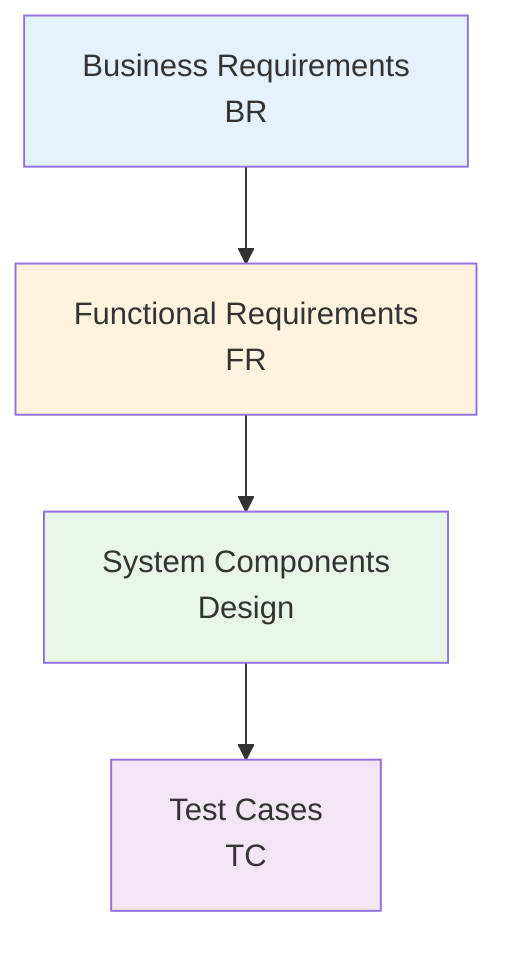

# Requirements Traceability Matrix: [PROJECT_NAME]

> **Template Status**: Live | **Version**: [VERSION] | **Command**: `/arckit.traceability`

## Document Control

| Field | Value |
|-------|-------|
| **Document ID** | ARC-[PROJECT_ID]-TRAC-v[VERSION] |
| **Document Type** | [DOCUMENT_TYPE_NAME] |
| **Project** | [PROJECT_NAME] (Project [PROJECT_ID]) |
| **Classification** | [PUBLIC / OFFICIAL / OFFICIAL-SENSITIVE / SECRET] |
| **Status** | [DRAFT / IN_REVIEW / APPROVED / PUBLISHED / SUPERSEDED / ARCHIVED] |
| **Version** | [VERSION] |
| **Created Date** | [YYYY-MM-DD] |
| **Last Modified** | [YYYY-MM-DD] |
| **Review Cycle** | [Monthly / Quarterly / Annual / On-Demand] |
| **Next Review Date** | [YYYY-MM-DD] |
| **Owner** | [OWNER_NAME_AND_ROLE] |
| **Reviewed By** | [REVIEWER_NAME] on [DATE] or [PENDING] |
| **Approved By** | [APPROVER_NAME] on [DATE] or [PENDING] |
| **Distribution** | [DISTRIBUTION_LIST] |

## Revision History

| Version | Date | Author | Changes | Approved By | Approval Date |
|---------|------|--------|---------|-------------|---------------|
| [VERSION] | [DATE] | ArcKit AI | Initial creation from `/arckit.[COMMAND]` command | [PENDING] | [PENDING] |

## Document Purpose

[Brief description of what this document is for and how it will be used]

---

## 1. Overview

### 1.1 Purpose

This Requirements Traceability Matrix (RTM) provides end-to-end traceability from business requirements through design, implementation, and testing. It ensures:
- All requirements are addressed in design
- All design elements trace to requirements
- All requirements are tested
- Coverage gaps are identified and tracked

### 1.2 Traceability Scope

This matrix traces:

### 1.3 Document References

| Document | Version | Date | Link |
|----------|---------|------|------|
| Requirements Document | [VERSION] | [DATE] | [LINK] |
| High-Level Design (HLD) | [VERSION] | [DATE] | [LINK] |
| Detailed Design (DLD) | [VERSION] | [DATE] | [LINK] |
| Test Plan | [VERSION] | [DATE] | [LINK] |

---

## 2. Traceability Matrix

### 2.1 Forward Traceability: Requirements → Design → Tests

| BR ID | FR ID | Functional Requirement | Design Component | HLD Section | DLD Section | Test Case ID(s) | Status | Comments |
|-------|-------|------------------------|------------------|-------------|-------------|-----------------|--------|----------|
| BR-1 | FR-1 | [Requirement description] | [Service/Component] | [Section] | [Section] | TC-001, TC-002 | [✅ Covered \| ⚠️ Partial \| ❌ Gap] | |
| BR-1 | FR-2 | [Requirement description] | [Service/Component] | [Section] | [Section] | TC-003 | [✅ \| ⚠️ \| ❌] | |
| BR-2 | FR-3 | [Requirement description] | [Service/Component] | [Section] | [Section] | TC-004, TC-005 | [✅ \| ⚠️ \| ❌] | |
| BR-2 | FR-4 | [Requirement description] | [Service/Component] | [Section] | [Section] | - | [❌ Gap] | Test cases missing |
| BR-3 | FR-5 | [Requirement description] | Not yet designed | - | - | - | [❌ Gap] | Design not started |

**Legend**:
- ✅ **Covered**: Requirement fully addressed in design and tested
- ⚠️ **Partial**: Requirement partially addressed; needs clarification or additional work
- ❌ **Gap**: Requirement not addressed in design or testing

---

### 2.2 Backward Traceability: Tests → Design → Requirements

This ensures no "orphan" design elements or tests that don't trace to requirements.

| Test Case ID | Test Description | Design Component | FR ID | BR ID | Status | Comments |
|--------------|------------------|------------------|-------|-------|--------|----------|
| TC-001 | [Test description] | [Component] | FR-1 | BR-1 | [✅ Traced \| ⚠️ Unclear \| ❌ Orphan] | |
| TC-002 | [Test description] | [Component] | FR-1 | BR-1 | [✅ \| ⚠️ \| ❌] | |
| TC-003 | [Test description] | [Component] | FR-2 | BR-1 | [✅ \| ⚠️ \| ❌] | |
| TC-099 | [Test description] | [Component] | - | - | [❌ Orphan] | Test exists but no requirement - remove or trace |

---

## 3. Coverage Analysis

### 3.1 Requirements Coverage Summary

| Category | Total | Covered | Partial | Gap | % Coverage |
|----------|-------|---------|---------|-----|------------|
| Business Requirements (BR) | [X] | [Y] | [Z] | [N] | [Y/X × 100%] |
| Functional Requirements (FR) | [X] | [Y] | [Z] | [N] | [Y/X × 100%] |
| Non-Functional Requirements (NFR) | [X] | [Y] | [Z] | [N] | [Y/X × 100%] |

**Target Coverage**: 100% of BR and FR, 95%+ of NFR

**Current Status**: [ON TRACK | AT RISK | BEHIND]

---

### 3.2 Design Coverage

| Component/Service | Requirements Addressed | FR IDs | % of Total FRs | Comments |
|-------------------|------------------------|--------|----------------|----------|
| [Service A] | [X] | FR-1, FR-2, FR-5 | [Y%] | |
| [Service B] | [X] | FR-3, FR-4, FR-7 | [Y%] | |
| [Service C] | [X] | FR-6, FR-8 | [Y%] | |
| **Total** | **[X]** | | **100%** | |

**Orphan Components**: [Components in design that don't trace to any requirement - should they be removed?]

---

### 3.3 Test Coverage

| Test Level | Total Tests | Requirements Covered | % Coverage | Comments |
|------------|-------------|----------------------|------------|----------|
| Unit Tests | [X] | [Y FRs] | [Z%] | |
| Integration Tests | [X] | [Y FRs] | [Z%] | |
| E2E Tests | [X] | [Y FRs] | [Z%] | |
| Performance Tests | [X] | [Y NFRs] | [Z%] | |
| Security Tests | [X] | [Y NFRs] | [Z%] | |

**Test Coverage Goal**: 100% of functional requirements, 90%+ of NFRs

---

## 4. Gap Analysis

### 4.1 Requirements Without Design

Requirements that have NOT been addressed in HLD or DLD:

| BR ID | FR ID | Requirement | Priority | Reason for Gap | Target Completion |
|-------|-------|-------------|----------|----------------|-------------------|
| [BR-X] | [FR-Y] | [Description] | [HIGH \| MED \| LOW] | [Reason] | [DATE] |

**Impact**: [Description of impact if gaps not addressed]

**Mitigation**: [Plan to address gaps]

---

### 4.2 Requirements Without Tests

Requirements that have been designed but NOT yet tested:

| BR ID | FR ID | Requirement | Design Component | Missing Test Type | Target Completion |
|-------|-------|-------------|------------------|-------------------|-------------------|
| [BR-X] | [FR-Y] | [Description] | [Component] | [Unit \| Integration \| E2E] | [DATE] |

**Risk**: [Impact of untested requirements]

---

### 4.3 Design Components Without Requirements

Components in design that do NOT trace back to any requirement (potential over-engineering or missing requirements):

| Component | Purpose | Should Trace To | Action |
|-----------|---------|-----------------|--------|
| [Component X] | [Purpose] | [Missing BR/FR or "Technical necessity"] | [Add requirement \| Remove component \| Justify] |

---

## 5. Non-Functional Requirements Traceability

### 5.1 Performance Requirements

| NFR ID | Requirement | Target | Design Strategy | Test Plan | Status | Comments |
|--------|-------------|--------|-----------------|-----------|--------|----------|
| NFR-P-1 | API response time | <200ms (p95) | [Caching, async processing] | [Load testing plan] | [✅ \| ⚠️ \| ❌] | |
| NFR-P-2 | Throughput | 10K TPS | [Auto-scaling, load balancing] | [Stress testing plan] | [✅ \| ⚠️ \| ❌] | |

---

### 5.2 Security Requirements

| NFR ID | Requirement | Design Control | Implementation | Test Plan | Status | Comments |
|--------|-------------|----------------|----------------|-----------|--------|----------|
| NFR-SEC-1 | Authentication (SSO/MFA) | [OIDC with MFA] | [Component] | [Security test cases] | [✅ \| ⚠️ \| ❌] | |
| NFR-SEC-2 | Encryption at rest | [AES-256, KMS] | [RDS config] | [Config audit] | [✅ \| ⚠️ \| ❌] | |

---

### 5.3 Availability & Resilience

| NFR ID | Requirement | Target | Design Strategy | Test Plan | Status | Comments |
|--------|-------------|--------|-----------------|-----------|--------|----------|
| NFR-A-1 | Availability SLA | 99.95% | [Multi-AZ, health checks] | [Availability monitoring] | [✅ \| ⚠️ \| ❌] | |
| NFR-A-2 | RPO | <15 min | [Continuous backup] | [DR drill] | [✅ \| ⚠️ \| ❌] | |
| NFR-A-3 | RTO | <4 hours | [Automated failover] | [Failover test] | [✅ \| ⚠️ \| ❌] | |

---

### 5.4 Compliance Requirements

| NFR ID | Requirement | Design Controls | Evidence | Audit Trail | Status | Comments |
|--------|-------------|-----------------|----------|-------------|--------|----------|
| NFR-C-1 | GDPR compliance | [Data residency, deletion APIs] | [Compliance doc] | [Audit logs] | [✅ \| ⚠️ \| ❌] | |
| NFR-C-2 | Audit logging | [7-year retention, immutable] | [Log config] | [Log analysis] | [✅ \| ⚠️ \| ❌] | |

---

## 6. Change Impact Analysis

This section tracks how requirement changes ripple through design and tests.

### 6.1 Requirement Changes

| Change ID | Date | BR/FR ID | Change Description | Impacted Components | Impacted Tests | Status | Impact Level |
|-----------|------|----------|--------------------|--------------------|----------------|--------|--------------|
| CHG-001 | [DATE] | FR-5 | [Changed from X to Y] | [Service A, Service C] | [TC-010, TC-012] | [In Progress] | [HIGH \| MED \| LOW] |

**Change Impact Legend**:
- **HIGH**: Requires significant rework of design and tests
- **MEDIUM**: Requires moderate updates to design or tests
- **LOW**: Minor updates, limited impact

---

## 7. Metrics and KPIs

### 7.1 Traceability Metrics

| Metric | Current Value | Target | Status |
|--------|---------------|--------|--------|
| Requirements with Design Coverage | [X/Y] ([Z%]) | 100% | [✅ On Track \| ⚠️ At Risk \| ❌ Behind] |
| Requirements with Test Coverage | [X/Y] ([Z%]) | 100% | [✅ \| ⚠️ \| ❌] |
| Orphan Components (no requirement trace) | [X] | 0 | [✅ \| ⚠️ \| ❌] |
| Orphan Tests (no requirement trace) | [X] | 0 | [✅ \| ⚠️ \| ❌] |
| Outstanding Gaps | [X] | 0 | [✅ \| ⚠️ \| ❌] |

---

### 7.2 Coverage Trends

Track coverage over time to monitor progress:

| Date | Requirements Coverage | Design Coverage | Test Coverage |
|------|----------------------|-----------------|---------------|
| [DATE] | [X%] | [Y%] | [Z%] |
| [DATE] | [X%] | [Y%] | [Z%] |
| [DATE] | [X%] | [Y%] | [Z%] |

**Trend**: [Improving | Stable | Declining]

---

## 8. Action Items

### 8.1 Gap Resolution

| ID | Gap Description | Owner | Priority | Target Date | Status |
|----|-----------------|-------|----------|-------------|--------|
| GAP-001 | [FR-X not designed] | [Owner] | HIGH | [DATE] | [Open \| In Progress \| Closed] |
| GAP-002 | [FR-Y not tested] | [Owner] | MEDIUM | [DATE] | [Open \| In Progress \| Closed] |

---

### 8.2 Orphan Resolution

| ID | Orphan Item | Type | Resolution | Owner | Target Date | Status |
|----|-------------|------|------------|-------|-------------|--------|
| ORP-001 | [Component X] | Design Component | [Add requirement \| Remove] | [Owner] | [DATE] | [Open \| In Progress \| Closed] |
| ORP-002 | [Test TC-099] | Test Case | [Add requirement \| Remove] | [Owner] | [DATE] | [Open \| In Progress \| Closed] |

---

## 9. Review and Approval

### 9.1 Review Checklist

- [ ] All business requirements traced to functional requirements
- [ ] All functional requirements traced to design components
- [ ] All design components traced back to requirements (no orphans)
- [ ] All requirements have test coverage defined
- [ ] All gaps identified and action plan in place
- [ ] All NFRs addressed in design and test plan
- [ ] Change impact analysis complete

### 9.2 Approval

| Role | Name | Review Date | Approval | Signature | Date |
|------|------|-------------|----------|-----------|------|
| Product Owner | [NAME] | [DATE] | [ ] Approve [ ] Reject | _________ | [DATE] |
| Enterprise Architect | [NAME] | [DATE] | [ ] Approve [ ] Reject | _________ | [DATE] |
| QA Lead | [NAME] | [DATE] | [ ] Approve [ ] Reject | _________ | [DATE] |
| Project Manager | [NAME] | [DATE] | [ ] Approve [ ] Reject | _________ | [DATE] |

---

## 10. Appendices

### Appendix A: Full Requirements List

[Link to complete requirements document]

### Appendix B: Design Documents

[Links to HLD and DLD]

### Appendix C: Test Plan

[Link to test plan and test cases]

### Appendix D: Traceability Tools

[If using tools like Jira, Azure DevOps, or specialized traceability tools, document how to access and use them]

---

**Document Control**

| Version | Date | Author | Changes |
|---------|------|--------|---------|
| 0.1 | [DATE] | [AUTHOR] | Initial draft |
| 1.0 | [DATE] | [AUTHOR] | Baseline after requirements approval |
| 1.1 | [DATE] | [AUTHOR] | Updated after HLD review |
| 2.0 | [DATE] | [AUTHOR] | Updated after DLD completion |

## External References

| Document | Type | Source | Key Extractions | Path |
|----------|------|--------|-----------------|------|
| *None provided* | — | — | — | — |

---

**Generated by**: ArcKit `/arckit.traceability` command
**Generated on**: [DATE]
**ArcKit Version**: [VERSION]
**Project**: [PROJECT_NAME]
**Model**: [AI_MODEL]