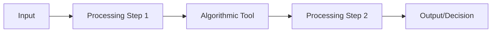

# Algorithmic Transparency Recording Standard (ATRS)

> **Template Status**: Alpha | **Version**: [VERSION] | **Command**: `/arckit.atrs`

## Document Control

| Field | Value |
|-------|-------|
| **Document ID** | ARC-[PROJECT_ID]-ATRS-v[VERSION] |
| **Document Type** | [DOCUMENT_TYPE_NAME] |
| **Project** | [PROJECT_NAME] (Project [PROJECT_ID]) |
| **Classification** | [PUBLIC / OFFICIAL / OFFICIAL-SENSITIVE / SECRET] |
| **Status** | [DRAFT / IN_REVIEW / APPROVED / PUBLISHED / SUPERSEDED / ARCHIVED] |
| **Version** | [VERSION] |
| **Created Date** | [YYYY-MM-DD] |
| **Last Modified** | [YYYY-MM-DD] |
| **Review Cycle** | [Monthly / Quarterly / Annual / On-Demand] |
| **Next Review Date** | [YYYY-MM-DD] |
| **Owner** | [OWNER_NAME_AND_ROLE] |
| **Reviewed By** | [REVIEWER_NAME] on [DATE] or [PENDING] |
| **Approved By** | [APPROVER_NAME] on [DATE] or [PENDING] |
| **Distribution** | [DISTRIBUTION_LIST] |

## Revision History

| Version | Date | Author | Changes | Approved By | Approval Date |
|---------|------|--------|---------|-------------|---------------|
| [VERSION] | [DATE] | ArcKit AI | Initial creation from `/arckit.[COMMAND]` command | [PENDING] | [PENDING] |

## Document Purpose

[Brief description of what this document is for and how it will be used]

---

## About This Template

This template follows the UK Government's Algorithmic Transparency Recording Standard (ATRS), which is **MANDATORY** for:
- All central government departments
- Arm's length bodies (ALBs) delivering public/frontline services
- Organizations directly interacting with the general public

**Purpose**: The ATRS helps public sector organizations provide clear information about how and why they use algorithmic tools, including AI systems.

**Structure**:
- **Tier 1**: Summary information for the general public (clear, simple language)
- **Tier 2**: Detailed technical information for specialists, journalists, researchers

**Resources**:
- ATRS Guidance: https://www.gov.uk/government/publications/guidance-for-organisations-using-the-algorithmic-transparency-recording-standard
- ATRS Template: https://www.gov.uk/government/publications/algorithmic-transparency-template
- Contact: algorithmic-transparency@dsit.gov.uk

---

# TIER 1: Summary Information
*For the general public - use clear, simple language*

## 1. Basic Information

### 1 - Name
**Tool Name**: [Name of the algorithmic tool]

### 2 - Description
**Brief Description** (1-2 sentences for public understanding):
[Describe what the tool does in plain English]

### 3 - Website URL
**More Information**: [URL to tool information page]

### 4 - Contact Email
**Contact**: [email@department.gov.uk]

---

## 2. Organization and Phase

### Organization
- **Department/Organization**: [e.g., Department for Work and Pensions]
- **Organization Type**: [ ] Ministerial Department / [ ] Non-Ministerial Department / [ ] Executive Agency / [ ] Non-Departmental Public Body / [ ] Local Authority / [ ] NHS / [ ] Other

### Function
[ ] Benefits and welfare
[ ] Crime and policing
[ ] Education
[ ] Healthcare
[ ] Immigration
[ ] Justice
[ ] Licensing and regulation
[ ] Tax and revenue
[ ] Transport
[ ] Other: _______________

### Geographic Region
[ ] England
[ ] Scotland
[ ] Wales
[ ] Northern Ireland
[ ] UK-wide
[ ] Other: _______________

### Phase
[ ] Pre-deployment (planning/development)
[ ] Private Beta (limited testing)
[ ] Public Beta (wider testing)
[ ] Production (live use)
[ ] Retired (no longer in use)

**Start Date**: [YYYY-MM or YYYY-MM-DD]
**End Date** (if retired): [YYYY-MM or YYYY-MM-DD]

---

# TIER 2: Detailed Information
*For specialists, journalists, researchers - more technical detail*

---

## Section 1: Owner and Responsibility

### 1.1 - Organization or Department
**Owning Organization**: [Full official name]

### 1.2 - Team
**Responsible Team**: [Team name and role]

### 1.3 - Senior Responsible Owner
**SRO Name**: [Name]
**SRO Role**: [Job title]
**SRO Accountability**: [Description of accountability]

### 1.4 - External Supplier Involvement
**External Suppliers Used**: [ ] Yes / [ ] No

#### 1.4.1 - External Supplier(s)
1. **Supplier Name**: [Company name]
2. **Supplier Name**: [Company name]

#### 1.4.2 - Companies House Number(s)
1. [Companies House registration number]
2. [Companies House registration number]

#### 1.4.3 - External Supplier Role
[Describe what each supplier provides - development, hosting, AI models, data processing, etc.]

#### 1.4.4 - Procurement Procedure Type
[ ] Open procedure
[ ] Restricted procedure
[ ] Competitive procedure with negotiation
[ ] Competitive dialogue
[ ] Innovation partnership
[ ] Direct award (state justification): _______________
[ ] Framework agreement: [Framework name, e.g., G-Cloud 14]

#### 1.4.5 - Data Access Terms
[Describe supplier access to data, data processing agreements, data residency, security controls]

---

## Section 2: Description and Rationale

### 2.1 - Detailed Description
**Technical Architecture**:
[Describe the algorithmic tool's architecture, components, data flow]

**Algorithm Type**:
[ ] Rule-based (deterministic logic)
[ ] Machine Learning - Supervised
[ ] Machine Learning - Unsupervised
[ ] Machine Learning - Reinforcement Learning
[ ] Generative AI (LLM/Foundation Model)
[ ] Computer Vision
[ ] Natural Language Processing
[ ] Optimization/Operations Research
[ ] Statistical Model
[ ] Hybrid approach
[ ] Other: _______________

**AI Model Details** (if applicable):
- **Model Name/Type**: [e.g., GPT-4, BERT, custom model]
- **Model Provider**: [e.g., OpenAI, Anthropic, Google, in-house]
- **Model Version**: [Version number]
- **Fine-tuned**: [ ] Yes / [ ] No
- **Training Data**: [Description of training data used]

**Technical Components**:
- [List key technical components, APIs, databases, infrastructure]

### 2.2 - Scope
**Intended Use**:
[Describe the specific use cases and boundaries]

**Out of Scope**:
[Explicitly state what the tool is NOT designed to do]

**User Population**:
- **Internal Users**: [Number and roles of staff using the tool]
- **External Users**: [Number and types of citizens/public affected]

**Geographic Scope**: [England/Scotland/Wales/NI/UK-wide/Specific regions]

### 2.3 - Benefit
**Intended Benefits**:
[Describe expected positive outcomes]

**Impact Metrics**:
- [Metric 1: e.g., reduced processing time]
- [Metric 2: e.g., improved accuracy]
- [Metric 3: e.g., cost savings]

**Evidence of Benefits**:
[Cite evidence, trials, user research demonstrating benefits]

### 2.4 - Previous Process
**Before Implementation**:
[Describe how this task was done before the algorithmic tool]

**Comparison**:
| Aspect | Previous Process | Current Tool |
|--------|-----------------|--------------|
| Time | | |
| Accuracy | | |
| Cost | | |
| User Experience | | |
| Fairness | | |

### 2.5 - Alternatives Considered
**Alternative 1**: [Option considered]
- **Reason for Rejection**: [Why not chosen]

**Alternative 2**: [Option considered]
- **Reason for Rejection**: [Why not chosen]

**Non-Algorithmic Approach**:
[Why a non-AI/algorithmic solution was not suitable]

---

## Section 3: Decision-Making Process

### 3.1 - Process Integration
**Role in Workflow**:
[Describe where the tool fits in the overall process]

**Process Diagram**:

**Integration Points**:
- [System 1 integration]
- [System 2 integration]

### 3.2 - Provided Information
**Outputs**:
[Describe what information the tool provides]

**Output Format**:
[ ] Score/Rating
[ ] Classification/Category
[ ] Recommendation
[ ] Prediction
[ ] Ranking/Prioritization
[ ] Risk Assessment
[ ] Generated Content
[ ] Other: _______________

**Output Interpretation**:
[Explain how to interpret the tool's outputs]

### 3.3 - Frequency and Scale of Usage
**Usage Volume**:
- **Decisions per day/month/year**: [Number]
- **Users affected per day/month/year**: [Number]
- **Staff users**: [Number]

**Usage Pattern**:
[ ] Continuous/Real-time
[ ] Batch processing (daily/weekly/monthly)
[ ] On-demand

### 3.4 - Human Decisions and Review
**Human Oversight Model**:
[ ] Human-in-the-loop (review EVERY decision before action)
[ ] Human-on-the-loop (periodic/sample review)
[ ] Human-in-command (can override at any time)
[ ] Fully automated (explain justification): _______________

**Review Process**:
[Describe how human reviewers assess algorithmic outputs]

**Override Capability**:
- **Can humans override**: [ ] Yes / [ ] No
- **Override frequency**: [e.g., X% of cases]
- **Override reasons**: [Common reasons for overriding algorithm]

**Quality Assurance**:
[Describe QA processes, sample checks, audits]

### 3.5 - Required Training
**Staff Training Program**:
- **Duration**: [Hours/days of training]
- **Content**: [What training covers]
- **Certification**: [ ] Yes / [ ] No

**Training Topics**:
- [ ] How the algorithm works
- [ ] AI limitations and risks
- [ ] Bias and fairness awareness
- [ ] Override procedures
- [ ] Escalation process
- [ ] User rights (contestability)

**Ongoing Training**: [Frequency of refresher training]

### 3.6 - Appeals and Contestability
**Right to Contest**:
[ ] Yes - users can contest algorithmic decisions
[ ] No - not applicable (explain): _______________

**Contest Process**:
1. [Step 1: How users submit contest]
2. [Step 2: Review process]
3. [Step 3: Resolution]

**Response Time**: [e.g., 28 days]

**Human Review for Contested Decisions**:
[Describe human review process for appeals]

---

## Section 4: Data

### 4.1 - Data Sources
**Input Data**:
1. **Data Source 1**:
   - **Type**: [e.g., Personal data, Administrative data, Open data]
   - **Origin**: [Where data comes from]
   - **Fields Used**: [Specific data fields]

2. **Data Source 2**:
   - **Type**: [e.g., Personal data, Administrative data, Open data]
   - **Origin**: [Where data comes from]
   - **Fields Used**: [Specific data fields]

**Personal Data**: [ ] Yes / [ ] No

**Special Category Data** (e.g., health, ethnicity, religion): [ ] Yes / [ ] No
- If yes, specify: _______________
- Legal basis: _______________

### 4.2 - Data Sharing
**Data Shared With**:
- [Organization/Partner 1]: [Purpose]
- [Organization/Partner 2]: [Purpose]

**Legal Basis for Sharing**:
[Cite specific legislation or data sharing agreements]

### 4.3 - Data Quality and Maintenance
**Data Quality Assurance**:
[Describe data validation, cleansing, quality checks]

**Data Freshness**:
- **Update Frequency**: [Real-time / Daily / Weekly / Monthly]
- **Historical Data**: [How far back data goes]

**Data Completeness**:
[Percentage complete, known gaps]

### 4.4 - Data Storage and Security
**Data Location**:
[ ] UK
[ ] EU
[ ] USA
[ ] Other: _______________

**Cloud Provider**: [e.g., AWS, Azure, GCP, on-premise]

**Security Measures**:
- [ ] Encryption at rest
- [ ] Encryption in transit
- [ ] Access controls (RBAC)
- [ ] Audit logging
- [ ] Regular penetration testing
- [ ] Cyber Essentials / Cyber Essentials Plus certified
- [ ] ISO 27001 certified

**Data Retention**:
[How long data is kept and why]

---

## Section 5: Impact Assessments

### 5.1 - Data Protection Impact Assessment (DPIA)
**DPIA Completed**: [ ] Yes / [ ] No / [ ] In Progress

**DPIA Date**: [YYYY-MM-DD]

**DPIA Outcome**:
[ ] Approved - low risk
[ ] Approved with mitigations
[ ] Requires ICO consultation

**Key Risks Identified**:
1. [Risk 1 and mitigation]
2. [Risk 2 and mitigation]
3. [Risk 3 and mitigation]

**DPIA Review Date**: [YYYY-MM-DD]

### 5.2 - Equality Impact Assessment (EqIA)
**EqIA Completed**: [ ] Yes / [ ] No / [ ] In Progress

**EqIA Date**: [YYYY-MM-DD]

**Protected Characteristics Assessed**:
- [ ] Age
- [ ] Disability
- [ ] Gender reassignment
- [ ] Marriage and civil partnership
- [ ] Pregnancy and maternity
- [ ] Race
- [ ] Religion or belief
- [ ] Sex
- [ ] Sexual orientation

**Impact Assessment**:
| Characteristic | Potential Impact | Mitigation |
|----------------|------------------|------------|
| Age | | |
| Disability | | |
| Race | | |
| Sex | | |

**EqIA Outcome**: [Summary and actions]

**EqIA Review Date**: [YYYY-MM-DD]

### 5.3 - Human Rights Assessment
**Human Rights Assessment Completed**: [ ] Yes / [ ] No

**ECHR Articles Considered**:
- [ ] Article 6: Right to fair trial
- [ ] Article 8: Right to privacy
- [ ] Article 14: Freedom from discrimination
- [ ] Other: _______________

**Human Rights Safeguards**:
[Describe how human rights are protected]

### 5.4 - Other Impact Assessments
**Environmental Impact Assessment**: [ ] Yes / [ ] No
- **Carbon Footprint**: [e.g., CO2e from model training/inference]
- **Sustainability Measures**: [Green hosting, energy efficiency]

**Accessibility Assessment** (WCAG 2.2 Level AA): [ ] Yes / [ ] No

**Security Risk Assessment**: [ ] Yes / [ ] No

---

## Section 6: Fairness, Bias, and Discrimination

### 6.1 - Bias Assessment
**Bias Testing Completed**: [ ] Yes / [ ] No / [ ] In Progress

**Bias Testing Date**: [YYYY-MM-DD]

**Testing Methodology**:
[Describe how bias was tested - datasets, metrics, methods]

### 6.2 - Fairness Metrics
**Fairness Metrics Calculated**:
- [ ] Demographic parity
- [ ] Equalized odds
- [ ] Equal opportunity
- [ ] Calibration
- [ ] Other: _______________

**Results**:
| Protected Characteristic | Metric | Result | Threshold | Pass/Fail |
|--------------------------|--------|--------|-----------|-----------|
| Gender | | | | |
| Ethnicity | | | | |
| Age | | | | |
| Disability | | | | |

### 6.3 - Known Limitations and Bias
**Known Biases**:
1. [Bias 1]: [Description and cause]
2. [Bias 2]: [Description and cause]
3. [Bias 3]: [Description and cause]

**Mitigation Strategies**:
- [Strategy 1]
- [Strategy 2]
- [Strategy 3]

**Residual Risk**:
[Describe any remaining bias that couldn't be fully eliminated]

### 6.4 - Training Data Bias
**Training Data Review**: [ ] Yes / [ ] No

**Training Data Demographics**:
[Describe representation of different groups in training data]

**Known Data Gaps**:
[Groups underrepresented or missing from training data]

**Data Augmentation**:
[Methods used to address data gaps]

### 6.5 - Ongoing Bias Monitoring
**Monitoring Frequency**: [Daily / Weekly / Monthly / Quarterly / Annually]

**Monitoring Metrics**:
- [Metric 1]
- [Metric 2]

**Alert Thresholds**:
[When bias monitoring triggers a review]

---

## Section 7: Technical Details

### 7.1 - Model Performance
**Performance Metrics**:
| Metric | Value | Benchmark |
|--------|-------|-----------|
| Accuracy | | |
| Precision | | |
| Recall | | |
| F1 Score | | |
| False Positive Rate | | |
| False Negative Rate | | |

**Performance by Demographic Group**:
[Break down metrics by protected characteristics]

### 7.2 - Model Explainability
**Explainability Approach**:
[ ] SHAP (SHapley Additive exPlanations)
[ ] LIME (Local Interpretable Model-agnostic Explanations)
[ ] Feature importance
[ ] Decision tree visualization
[ ] Natural language explanations
[ ] Other: _______________
[ ] Not applicable (rule-based system)

**Explanation Provided to Users**: [ ] Yes / [ ] No

**Example Explanation**:
[Provide example of how decision is explained to user]

### 7.3 - Model Versioning and Change Management
**Current Model Version**: [Version number]

**Version History**:
| Version | Date | Changes | Impact |
|---------|------|---------|--------|
| 1.0 | | Initial deployment | |
| 1.1 | | | |
| 2.0 | | | |

**Change Management Process**:
[Describe how model updates are tested, approved, deployed]

**Rollback Capability**: [ ] Yes / [ ] No

### 7.4 - Model Monitoring and Drift Detection
**Drift Monitoring**: [ ] Yes / [ ] No

**Monitoring Metrics**:
- **Data Drift**: [How input data distribution is monitored]
- **Concept Drift**: [How relationship between inputs and outputs is monitored]
- **Performance Drift**: [How accuracy changes over time]

**Alert Thresholds**:
[When drift triggers retraining or review]

**Retraining Schedule**:
[ ] Triggered by drift detection
[ ] Fixed schedule: [Frequency]
[ ] Ad-hoc based on performance review

---

## Section 8: Testing and Assurance

### 8.1 - Testing Approach
**Testing Phases**:
- [ ] Unit testing (individual components)
- [ ] Integration testing (system interaction)
- [ ] User acceptance testing (UAT)
- [ ] A/B testing
- [ ] Shadow testing (parallel running)
- [ ] Red teaming (adversarial testing)

**Test Coverage**: [Percentage or description]

### 8.2 - Edge Cases and Failure Modes
**Known Edge Cases**:
1. [Edge case 1 and handling]
2. [Edge case 2 and handling]
3. [Edge case 3 and handling]

**Failure Modes**:
| Failure Mode | Probability | Impact | Mitigation |
|--------------|-------------|--------|------------|
| Model returns no result | | | |
| Model fails to process input | | | |
| Performance degradation | | | |

**Fallback Procedures**:
[What happens when algorithm fails]

### 8.3 - Security Testing
**Security Assessments Completed**:
- [ ] Penetration testing
- [ ] Vulnerability scanning
- [ ] AI-specific threat assessment:
  - [ ] Prompt injection testing (for LLMs)
  - [ ] Data poisoning risk assessment
  - [ ] Model inversion attack assessment
  - [ ] Adversarial example testing
  - [ ] Model theft/extraction risk

**Security Findings**: [Summary and remediation]

### 8.4 - Independent Assurance
**Independent Review**: [ ] Yes / [ ] No

**Reviewer**: [Organization/team]

**Review Date**: [YYYY-MM-DD]

**Review Outcome**: [Summary and recommendations]

**External Audit**: [ ] Yes / [ ] No / [ ] Planned

---

## Section 9: Transparency and Explainability

### 9.1 - Public Information
**Public Disclosure**:
- [ ] Tool is publicly disclosed
- [ ] ATRS record published on GOV.UK
- [ ] Information on department website
- [ ] Model card published
- [ ] Open source code

**Website URL**: [URL to public information]

### 9.2 - User Communication
**Users Informed**: [ ] Yes / [ ] Partially / [ ] No

**How Users Are Informed**:
- [ ] Direct notification
- [ ] Website information
- [ ] Privacy notice
- [ ] Terms of service
- [ ] In-application message

**Information Provided to Users**:
- [ ] That an algorithm is being used
- [ ] What the algorithm does
- [ ] How it affects them
- [ ] How to contest decisions
- [ ] How their data is used

### 9.3 - Model Card
**Model Card Published**: [ ] Yes / [ ] No

**Model Card URL**: [URL]

**Model Card Contents**:
- [ ] Model architecture
- [ ] Training data description
- [ ] Performance metrics
- [ ] Limitations
- [ ] Bias testing results
- [ ] Intended use
- [ ] Out-of-scope uses

---

## Section 10: Governance and Oversight

### 10.1 - Governance Structure
**Governance Board**: [Name of board/committee]

**Board Composition**:
- [Role 1]
- [Role 2]
- [Role 3]

**Board Responsibilities**:
- [Responsibility 1]
- [Responsibility 2]

**Meeting Frequency**: [e.g., Monthly, Quarterly]

### 10.2 - Risk Management
**Risk Register Maintained**: [ ] Yes / [ ] No

**Top Risks**:
| Risk | Likelihood | Impact | Mitigation | Owner |
|------|------------|--------|------------|-------|
| | | | | |
| | | | | |
| | | | | |

**Risk Review Frequency**: [e.g., Monthly]

### 10.3 - Incident Management
**Incident Response Plan**: [ ] Yes / [ ] No

**Incident Types**:
- [ ] Algorithm error/failure
- [ ] Bias/discrimination incident
- [ ] Data breach
- [ ] Security incident
- [ ] Public complaint

**Incident Response Process**:
1. [Detection]
2. [Escalation]
3. [Response]
4. [Resolution]
5. [Review and lessons learned]

**Contact for Incidents**: [email@department.gov.uk]

### 10.4 - Audit Trail
**Audit Logging**: [ ] Yes / [ ] No

**Logged Events**:
- [ ] All algorithmic decisions
- [ ] User access
- [ ] Configuration changes
- [ ] Model updates
- [ ] Data access

**Log Retention**: [Duration]

**Log Review**: [Frequency and process]

---

## Section 11: Compliance

### 11.1 - Legal Basis
**Primary Legislation**:
- [Act 1]: [Specific sections]
- [Act 2]: [Specific sections]

**Regulatory Compliance**:
- [ ] UK GDPR
- [ ] Data Protection Act 2018
- [ ] Equality Act 2010
- [ ] Human Rights Act 1998
- [ ] Freedom of Information Act 2000
- [ ] Public Sector Equality Duty
- [ ] AI-specific regulation (if applicable)

### 11.2 - Data Protection
**Data Controller**: [Organization name]

**Data Protection Officer**: [Name and contact]

**ICO Registration Number**: [Number]

**Legal Basis for Processing**:
[ ] Consent
[ ] Contract
[ ] Legal obligation
[ ] Vital interests
[ ] Public task
[ ] Legitimate interests

### 11.3 - Standards Compliance
**Standards Followed**:
- [ ] Technology Code of Practice
- [ ] Government Design Principles
- [ ] GDS Service Standard
- [ ] Data Ethics Framework
- [ ] AI Governance Standards
- [ ] ISO 27001 (Information Security)
- [ ] ISO 9001 (Quality Management)
- [ ] Other: _______________

### 11.4 - Procurement Compliance
**Procurement Route**: [e.g., G-Cloud, DOS, Open Tender]

**Contract Value**: [£ amount or range]

**IR35 Compliance** (if contractors): [ ] Yes / [ ] No / [ ] N/A

---

## Section 12: Performance and Outcomes

### 12.1 - Success Metrics
**KPIs**:
1. [KPI 1]: [Target] → [Current performance]
2. [KPI 2]: [Target] → [Current performance]
3. [KPI 3]: [Target] → [Current performance]

**Benefits Realised**:
- [Benefit 1]: [Evidence]
- [Benefit 2]: [Evidence]
- [Benefit 3]: [Evidence]

### 12.2 - User Feedback
**User Research Conducted**: [ ] Yes / [ ] No

**User Satisfaction**: [Score or qualitative feedback]

**User Concerns**:
- [Concern 1 and response]
- [Concern 2 and response]

**Feedback Mechanism**: [How users can provide feedback]

### 12.3 - Continuous Improvement
**Improvement Log**:
| Date | Issue | Action Taken | Outcome |
|------|-------|--------------|---------|
| | | | |
| | | | |

**Lessons Learned**:
- [Lesson 1]
- [Lesson 2]
- [Lesson 3]

---

## Section 13: Review and Updates

### 13.1 - Review Schedule
**ATRS Review Frequency**: [e.g., Annually, or when significant changes]

**Next Review Date**: [YYYY-MM-DD]

**Trigger for Unscheduled Review**:
- [ ] Significant model change
- [ ] Change in usage/scope
- [ ] Incident or complaint
- [ ] Regulatory change
- [ ] New evidence of bias

### 13.2 - Version History
| Version | Date | Author | Changes |
|---------|------|--------|---------|
| 1.0 | | | Initial ATRS record |
| 1.1 | | | |
| 2.0 | | | |

### 13.3 - Contact for Updates
**ATRS Record Owner**: [Name]
**Email**: [email@department.gov.uk]
**Last Updated**: [YYYY-MM-DD]

---

## Appendices

### Appendix A: Glossary
- **Algorithm**: [Definition for your context]
- **Machine Learning**: [Definition]
- **Training Data**: [Definition]
- **Bias**: [Definition]
- **DPIA**: Data Protection Impact Assessment
- **EqIA**: Equality Impact Assessment

### Appendix B: References
- [Reference 1]
- [Reference 2]
- [Reference 3]

### Appendix C: Supporting Documentation
- [ ] Full DPIA
- [ ] Full EqIA
- [ ] Human Rights Assessment
- [ ] Model Card
- [ ] User Research Reports
- [ ] Audit Reports
- [ ] Test Results

---

## Publication Checklist

Before publishing this ATRS record:

**Completeness**:
- [ ] All Tier 1 fields completed
- [ ] All mandatory Tier 2 fields completed
- [ ] Plain English used in Tier 1
- [ ] Technical detail sufficient in Tier 2

**Approvals**:
- [ ] Senior Responsible Owner approval
- [ ] Legal/compliance review
- [ ] Data Protection Officer review
- [ ] Communications team review (public-facing content)

**Impact Assessments**:
- [ ] DPIA completed and approved
- [ ] EqIA completed
- [ ] Human Rights Assessment completed (if applicable)
- [ ] Security Risk Assessment completed

**Quality**:
- [ ] Accuracy verified
- [ ] Links work
- [ ] Contact details current
- [ ] Sensitive information redacted

**Publication**:
- [ ] Published on GOV.UK ATRS repository
- [ ] Published on department website
- [ ] Stakeholders informed
- [ ] Review date set

---

**END OF ATRS RECORD**

For guidance on completing this template, see:
https://www.gov.uk/government/publications/guidance-for-organisations-using-the-algorithmic-transparency-recording-standard

For questions: algorithmic-transparency@dsit.gov.uk

## External References

| Document | Type | Source | Key Extractions | Path |
|----------|------|--------|-----------------|------|
| *None provided* | — | — | — | — |

---

**Generated by**: ArcKit `/arckit.atrs` command
**Generated on**: [DATE]
**ArcKit Version**: [VERSION]
**Project**: [PROJECT_NAME]
**Model**: [AI_MODEL]