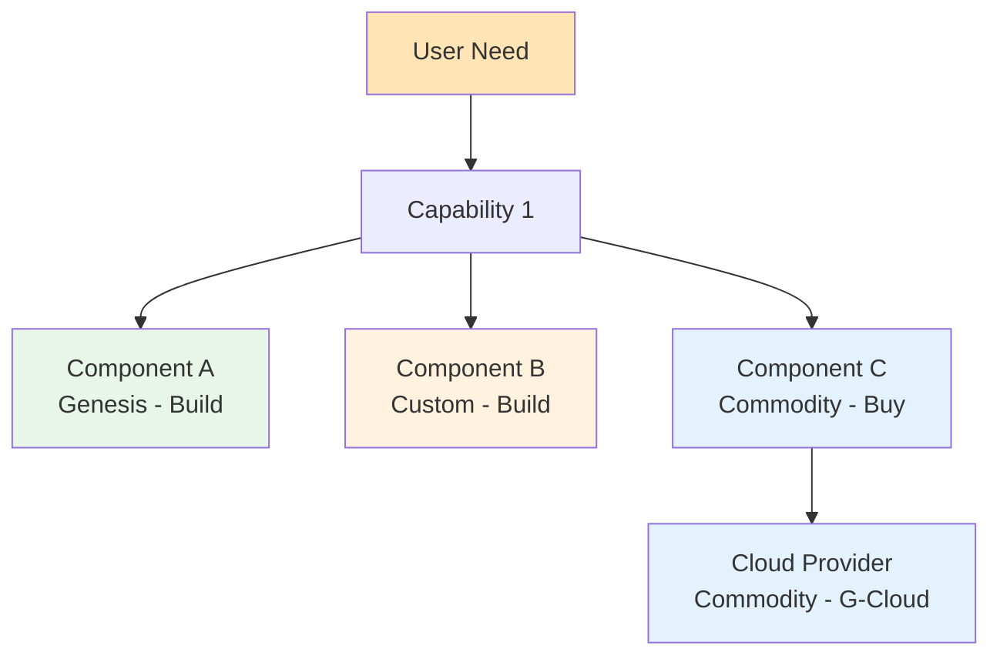

# Wardley Map: {map_name}

> **Template Status**: Experimental | **Version**: [VERSION] | **Command**: `/arckit.wardley`

## Document Control

| Field | Value |
|-------|-------|
| **Document ID** | ARC-[PROJECT_ID]-WARD-v[VERSION] |
| **Document Type** | Wardley Map |
| **Project** | [PROJECT_NAME] (Project [PROJECT_ID]) |
| **Classification** | [PUBLIC / OFFICIAL / OFFICIAL-SENSITIVE / SECRET] |
| **Status** | [DRAFT / IN_REVIEW / APPROVED / PUBLISHED / SUPERSEDED / ARCHIVED] |
| **Version** | [VERSION] |
| **Created Date** | [YYYY-MM-DD] |
| **Last Modified** | [YYYY-MM-DD] |
| **Review Cycle** | [Monthly / Quarterly / Annual / On-Demand] |
| **Next Review Date** | [YYYY-MM-DD] |
| **Owner** | [OWNER_NAME_AND_ROLE] |
| **Reviewed By** | [REVIEWER_NAME] ([YYYY-MM-DD]) or PENDING |
| **Approved By** | [APPROVER_NAME] ([YYYY-MM-DD]) or PENDING |
| **Distribution** | [DISTRIBUTION_LIST] |

## Revision History

| Version | Date | Author | Changes | Approved By | Approval Date |
|---------|------|--------|---------|-------------|---------------|
| [VERSION] | [DATE] | ArcKit AI | Initial creation from `/arckit.wardley` command | PENDING | PENDING |

---

## Map Visualization

**View this map**: Paste the map code below into [https://create.wardleymaps.ai](https://create.wardleymaps.ai)

```wardley
title {map_name}
anchor {anchor_component} [0.95, 0.63]
annotation 1 [0.48, 0.40] High-Risk Area
annotation 2 [0.15, 0.65] Innovation Opportunity
annotation 3 [0.85, 0.45] Commodity - Use Off-the-Shelf
note {note_text} [0.25, 0.25]

component {Component_Name} [visibility, evolution]
{Component_Name} -> {Dependency_Name}

pipeline {Pipeline_Name} [visibility, evolution_start, evolution_end]
{Pipeline_Name} -> {Dependency_Name}

evolve {Component_Name} {evolution_end} label {label_text}

style wardley
```

---

## Evolution Stages Reference

| Stage | Maturity | Characteristics | Strategic Actions |
|-------|----------|-----------------|-------------------|
| **Genesis** (0.00 - 0.25) | Novel, uncertain, rapidly changing | - Unique and rare<br>- Poorly understood<br>- Rapid change<br>- High uncertainty<br>- Future value uncertain | - R&D focus<br>- Accept failure<br>- Explore and experiment<br>- Build in-house if strategic |
| **Custom** (0.25 - 0.50) | Emerging, growing understanding | - Bespoke solutions<br>- Artisanal development<br>- Competitive advantage<br>- Requires significant skill<br>- Still evolving rapidly | - Invest in differentiation<br>- Build custom if competitive advantage<br>- Patent/protect IP<br>- Hire specialists |
| **Product** (0.50 - 0.75) | Maturing, good/rental services | - Products with feature differentiation<br>- Rental models<br>- Slower evolution<br>- Defined practices<br>- Training available | - Buy products<br>- Compare features<br>- Use market leaders<br>- Standardize where possible |
| **Commodity** (0.75 - 1.00) | Industrialized, utility | - Standardized<br>- Volume operations<br>- Cost of deviation high<br>- Utility services<br>- Highly evolved | - Use commodity/utility<br>- Cloud services<br>- Outsource/procure<br>- Focus on cost efficiency |

---

## Component Inventory

### User Needs (Top of Map - High Visibility)

| Component | Visibility | Evolution | Stage | Description | Strategic Notes |
|-----------|-----------|-----------|-------|-------------|-----------------|
| {Component 1} | 0.95 | 0.65 | Product | {description} | {strategic_notes} |
| {Component 2} | 0.92 | 0.48 | Custom | {description} | {strategic_notes} |
| {Component 3} | 0.88 | 0.35 | Custom | {description} | {strategic_notes} |

### Supporting Capabilities (Mid-Level Visibility)

| Component | Visibility | Evolution | Stage | Description | Strategic Notes |
|-----------|-----------|-----------|-------|-------------|-----------------|
| {Component 4} | 0.68 | 0.82 | Commodity | {description} | {strategic_notes} |
| {Component 5} | 0.62 | 0.71 | Product | {description} | {strategic_notes} |
| {Component 6} | 0.58 | 0.45 | Custom | {description} | {strategic_notes} |

### Infrastructure Components (Low Visibility)

| Component | Visibility | Evolution | Stage | Description | Strategic Notes |
|-----------|-----------|-----------|-------|-------------|-----------------|
| {Component 7} | 0.35 | 0.95 | Commodity | {description} | {strategic_notes} |
| {Component 8} | 0.28 | 0.89 | Commodity | {description} | {strategic_notes} |
| {Component 9} | 0.22 | 0.78 | Product | {description} | {strategic_notes} |

---

## Evolution Analysis

### Components in Genesis (0.00 - 0.25)
**Novel, unproven, high uncertainty**

| Component | Current Position | Risk | Opportunity | Action |
|-----------|------------------|------|-------------|--------|
| {Component} | {evolution} | {risk_description} | {opportunity_description} | {action_plan} |

**Strategic Recommendations**:
- [ ] Accept high failure rate
- [ ] Invest in R&D and experimentation
- [ ] Build in-house if strategic differentiator
- [ ] Avoid outsourcing core innovation
- [ ] Plan for rapid change and iteration

### Components in Custom (0.25 - 0.50)
**Emerging practices, competitive advantage**

| Component | Current Position | Competitive Advantage? | Action |
|-----------|------------------|------------------------|--------|
| {Component} | {evolution} | {yes/no + rationale} | {action_plan} |

**Strategic Recommendations**:
- [ ] Build custom if provides competitive advantage
- [ ] Invest in specialist skills
- [ ] Consider IP protection (patents, trade secrets)
- [ ] Monitor evolution velocity - may move to product soon
- [ ] Build vs Buy decision critical here

### Components in Product (0.50 - 0.75)
**Maturing market, feature differentiation**

| Component | Current Position | Market Options | Action |
|-----------|------------------|----------------|--------|
| {Component} | {evolution} | {list_of_vendors} | {action_plan} |

**Strategic Recommendations**:
- [ ] Procure from market leaders
- [ ] Compare feature sets and pricing
- [ ] Standardize on common platforms
- [ ] Avoid custom development unless critical
- [ ] Use RFP process for selection

### Components in Commodity (0.75 - 1.00)
**Industrialized, utility services**

| Component | Current Position | Commodity Provider | Action |
|-----------|------------------|-------------------|--------|
| {Component} | {evolution} | {provider_name} | {action_plan} |

**Strategic Recommendations**:
- [ ] Use commodity/utility services (cloud, SaaS)
- [ ] Focus on cost efficiency, not features
- [ ] Avoid custom development at all costs
- [ ] Use Digital Marketplace (G-Cloud) if UK Government
- [ ] Automate procurement and provisioning

---

## Build vs Buy Analysis

### Build (In-House Development)

**Candidates for Building**:

| Component | Evolution Stage | Rationale | Risk | Investment |
|-----------|----------------|-----------|------|------------|
| {Component} | Genesis/Custom | {competitive_advantage_rationale} | {risk_level} | {estimated_cost} |

**Build Criteria**:
- ✅ Genesis/Custom stage (< 0.50 evolution)
- ✅ Provides competitive advantage
- ✅ Core to business differentiator
- ✅ No suitable market alternatives
- ✅ Skills available or acquirable
- ✅ Strategic IP ownership important

### Buy (Procurement)

**Candidates for Buying**:

| Component | Evolution Stage | Market Options | Rationale | Procurement Route |
|-----------|----------------|----------------|-----------|-------------------|
| {Component} | Product/Commodity | {vendor_names} | {rationale} | {RFP/G-Cloud/Direct} |

**Buy Criteria**:
- ✅ Product/Commodity stage (> 0.50 evolution)
- ✅ Mature market with multiple vendors
- ✅ Not a competitive differentiator
- ✅ Cost of building > cost of buying
- ✅ Time to market critical
- ✅ Skills not available in-house

### Rent/SaaS (Utility Services)

**Candidates for SaaS/Cloud**:

| Component | Evolution Stage | Provider | Rationale | Procurement Route |
|-----------|----------------|----------|-----------|-------------------|
| {Component} | Commodity | {provider_name} | {rationale} | {G-Cloud/Direct} |

**Rent Criteria**:
- ✅ Commodity stage (> 0.75 evolution)
- ✅ Utility services available (AWS, Azure, GCP, SaaS)
- ✅ Pay-as-you-go model preferred
- ✅ Low switching costs
- ✅ Standardized functionality sufficient
- ✅ Operational burden not desired

---

## Inertia and Barriers to Change

**Inertia** = resistance to evolution due to existing practices, skills, or investments

| Component | Current Evolution | Desired Evolution | Inertia Factor | Barrier Description | Mitigation Strategy |
|-----------|-------------------|-------------------|----------------|---------------------|---------------------|
| {Component} | {current} | {desired} | {High/Medium/Low} | {barrier_description} | {mitigation_plan} |

**Common Inertia Sources**:
- **Skills inertia**: Team expertise in legacy technology
- **Process inertia**: Established workflows and procedures
- **Vendor lock-in**: Contractual or technical dependencies
- **Cultural inertia**: "We've always done it this way"
- **Capital investment**: Sunk costs in existing systems
- **Regulatory inertia**: Compliance requirements for change

**De-risking Strategies**:
- [ ] Upskilling programs for new technology
- [ ] Pilot projects to prove new approach
- [ ] Phased migration to reduce risk
- [ ] Vendor negotiations for lock-in exit
- [ ] Change management and communication

---

## Movement and Evolution Predictions

**Evolution Velocity** = how fast components are expected to move along evolution axis

### Next 12 Months

| Component | Current | Predicted (12m) | Velocity | Impact | Action Required |
|-----------|---------|----------------|----------|--------|-----------------|
| {Component} | {current} | {predicted} | {Fast/Medium/Slow} | {impact_description} | {action_plan} |

### Next 24 Months

| Component | Current | Predicted (24m) | Velocity | Impact | Action Required |
|-----------|---------|----------------|----------|--------|-----------------|
| {Component} | {current} | {predicted} | {Fast/Medium/Slow} | {impact_description} | {action_plan} |

**Strategic Implications**:
- [ ] Components moving Genesis → Custom: Invest in R&D now
- [ ] Components moving Custom → Product: Prepare to buy vs build
- [ ] Components moving Product → Commodity: Plan cloud migration
- [ ] Components with high velocity: Monitor market closely
- [ ] Components with inertia: Plan change management early

---

## UK Government Context (if applicable)

### GOV.UK Services and Platforms

**Mapped GOV.UK Components**:

| GOV.UK Service | Evolution Stage | Current Usage | Rationale for Evolution Position |
|----------------|----------------|---------------|----------------------------------|
| GOV.UK Pay | Commodity (0.90) | {usage_status} | {rationale} |
| GOV.UK Notify | Commodity (0.92) | {usage_status} | {rationale} |
| GOV.UK Design System | Product (0.75) | {usage_status} | {rationale} |
| GOV.UK PaaS | Commodity (0.85) | {usage_status} | {rationale} |
| GOV.UK Verify | Product (0.68) | {usage_status} | {rationale} |
| {Custom Service} | {stage} | {usage_status} | {rationale} |

**Reuse Opportunities**:
- [ ] GOV.UK Pay for payment processing (avoid building custom)
- [ ] GOV.UK Notify for notifications (SMS, email)
- [ ] GOV.UK Design System for frontend (accessibility compliance)
- [ ] GOV.UK PaaS for hosting (cloud-first compliance)
- [ ] Cross-government shared components

### Digital Marketplace Procurement Strategy

**Components to Procure via Digital Marketplace**:

| Component | Evolution Stage | Framework | Rationale |
|-----------|----------------|-----------|-----------|
| {Component} | Product/Commodity | G-Cloud / DOS | {rationale} |

**Procurement Recommendations**:
- **Genesis/Custom** (< 0.50): Consider DOS Outcomes for discovery + build
- **Product** (0.50-0.75): G-Cloud for commercial off-the-shelf products
- **Commodity** (> 0.75): G-Cloud for cloud services (AWS, Azure, GCP)

### Technology Code of Practice Mapping

| TCoP Point | Related Components | Compliance Status | Gap Analysis |
|------------|-------------------|-------------------|--------------|
| 1. User Needs | {components} | {status} | {gaps} |
| 2. Accessibility | {components} | {status} | {gaps} |
| 3. Open Source | {components} | {status} | {gaps} |
| 5. Cloud First | {components} | {status} | {gaps} |
| 6. Security | {components} | {status} | {gaps} |

### AI Playbook Mapping (if AI system)

| AI Principle | Related Components | Compliance Status | Gap Analysis |
|--------------|-------------------|-------------------|--------------|
| Human Oversight | {components} | {status} | {gaps} |
| Fairness & Bias Mitigation | {components} | {status} | {gaps} |
| Transparency & Explainability | {components} | {status} | {gaps} |
| Data Quality & Governance | {components} | {status} | {gaps} |

**HIGH-RISK AI Components** (if applicable):
- [ ] Human-in-the-loop component mapped (Custom, ~0.45 evolution)
- [ ] Bias testing framework mapped (Custom, ~0.35 evolution)
- [ ] DPIA/EqIA requirements noted
- [ ] ATRS publication requirement noted

---

## Dependencies and Value Chain

**Component Dependencies**:



**Critical Path Analysis**:
- [ ] Identify components on critical path to user value
- [ ] Highlight high-risk dependencies (single vendor, Genesis components)
- [ ] Flag inertia points that could block evolution
- [ ] Map to requirements traceability matrix

---

## Strategic Gameplay

### Gameplay Patterns Identified

**Accelerators** (speed up evolution):
- [ ] {Component}: Use open source to commoditize
- [ ] {Component}: Partner with vendor to productize
- [ ] {Component}: Contribute to standards to industrialize

**Tower and Moat** (protect competitive advantage):
- [ ] {Component}: Build custom, keep proprietary
- [ ] {Component}: Create switching costs for competitors
- [ ] {Component}: Build ecosystem around our platform

**Exploiting Inertia** (leverage competitors' resistance to change):
- [ ] {Competitor} has inertia in {legacy_system}
- [ ] We can move faster to {new_technology}
- [ ] Market opportunity: {opportunity_description}

**Sensing Engines** (early warning systems):
- [ ] Monitor {market_segment} for new entrants
- [ ] Track {open_source_project} evolution velocity
- [ ] Watch for {technology} moving to commodity

---

## Risk Analysis

### High-Risk Areas

| Risk | Component(s) Affected | Likelihood | Impact | Mitigation |
|------|----------------------|------------|--------|------------|
| **Single vendor dependency** | {component} | {H/M/L} | {H/M/L} | {mitigation_strategy} |
| **Genesis component failure** | {component} | {H/M/L} | {H/M/L} | {mitigation_strategy} |
| **Rapid commoditization** | {component} | {H/M/L} | {H/M/L} | {mitigation_strategy} |
| **Skills gap** | {component} | {H/M/L} | {H/M/L} | {mitigation_strategy} |
| **Regulatory change** | {component} | {H/M/L} | {H/M/L} | {mitigation_strategy} |

### Opportunities

| Opportunity | Component(s) | Potential Value | Investment Required | Action Plan |
|-------------|--------------|-----------------|---------------------|-------------|
| {Opportunity} | {component} | {value_description} | {investment_amount} | {action_plan} |

---

## Traceability

### Requirements Mapping

| Requirement ID | Related Components | Evolution Stage | Build/Buy Decision |
|----------------|-------------------|-----------------|-------------------|
| BR-001 | {components} | {stage} | {decision} |
| FR-001 | {components} | {stage} | {decision} |
| NFR-S-001 | {components} | {stage} | {decision} |

### Architecture Principles Alignment

| Principle | Related Components | Compliance | Gap Analysis |
|-----------|-------------------|------------|--------------|
| {Principle 1} | {components} | ✅ / ⚠️ / ❌ | {gap_description} |
| {Principle 2} | {components} | ✅ / ⚠️ / ❌ | {gap_description} |

---

## Recommendations

### Immediate Actions (0-3 months)

1. **{Action 1}**
   - **Component**: {component_name}
   - **Rationale**: {rationale}
   - **Investment**: {cost}
   - **Owner**: {owner}
   - **Success Criteria**: {criteria}

2. **{Action 2}**
   - **Component**: {component_name}
   - **Rationale**: {rationale}
   - **Investment**: {cost}
   - **Owner**: {owner}
   - **Success Criteria**: {criteria}

### Short-Term Actions (3-12 months)

1. **{Action 3}**
   - **Component**: {component_name}
   - **Rationale**: {rationale}
   - **Investment**: {cost}
   - **Owner**: {owner}
   - **Success Criteria**: {criteria}

### Long-Term Strategic Actions (12-24 months)

1. **{Action 4}**
   - **Component**: {component_name}
   - **Rationale**: {rationale}
   - **Investment**: {cost}
   - **Owner**: {owner}
   - **Success Criteria**: {criteria}

---

## Map Versioning

**Version History**:

| Version | Date | Author | Changes | Rationale |
|---------|------|--------|---------|-----------|
| v1.0 | {date} | {author} | Initial map | {rationale} |
| v1.1 | {date} | {author} | {changes} | {rationale} |

**Next Review Date**: {review_date}

**Review Frequency**: {quarterly / bi-annually / annually}

---

## Appendix: Wardley Mapping Primer

### What is a Wardley Map?

A Wardley Map is a visual representation of:
1. **Value Chain** (Visibility axis, top to bottom): User needs → capabilities → components
2. **Evolution** (Evolution axis, left to right): Genesis → Custom → Product → Commodity
3. **Movement**: How components evolve over time
4. **Dependencies**: What depends on what

### How to Read This Map

- **Y-axis (Visibility)**: How visible the component is to the user
  - Top (0.95-1.0): Direct user needs
  - Middle (0.4-0.7): Supporting capabilities
  - Bottom (0.0-0.3): Infrastructure components

- **X-axis (Evolution)**: How industrialized/commoditized the component is
  - Left (0.0-0.25): Genesis - novel, unproven, uncertain
  - Custom (0.25-0.50): Bespoke, emerging practices
  - Product (0.50-0.75): Products with feature differentiation
  - Right (0.75-1.0): Commodity - utility, standardized

### Strategic Decision Rules

1. **Genesis** (0.0-0.25): Build only if strategic differentiator
2. **Custom** (0.25-0.50): Build vs Buy decision critical - evaluate competitive advantage
3. **Product** (0.50-0.75): Buy from market unless very specific needs
4. **Commodity** (0.75-1.0): Always use commodity/utility - never build

### Common Mistakes to Avoid

❌ Building custom solutions for commodity components (high cost, low value)
❌ Buying products for Genesis stage needs (no market solutions exist yet)
❌ Ignoring inertia (people, process, technology resistance to change)
❌ Not mapping dependencies (missing critical path risks)
❌ Static maps (not updating as components evolve)

---

## Additional Resources

- **Wardley Mapping**: https://learnwardleymapping.com/
- **Create Maps**: https://create.wardleymaps.ai
- **UK Government Digital Marketplace**: https://www.digitalmarketplace.service.gov.uk/
- **Technology Code of Practice**: https://www.gov.uk/guidance/the-technology-code-of-practice

## External References

| Document | Type | Source | Key Extractions | Path |
|----------|------|--------|-----------------|------|
| *None provided* | — | — | — | — |

---

**Generated by**: ArcKit `/arckit.wardley` command
**Generated on**: [DATE]
**ArcKit Version**: [VERSION]
**Project**: [PROJECT_NAME]
**Model**: [AI_MODEL]

