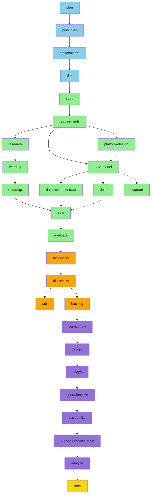
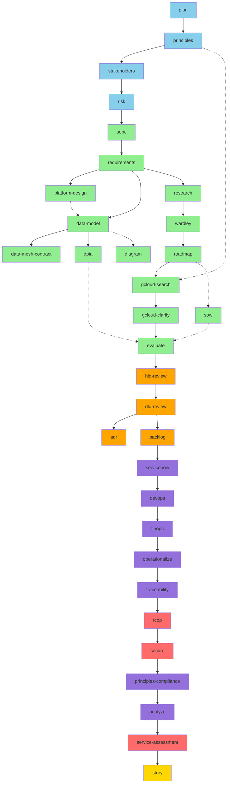
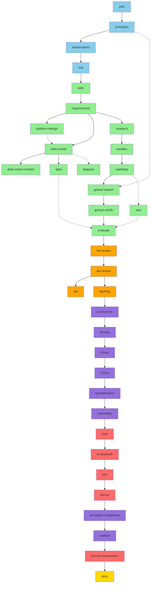
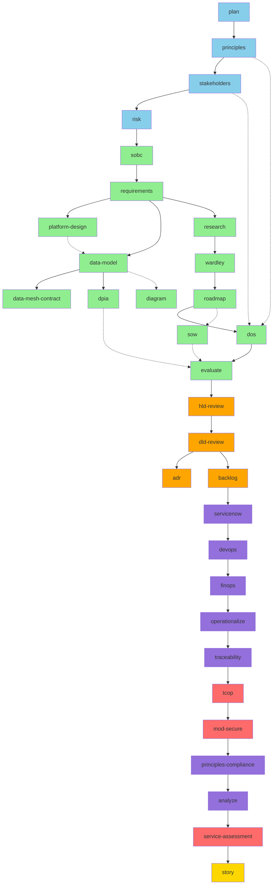
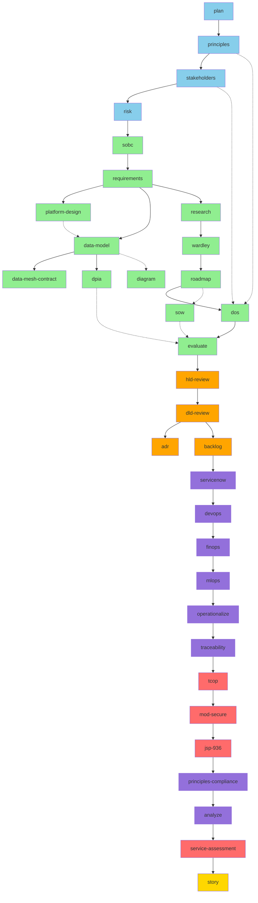
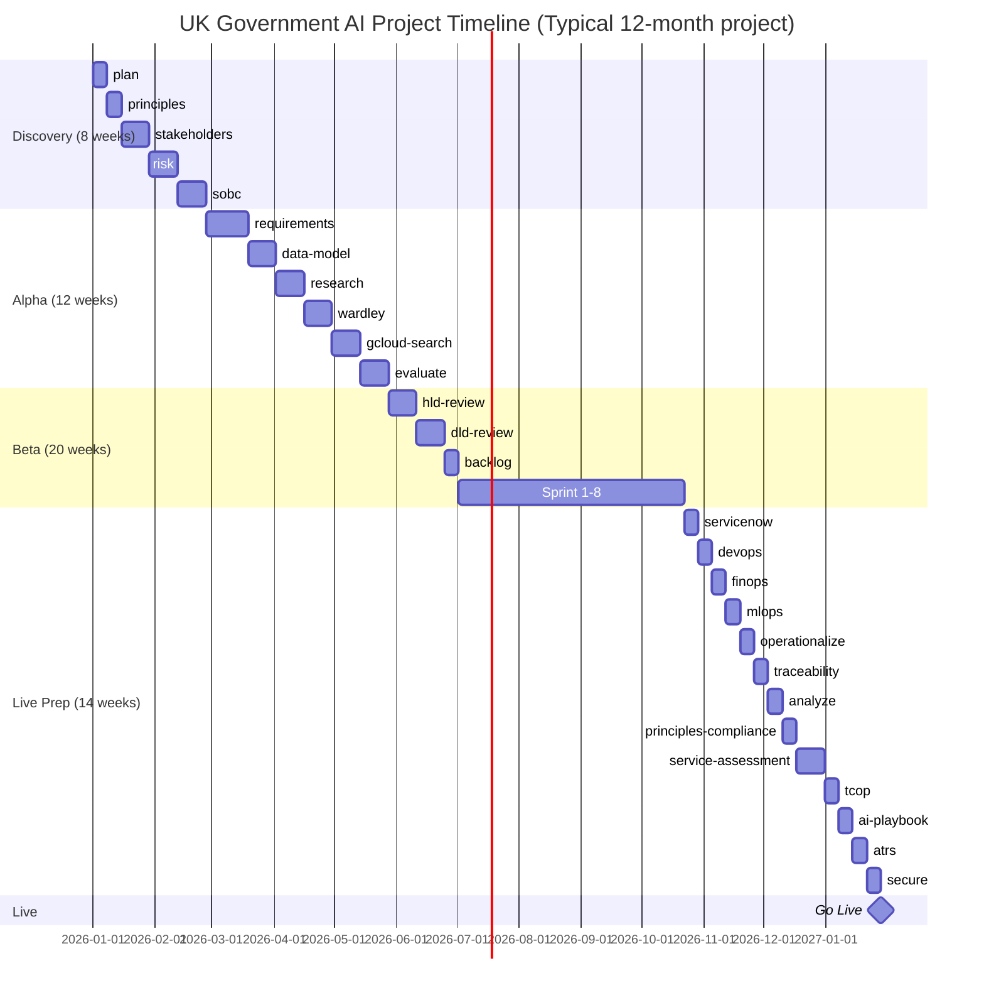
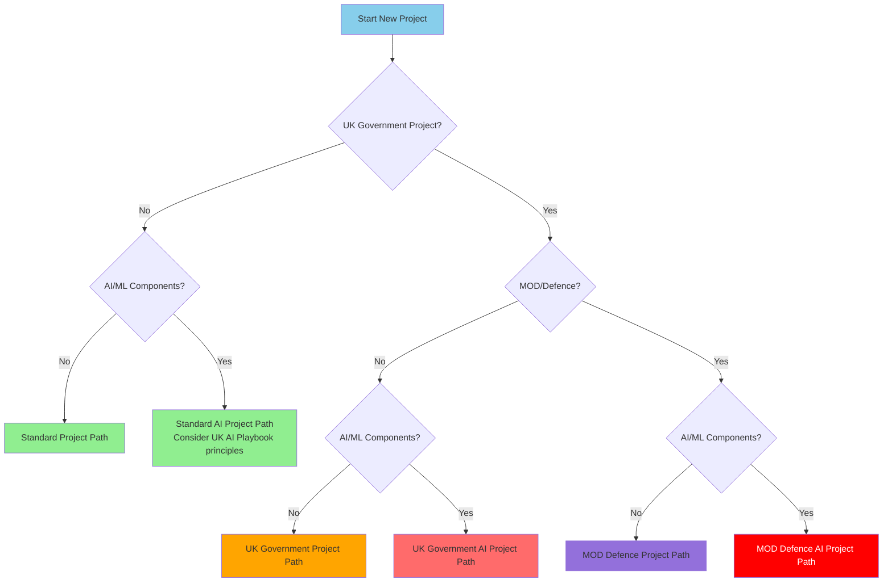
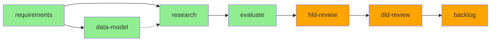
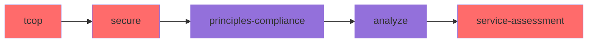

# ArcKit Workflow Diagrams

This document contains Mermaid diagrams for all 5 ArcKit workflow paths based on the Dependency Structure Matrix.

**Legend**:
- **Blue boxes** = Foundation commands (Tier 0-1)
- **Green boxes** = Core workflow (Tier 2-5)
- **Orange boxes** = Design & Implementation (Tier 6-7)
- **Purple boxes** = Quality & Operations (Tier 8-9)
- **Red boxes** = Compliance (Tier 10)
- **Gold boxes** = Project Story & Reporting (Tier 11)
- **Solid arrows (→)** = Mandatory sequential flow
- **Dotted arrows (-.->)** = Recommended dependencies or optional inputs

---

## 1. Standard Project Path (Non-AI, Non-Government)

For private sector and non-UK government projects without AI components.

**Duration**: 4-8 months
**Key Milestones**: SOBC Approval → Strategy/Requirements Sign-off → DPIA Complete → ADR Approved → Sprint 1 → Go Live

---

## 2. UK Government Project Path

For UK Government civilian departments (non-AI projects).

**Duration**: 6-12 months
**Key Milestones**: SOBC Approval → Strategy/Requirements Sign-off → DPIA Complete → G-Cloud Clarifications → Service Assessment → Go Live

---

## 3. UK Government AI Project Path

For UK Government projects with AI/ML components.

**Duration**: 9-18 months
**Key Milestones**: SOBC Approval → Strategy/Requirements Sign-off → DPIA Complete → G-Cloud Clarifications → AI Playbook Approval → ATRS Publication → Service Assessment → Go Live

**Critical Gates**:
- AI Playbook compliance required before Beta
- ATRS publication required before Live

---

## 4. MOD Defence Project Path

For Ministry of Defence projects (non-AI).

**Duration**: 12-24 months
**Key Milestones**: SOBC Approval → Strategy/Requirements Sign-off → DPIA Complete → DOS Down-select → MOD Secure by Design Approval → Service Assessment → Go Live

**Critical Gates**:
- MOD Secure by Design (JSP 440, IAMM) required before Beta
- Security clearances required for team

---

## 5. MOD Defence AI Project Path

For Ministry of Defence projects with AI/ML components.

**Duration**: 18-36 months
**Key Milestones**: SOBC Approval → Strategy/Requirements Sign-off → DPIA Complete → DOS Down-select → MOD Secure by Design + JSP 936 Approval → Service Assessment → Go Live

**Critical Gates**:
- MOD Secure by Design required before Beta
- JSP 936 AI assurance required before Beta
- Risk classification determines approval pathway:
  - **Critical**: 2PUS/Ministerial approval
  - **Severe/Major**: Defence-Level JROC/IAC approval
  - **Moderate/Minor**: TLB-Level approval

---

## Command Dependency Legend

### Dependency Types in Diagrams

- **Solid arrows (→)**: Mandatory/Recommended sequential flow
- **Dotted arrows (-.->)**: Optional parallel activities

### Tier Groupings

| Tier | Phase | Commands |
|------|-------|----------|
| 0 | Foundation | plan, principles |
| 1 | Strategic Context | stakeholders, risk |
| 2 | Business Justification | sobc |
| 3 | Requirements | requirements |
| 3.5 | Platform Strategy | platform-design |
| 4 | Detailed Design | data-model, data-mesh-contract, dpia, research, azure-research*, aws-research*, wardley, roadmap, diagram |
| 5 | Procurement | sow, dos, gcloud-search, gcloud-clarify, evaluate |
| 6 | Design Reviews | hld-review, dld-review, adr |
| 7 | Implementation | backlog |
| 8-9 | Operations & Quality | servicenow, devops, finops, mlops (AI projects), operationalize, traceability, analyze, principles-compliance |
| 10 | Compliance | service-assessment, tcop, ai-playbook, atrs, secure, mod-secure, jsp-936 |
| 11 | Reporting | story |
| 12 | Publishing | pages |

> **\*** `azure-research` and `aws-research` are alternatives to `research` for cloud-specific projects. Each requires its respective MCP server.

---

## Alternative View: Gantt Chart Format

For project planning purposes, here's a Gantt chart representation of a typical UK Government AI project:

---

## Workflow Decision Tree

Use this decision tree to determine which workflow path to follow:

---

## Common Variations

### Fast-Track Path (Existing Architecture)

If architecture principles and governance already established:

**Duration**: 2-4 months
**Use When**: Enhancement to existing system, clear architecture patterns

### Compliance-Only Path

For auditing existing projects:

**Duration**: 2-4 weeks
**Use When**: Pre-assessment preparation, audit requirements

---

## Version

- **ArcKit Version**: 1.0.4
- **Document Date**: 2026-01-31
- **Based On**: DEPENDENCY-MATRIX.md (with Phase 2 R-level dependencies)
- **Commands Documented**: 42
- **Key Changes**:
  - Added missing style definitions for finops nodes in all workflow diagrams
  - Updated Tier Groupings table to include all 40 commands across 13 tiers
  - Added principles-compliance to Operations & Quality tier
  - Updated Gantt chart to include devops, finops, mlops, operationalize, principles-compliance
  - Updated date references from 2025 to 2026
