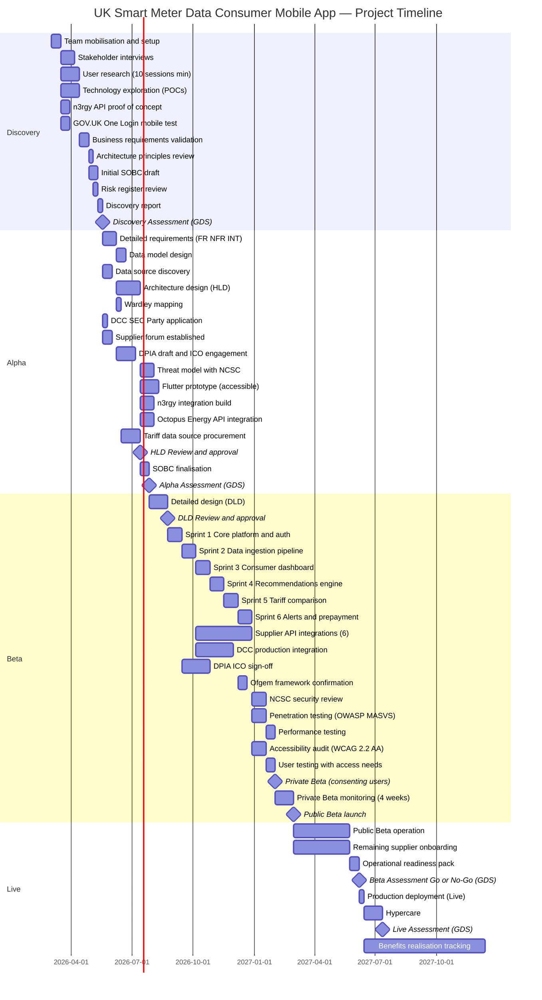

# Project Plan: UK Smart Meter Data Consumer Mobile App

> **Template Status**: Live | **Version**: 1.3.0 | **Command**: `/arckit.plan`

## Document Control

| Field | Value |
|-------|-------|
| **Document ID** | ARC-001-PLAN-v2.0 |
| **Document Type** | Project Plan |
| **Project** | UK Smart Meter Data Consumer Mobile App (Project 001) |
| **Classification** | OFFICIAL |
| **Status** | DRAFT |
| **Version** | 2.0 |
| **Created Date** | 2026-02-01 |
| **Last Modified** | 2026-02-03 |
| **Review Cycle** | Monthly |
| **Next Review Date** | 2026-03-03 |
| **Owner** | [OWNER_NAME_AND_ROLE] |
| **Reviewed By** | PENDING |
| **Approved By** | PENDING |
| **Distribution** | Programme Board, DESNZ SRO, Delivery Team, DCC, Ofgem, GDS Assessors, HM Treasury |

## Revision History

| Version | Date | Author | Changes | Approved By | Approval Date |
|---------|------|--------|---------|-------------|---------------|
| 1.0 | 2026-02-01 | ArcKit AI | Initial creation from `/arckit.plan` command | PENDING | PENDING |
| 2.0 | 2026-02-03 | ArcKit AI | Updated: integrated DPIA, DATA, SECD, DSCT artifacts; ArcKit 1.3.0; added /arckit.datascout | PENDING | PENDING |

---

## Executive Summary

**Project**: UK Smart Meter Data Consumer Mobile App
**Duration**: 18 months (78 weeks) — Discovery to Live
**Budget**: £10-17M (capital) + £5-9M/year (operating) — per ARC-001-REQ-v1.0
**Team**: 8-12 FTE (Discovery/Alpha), 20-30 FTE (Beta), 10-15 FTE (Live)
**Delivery Model**: GDS Agile Delivery (Discovery → Alpha → Beta → Live)

**Objective**: Deliver a cross-platform mobile application enabling 34 million smart meter households to access their half-hourly energy consumption data, receive personalised savings recommendations, and compare tariffs — achieving 5 million monthly active users within 18 months of public launch.

**Success Criteria**:
- 5 million MAU by Month 18 post-public launch (Goal G-1)
- 5% average energy reduction for active users (Goal G-2)
- All regulatory sign-offs (ICO, Ofgem, NCSC, GDS) before processing real consumer data (Goal G-3)
- DCC + 6 supplier integrations at Beta with >95% data retrieval success (Goal G-4)
- WCAG 2.2 AA compliance with 20+ accessibility user tests (Goal G-5)
- BCR > 2.0 validated by Month 24 post-launch (Goal G-6)

**Key Milestones**:
- Discovery Complete: Week 10
- Alpha Assessment (GDS): Week 22
- HLD Review: Week 20
- Private Beta Launch (real data): Week 40
- Public Beta Launch (all consumers): Week 52
- Live Assessment (GDS): Week 64
- 5M Users Target: Week 78 + 78 weeks post-public Beta = ~2028-12

**Project Complexity**: LARGE — 100+ requirements, 5+ external integrations, multiple compliance regimes (UK GDPR, SEC, Ofgem, GDS, NCSC, WCAG 2.2), 12 stakeholders with complex driver landscape, 20 identified risks including 5 exceeding appetite.

---

## Gantt Timeline

---

## Workflow and Gates Diagram

```mermaid
graph TB
    Start[Project Initiation<br/>Team mobilisation] --> Discovery

    Discovery[Discovery Phase<br/>- Stakeholder interviews<br/>- User research 10+ sessions<br/>- Technology POCs n3rgy Flutter<br/>- Business requirements validation<br/>- Initial SOBC and risk review] --> DiscGate{Discovery<br/>Assessment<br/>GDS}

    DiscGate -->|Pass| Alpha
    DiscGate -->|Not Met| RefineDisc[Address findings<br/>Additional research]
    RefineDisc --> DiscGate

    Alpha[Alpha Phase<br/>- Detailed requirements FR NFR INT<br/>- HLD architecture design<br/>- DPIA and ICO engagement<br/>- Threat model with NCSC<br/>- Flutter prototype accessible<br/>- n3rgy and Octopus integration<br/>- Tariff data procurement<br/>- SOBC finalisation] --> HLDGate{HLD Review}

    HLDGate -->|Approved| AlphaGate{Alpha<br/>Assessment<br/>GDS}
    HLDGate -->|Rejected| RefineHLD[Refine architecture]
    RefineHLD --> HLDGate

    AlphaGate -->|Pass| Beta
    AlphaGate -->|Not Met| RefineAlpha[Address findings]
    RefineAlpha --> Alpha

    Beta[Beta Phase<br/>- DLD detailed design<br/>- 6 implementation sprints<br/>- 6 supplier integrations<br/>- DCC production integration<br/>- Security and pen testing<br/>- Performance testing<br/>- WCAG 2.2 AA audit] --> DLDGate{DLD Review}

    DLDGate -->|Approved| Build[Implementation<br/>Sprints 1-6]
    DLDGate -->|Rejected| RefineDLD[Refine design]
    RefineDLD --> DLDGate

    Build --> RegGate{Regulatory<br/>Sign-offs<br/>ICO Ofgem NCSC}

    RegGate -->|All Approved| Testing[Security and<br/>Performance<br/>Testing]
    RegGate -->|Not Approved| FixCompliance[Address<br/>regulatory findings]
    FixCompliance --> RegGate

    Testing --> UAT{UAT and<br/>Accessibility<br/>Pass}
    UAT -->|Pass| PrivateBeta[Private Beta<br/>Consenting users<br/>4 weeks monitoring]
    UAT -->|Fail| FixIssues[Fix issues]
    FixIssues --> UAT

    PrivateBeta --> PublicBeta[Public Beta<br/>All consumers<br/>12 weeks operation]

    PublicBeta --> BetaGate{Beta Assessment<br/>Go or No-Go<br/>GDS}
    BetaGate -->|Go Live| Live[Production<br/>Deployment]
    BetaGate -->|No-Go| FixBlockers[Address<br/>blockers]
    FixBlockers --> PublicBeta

    Live --> Hypercare[Hypercare<br/>4 weeks]
    Hypercare --> LiveGate{Live Assessment<br/>GDS}
    LiveGate -->|Met| BAU[Business As Usual<br/>Benefits realisation<br/>Continuous improvement]
    LiveGate -->|Not Met| ImproveOps[Improve<br/>operational maturity]
    ImproveOps --> LiveGate

    style DiscGate fill:#FFE4B5
    style HLDGate fill:#FFE4B5
    style AlphaGate fill:#FFE4B5
    style DLDGate fill:#FFE4B5
    style RegGate fill:#FFE4B5
    style BetaGate fill:#FFE4B5
    style LiveGate fill:#FFE4B5
    style PrivateBeta fill:#90EE90
    style PublicBeta fill:#90EE90
    style Live fill:#90EE90
```

---

## Discovery Phase (Weeks 1-10)

**Objective**: Validate the problem, understand user needs, explore technology feasibility, and confirm the business case justifies proceeding to Alpha.

### Activities and Timeline

| Week | Activity | ArcKit Command | Deliverable |
|------|----------|----------------|-------------|
| 1-2 | Team mobilisation, environments, ways of working | — | Team onboarded, tooling set up |
| 1-4 | Stakeholder interviews (10 key stakeholders from ARC-001-STKE) | — | Validated stakeholder map, refined drivers |
| 1-5 | User research — 10+ sessions with energy consumers across personas (Sarah, James, Margaret, Aisha) | — | User needs map, pain points, accessibility insights |
| 1-4 | Technology exploration — n3rgy POC, GOV.UK One Login mobile test, Flutter prototype, TimescaleDB trial | — | Technology feasibility report, POC results |
| 5-7 | Business requirements validation against user research | — | Validated BR-001 through BR-007 |
| 7-8 | Architecture principles review with delivery team | — | Confirmed ARC-000-PRIN-v1.0 applicability |
| 7-9 | Initial SOBC draft using research TCO data | `/arckit.sobc` | ARC-001-SOBC-v1.0 (draft) |
| 8-9 | Risk register review and update | — | ARC-001-RISK-v1.1 |
| 9-10 | Discovery report compilation | — | Discovery findings document |
| 10 | **Discovery Assessment (GDS)** | — | GDS assessment outcome |

### Gate: Discovery Assessment (Week 10)

**Approval Criteria**:
- [ ] Problem clearly defined — market failure in consumer energy data access validated
- [ ] User needs documented from 10+ research sessions across all 4 personas
- [ ] Technology feasibility confirmed — n3rgy POC successful, Flutter prototype accessible
- [ ] Business requirements validated against user research evidence
- [ ] Architecture principles agreed by delivery team and architecture board
- [ ] Initial SOBC shows positive indicative BCR
- [ ] Top 20 risks identified with mitigations (ARC-001-RISK-v1.0 reviewed)
- [ ] Stakeholder buy-in confirmed — DCC, Ofgem, and at least 2 suppliers engaged
- [ ] GOV.UK One Login mobile suitability confirmed or contingency activated

**Approvers**: GDS Assessment Panel, DESNZ SRO

**Possible Outcomes**:
- **Pass** — Problem validated, approach feasible, proceed to Alpha
- **Pivot** — Adjust approach based on findings (e.g., alternative data source if n3rgy unsuitable)
- **Stop** — Fundamental viability issue (unlikely given existing artefact maturity)

---

## Alpha Phase (Weeks 11-22)

**Objective**: Design the service, prove the architecture works, test prototypes with users, procure key vendors, and prepare for Beta build.

### Activities and Timeline

| Week | Activity | ArcKit Command | Deliverable |
|------|----------|----------------|-------------|
| 11-13 | Detailed requirements — FRs, NFRs, INTs, DRs refined from Discovery | `/arckit.requirements` | ARC-001-REQ-v1.1 |
| 11-12 | Data model design | `/arckit.data-model` | ARC-001-DATA-v1.0 [COMPLETED] |
| 11-12 | Data source discovery | `/arckit.datascout` | ARC-001-DSCT-v1.0 [COMPLETED] |
| 11 | Wardley mapping for build vs buy decisions | `/arckit.wardley` | ARC-001-WARD-001-v1.0 |
| 11-16 | Architecture design (HLD) — platform, mobile, integrations, data pipeline | — | HLD document |
| 11 | DCC SEC Party application submitted | — | Application acknowledgement |
| 11-12 | Monthly supplier forum established, API spec shared | — | Supplier engagement tracker |
| 13-16 | DPIA draft and ICO pre-consultation | `/arckit.dpia` | ARC-001-DPIA-v1.0 [COMPLETED] |
| 16-18 | Threat model with NCSC input | `/arckit.secure` | ARC-001-SECD-v1.0 [COMPLETED] |
| 16-20 | Flutter prototype — accessible dashboard with real n3rgy data | — | Working prototype tested with users |
| 16-18 | n3rgy integration build (production adapter) | — | n3rgy adapter deployed to staging |
| 16-18 | Octopus Energy API integration (first supplier adapter) | — | Octopus adapter deployed to staging |
| 12-16 | Tariff data source procurement — Switchcraft evaluation, Ofgem engagement | — | Tariff data source decision |
| 20 | **HLD Review and approval** | `/arckit.hld-review` | ARC-001-HLDR-v1.0 |
| 20-22 | SOBC finalisation with confirmed TCO and vendor selections | `/arckit.sobc` | ARC-001-SOBC-v1.0 (final) |
| 22 | **Alpha Assessment (GDS)** | — | GDS assessment outcome |

### Gate: HLD Review (Week 20)

**Approval Criteria**:
- [ ] HLD addresses all 21 architecture principles (ARC-000-PRIN-v1.0)
- [ ] DCC integration architecture validated (batch retrieval, caching, capacity plan)
- [ ] Supplier adapter pattern proven with Octopus Energy integration
- [ ] Security architecture reviewed — zero trust, encryption, MFA
- [ ] Data architecture supports 50TB growth with hot/warm/cold tiering
- [ ] Mobile architecture supports offline-first, WCAG 2.2 AA, <3s launch
- [ ] Resilience patterns defined — circuit breakers, graceful degradation
- [ ] No critical findings from initial threat model

**Approvers**: Architecture Review Board, DESNZ SRO, Technical Architect

### Gate: Alpha Assessment (Week 22)

**Approval Criteria**:
- [ ] Working prototype tested with 20+ users including accessibility testing
- [ ] HLD approved by Architecture Review Board
- [ ] DPIA submitted to ICO for pre-consultation
- [ ] Threat model completed with NCSC input
- [ ] At least 2 data sources proven (n3rgy + Octopus Energy)
- [ ] Tariff data source identified or procurement initiated
- [ ] SOBC approved by DESNZ SRO (pending Treasury submission)
- [ ] GDS assessors satisfied on Points 1-3, 5, 6, 8, 9, 11-13
- [ ] Beta delivery plan with sprint breakdown

**Approvers**: GDS Assessment Panel, DESNZ SRO

---

## Beta Phase (Weeks 23-64)

**Objective**: Build the production service, integrate with DCC and 6+ suppliers, achieve all regulatory sign-offs, test thoroughly, and launch to consumers.

### Activities and Timeline

| Week | Activity | ArcKit Command | Deliverable |
|------|----------|----------------|-------------|
| 23-26 | Detailed design (DLD) — API specs, data schemas, mobile screens | — | DLD document |
| 26 | **DLD Review and approval** | `/arckit.dld-review` | ARC-001-DLDR-v1.0 |
| 27-29 | Sprint 1: Core platform — authentication (GOV.UK One Login), API gateway, consent management | — | Core platform deployed |
| 30-32 | Sprint 2: Data ingestion pipeline — n3rgy batch, TimescaleDB, data quality validation | — | Data pipeline operational |
| 33-35 | Sprint 3: Consumer dashboard — Flutter app, consumption views, offline mode | — | Dashboard feature complete |
| 36-38 | Sprint 4: Recommendation engine — personalised savings, A/B testing framework | — | Recommendations feature complete |
| 39-41 | Sprint 5: Tariff comparison — impartial comparison, Ofgem methodology alignment | — | Tariff feature complete |
| 42-44 | Sprint 6: Alerts, prepayment, budget tracking, carbon footprint | — | All features complete |
| 30-44 | Supplier API integrations — 6 major suppliers (British Gas, EDF, E.ON, Octopus, SSE, Scottish Power) | — | 6 supplier adapters operational |
| 30-38 | DCC production integration — SEC compliance, SMKI, batch scheduling | — | DCC integration operational |
| 27-32 | DPIA ICO sign-off | — | ICO acceptance letter |
| 39-41 | Ofgem data access framework confirmation | — | Ofgem written confirmation |
| 44-47 | NCSC security review | — | NCSC assessment report |
| 44-47 | Penetration testing — external firm, OWASP MASVS for mobile | — | Pen test report, remediation |
| 47-49 | Performance testing — 500K concurrent, energy price cap day simulation | — | Performance report |
| 44-47 | WCAG 2.2 AA accessibility audit (automated + manual) | — | Accessibility audit report |
| 47-49 | User testing with 20+ consumers with access needs | — | Accessibility user research report |
| 49 | **Private Beta launch** (consenting volunteers, real data) | — | Private Beta live |
| 49-52 | Private Beta monitoring — 4 weeks, incident response testing | — | Private Beta report |
| 52 | **Public Beta launch** (open to all consumers) | — | Public Beta live |
| 52-64 | Public Beta operation — 12 weeks, supplier onboarding, refinement | — | Operational metrics |
| 52-64 | Remaining supplier onboarding (target: 10+ for 90% coverage) | — | Supplier coverage report |
| 60-62 | Operational readiness pack | `/arckit.operationalize` | ARC-001-OPS-v1.0 |
| 60-62 | Traceability matrix | `/arckit.traceability` | ARC-001-TRACE-v1.0 |
| 60-62 | TCoP assessment | `/arckit.tcop` | ARC-001-TCOP-v1.0 |
| 60-62 | Secure by Design assessment | `/arckit.secure` | ARC-001-SECD-v1.1 |
| 60-62 | Principles compliance assessment | `/arckit.principles-compliance` | ARC-001-PCOMP-v1.0 |
| 62 | **Beta Assessment / Go-No-Go (GDS)** | — | GDS Beta assessment |

### Gate: DLD Review (Week 26)

**Approval Criteria**:
- [ ] DLD implements approved HLD architecture
- [ ] API specifications complete (OpenAPI 3.0)
- [ ] Data schemas align with ARC-001-DATA-v1.0
- [ ] Mobile screen designs accessible (WCAG 2.2 AA)
- [ ] Security controls specified per threat model
- [ ] Integration specifications for DCC and 6 suppliers
- [ ] Performance targets achievable per architecture design
- [ ] Deployment pipeline design (CI/CD, environments)

**Approvers**: Technical Architect, Architecture Review Board

### Gate: Regulatory Sign-offs (Weeks 32-47)

**Approval Criteria**:
- [ ] ICO: DPIA accepted, lawful basis confirmed, consent mechanism approved
- [ ] Ofgem: Data access framework alignment confirmed in writing
- [ ] NCSC: Security review passed with no critical findings
- [ ] ALL three sign-offs achieved before Private Beta with real consumer data

**Approvers**: ICO, Ofgem, NCSC (external)

**Hard Constraint**: No real consumer energy data processed until all three regulatory bodies have signed off. This is non-negotiable per BR-003.

### Gate: Beta Assessment / Go-No-Go (Week 62)

**Approval Criteria**:
- [ ] Service passes GDS Service Standard on all 14 points
- [ ] Private Beta operated for 4+ weeks with no critical incidents
- [ ] Public Beta operated for 12+ weeks with operational metrics meeting SLOs
- [ ] Platform availability >99.9% during Public Beta
- [ ] Data retrieval success rate >95% across all integrated suppliers
- [ ] WCAG 2.2 AA compliance verified (automated + manual + user testing)
- [ ] Operational readiness pack complete — runbooks, DR tested, on-call established
- [ ] Penetration test remediation complete — no critical/high findings
- [ ] App store ratings >4.0 on both platforms
- [ ] Traceability matrix shows requirements coverage
- [ ] All 20 risks reviewed and within appetite (or escalated with accepted treatment)
- [ ] SOBC benefits tracking framework operational

**Approvers**: GDS Assessment Panel, DESNZ SRO, Programme Board

---

## Live Phase (Weeks 64-78+)

**Objective**: Deploy to production, operate with full support, track benefits, and transition to BAU.

### Activities and Timeline

| Week | Activity | ArcKit Command | Deliverable |
|------|----------|----------------|-------------|
| 64-65 | Production deployment and smoke testing | — | Production live |
| 65-69 | Hypercare — enhanced monitoring, rapid response | — | Hypercare report |
| 69 | **Live Assessment (GDS)** | `/arckit.service-assessment` | GDS Live assessment outcome |
| 65-78 | Benefits realisation tracking — MAU, energy savings, BCR | — | Quarterly benefits report |
| 65-78 | Remaining supplier onboarding (90%+ coverage target) | — | Coverage milestone |
| 70-78 | DCC direct access go-live (strategic, parallel to n3rgy) | — | DCC direct integration live |
| 78 | Service Assessment readiness report | `/arckit.service-assessment` | ARC-001-SASS-v1.0 |
| 78 | Project story and governance achievements | `/arckit.story` | ARC-001-STORY-v1.0 |

### Gate: Live Assessment (Week 69)

**Approval Criteria**:
- [ ] Service has been in public operation for 16+ weeks
- [ ] SLOs met consistently (99.9% availability, <500ms p95 API response)
- [ ] Operational runbooks tested via real incidents
- [ ] DR failover tested at least once
- [ ] Continuous deployment pipeline operational
- [ ] User research ongoing — evidence of iteration based on feedback
- [ ] Accessibility statement published and accurate
- [ ] Source code published open (or exception documented)
- [ ] Support model operating — L1/L2/L3 triage, on-call rota

**Approvers**: GDS Assessment Panel

---

## ArcKit Commands in Project Flow

### Discovery Phase (Weeks 1-10)
- Week 7-9: `/arckit.sobc` — Initial Strategic Outline Business Case
- Week 8-9: (Review existing) — ARC-001-RISK-v1.0 already created

### Alpha Phase (Weeks 11-22)
- Week 11-13: `/arckit.requirements` — Detailed requirements update (v1.1)
- Week 11-12: `/arckit.data-model` — Data model for TimescaleDB schema (ARC-001-DATA-v1.0)
- Week 11-12: `/arckit.datascout` — Data source discovery (ARC-001-DSCT-v1.0)
- Week 11: `/arckit.wardley` — Wardley Maps for build vs buy
- Week 13-16: `/arckit.dpia` — Data Protection Impact Assessment
- Week 16-18: `/arckit.secure` — Secure by Design / threat model
- Week 20: `/arckit.hld-review` — HLD approval gate
- Week 20-22: `/arckit.sobc` — SOBC finalisation

### Beta Phase (Weeks 23-64)
- Week 26: `/arckit.dld-review` — DLD approval gate
- Week 42-44: `/arckit.devops` — DevOps strategy (CI/CD, IaC)
- Week 44-47: `/arckit.diagram` — Architecture diagrams (C4)
- Week 60-62: `/arckit.operationalize` — Operational readiness pack
- Week 60-62: `/arckit.traceability` — Requirements traceability matrix
- Week 60-62: `/arckit.tcop` — Technology Code of Practice assessment
- Week 60-62: `/arckit.secure` — Updated Secure by Design assessment
- Week 60-62: `/arckit.principles-compliance` — Principles compliance scorecard
- Week 60-62: `/arckit.analyze` — Governance quality analysis
- Week 62: `/arckit.service-assessment` — GDS Beta assessment preparation

### Live Phase (Weeks 64-78)
- Week 69: `/arckit.service-assessment` — GDS Live assessment preparation
- Week 78: `/arckit.story` — Project story and governance achievements
- Quarterly: `/arckit.risk` — Updated risk register
- Quarterly: `/arckit.analyze` — Periodic quality reviews
- Annually: `/arckit.sobc` — Benefits realisation tracking

---

## Team Structure

### Discovery Phase (Weeks 1-10) — 8-12 FTE

| Role | FTE | Responsibility |
|------|-----|---------------|
| Programme Director | 1.0 | Overall delivery, stakeholder management |
| Product Owner | 1.0 | User needs, backlog, prioritisation |
| Technical Architect | 1.0 | Technology exploration, POCs, architecture principles |
| User Researcher | 1.0 | Consumer research sessions, accessibility research |
| Interaction Designer | 1.0 | Prototype design, accessibility patterns |
| Content Designer | 0.5 | Plain English energy content, consent language |
| Developer (Flutter) | 1.0 | Flutter prototype, n3rgy POC |
| Developer (Backend) | 1.0 | n3rgy integration, TimescaleDB POC |
| DPO / Privacy Lead | 0.5 | DPIA preparation, ICO engagement |
| **Total** | **8.0** | |

### Beta Phase (Weeks 23-64) — 20-30 FTE

| Role | FTE | Responsibility |
|------|-----|---------------|
| Programme Director | 1.0 | Delivery, supplier management, gates |
| Product Owner | 1.0 | Backlog, sprint planning, acceptance |
| Technical Architect | 1.0 | Architecture governance, DCC integration oversight |
| Delivery Manager | 1.0 | Sprint ceremonies, impediment removal |
| User Researcher | 1.0 | Ongoing research, accessibility testing |
| Interaction Designer | 1.0 | Screen design, WCAG validation |
| Content Designer | 0.5 | Consumer-facing content |
| Flutter Developers | 4.0 | Mobile app build (iOS + Android) |
| Backend Developers | 4.0 | Platform services, data pipeline, APIs |
| Integration Engineers | 2.0 | DCC, 6 supplier APIs |
| DevOps Engineers | 2.0 | CI/CD, IaC, monitoring |
| QA Engineers | 2.0 | Testing automation, accessibility, performance |
| Security Lead | 1.0 | Threat model, pen testing, NCSC liaison |
| DPO / Privacy Lead | 0.5 | DPIA, ICO engagement, consent implementation |
| Performance Engineer | 1.0 | Load testing, optimisation |
| **Total** | **24.0** | |

### Live Phase (Weeks 64-78+) — 10-15 FTE

| Role | FTE | Responsibility |
|------|-----|---------------|
| Service Owner | 1.0 | Service governance, benefits tracking |
| Product Owner | 1.0 | Continuous improvement, new supplier onboarding |
| Technical Architect | 0.5 | Architecture evolution, DCC direct access |
| Flutter Developers | 2.0 | Feature iteration, bug fixes |
| Backend Developers | 2.0 | Platform maintenance, scaling |
| DevOps/SRE | 2.0 | Operational excellence, incident response |
| QA Engineers | 1.0 | Regression, accessibility |
| L1/L2 Support | 2.0 | Consumer support, incident triage |
| **Total** | **11.5** | |

---

## Timeline Estimates

### Duration by Phase

| Phase | Start | End | Duration | Key Dependency |
|-------|-------|-----|----------|----------------|
| Discovery | Week 1 (2026-03-02) | Week 10 (2026-05-08) | 10 weeks | Team mobilisation |
| Alpha | Week 11 (2026-05-11) | Week 22 (2026-07-31) | 12 weeks | Discovery assessment pass |
| Beta | Week 23 (2026-08-03) | Week 64 (2027-05-14) | 42 weeks | Alpha assessment pass |
| Live | Week 65 (2027-05-17) | Week 78+ (ongoing) | 14+ weeks | Beta assessment pass |
| **Total Discovery to Live** | | | **78 weeks (~18 months)** | |

### Critical Path

The critical path runs through:

1. **Discovery → Alpha Assessment** (10 weeks) — Blocked by: user research, technology POCs
2. **Alpha → HLD Review → Alpha Assessment** (12 weeks) — Blocked by: architecture design, ICO engagement
3. **Alpha Assessment → DLD Review** (4 weeks) — Blocked by: HLD approval
4. **DLD Review → Sprint 6 completion** (18 weeks) — Blocked by: sprint delivery
5. **Regulatory sign-offs** (parallel, but hard gate for Private Beta) — Blocked by: ICO, Ofgem, NCSC capacity
6. **Private Beta → Public Beta → Beta Assessment** (16 weeks) — Blocked by: operational maturity
7. **Beta Assessment → Live** (7 weeks) — Blocked by: GDS assessment pass

**Critical path duration**: 67 weeks (allowing for parallel activities within phases)

**Highest risk items on critical path**:
- **ICO DPIA review** (R-010): ICO capacity may extend timeline — mitigate with early engagement in Alpha
- **DCC integration** (R-004): SEC process is lengthy — mitigate with n3rgy as interim route
- **Supplier API readiness** (R-003): 6 suppliers needed at Beta — mitigate with willing suppliers first

---

## Risk and Assumptions

### Key Risks Affecting the Plan

| Risk ID | Description | Plan Impact | Mitigation |
|---------|-------------|-------------|------------|
| R-006 | Political/MoG change (Residual 16) | Programme cancelled or defunded | Demonstrate value at each gate; cross-party framing |
| R-002 | Consumer data breach (Residual 15) | Programme halted, trust destroyed | Security by Design, pen testing, NCSC review |
| R-010 | UK GDPR non-compliance (Residual 12) | Cannot process real data | Early DPIA, ICO pre-consultation |
| R-004 | DCC integration delays (Residual 6) | Beta delayed 2-4 months | n3rgy as interim; SEC application in Week 11 |
| R-003 | Supplier non-cooperation (Residual 9) | <80% coverage at Beta | Ofgem mandate; launch with willing suppliers |
| R-001 | Low consumer adoption (Residual 9) | BCR not achieved | Smart Energy GB co-marketing; simple onboarding |

### Key Assumptions

| ID | Assumption | Impact if Wrong | Validation |
|----|-----------|----------------|------------|
| A-1 | DCC will provide API access within programme timeline | SMETS2 data unavailable — n3rgy as fallback | Alpha: SEC application, DCC engagement |
| A-2 | 6 major suppliers deliver APIs by Beta | Coverage below 80% target | Alpha: supplier forum, Ofgem reinforcement |
| A-3 | GOV.UK One Login supports mobile apps | Must deploy Keycloak (£264K, 4-week delay) | Discovery: One Login team engagement (Week 1) |
| A-4 | Smart Energy GB co-promotes at no cost | Marketing budget must increase | Discovery: co-marketing MoU |
| A-5 | Ofgem-endorsed tariff data source exists | Tariff comparison feature delayed | Alpha: Switchcraft evaluation, Ofgem engagement |
| A-6 | ICO capacity allows DPIA review within 6 weeks | Beta delayed by regulatory gate | Alpha: early ICO pre-consultation |

### Contingency

- **2 weeks buffer** built into each phase transition
- **DCC fallback**: If DCC direct integration delayed, n3rgy provides nationwide coverage
- **Authentication fallback**: If GOV.UK One Login unsuitable, Keycloak deployable in 4 weeks
- **Tariff data fallback**: Octopus and n3rgy both provide tariff data; build custom aggregation if no commercial source

---

## Budget Summary

### Budget by Phase

| Phase | Staff Costs | Infrastructure | Procurement | Compliance | Total |
|-------|------------|----------------|-------------|------------|-------|
| Discovery | £500K-700K | £20K | £0 | £30K | £550K-750K |
| Alpha | £1M-1.5M | £50K | £100K | £200K | £1.35M-1.85M |
| Beta | £4M-6M | £500K-1M | £500K | £800K | £5.8M-8.8M |
| Live (to Month 6) | £1M-1.5M | £500K | £0 | £200K | £1.7M-2.2M |
| **Total to Live** | **£6.5M-9.7M** | **£1.1M-1.6M** | **£600K** | **£1.2M** | **£9.4M-13.1M** |

*Note: Aligns with ARC-001-REQ-v1.0 estimate of £10-17M total, and ARC-001-RSCH-v1.0 blended TCO of £13-14M over 3 years.*

### Ongoing Annual Operating Costs (Post-Live)

| Category | Annual Cost | Notes |
|----------|-------------|-------|
| Cloud hosting (AWS UK) | £2-4M | Scales with user growth |
| Continuous development team | £2-3M | Feature iteration, supplier onboarding |
| Support and operations | £1-2M | L1/L2/L3, incident response, on-call |
| TimescaleDB + observability | £30-50K | Managed services |
| DCC data access charges | TBD | Subject to commercial agreement |
| GOV.UK Notify (SMS) | £50-200K | Volume-dependent |
| **Total** | **£5-9M/year** | Per ARC-001-REQ-v1.0 |

---

## Governance and Reporting

### Reporting Cadence

| Report | Frequency | Audience | Content |
|--------|-----------|----------|---------|
| Sprint review | Every 3 weeks | Delivery team, Product Owner | Sprint outcomes, demo, impediments |
| Programme board | Monthly | DESNZ SRO, Programme Director, key stakeholders | RAG status, risks, milestones, budget |
| Steering committee | Quarterly | DESNZ SRO, Minister (briefing), Treasury | Strategic progress, risk appetite, gate outcomes |
| Ministerial briefing | Monthly | DESNZ Minister | Dashboard: milestones, adoption metrics, positive narrative |
| Supplier forum | Monthly | Energy suppliers | API progress, specification updates, integration issues |
| DCC technical sessions | Fortnightly | DCC, Integration team | Integration progress, capacity planning |
| GDS pre-assessment | Before each gate | GDS assessors | Evidence portfolio review |

### Decision Authority

| Decision Type | Authority | Escalation |
|---------------|-----------|------------|
| Sprint scope and priorities | Product Owner | Programme Director |
| Architecture and technology | Technical Architect | Architecture Review Board |
| Budget and timeline changes | Programme Director | DESNZ SRO |
| Regulatory and compliance | DPO / Privacy Lead | DESNZ SRO |
| Go/No-Go at gates | DESNZ SRO | DESNZ Minister (for public launch) |
| Supplier engagement | Programme Director | DESNZ SRO (with Ofgem if regulatory) |

---

## Validation and Sign-off

### Plan Review

| Stakeholder | Review Date | Comments | Status |
|-------------|-------------|----------|--------|
| DESNZ SRO | PENDING | | PENDING |
| Programme Director | PENDING | | PENDING |
| Technical Architect | PENDING | | PENDING |
| GDS Assessment Lead | PENDING | | PENDING |
| DCC Representative | PENDING | | PENDING |
| HM Treasury Spending Team | PENDING | | PENDING |

### Document Approval

| Role | Name | Signature | Date |
|------|------|-----------|------|
| Programme SRO | | | |
| Programme Director | | | |
| Technical Architect | | | |

---

## Appendices

### Appendix A: Reference Documents

| Document | ID | Relationship |
|----------|----|-------------|
| Architecture Principles | ARC-000-PRIN-v1.0 | Governing principles for all design decisions |
| Stakeholder Analysis | ARC-001-STKE-v1.0 | Stakeholder drivers informing plan priorities |
| Requirements | ARC-001-REQ-v1.0 | Requirements governing scope and acceptance |
| Risk Register | ARC-001-RISK-v1.0 | 20 risks informing timeline contingency |
| Technology Research | ARC-001-RSCH-v1.0 | Technology selections informing build/buy decisions |
| Data Model | ARC-001-DATA-v1.0 | 12 entities defining data architecture and volumes |
| DPIA | ARC-001-DPIA-v1.0 | 10 data protection risks and 6 approval conditions |
| Secure by Design | ARC-001-SECD-v1.0 | NCSC CAF assessment and security action plan |
| Data Source Discovery | ARC-001-DSCT-v1.0 | 21 external data sources and integration patterns |

### Appendix B: Dependency Matrix (Plan-Specific)

| Milestone | Depends On | Critical |
|-----------|-----------|----------|
| Discovery Assessment | User research, technology POCs | YES |
| HLD Review | Detailed requirements, data model | YES |
| Alpha Assessment | HLD approval, DPIA submitted, prototype tested | YES |
| DLD Review | HLD approval | YES |
| Private Beta | ALL regulatory sign-offs (ICO, Ofgem, NCSC) | YES |
| Public Beta | Private Beta (4 weeks minimum) | YES |
| Beta Assessment (Go/No-Go) | Public Beta (12 weeks minimum), operational readiness | YES |
| Live | Beta Assessment pass | YES |

---

**Generated by**: ArcKit `/arckit.plan` command
**Generated on**: 2026-02-03
**ArcKit Version**: 1.3.0
**Project**: UK Smart Meter Data Consumer Mobile App (Project 001)
**AI Model**: Claude Opus 4.5 (claude-opus-4-5-20251101)
**Generation Context**: Based on ARC-000-PRIN-v1.0 (21 principles), ARC-001-STKE-v1.0 (12 stakeholders, 7 goals), ARC-001-REQ-v1.0 (7 BRs, 15 FRs, 18 NFRs, 5 INTs, 5 DRs), ARC-001-RISK-v1.0 (20 risks), ARC-001-RSCH-v1.0 (8 technology categories), ARC-001-DPIA-v1.0 (10 risks, 6 conditions), ARC-001-DATA-v1.0 (12 entities, 108 attributes), ARC-001-SECD-v1.0 (NCSC CAF 4/14 achieved), ARC-001-DSCT-v1.0 (21 data sources)
