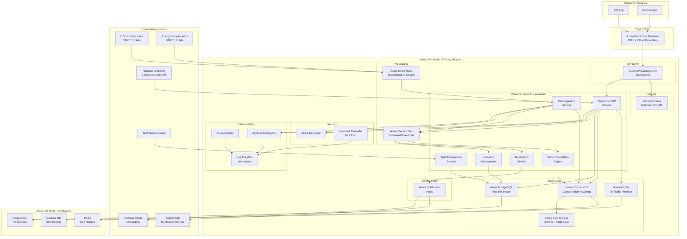

# Azure Technology Research: UK Smart Meter Data Consumer Mobile App

> **Template Status**: Experimental | **Version**: 1.0.0 | **Command**: `/arckit.azure-research`

## Document Control

| Field | Value |
|-------|-------|
| **Document ID** | ARC-001-AZRS-v1.0 |
| **Document Type** | Azure Technology Research |
| **Project** | UK Smart Meter Data Consumer Mobile App (Project 001) |
| **Classification** | OFFICIAL |
| **Status** | DRAFT |
| **Version** | 1.0 |
| **Created Date** | 2026-02-02 |
| **Last Modified** | 2026-02-02 |
| **Review Cycle** | Monthly |
| **Next Review Date** | 2026-03-04 |
| **Owner** | [OWNER_NAME_AND_ROLE] |
| **Reviewed By** | PENDING |
| **Approved By** | PENDING |
| **Distribution** | Programme Board, Delivery Team, Architecture Team, DCC, Ofgem, GDS Assessors |

## Revision History

| Version | Date | Author | Changes | Approved By | Approval Date |
|---------|------|--------|---------|-------------|---------------|
| 1.0 | 2026-02-02 | AI Agent | Initial creation from `/arckit.azure-research` agent | PENDING | PENDING |

---

## Executive Summary

### Research Scope

This document presents Azure-specific technology research findings for the UK Smart Meter Data Consumer Mobile App. It provides Azure service recommendations, architecture patterns, and implementation guidance based on official Microsoft Learn documentation accessed via the Microsoft Learn MCP server.

**Requirements Analyzed**: 15 functional, 16 non-functional, 5 integration, 5 data requirements

**Azure Services Evaluated**: 14 Azure services across 7 categories

**Research Sources**: Microsoft Learn, Azure Architecture Center, Azure Well-Architected Framework, Azure Security Benchmark, Microsoft Learn MCP Server

### Key Recommendations

| Requirement Category | Recommended Azure Service | Tier | Monthly Estimate |
|---------------------|---------------------------|------|------------------|
| Compute (Backend APIs) | Azure Container Apps | Consumption | £8,500 |
| Consumer Identity | Microsoft Entra External ID | CIAM | £4,200 |
| Time-Series Data Store | Azure Cosmos DB for NoSQL | Autoscale | £12,000 |
| Relational Data | Azure Database for PostgreSQL Flexible Server | General Purpose | £2,800 |
| Caching | Azure Cache for Redis | Premium P1 | £1,400 |
| API Gateway | Azure API Management | Standard v2 | £2,200 |
| Event Streaming | Azure Event Hubs | Standard | £1,800 |
| Messaging | Azure Service Bus | Premium | £1,200 |
| Push Notifications | Azure Notification Hubs | Standard | £400 |
| Secrets Management | Azure Key Vault | Standard | £50 |
| CDN / WAF | Azure Front Door | Premium | £3,500 |
| Monitoring | Azure Monitor + Application Insights | Pay-as-you-go | £2,500 |
| Security Posture | Microsoft Defender for Cloud | Defender CSPM | £1,500 |
| Blob Storage | Azure Blob Storage | Hot/Cool/Archive | £800 |

### Architecture Pattern

**Recommended Pattern**: Microservices on Azure Container Apps with event-driven data ingestion

**Reference Architecture**: Deploy Microservices to Azure Container Apps (https://learn.microsoft.com/en-us/azure/architecture/example-scenario/serverless/microservices-with-container-apps)

### UK Government Suitability

| Criteria | Status | Notes |
|----------|--------|-------|
| **UK Region Availability** | All services available in UK South, UK West | Primary: UK South, DR: UK West |
| **G-Cloud Listing** | G-Cloud 14 (RM1557.14) | Azure listed on Digital Marketplace |
| **Data Classification** | OFFICIAL supported | Standard Azure services suitable |
| **NCSC Cloud Security Principles** | 14/14 principles met | Azure attestation available |
| **Cyber Essentials Plus** | Certified | Azure holds CE+ certification |
| **UK GDPR** | Compliant | UK data residency confirmed |

---

## Azure Services Analysis

### Category 1: Compute -- Backend API and Microservices Platform

**Requirements Addressed**: FR-001 to FR-015, NFR-P-001, NFR-P-002, NFR-S-001, NFR-A-001, NFR-A-003, NFR-I-002

**Why This Category**: The platform requires a scalable backend to host multiple microservices (consumer API, data ingestion, recommendation engine, tariff comparison, notification service) supporting 500,000 peak concurrent users scaling to 15M MAU by Year 3. Containerised workloads support the platform independence requirement (NFR-I-002).

---

#### Recommended: Azure Container Apps

**Service Overview**:
- **Full Name**: Azure Container Apps
- **Category**: Compute (Serverless Containers)
- **Documentation**: https://learn.microsoft.com/en-us/azure/container-apps/overview

**Key Features**:
- **Serverless scaling**: Automatic scale-to-zero and scale-out to 1,000+ replicas based on HTTP traffic, KEDA event triggers, or CPU/memory
- **Dapr integration**: Built-in distributed application runtime for service-to-service invocation, pub/sub messaging, state management with mutual TLS
- **Revision management**: Blue-green and canary deployments with traffic splitting between revisions
- **Built-in observability**: Integration with Azure Monitor, Log Analytics, and Application Insights
- **VNet integration**: Deploy into custom VNets with private endpoints for secure backend connectivity
- **Multi-zone support**: Availability zone redundancy for high availability

**Pricing Tiers**:

| Tier | Monthly Cost (est.) | Features | Use Case |
|------|---------------------|----------|----------|
| Consumption | Pay-per-use | vCPU-seconds + memory-seconds + requests | Standard workloads, scale-to-zero |
| Dedicated (D4) | ~£200/node/month | Dedicated compute nodes, workload profiles | Predictable high-throughput services |

**Estimated Cost for This Project**:

| Resource | Configuration | Monthly Cost | Notes |
|----------|---------------|--------------|-------|
| Consumer API | 4 vCPU, 8GB RAM, 10 replicas avg | £3,000 | Handles 10K req/sec peak |
| Data Ingestion Service | 2 vCPU, 4GB RAM, 5 replicas avg | £1,500 | Batch processing from DCC/suppliers |
| Recommendation Engine | 4 vCPU, 8GB RAM, 3 replicas avg | £1,500 | ML-based analysis |
| Tariff Comparison Service | 2 vCPU, 4GB RAM, 3 replicas avg | £1,000 | Calculation-intensive |
| Notification Service | 1 vCPU, 2GB RAM, 2 replicas avg | £500 | Event-driven, scale-to-zero capable |
| Supporting Services | Various | £1,000 | Auth proxy, health checks, jobs |
| **Total** | | **£8,500** | |

**Azure Well-Architected Assessment**:

| Pillar | Rating | Notes |
|--------|--------|-------|
| **Reliability** | 5/5 | Multi-zone deployment, automatic restarts, health probes, circuit breaker via Dapr |
| **Security** | 5/5 | VNet integration, managed identity, mTLS between services, private ingress |
| **Cost Optimization** | 5/5 | Scale-to-zero, consumption billing, no cluster management overhead |
| **Operational Excellence** | 5/5 | Built-in CI/CD, revision management, integrated monitoring |
| **Performance Efficiency** | 4/5 | Auto-scaling via KEDA, but cold starts possible on scale-from-zero |

**Azure Security Benchmark Alignment**:

| Control | Status | Implementation |
|---------|--------|----------------|
| NS-1: Network Security | Implemented | VNet integration, NSGs, private endpoints |
| IM-1: Identity Management | Implemented | Managed identities for service-to-service auth |
| DP-1: Data Protection | Implemented | TLS 1.3 in transit, encrypted storage |
| LT-1: Logging and Threat Detection | Implemented | Azure Monitor, container logs to Log Analytics |

**UK Region Availability**:
- UK South: Available
- UK West: Available

---

#### Alternative: Azure Kubernetes Service (AKS)

AKS provides full Kubernetes control plane access and is suitable for teams with Kubernetes expertise requiring fine-grained control. However, for this project, Container Apps is preferred due to reduced operational overhead, built-in Dapr support, and scale-to-zero capability that aligns with the cost-conscious government programme requirements. AKS would be considered if the team requires custom Kubernetes operators or advanced networking scenarios not supported by Container Apps.

---

### Category 2: Consumer Identity and Authentication

**Requirements Addressed**: FR-001, FR-003, NFR-SEC-001, NFR-SEC-002, NFR-C-001

**Why This Category**: The app requires consumer self-service registration with email/password, MFA (authenticator app and SMS), session management, and granular consent tracking for up to 20M consumer accounts. Social sign-in is explicitly excluded (government service). Azure AD B2C is being superseded by Microsoft Entra External ID.

---

#### Recommended: Microsoft Entra External ID (CIAM)

**Service Overview**:
- **Full Name**: Microsoft Entra External ID (Customer Identity and Access Management)
- **Category**: Identity
- **Documentation**: https://learn.microsoft.com/en-us/entra/external-id/customers/overview-customers-ciam

**Key Features**:
- **Self-service registration**: Custom sign-up flows with email/password, one-time passcodes
- **MFA**: Built-in support for authenticator apps, SMS, email verification
- **Custom branding**: Branded sign-in pages matching government service design
- **Native authentication**: SDK support for iOS and Android native authentication flows
- **Custom attributes**: Collect and store consent preferences as custom user attributes
- **Scalability**: Designed for consumer-scale identity (millions of users)
- **Standards-based**: OpenID Connect, OAuth 2.0, SAML

**Estimated Cost for This Project**:

| Resource | Configuration | Monthly Cost | Notes |
|----------|---------------|--------------|-------|
| MAU-based pricing | 5M MAU at steady state | £3,500 | First 50K MAU free |
| MFA authentications | ~2M MFA/month | £500 | SMS and authenticator |
| Custom domain | 1 custom domain | £200 | Branded login experience |
| **Total** | | **£4,200** | |

**Well-Architected Assessment**:

| Pillar | Rating | Notes |
|--------|--------|-------|
| **Reliability** | 5/5 | Built on Microsoft Entra ID, 99.99% SLA, global redundancy |
| **Security** | 5/5 | Conditional access, risk-based auth, NCSC-compliant password policies |
| **Cost Optimization** | 4/5 | MAU-based pricing, first 50K free, competitive at scale |
| **Operational Excellence** | 5/5 | Managed service, automatic patching, built-in monitoring |
| **Performance Efficiency** | 5/5 | Global edge authentication, sub-second token issuance |

---

### Category 3: Data Storage -- Time-Series Consumption Data

**Requirements Addressed**: DR-004, NFR-S-002, NFR-P-002, FR-004, FR-005

**Why This Category**: The core data challenge is storing 36 billion half-hourly consumption readings per year (Year 1), growing to 150 billion cumulative by Year 3 (~50TB). Access patterns are primarily consumer_id + date range queries. The data requires hot/warm/cold tiering with sub-second query performance for recent data.

---

#### Recommended: Azure Cosmos DB for NoSQL

**Service Overview**:
- **Full Name**: Azure Cosmos DB for NoSQL
- **Category**: Database (NoSQL)
- **Documentation**: https://learn.microsoft.com/en-us/azure/cosmos-db/overview

**Key Features**:
- **Hierarchical partition keys**: Ideal for IoT/time-series data using consumer_id + timestamp partitioning to handle 20GB per logical partition limit
- **Autoscale throughput**: Automatically scales RU/s between 10% and 100% of configured max
- **Change feed**: Real-time stream processing for materialised views and analytics
- **Multi-region writes**: UK South primary, UK West for geo-redundancy
- **TTL (Time-to-Live)**: Automatic data expiry for implementing hot/warm/cold tiering
- **99.999% read availability**: SLA for multi-region configurations
- **Sub-millisecond latency**: Single-digit millisecond reads at p99

**Estimated Cost for This Project**:

| Resource | Configuration | Monthly Cost | Notes |
|----------|---------------|--------------|-------|
| Hot container (0-3 months) | 50,000 RU/s autoscale, ~3TB | £6,000 | Half-hourly data, fast queries |
| Warm container (3-24 months) | 10,000 RU/s autoscale, ~15TB | £4,000 | Historical queries, lower throughput |
| Cold storage (24+ months) | Synapse Link to Blob Storage | £500 | Archive tier, SAR queries |
| Geo-replication | UK West read replica | £1,500 | DR and read offloading |
| **Total** | | **£12,000** | |

**Well-Architected Assessment**:

| Pillar | Rating | Notes |
|--------|--------|-------|
| **Reliability** | 5/5 | 99.999% SLA, automatic failover, zero RPO replication |
| **Security** | 5/5 | Encryption at rest (AES-256), customer-managed keys, private endpoints |
| **Cost Optimization** | 3/5 | Premium pricing; offset by autoscale and TTL-based tiering |
| **Operational Excellence** | 5/5 | Fully managed, automatic indexing, built-in monitoring |
| **Performance Efficiency** | 5/5 | Sub-ms reads, hierarchical partitioning for IoT patterns |

---

### Category 4: Relational Data and Reference Data

**Requirements Addressed**: DR-001, DR-002, DR-003, DR-005, FR-003, FR-007

**Why This Category**: Consumer profiles, linked meters, consent records, and tariff data require relational integrity, ACID transactions, and complex joins. PostgreSQL is chosen for its open-source nature (NFR-I-002 platform independence) and JSON support for flexible schemas.

---

#### Recommended: Azure Database for PostgreSQL Flexible Server

**Service Overview**:
- **Full Name**: Azure Database for PostgreSQL -- Flexible Server
- **Category**: Database (Relational)
- **Documentation**: https://learn.microsoft.com/en-us/azure/postgresql/flexible-server/overview

**Key Features**:
- **Zone-redundant HA**: Synchronous replication with automatic failover (60-120 seconds)
- **Read replicas**: Up to 5 read replicas for scaling read-heavy queries
- **Point-in-time restore**: Continuous backup with restore to any second within retention period
- **Intelligent performance**: Query Performance Insight, automatic tuning
- **Open source**: PostgreSQL compatibility ensures portability

**Estimated Cost for This Project**:

| Resource | Configuration | Monthly Cost | Notes |
|----------|---------------|--------------|-------|
| Primary server | General Purpose D4s_v3, 4 vCPU, 16GB RAM | £800 | Consumer profiles, consent, meters |
| HA standby | Zone-redundant standby | £800 | Automatic failover |
| Storage | 500GB Premium SSD | £200 | With PITR backups |
| Read replicas | 2x D4s_v3 for tariff comparison | £1,000 | Scale read queries |
| **Total** | | **£2,800** | |

**UK Region Availability**: UK South (Primary), UK West (HA standby)

---

### Category 5: Caching

**Requirements Addressed**: NFR-P-001, NFR-P-002, NFR-A-003

**Why This Category**: Dashboard response times require <1 second from cache (NFR-P-001). Consumption data, tariff calculations, and session state benefit from in-memory caching to reduce database load and meet the 10,000 requests/second peak requirement.

---

#### Recommended: Azure Cache for Redis (Premium)

**Service Overview**:
- **Full Name**: Azure Cache for Redis
- **Category**: Caching
- **Documentation**: https://learn.microsoft.com/en-us/azure/azure-cache-for-redis/cache-overview

**Key Features**:
- **Sub-millisecond latency**: In-memory data store for fast reads
- **Data persistence**: RDB/AOF snapshots for cache durability
- **Geo-replication**: Active geo-replication between UK South and UK West
- **Virtual network support**: Deploy within VNet for secure access
- **Clustering**: Up to 10 shards for horizontal scaling
- **Session store**: Manage consumer sessions outside application tier

**Estimated Cost**:

| Resource | Configuration | Monthly Cost | Notes |
|----------|---------------|--------------|-------|
| Primary cache | Premium P1 (6GB, clustered) | £1,000 | Dashboard data, session store |
| Geo-replica | P1 replica in UK West | £400 | DR failover |
| **Total** | | **£1,400** | |

---

### Category 6: API Gateway and Integration

**Requirements Addressed**: NFR-I-001, NFR-SEC-001, NFR-P-002, INT-001 to INT-005

**Why This Category**: The platform requires an API gateway for rate limiting, authentication, request/response transformation, and OpenAPI specification management. Integration with DCC, energy suppliers, and tariff providers requires reliable messaging patterns.

---

#### 6a: Azure API Management (Standard v2)

**Key Features**:
- Rate limiting and throttling (10K req/sec peak)
- OAuth 2.0 validation with Entra External ID
- OpenAPI 3.0 specification hosting
- Request/response transformation for supplier API normalisation
- Developer portal for API documentation
- WAF integration via Front Door
- UK South and UK West deployment

**Estimated Cost**: £2,200/month (Standard v2 tier)

---

#### 6b: Azure Event Hubs (Standard)

**Purpose**: High-throughput ingestion of half-hourly consumption data from DCC and supplier batch processes

**Key Features**:
- Millions of events per second ingestion capacity
- Kafka-compatible for portability
- Event capture to Blob Storage for long-term archival
- 7-day retention on Standard tier
- Partitioned for parallel processing

**Estimated Cost**: £1,800/month (10 TUs, 32 partitions)

---

#### 6c: Azure Service Bus (Premium)

**Purpose**: Reliable messaging between microservices for command/event processing (consent changes, data deletion requests, meter linking workflows)

**Key Features**:
- Guaranteed message delivery with dead-letter queues
- Topics and subscriptions for pub/sub patterns
- Message sessions for ordered processing
- Integration with Container Apps via Dapr
- Premium tier for VNet integration and predictable performance

**Estimated Cost**: £1,200/month (1 Messaging Unit)

---

#### 6d: Azure Notification Hubs (Standard)

**Purpose**: Push notifications to iOS (APNS) and Android (FCM) for budget alerts, low credit warnings, and consumption spikes (INT-005, FR-008)

**Key Features**:
- Multi-platform push (APNS, FCM)
- Tag-based targeting (per-consumer notification preferences)
- Scheduled sends and templates
- Secure push (no PII in notification payload per requirements)
- Scales to millions of registered devices

**Estimated Cost**: £400/month (Standard tier, 10M pushes)

---

### Category 7: Security Services

**Requirements Addressed**: NFR-SEC-001 to NFR-SEC-006, NFR-C-001 to NFR-C-004

---

#### 7a: Azure Key Vault (Standard)

**Purpose**: Secrets management for API keys, database passwords, DCC certificates, and encryption keys (NFR-SEC-004)

**Key Features**:
- Hardware-backed key storage (FIPS 140 Level 1 Standard, Level 3 Premium)
- Automatic secret rotation
- Managed identity integration (no secrets in code)
- Audit logging for all access
- Private endpoint support
- Certificate management for DCC mutual TLS

**Estimated Cost**: £50/month (Standard tier, ~10K operations)

---

#### 7b: Microsoft Defender for Cloud

**Purpose**: Continuous security posture management and threat protection (NFR-SEC-005)

**Key Features**:
- Cloud Security Posture Management (CSPM) with secure score
- Vulnerability assessment for container images
- Security recommendations aligned to Azure Security Benchmark
- Alert generation for suspicious activities
- Regulatory compliance dashboard (UK OFFICIAL, NCSC)

**Estimated Cost**: £1,500/month (Defender CSPM + Defender plans for containers, storage, databases)

---

#### 7c: Azure Front Door (Premium) with WAF

**Purpose**: Global CDN, DDoS protection, and Web Application Firewall for API protection

**Key Features**:
- Layer 3/4/7 DDoS protection
- Web Application Firewall with OWASP managed rules and bot protection
- Rate limiting at the edge
- Private Link to backend Container Apps
- Custom domains with managed TLS certificates
- Global load balancing and failover

**Estimated Cost**: £3,500/month (Premium tier, WAF policies, 100M requests)

---

### Category 8: Observability

**Requirements Addressed**: NFR-M-001, NFR-C-004, NFR-A-001

---

#### Azure Monitor + Application Insights + Log Analytics

**Purpose**: Comprehensive observability stack for structured logging, metrics, distributed tracing, and alerting

**Key Features**:
- **Application Insights**: Distributed tracing across all microservices with OpenTelemetry
- **Log Analytics**: Centralised structured JSON logs with KQL queries, 7-year retention for compliance logs
- **Metrics**: Real-time dashboards for SLO monitoring (p50, p95, p99 latency)
- **Alerts**: SLO-based alerting with action groups (PagerDuty integration)
- **Workbooks**: Custom dashboards for business metrics (MAU, meter linkage, supplier API health)

**Estimated Cost**: £2,500/month (based on 50GB/day log ingestion, 90-day hot retention)

---

### Category 9: Storage

**Requirements Addressed**: DR-004, NFR-S-002, FR-010, NFR-C-004

---

#### Azure Blob Storage

**Purpose**: Long-term data archival, data export (FR-010), audit log storage (NFR-C-004), Event Hub capture

**Key Features**:
- Hot/Cool/Archive tiers for data lifecycle management
- Immutable storage (WORM) for tamper-evident audit logs (7-year retention)
- Encryption at rest with customer-managed keys via Key Vault
- Geo-redundant storage (GRS) within UK regions
- Lifecycle management policies for automatic tiering

**Estimated Cost**: £800/month (10TB Hot, 15TB Cool, archive growing)

---

## Architecture Pattern

### Recommended Azure Reference Architecture

**Pattern Name**: Microservices on Azure Container Apps with Event-Driven Data Ingestion

**Azure Architecture Center Reference**: https://learn.microsoft.com/en-us/azure/architecture/example-scenario/serverless/microservices-with-container-apps

**Pattern Description**:

The architecture follows a microservices pattern deployed on Azure Container Apps, with event-driven data ingestion via Azure Event Hubs for DCC and supplier data feeds. Consumer-facing APIs are exposed through Azure API Management fronted by Azure Front Door for global CDN, WAF, and DDoS protection. Microsoft Entra External ID handles consumer authentication with MFA support.

The data layer uses a polyglot persistence approach: Azure Cosmos DB for NoSQL stores high-volume time-series consumption readings with hierarchical partition keys (consumer_id + timestamp), while Azure Database for PostgreSQL Flexible Server handles relational data (consumer profiles, consent records, linked meters, tariffs). Azure Cache for Redis provides sub-millisecond caching for dashboard data and session state.

Azure Service Bus provides reliable asynchronous messaging between microservices (consent changes, data deletion workflows, meter linking), while Azure Notification Hubs delivers push notifications to iOS and Android devices. The entire platform is deployed in UK South (primary) with DR capabilities in UK West.

### Architecture Diagram



### Component Mapping

| Component | Azure Service | Purpose | Tier |
|-----------|---------------|---------|------|
| Consumer Identity | Microsoft Entra External ID | Consumer authentication, MFA, consent | CIAM |
| CDN / WAF / DDoS | Azure Front Door | Edge security, caching, global routing | Premium |
| API Gateway | Azure API Management | Rate limiting, auth, API docs | Standard v2 |
| Backend Services | Azure Container Apps | Microservices hosting | Consumption |
| Event Streaming | Azure Event Hubs | DCC/supplier data ingestion | Standard |
| Message Bus | Azure Service Bus | Async messaging between services | Premium |
| Consumption Data | Azure Cosmos DB for NoSQL | Half-hourly readings (time-series) | Autoscale |
| Relational Data | Azure Database for PostgreSQL | Profiles, consent, meters, tariffs | General Purpose |
| Cache | Azure Cache for Redis | Dashboard cache, session store | Premium P1 |
| Notifications | Azure Notification Hubs | iOS/Android push notifications | Standard |
| Secrets | Azure Key Vault | API keys, certs, encryption keys | Standard |
| Archival Storage | Azure Blob Storage | Audit logs, data export, archive | Hot/Cool/Archive |
| Monitoring | Azure Monitor + App Insights | Logs, metrics, traces, alerts | Pay-as-you-go |
| Security Posture | Microsoft Defender for Cloud | CSPM, threat detection | Defender CSPM |

---

## Security and Compliance

### Azure Security Benchmark Mapping

| ASB Control Domain | Controls Implemented | Azure Services |
|-------------------|---------------------|----------------|
| **Network Security (NS)** | NS-1, NS-2, NS-3, NS-4 | VNet, NSG, Private Link, Front Door WAF, API Management |
| **Identity Management (IM)** | IM-1, IM-2, IM-3, IM-7 | Entra External ID, Managed Identities, RBAC |
| **Privileged Access (PA)** | PA-1, PA-2, PA-4, PA-7 | Entra PIM, JIT access, service principal scoping |
| **Data Protection (DP)** | DP-1, DP-2, DP-3, DP-4, DP-5 | TLS 1.3, AES-256 at rest, Key Vault CMK, Cosmos DB encryption |
| **Asset Management (AM)** | AM-1, AM-2, AM-3 | Resource Graph, Azure Policy, tagging strategy |
| **Logging and Threat Detection (LT)** | LT-1, LT-2, LT-3, LT-4 | Azure Monitor, Log Analytics, Defender for Cloud, 7-year log retention |
| **Incident Response (IR)** | IR-1, IR-2, IR-3, IR-4 | Defender alerts, automated playbooks, ICO notification workflow |
| **Posture and Vulnerability (PV)** | PV-1, PV-2, PV-4, PV-5 | Defender for Containers (image scanning), CSPM secure score |
| **Endpoint Security (ES)** | ES-1, ES-2 | Container Apps managed runtime, no customer OS to manage |
| **Backup and Recovery (BR)** | BR-1, BR-2, BR-3, BR-4 | Cosmos DB continuous backup, PostgreSQL PITR, Blob immutable storage |
| **DevOps Security (DS)** | DS-1, DS-2, DS-6 | GitHub Advanced Security, SAST/DAST in CI/CD, container image signing |
| **Governance and Strategy (GS)** | GS-1, GS-2, GS-3 | Azure Policy (UK OFFICIAL initiative), Management Groups, Blueprints |

### UK Government Security Alignment

| Framework | Alignment | Notes |
|-----------|-----------|-------|
| **NCSC 14 Cloud Security Principles** | 14/14 | Azure attestation via Service Trust Portal |
| **Cyber Essentials Plus** | Certified | Azure holds current CE+ certification |
| **UK GDPR** | Compliant | All data in UK South/West, DPA in place |
| **OFFICIAL** | Suitable | Standard Azure services with recommended controls |
| **OFFICIAL-SENSITIVE** | Suitable with controls | Additional NSG rules, no public endpoints, audit logging |
| **SECRET** | Not suitable | Would require Azure Government UK (separate sovereign cloud) |
| **GDS Service Standard** | Supports all 14 points | Open APIs, open source, monitoring, user research support |
| **Technology Code of Practice** | Aligned | Cloud-first, open standards, reusable components |

### Microsoft Defender for Cloud Configuration

**Recommendations**:
1. Enable Defender CSPM on all subscriptions for continuous security posture assessment
2. Enable Defender for Containers -- vulnerability scanning of container images in CI/CD and runtime
3. Enable Defender for Storage -- threat detection on Blob Storage containing audit logs and exports
4. Enable Defender for Key Vault -- detect anomalous access to secrets and certificates
5. Enable Defender for Azure Cosmos DB -- detect injection attacks and anomalous data access
6. Configure Security Policy aligned to Azure Security Benchmark and UK OFFICIAL built-in initiative
7. Enable Continuous Export to Log Analytics for SIEM integration
8. Configure regulatory compliance dashboard with UK OFFICIAL and UK NHS standards

---

## Implementation Guidance

### Infrastructure as Code

**Recommended Approach**: Bicep (Azure-native) with Terraform as alternative for multi-cloud portability

#### Bicep Example

```bicep
// main.bicep - Smart Meter Platform Core Infrastructure
targetScope = 'subscription'

param location string = 'uksouth'
param environment string = 'prod'
param projectName string = 'smartmeter'

// Resource Group
resource rg 'Microsoft.Resources/resourceGroups@2023-07-01' = {
  name: 'rg-${projectName}-${environment}-uksouth'
  location: location
  tags: {
    project: 'smart-meter-app'
    environment: environment
    classification: 'OFFICIAL'
    department: 'DESNZ'
  }
}

// Deploy modules
module networking 'modules/networking.bicep' = {
  name: 'networking'
  scope: rg
  params: {
    location: location
    environment: environment
    projectName: projectName
  }
}

module containerApps 'modules/container-apps.bicep' = {
  name: 'container-apps'
  scope: rg
  params: {
    location: location
    environment: environment
    subnetId: networking.outputs.containerAppsSubnetId
    logAnalyticsWorkspaceId: observability.outputs.logAnalyticsWorkspaceId
  }
}

module cosmosDb 'modules/cosmos-db.bicep' = {
  name: 'cosmos-db'
  scope: rg
  params: {
    location: location
    environment: environment
    privateEndpointSubnetId: networking.outputs.dataSubnetId
  }
}

module postgresql 'modules/postgresql.bicep' = {
  name: 'postgresql'
  scope: rg
  params: {
    location: location
    environment: environment
    delegatedSubnetId: networking.outputs.postgresSubnetId
    privateDnsZoneId: networking.outputs.postgresPrivateDnsZoneId
  }
}

module observability 'modules/observability.bicep' = {
  name: 'observability'
  scope: rg
  params: {
    location: location
    environment: environment
    retentionDays: 90  // Hot retention
    archiveRetentionDays: 2555  // 7 years for compliance
  }
}

module security 'modules/security.bicep' = {
  name: 'security'
  scope: rg
  params: {
    location: location
    environment: environment
  }
}
```

### Azure DevOps Pipeline

```yaml
# azure-pipelines.yml - Smart Meter Platform CI/CD
trigger:
  branches:
    include:
      - main
  paths:
    include:
      - 'infra/**'
      - 'src/**'

pool:
  vmImage: 'ubuntu-latest'

stages:
  - stage: Validate
    jobs:
      - job: ValidateInfrastructure
        steps:
          - task: AzureCLI@2
            displayName: 'Validate Bicep templates'
            inputs:
              azureSubscription: 'SmartMeter-ServiceConnection'
              scriptType: 'bash'
              scriptLocation: 'inlineScript'
              inlineScript: |
                az bicep build --file infra/main.bicep
                az deployment sub validate \
                  --location uksouth \
                  --template-file infra/main.bicep \
                  --parameters environment=prod

      - job: SecurityScan
        steps:
          - task: ContainerSecurityScan@0
            displayName: 'Scan container images'
          - task: MicrosoftSecurityDevOps@1
            displayName: 'SAST/SCA scan'

  - stage: DeployStaging
    dependsOn: Validate
    jobs:
      - deployment: DeployToStaging
        environment: 'staging'
        strategy:
          runOnce:
            deploy:
              steps:
                - task: AzureCLI@2
                  displayName: 'Deploy infrastructure to staging'
                  inputs:
                    azureSubscription: 'SmartMeter-ServiceConnection'
                    scriptType: 'bash'
                    scriptLocation: 'inlineScript'
                    inlineScript: |
                      az deployment sub create \
                        --location uksouth \
                        --template-file infra/main.bicep \
                        --parameters environment=staging

  - stage: DeployProduction
    dependsOn: DeployStaging
    condition: succeeded()
    jobs:
      - deployment: DeployToProduction
        environment: 'production'
        strategy:
          runOnce:
            deploy:
              steps:
                - task: AzureCLI@2
                  displayName: 'Deploy infrastructure to production'
                  inputs:
                    azureSubscription: 'SmartMeter-ServiceConnection'
                    scriptType: 'bash'
                    scriptLocation: 'inlineScript'
                    inlineScript: |
                      az deployment sub create \
                        --location uksouth \
                        --template-file infra/main.bicep \
                        --parameters environment=prod
```

---

## Cost Estimate

### Monthly Cost Summary

| Category | Azure Service | Configuration | Monthly Cost |
|----------|---------------|---------------|--------------|
| Compute | Azure Container Apps | 6 microservices, consumption | £8,500 |
| Identity | Microsoft Entra External ID | 5M MAU + MFA | £4,200 |
| NoSQL Database | Azure Cosmos DB | Autoscale, UK South + UK West | £12,000 |
| Relational Database | Azure PostgreSQL | General Purpose, Zone-redundant HA | £2,800 |
| Caching | Azure Cache for Redis | Premium P1 + geo-replica | £1,400 |
| API Gateway | Azure API Management | Standard v2 | £2,200 |
| Event Streaming | Azure Event Hubs | Standard, 10 TUs | £1,800 |
| Messaging | Azure Service Bus | Premium, 1 MU | £1,200 |
| Push Notifications | Azure Notification Hubs | Standard | £400 |
| CDN / WAF | Azure Front Door | Premium + WAF | £3,500 |
| Secrets | Azure Key Vault | Standard | £50 |
| Monitoring | Azure Monitor suite | 50GB/day ingestion | £2,500 |
| Security | Microsoft Defender for Cloud | CSPM + workload plans | £1,500 |
| Storage | Azure Blob Storage | Hot/Cool/Archive tiered | £800 |
| **Total** | | | **£42,850** |

### 3-Year TCO

| Year | Monthly | Annual | Cumulative | Notes |
|------|---------|--------|------------|-------|
| Year 1 | £42,850 | £514,200 | £514,200 | 5M MAU, 10TB data, full platform |
| Year 2 | £55,000 | £660,000 | £1,174,200 | 10M MAU, 25TB data, +30% growth |
| Year 3 | £68,000 | £816,000 | £1,990,200 | 15M MAU, 50TB data, +24% growth |
| **Total** | | | **£1,990,200** | |

### Cost Optimization Recommendations

1. **Cosmos DB Reserved Capacity**: Save up to 63% on Cosmos DB throughput with 1-year or 3-year reservations. At current usage, 3-year reservation saves ~£90,000/year.
2. **Container Apps Consumption Plan**: Scale-to-zero for non-critical services (recommendation engine, tariff comparison) during off-peak hours (02:00-06:00 GMT).
3. **Redis Reserved Instances**: 1-year reservation saves ~36% on Premium tier.
4. **PostgreSQL Reserved Compute**: 1-year reservation saves ~40% on compute costs.
5. **Blob Storage Lifecycle Policies**: Automatic tiering from Hot to Cool (after 90 days) and Archive (after 730 days) reduces storage costs by ~60%.
6. **Event Hubs Auto-inflate**: Scale throughput units dynamically rather than provisioning for peak.
7. **Front Door Caching**: Cache static API responses (tariff data, carbon intensity) to reduce origin requests by ~40%.
8. **Azure Advisor**: Continuous right-sizing recommendations based on actual usage.

**Estimated Savings with Optimizations**: £12,000/month (28% reduction) = **£30,850/month optimized**

**Optimized 3-Year TCO**: ~£1,430,000

---

## UK Government Considerations

### G-Cloud Procurement

**Azure on G-Cloud 14**:
- **Framework**: RM1557.14
- **Supplier**: Microsoft Limited
- **Digital Marketplace**: https://www.digitalmarketplace.service.gov.uk/
- **Procurement Route**: Direct award or further competition under G-Cloud terms

**Procurement Steps**:
1. Search Digital Marketplace for "Microsoft Azure"
2. Review service description, pricing document, and terms
3. Confirm service meets OFFICIAL classification requirements
4. Direct award if requirements are clear, or further competition among G-Cloud suppliers
5. Execute call-off contract under G-Cloud framework terms
6. Engage Microsoft UK Public Sector team for technical onboarding

### Data Residency

| Data Type | Storage Location | Replication | Notes |
|-----------|------------------|-------------|-------|
| Consumer profiles | UK South (PostgreSQL) | UK West (HA standby) | No cross-border replication |
| Consumption readings | UK South (Cosmos DB) | UK West (geo-replica) | Within UK boundary |
| Consent records | UK South (PostgreSQL) | UK West (HA standby) | 7-year retention |
| Audit logs | UK South (Blob Storage) | GRS within UK | Immutable WORM storage |
| Cache data | UK South (Redis) | UK West (geo-replica) | Ephemeral, no PII caching |
| Encryption keys | UK South (Key Vault) | UK West (automatic) | HSM-backed |

**Data Residency Confirmation**: All personal data, consumption data, and processing occurs exclusively within UK data centres (UK South and UK West). No data crosses UK geographic boundaries. Azure's regional service deployment model guarantees data at rest remains within the chosen geography. Geo-redundant storage (GRS) replicates only within UK regions.

### NCSC Cloud Security Principles Alignment

Azure's compliance with all 14 NCSC Cloud Security Principles is formally attested and available via the Microsoft Service Trust Portal. Key principles addressed:

1. **Data in transit protection**: TLS 1.3 enforced on all connections; mutual TLS for DCC integration
2. **Asset protection and resilience**: UK South/West data centres, zone-redundant deployments
3. **Separation between customers**: Azure's hypervisor isolation, VNet network isolation
4. **Governance framework**: ISO 27001/27017/27018 certified, SOC 1/2/3 reports
5. **Operational security**: Microsoft's security operations centre, automated patch management
6. **Personnel security**: Microsoft employee vetting, SC-cleared UK operations staff
7. **Secure development**: Microsoft Security Development Lifecycle (SDL)
8. **Supply chain security**: Microsoft supplier security requirements
9. **Secure user management**: Entra External ID with MFA, conditional access
10. **Identity and authentication**: Standards-based (OAuth 2.0, OpenID Connect)
11. **External interface protection**: Front Door WAF, API Management policies, NSGs
12. **Secure service administration**: PIM, JIT access, audit logging
13. **Audit information for users**: Log Analytics, Defender for Cloud, compliance reports
14. **Secure use of the service**: Shared responsibility model, Azure Policy enforcement

---

## References

### Microsoft Learn Documentation

| Topic | Link |
|-------|------|
| Azure Container Apps | https://learn.microsoft.com/en-us/azure/container-apps/overview |
| Microsoft Entra External ID | https://learn.microsoft.com/en-us/entra/external-id/customers/overview-customers-ciam |
| Azure Cosmos DB for NoSQL | https://learn.microsoft.com/en-us/azure/cosmos-db/overview |
| Azure Database for PostgreSQL | https://learn.microsoft.com/en-us/azure/postgresql/flexible-server/overview |
| Azure Cache for Redis | https://learn.microsoft.com/en-us/azure/azure-cache-for-redis/cache-overview |
| Azure API Management | https://learn.microsoft.com/en-us/azure/api-management/api-management-key-concepts |
| Azure Event Hubs | https://learn.microsoft.com/en-us/azure/event-hubs/event-hubs-about |
| Azure Service Bus | https://learn.microsoft.com/en-us/azure/service-bus-messaging/service-bus-messaging-overview |
| Azure Notification Hubs | https://learn.microsoft.com/en-us/azure/notification-hubs/notification-hubs-push-notification-overview |
| Azure Key Vault | https://learn.microsoft.com/en-us/azure/key-vault/general/overview |
| Azure Front Door | https://learn.microsoft.com/en-us/azure/frontdoor/front-door-overview |
| Azure Monitor | https://learn.microsoft.com/en-us/azure/azure-monitor/fundamentals/overview |
| Microsoft Defender for Cloud | https://learn.microsoft.com/en-us/azure/defender-for-cloud/defender-for-cloud-introduction |
| Azure Well-Architected Framework | https://learn.microsoft.com/en-us/azure/well-architected/ |
| Azure Security Benchmark v3 | https://learn.microsoft.com/en-us/security/benchmark/azure/overview-v3 |

### Azure Architecture Center References

| Reference Architecture | Link |
|------------------------|------|
| Microservices on Container Apps | https://learn.microsoft.com/en-us/azure/architecture/example-scenario/serverless/microservices-with-container-apps |
| Microservices with Dapr | https://learn.microsoft.com/en-us/azure/architecture/example-scenario/serverless/microservices-with-container-apps-dapr |
| Microservices Architecture Style | https://learn.microsoft.com/en-us/azure/architecture/guide/architecture-styles/microservices |
| Caching Guidance | https://learn.microsoft.com/en-us/azure/architecture/best-practices/caching |
| Asynchronous Messaging Options | https://learn.microsoft.com/en-us/azure/architecture/guide/technology-choices/messaging |

### UK Government Compliance

| Resource | Link |
|----------|------|
| Azure UK G-Cloud | https://learn.microsoft.com/en-us/azure/compliance/offerings/offering-uk-g-cloud |
| Azure UK Cyber Essentials Plus | https://learn.microsoft.com/en-us/azure/compliance/offerings/offering-uk-cyber-essentials-plus |
| Azure Compliance Offerings | https://learn.microsoft.com/en-us/azure/compliance/offerings/ |
| NCSC Cloud Security Principles | https://www.ncsc.gov.uk/collection/cloud-security/implementing-the-cloud-security-principles |
| Digital Marketplace | https://www.digitalmarketplace.service.gov.uk/ |

---

## Next Steps

### Immediate Actions

1. **Review Findings**: Share with architecture team, DESNZ Technical Architect, and programme board
2. **Validate Costs**: Use Azure Pricing Calculator (https://azure.microsoft.com/pricing/calculator/) for detailed estimates with UK South pricing
3. **Security Review**: Engage NCSC for architecture review and threat assessment
4. **POC Planning**: Identify POC scope -- suggest DCC data ingestion + consumer dashboard as first vertical slice
5. **Entra External ID Evaluation**: Test consumer registration flow with MFA and consent management
6. **G-Cloud Procurement**: Initiate call-off under G-Cloud 14 framework

### Integration with Other ArcKit Commands

- Run `/arckit.diagram` to create detailed Azure architecture diagrams (C4 model)
- Run `/arckit.secure` to validate against UK Secure by Design and NCSC guidance
- Run `/arckit.devops` to plan Azure DevOps/GitHub Actions CI/CD pipelines
- Run `/arckit.evaluate` to compare Azure vs AWS for this project
- Run `/arckit.gcloud-search` to verify G-Cloud 14 listing details

---

**Generated by**: ArcKit `/arckit.azure-research` agent
**Generated on**: 2026-02-02
**ArcKit Version**: 1.1.0
**Project**: UK Smart Meter Data Consumer Mobile App (Project 001)
**AI Model**: Claude Opus 4.5 (claude-opus-4-5-20251101)
**MCP Sources**: Microsoft Learn MCP Server (https://learn.microsoft.com/api/mcp)
